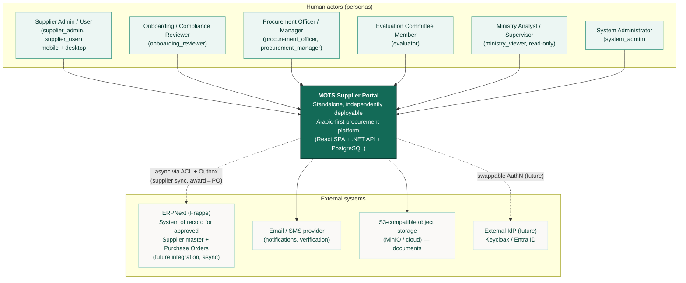
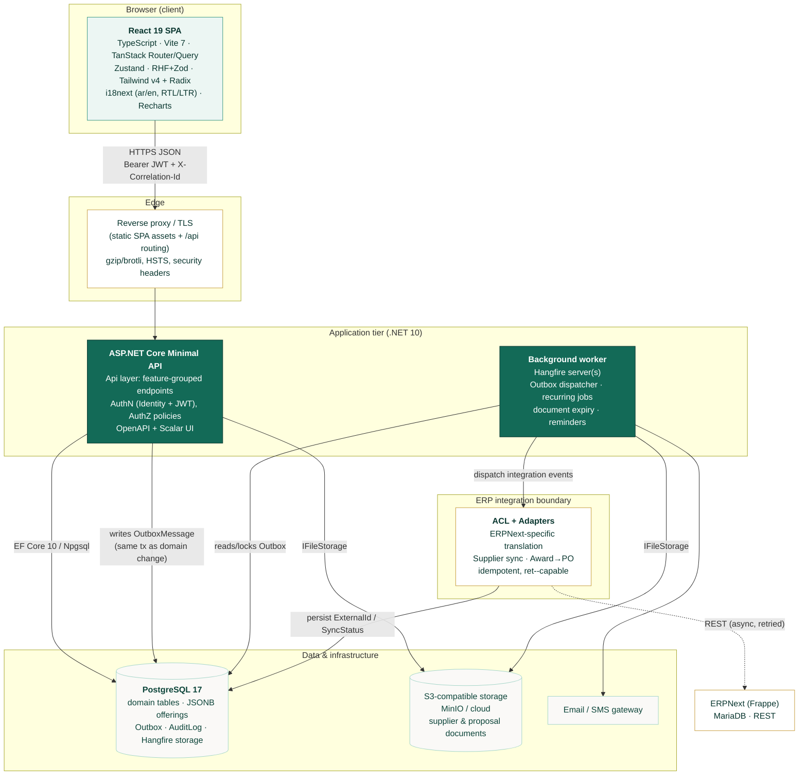
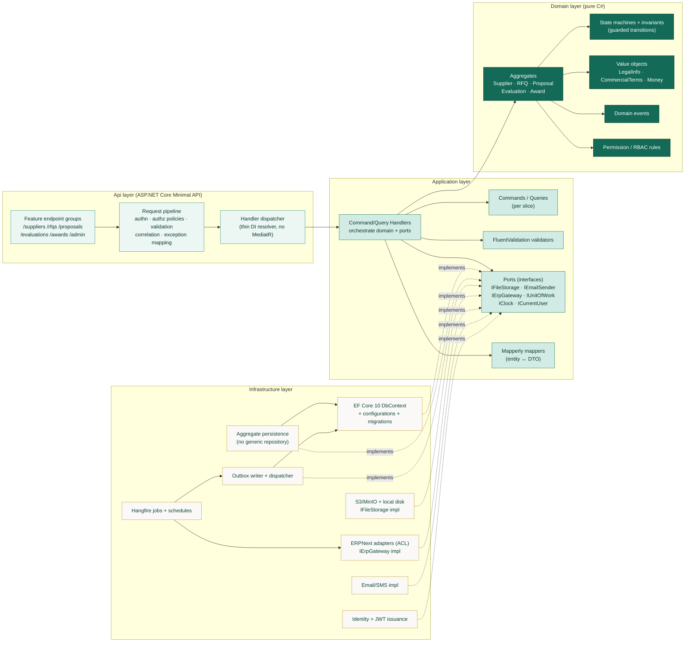
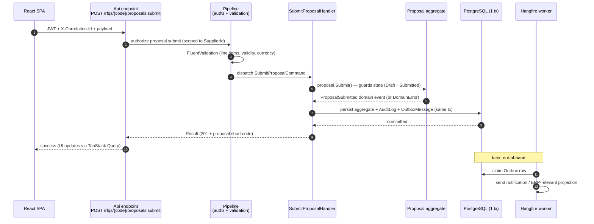

# MOTS Supplier Portal — Architecture Overview

> **Status:** Baseline v1 · **Owner:** Principal Architect · **Date:** 2026-08-26
> Consistent with [`00-foundational-decisions.md`](./00-foundational-decisions.md) (canonical) and the
> [Discovery Report](../product/DISCOVERY-REPORT.md). Related: [Domain Model](./DOMAIN-MODEL.md) ·
> [Observability](./OBSERVABILITY-ARCHITECTURE.md) · [Deployment](../deployment/DEPLOYMENT-ARCHITECTURE.md) ·
> [ADRs](../adr/) · [Integration](../integration/).

This document is the C4-style architectural map for the portal: the **System Context**, **Container**,
and **Component** views, the principles and dependency rules that govern the code, the cross-cutting
concerns every slice inherits, and the technology justifications (mirroring the canonical brief). It is
the orientation document a new engineer reads on day one.

---

## 1. Architectural principles

These are the non-negotiable rules that shape every decision downstream. They exist to keep the core
business logic **pure, testable, and independent** of frameworks, the database, the ERP, and the UI.

| # | Principle | What it means in practice |
|---|---|---|
| P1 | **Domain is the center** | Business rules (state machines §5 of canonical, invariants, RBAC guards) live in `Domain` and depend on **nothing** external. No EF, no ASP.NET, no HTTP, no ERP types. |
| P2 | **Dependency rule points inward** | `Api → Application → Domain` and `Infrastructure → Application/Domain`. Inner layers never reference outer ones. Enforced by **NetArchTest** in CI. |
| P3 | **Vertical slices over layered services** | Each feature (e.g. *Submit Proposal*) is a cohesive slice: endpoint + command/query + validator + handler + persistence + tests. No god-services, no generic repositories. |
| P4 | **Portal is ERP-independent** | The portal must run fully with the ERP offline. All ERP interaction is **async** through an Anti-Corruption Layer (ACL) + transactional **Outbox** (canonical §1). Core flows never block on ERP. |
| P5 | **Explicit over implicit** | Direct DI-resolved handler dispatch (no MediatR), source-generated mapping (Mapperly), explicit state transitions. No hidden reflection magic. |
| P6 | **Illegal states unrepresentable** | State transitions are guarded in the **domain**, not just the UI (canonical §5). The domain rejects illegal transitions with a typed error; the API surfaces it; the UI merely hides affordances. |
| P7 | **Secure & auditable by default** | Every state change is permission-guarded (RBAC, canonical §6) and written to `AuditLog` with actor, timestamp, from→to, reason, and `correlationId`. |
| P8 | **Arabic-first, accessible, premium** | RTL/LTR, WCAG 2.2 AA, and premium UX are first-class architectural constraints, not a later polish pass (canonical §7–§9). |
| P9 | **Opaque public identifiers** | Internal PKs are **GUIDv7**; public URLs use opaque slugs/short codes (`RFQ-2026-000123`). Internal keys are never exposed. |
| P10 | **Everything observable** | Structured JSON logs, correlation/trace-ID propagation FE→API→jobs, OpenTelemetry traces/metrics. See [Observability](./OBSERVABILITY-ARCHITECTURE.md). |

---

## 2. C4 Level 1 — System Context

Who and what the portal interacts with. Personas map 1:1 to the canonical persona table (§3).

**Boundary notes**

- The **ERP is external and eventual.** The dotted line is deliberately async and one-portal-drives:
  the portal emits domain/integration events; adapters translate them. The portal consumes ERP
  responses (e.g. approved-supplier `ExternalId`) idempotently. See canonical §1 and [Integration](../integration/).
- **Ministry access is read-only, cross-organization, aggregate.** Whether it sees commercial values
  or only anonymized metrics is `[ASSUMPTION / REQUIRES BUSINESS CONFIRMATION]` (Discovery §5).
- **Object storage** is reached through the `IFileStorage` abstraction (local disk in dev, S3/MinIO
  in prod) — canonical §2, requirement §23.

---

## 3. C4 Level 2 — Container view

The deployable/process-level building blocks and how they communicate.

### 3.1 Container responsibilities

| Container | Responsibility | Notes |
|---|---|---|
| **React SPA** | All persona UIs (supplier app, back-office, governance, admin). Renders affordances by permission; validates with shared Zod schemas; RTL/LTR + i18n. | Route-level code splitting for LCP < 2.5s. Never trusted for authz — server re-checks. |
| **Reverse proxy** | TLS termination, static asset serving, `/api` routing, compression, security headers, rate-limit edge. | Deploy-target-specific (nginx/Traefik/cloud LB). |
| **.NET API** | Synchronous request/response: auth, validation, command/query handlers, domain execution, persistence. Writes `OutboxMessage` in the **same transaction** as the domain change. | Stateless → horizontally scalable. |
| **Background worker (Hangfire)** | Durable async work: Outbox dispatch, notifications, document-expiry sweeps, reminders, ERP sync jobs. Dashboard + retries + dead-letter. | Can run in-process (small deploy) or as a separate process/replica (scale). |
| **PostgreSQL 17** | System of record for all portal-owned data; JSONB for flexible `Offering` payloads; also hosts Outbox, AuditLog, and Hangfire tables. | GUIDv7 PKs, `RowVersion` concurrency. Backups + PITR (canonical §9). |
| **Object storage** | Binary documents (registration certs, licenses, proposal attachments) behind `IFileStorage`. | Local disk (dev) / S3/MinIO (prod). Pre-signed, scoped, time-limited access URLs. |
| **ACL + Adapters** | The only code that knows ERPNext exists. Translates portal events ↔ ERPNext doctypes, maps naming-series **string** `ExternalId`, enforces idempotency. | Keeps ERPNext concepts out of the Domain (canonical §1). |

---

## 4. C4 Level 3 — Component view (inside the .NET API)

The Clean Architecture + Vertical Slice internals. Arrows show the **dependency direction** (compile-time
references), which always points inward toward the Domain.

**The dependency inversion at the ERP boundary is the load-bearing detail:** `Application` declares an
`IErpGateway` **port**; `Infrastructure` provides the ERPNext-specific **adapter** (the ACL). The Domain
and Application layers compile and test with zero knowledge of ERPNext, MariaDB, or naming-series keys.

### 4.1 Layer responsibilities & the dependency rule

| Layer | Owns | Depends on | Must never reference |
|---|---|---|---|
| **Domain** | Aggregates, entities, value objects, invariants, state machines, domain events, permission predicates. | *Nothing* (pure C#, BCL only). | EF Core, ASP.NET, HTTP, ERP types, DTOs, config. |
| **Application** | Use-cases: commands/queries + handlers, validators, orchestration, **ports** (interfaces), DTOs, mapping. | Domain. | Concrete infrastructure, EF, ASP.NET request types, ERPNext. |
| **Infrastructure** | Port **implementations**: EF Core persistence, migrations, Outbox, `IFileStorage`, ERP adapters (ACL), email/SMS, Identity/JWT, Hangfire jobs. | Application, Domain. | Api layer. |
| **Api** | HTTP composition: Minimal API endpoint groups, request pipeline (authn/authz/validation/correlation/exception mapping), OpenAPI, DI wiring, dispatcher. | Application, Infrastructure (composition root only), Domain. | Being referenced by anything (it is the top). |

> **Enforcement:** `NetArchTest` rules in the backend test suite fail the build if any inward-pointing
> rule is violated (e.g. Domain referencing `Microsoft.EntityFrameworkCore`). This is a CI gate, not a
> convention.

### 4.2 Anatomy of one vertical slice — *Submit Proposal*

A representative slice, to make P3 concrete. Every feature follows this shape.

**Key guarantees visible here:** authz *before* work (P7), domain guards the transition (P6), and the
domain change + audit + outbox commit **atomically** (P4) so async side-effects can never be lost or
double-fire without a durable record.

---

## 5. Cross-cutting concerns

Concerns that every slice inherits from the pipeline and infrastructure, so no feature re-implements them.

| Concern | Mechanism | Notes |
|---|---|---|
| **Validation** | FluentValidation in the request pipeline; **Zod** on the client (schemas shared in spirit with API contracts). | Two-tier: client for UX, server as the authority. Structural + business-rule validation split — deep invariants live in the Domain. |
| **Authorization** | Policy-based + permission claims (`resource.action`), row-scoped by `SupplierId` / `OrganizationId`; ministry read-only cross-org (canonical §6). | Enforced by API policy handlers **and** in the domain for transition guards. UI hides affordances only. |
| **Authentication** | ASP.NET Core Identity + JWT access + rotating refresh tokens; MFA-ready; swappable for external IdP later. | Short-lived access token; refresh rotation with reuse detection. |
| **Logging** | Serilog structured **JSON**; enriched with `correlationId`, `traceId`, `userId`, `supplierId/orgId`, slice name. | No secrets/PII in logs (log hygiene — see [Observability](./OBSERVABILITY-ARCHITECTURE.md)). |
| **Correlation / tracing** | `X-Correlation-Id` accepted from FE (or generated at edge), flowed through API → domain events → Outbox → Hangfire jobs → ERP adapter. OpenTelemetry `traceparent` alongside. | End-to-end trace: browser click → API → async job → ERP call. |
| **Auditing** | `AuditLog` write on every state change: actor, timestamp, from→to, reason, correlationId (canonical §5). | Immutable, queryable; drives governance/ministry views. |
| **Caching** | TanStack Query on the client (server-state cache, dedup, background refetch). Server-side: reference-data caching (categories, document types, currencies) with explicit invalidation. | No caching of authorization decisions across requests; reference data is the safe cache target. |
| **Concurrency** | `RowVersion` optimistic concurrency on aggregates; conflicting writes rejected with a typed conflict. | Prevents lost updates on evaluation scores, proposal edits, RFQ authoring. |
| **Idempotency** | Outbox dispatch + ERP adapters are idempotent (dedupe keys / `ExternalId` upserts); client submit endpoints accept idempotency keys where double-submit is plausible. | Critical across the async ERP boundary. |
| **Error handling** | Uniform exception → `ProblemDetails` mapping; domain errors → 4xx with typed codes; unexpected → 500 + logged trace, never leaking internals. | Localized, machine-readable error codes for the SPA. |
| **Localization** | i18next (ar default RTL / en LTR); server returns i18n **keys/codes**, not baked prose, for domain errors and notifications. | Arabic-first (canonical §8). |
| **Rate limiting** | ASP.NET Core rate limiter on sensitive endpoints (auth, registration, document upload). | Defends registration/verification abuse. |

---

## 6. Key ADR-worthy decisions

These decisions have material trade-offs and are (or should be) recorded as ADRs under
[`docs/adr/`](../adr/). They mirror the canonical brief and must not contradict it.

| ADR | Decision | Rationale (summary) | Trade-off accepted |
|---|---|---|---|
| ADR-0001 | **.NET 10 + Clean Architecture + Vertical Slice** | Testable pure core, feature cohesion, latest LTS perf/support. | More upfront structure than a CRUD monolith. |
| ADR-0002 | **No MediatR — direct DI-resolved dispatcher** | MediatR is now commercially licensed; a thin dispatcher removes indirection and cost. | Small amount of hand-rolled plumbing. |
| ADR-0003 | **PostgreSQL 17 + EF Core 10, JSONB for offerings** | Relational fit for procurement + flexible offering payloads; strong migrations. | JSONB fields need disciplined querying/validation. |
| ADR-0004 | **ERP integration via ACL + transactional Outbox + adapters** | Portal stays ERP-independent; durable, idempotent, async write-back. | Eventual consistency with ERP; reconciliation needed. |
| ADR-0005 | **String `ExternalId` per synced aggregate, never int FK** | ERPNext keys are naming-series strings; decouples portal PKs. | Mapping/sync-status bookkeeping per aggregate. |
| ADR-0006 | **GUIDv7 internal PKs + opaque public short codes** | Non-enumerable public references; time-ordered index locality. | Slightly larger keys than int. |
| ADR-0007 | **Local Identity + JWT now, external IdP later** | Ship without external dependency; MFA-ready; swappable. | Must design token/claims to be IdP-portable. |
| ADR-0008 | **Bespoke design system (Tailwind v4 + Radix), not MUI/AntD** | Premium, non-template look; a11y from Radix primitives. | More component build effort than a kit. |
| ADR-0009 | **Hangfire (Postgres storage) for background work** | Durable retries, dashboard, dead-letter; no extra broker to operate. | Coupled to Postgres; not a full message bus. |
| ADR-0010 | **Serilog JSON + OpenTelemetry** | Structured logs + vendor-neutral traces/metrics/logs. | Telemetry pipeline to operate (see Observability). |

---

## 7. Technology choices — justification (mirrors canonical §2)

> This table restates the canonical decisions for architectural context. On any perceived conflict,
> [`00-foundational-decisions.md`](./00-foundational-decisions.md) wins.

### Backend

| Area | Choice | Why (architectural relevance) |
|---|---|---|
| Runtime | .NET 10 (LTS), C# 14 | Long support window, top-tier performance for the NFR targets (p95 < 300ms reads). |
| API | ASP.NET Core Minimal APIs, feature-grouped | Thin endpoints per slice; no controller bloat; clean DI composition root. |
| Architecture | Clean Architecture + Vertical Slice | Pure testable Domain, cohesive features; enforced by NetArchTest. |
| Dispatch | Direct handler classes (no MediatR) | Avoids commercial licensing and needless indirection. |
| Persistence | EF Core 10 + PostgreSQL 17 (Npgsql) | Relational procurement fit; strong migrations; JSONB for offerings. |
| Validation | FluentValidation | Expressive, testable, pipeline-wired. |
| Mapping | Mapperly (source-generated) | Compile-time, zero-reflection; avoids AutoMapper licensing. |
| AuthN | ASP.NET Core Identity + JWT (rotating refresh) | Local now, MFA-ready, IdP-swappable. |
| AuthZ | Policy-based + permission claims (RBAC) | Fine-grained `resource.action`; row-scoping by Supplier/Org. |
| API docs | Native .NET OpenAPI + Scalar | Modern, clean; Swashbuckle fading post-.NET 9. |
| Background jobs | Hangfire (Postgres) + Outbox | Durable retries + transactional event consistency. |
| Telemetry | Serilog (JSON) + OpenTelemetry | Structured logs + vendor-neutral traces/metrics/logs. |
| File storage | `IFileStorage`: local disk (dev) / S3-MinIO (prod) | Storage-provider independence (req §23). |
| Testing | xUnit + FluentAssertions + Testcontainers + WebApplicationFactory + NetArchTest | Real-DB integration + architecture-rule enforcement. |

### Frontend

| Area | Choice | Why (architectural relevance) |
|---|---|---|
| Framework | React 19 + TypeScript 5.7+ | Concurrent features, strong typing across contracts. |
| Build | Vite 7 | Fast builds; route-level code splitting for LCP/INP targets. |
| Routing | TanStack Router | Type-safe routes, search-param validation, data loaders. |
| Server state | TanStack Query | Caching, dedup, optimistic updates, background refetch. |
| Client state | Zustand | Minimal session/UI state; no Redux over-engineering. |
| Forms | React Hook Form + Zod | Performant forms; shared client/contract validation. |
| Design system | Tailwind v4 + Radix → bespoke library | Premium look + a11y primitives; not a template kit. |
| i18n / RTL | i18next + CSS logical properties + `dir` switching | Arabic-first, RTL designed-in. |
| Data viz | Recharts + custom SVG | Themeable charts; bespoke premium moments. |
| Tables | TanStack Table (headless) | Full control of responsive + RTL behavior. |
| Icons | Lucide (RTL mirroring) | Clean, consistent, directional-aware. |
| Fonts | IBM Plex Sans Arabic + Inter | Script-harmonious, open-source. |
| Testing | Vitest + RTL + Playwright + axe-core | Unit→component→E2E + automated a11y. |
| Workshop | Storybook | Design-system dev & visual QA. |

---

## 8. Quality attributes → architectural tactics

How the NFR targets (canonical §9) are actually achieved by the architecture above.

| Quality attribute | Target | Architectural tactic |
|---|---|---|
| Availability | 99.5%, ERP-independent | Stateless API replicas; ERP calls async via Outbox; portal degrades gracefully when ERP/mail offline. |
| Performance (API) | p95 < 300ms reads / < 800ms writes | Thin Minimal APIs, compiled queries where hot, reference-data cache, Outbox moves side-effects off the request path. |
| Performance (web) | LCP < 2.5s, INP < 200ms mid-mobile | Route-level code splitting, TanStack Query caching, lean bespoke components. |
| Scalability | Horizontal | Stateless API + separately scalable Hangfire worker; Postgres as shared store. |
| Security | OWASP ASVS L2 | RBAC everywhere, audit on all state changes, rate limits, secret hygiene, opaque IDs, `ProblemDetails` with no leakage. |
| Accessibility | WCAG 2.2 AA | Radix primitives, axe-core in CI, RTL/LTR parity, reduced-motion respect. |
| Auditability | All state changes | `AuditLog` with actor/from→to/reason/correlationId; immutable trail. |
| Data safety | Backups + PITR | Managed/scripted PostgreSQL backups + point-in-time recovery (see [Deployment](../deployment/DEPLOYMENT-ARCHITECTURE.md)). |

---

## 9. Where to go next

- **Domain detail** → [`DOMAIN-MODEL.md`](./DOMAIN-MODEL.md) (aggregates, VOs, state machines).
- **Observability** → [`OBSERVABILITY-ARCHITECTURE.md`](./OBSERVABILITY-ARCHITECTURE.md).
- **Deployment & CI/CD** → [`../deployment/DEPLOYMENT-ARCHITECTURE.md`](../deployment/DEPLOYMENT-ARCHITECTURE.md).
- **ERP integration** → [`../integration/`](../integration/).
- **Decision records** → [`../adr/`](../adr/).
- **Canonical source of truth** → [`00-foundational-decisions.md`](./00-foundational-decisions.md).
