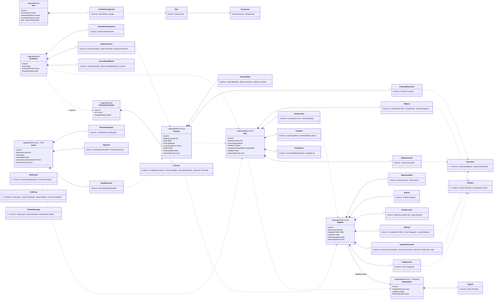

# MOTS Supplier Portal — Domain Model

> **Status:** Baseline v1 · **Owner:** Principal Architect · **Date:** 2026-08-26
> **Canonical parents:** [`00-foundational-decisions.md`](./00-foundational-decisions.md) · [`../product/DISCOVERY-REPORT.md`](../product/DISCOVERY-REPORT.md)
> This document is the authoritative **domain (conceptual) model**. The physical persistence
> mapping lives in [`DATABASE-MODEL.md`](./DATABASE-MODEL.md). Where a business rule is not yet
> confirmed it is tagged **[ASSUMPTION / REQUIRES BUSINESS CONFIRMATION]** and mirrored in
> [`../product/ASSUMPTIONS.md`](../product/ASSUMPTIONS.md).

---

## 1. Purpose & modelling stance

The domain is modelled with **Domain-Driven Design** tactical patterns on a Clean Architecture core
(§2 of the foundational brief). The model is expressed in **C# 14 / .NET 10** as a rich domain layer:
aggregate roots enforce invariants, value objects are immutable, and **all lifecycle transitions are
domain behaviours** — never raw property setters. The UI and API are affordance layers; illegal
transitions are rejected by the domain, not merely hidden (foundational §5).

Modelling principles applied throughout:

- **Aggregates are the transactional consistency boundary.** One aggregate is loaded, mutated, and
  saved per command. Cross-aggregate references are held **by identity (Id), never by object
  reference** — you will not find a navigation property from `Proposal` to a `Supplier` entity graph;
  it holds a `SupplierId`.
- **Eventual consistency between aggregates** via domain events dispatched through the transactional
  **Outbox** (foundational §1, §5). E.g. awarding a `Proposal` does not directly mutate the `Supplier`
  aggregate; it raises `ProposalAwarded` which downstream handlers react to.
- **The ERP is an external system of record**, integrated async through an Anti-Corruption Layer. No
  aggregate depends on ERP availability (foundational §1).
- **Ubiquitous language** (§9 below) is used verbatim in code — class names, methods, and events.

---

## 2. Identity strategy — GUIDv7 PKs and opaque public references

Two distinct identifier concepts exist for every persistent entity. They are never conflated.

### 2.1 Internal primary key — `GUIDv7` (`Guid` / `uuid`)

- Every entity's PK is a **version-7 UUID** (time-ordered UUID, RFC 9562). Generated **in the
  application** (`Guid.CreateVersion7()` in .NET 10) before insert, not by the database.
- **Why v7 over v4:** the leading 48 bits are a Unix-millisecond timestamp, so keys are **monotonic
  and index-friendly** — they cluster in B-tree insertion order like a sequence, avoiding the random
  page-split write amplification of v4 UUIDs, while remaining globally unique and non-guessable.
- **Why UUID over `bigint` identity:** IDs can be minted **before** the DB round-trip (needed to build
  the Outbox event and aggregate graph in one unit of work), they are safe to generate offline / in
  tests, and they never leak row counts.
- **Internal PKs are never exposed in URLs, APIs, or to users** (foundational §4). They live only in
  the database and server-internal DTOs.

### 2.2 Public reference code — opaque, human-legible

- Every aggregate the outside world addresses carries a **public reference code**: a stable, opaque,
  URL-safe string used in URLs, emails, notifications, and support conversations.
- Two shapes are used:
  - **Sequential business codes** for documents humans cite: `RFQ-2026-000123`,
    `PRO-2026-004510`, `SUP-2026-000078`, `AWD-2026-000045`. Format:
    `{PREFIX}-{YYYY}-{zero-padded per-year sequence}`. The year comes from creation date; the
    sequence is allocated from a per-prefix, per-year counter (see [`DATABASE-MODEL.md`](./DATABASE-MODEL.md#reference-code-allocation)).
  - **Opaque slugs / short codes** where enumeration must be prevented (e.g. an emailed
    clarification deep-link, a public invitation-accept token): a 12–16 char Base32 Crockford code
    with no embedded meaning.
- Reference codes are **not** the ERP `ExternalId`. They are portal-owned and exist even for entities
  that never sync to the ERP.

| Concern | Internal PK (`Id`) | Public reference (`ReferenceCode`) | ERP `ExternalId` |
|---|---|---|---|
| Type | `Guid` (v7) / `uuid` | `string` | `string?` (nullable) |
| Generated by | App, pre-insert | App/DB sequence | ERPNext naming series |
| Exposed to users | Never | Yes (URLs, UI, email) | No (internal ops only) |
| Stable for life | Yes | Yes | Yes once assigned |
| Example | `018f3a…c7` | `RFQ-2026-000123` | `PUR-RFQ-2026-00042` |

### 2.3 ERP synchronization markers

Every **ERP-syncable aggregate** (Supplier, RFQ, Proposal, Award, and the Evaluation result that
feeds a PO) additionally carries the sync marker value object (foundational §4):

- `ExternalId : string?` — the ERPNext naming-series key once mapped (e.g. `SUP-2026-00078`). Null
  until the entity has been reconciled with the ERP. **Never an integer FK** (Discovery §3.2.1).
- `SyncStatus : enum { NotApplicable, Pending, Syncing, Synced, Failed, Conflict }`.
- `LastSyncedAt : DateTimeOffset?`, `LastSyncError : string?`.

Aggregates that are **portal-only** (Notification, AuditLog, EvaluationTemplate, Clarification,
reference data) do **not** carry these markers; their `SyncStatus` is conceptually `NotApplicable`.

---

## 3. Aggregate catalogue (overview)

Aggregate roots are the units of consistency. The table maps each to its personas and ERP posture.

| Aggregate root | Owns (entities / VOs) | ERP-synced | Public ref prefix | Primary actors |
|---|---|---|---|---|
| **User** | Role membership, credentials, MFA, sessions | No | `USR` (internal) | `system_admin`, all |
| **Organization** | OrgUnit[] | Partly (→ ERP Company) | `ORG` | `system_admin`, `procurement_manager` |
| **Supplier** | Profile, LegalInfo(VO), Address[], Contact[], Representative[], Branch[], BankAccount[], CategoryLink[], Offering[], SupplierDocument[], OnboardingState | **Yes** | `SUP` | `supplier_admin`, `onboarding_reviewer` |
| **RFQ** | RfqItem[], Requirement[], Attachment[], Invitation[], Clarification[] (Q&A), Timeline, EvaluationTemplateRef | **Yes** | `RFQ` | `procurement_officer`, `procurement_manager` |
| **Proposal** | ProposalItem[], ProposalDocument[], CommercialTerms(VO), TechnicalResponse, Validity | **Yes** | `PRO` | `supplier_admin`, `supplier_user` |
| **EvaluationTemplate** | Criterion[] | No | `EVT` | `procurement_manager`, `system_admin` |
| **Evaluation** | EvaluationAssignment[], EvaluatorScore[], ConsolidatedResult | Result feeds ERP | `EVL` | `evaluator`, `procurement_manager` |
| **Award** | Recommendation, Approval[], AwardDecision, ExternalPurchaseOrderRef(VO) | **Yes** (→ PO) | `AWD` | `procurement_manager` |
| **Notification** | Channel deliveries | No | — | system |
| **AuditLog** | (append-only entries) | No | — | system / `audit.read` |
| **Document** | (shared file abstraction) | No (metadata only) | `DOC` | all |
| **OutboxMessage** | — | Bridge to ERP | — | system |
| **Category** (tree) | — | Partly (→ Supplier Group) | — | `system_admin` |

Reference data aggregates (small, mostly-immutable): **Category**, **DocumentType**, **Currency**,
**UnitOfMeasure**, **Incoterm**, **Region** (foundational §4).

---

## 4. Shared kernel — cross-cutting value objects & base types

Value objects (VOs) are immutable, compared **by value**, and validated at construction (no invalid
VO can exist). They are shared across aggregates.

| Value object | Fields | Invariants / notes |
|---|---|---|
| `EntityId<T>` (strongly-typed id) | `Guid` (v7) | Prevents passing a `SupplierId` where a `RfqId` is expected. |
| `ReferenceCode` | `string` | Matches `^[A-Z]{3}-\d{4}-\d{6}$` (business codes) or opaque form. Immutable once set. |
| `ExternalSyncInfo` | `ExternalId?`, `SyncStatus`, `LastSyncedAt?`, `LastSyncError?` | Only on ERP-syncable roots. |
| `Money` | `Amount decimal(18,4)`, `CurrencyCode` (ISO-4217, default `SYP`) | Amount ≥ 0 for prices; arithmetic only within same currency; rounding policy explicit. |
| `Quantity` | `Value decimal(18,4)`, `UnitOfMeasureCode` | Value > 0. |
| `DateRange` | `Start`, `End` (`DateTimeOffset`) | `End ≥ Start`; used for validity, submission windows. |
| `Address` | `Line1`, `Line2?`, `City`, `Region?`, `CountryCode`, `PostalCode?`, `Kind {HeadOffice, Branch, Billing, Warehouse}` | CountryCode ISO-3166; **no invented Syrian postal rules** — free-form, tagged [ASSUMPTION]. |
| `ContactInfo` | `FullName`, `Email`, `PhoneE164?`, `Position?` | Email RFC-5322; phone stored E.164 where provided. |
| `LegalInfo` | `LegalName` (ar + en), `RegistrationNumber?`, `TaxId?`, `SupplierType {Company, Individual, Partnership}`, `EstablishedOn?` | **[ASSUMPTION / REQUIRES BUSINESS CONFIRMATION]** — Syrian registration/tax field set is captured generically (aligns to ERPNext `tax_id`, `supplier_type`); no validation rules invented. |
| `BankAccountInfo` | `AccountHolderName`, `BankName`, `Branch?`, `Iban?`, `AccountNumber?`, `SwiftBic?`, `CurrencyCode` | At least one of `Iban`/`AccountNumber` present; format checks tagged [ASSUMPTION]. |
| `AuditStamp` | `CreatedAt`, `CreatedBy`, `ModifiedAt?`, `ModifiedBy?` | Set by infrastructure; never by domain callers. |
| `LocalizedText` | `Ar`, `En` | Arabic-first: `Ar` required, `En` optional (foundational §8). |

**Base building blocks:** `Entity<TId>` (identity equality), `AggregateRoot<TId>` (holds
`DomainEvents`, `RowVersion`), `ValueObject` (structural equality), `ISoftDeletable` (opt-in only).

---

## 5. Aggregates in detail

Each aggregate below lists its **root**, **entities**, **value objects**, **invariants** (rules the
root guarantees at all times), and **lifecycle** (the authoritative state machine from foundational
§5, expressed as domain behaviours).

### 5.1 User (aggregate root: `User`)

Represents an authenticated principal. Identity/auth handled by ASP.NET Core Identity (foundational
§2); the domain wraps it for profile, membership, and RBAC.

- **Entities:** `UserRoleAssignment` (User↔Role with optional scope), `UserSession` (refresh-token
  family, revocation), `MfaEnrollment`.
- **Value objects:** `ContactInfo`, `LocalePreference {Language ar|en, Numerals western|eastern,
  Timezone}`, `MembershipScope` (see below).
- **Membership scope (the row-scoping key, foundational §6):** a `User` belongs to **exactly one
  principal context**:
  - `SupplierMembership { SupplierId }` — supplier-side users, or
  - `OrganizationMembership { OrganizationId, OrgUnitId? }` — back-office/ministry users, or
  - `Platform` — `system_admin` (global).
- **Invariants:**
  - A User has **at least one Role**; roles grant `resource.action` permissions (foundational §6).
  - A supplier-scoped user can never hold a platform-global permission.
  - Email is unique across the platform (case-insensitive).
  - Deactivating a User revokes all active `UserSession`s (cascade within aggregate).
- **Lifecycle:** `Invited → Active ↔ Suspended → Deactivated`. MFA is **enrollable** (Identity 2FA,
  foundational §2) and may be **required-by-policy** for privileged roles [ASSUMPTION].

### 5.2 Organization (aggregate root: `Organization`)

A buying entity: a **Hotel**, an **MOT-affiliated body**, or the **Ministry** itself.

- **Entities:** `OrgUnit` (department/committee grouping; self-nesting tree).
- **Value objects:** `LegalInfo`, `Address[]`, `ContactInfo`, `OrganizationType {Hotel, MotBody,
  Ministry}`, `ExternalSyncInfo` (→ ERPNext **Company**; a supplier may transact with many companies,
  Discovery §3.2.2, so Supplier↔Organization is modelled **many-to-many** via `SupplierOrgLink`).
- **Invariants:**
  - `OrganizationType = Ministry` implies **read-only governance scope** for its users (foundational §6).
  - An OrgUnit tree has no cycles; every OrgUnit belongs to exactly one Organization.
- **Lifecycle:** `Active ↔ Inactive`.

### 5.3 Supplier (aggregate root: `Supplier`) — **ERP-synced**

The central supplier master the portal owns until ERP approval, then reconciles.

- **Entities:**
  - `Representative` — a named person authorized to act (maps to a supplier-scoped `User`); one is the
    **primary** (`supplier_admin`).
  - `Branch` — physical/operational locations.
  - `BankAccount` — holds `BankAccountInfo`; one marked default.
  - `Offering` — **flexible, category-shaped catalogue entry** (goods or services the supplier
    provides). Structured attributes vary by category, so `Offering` carries a typed core
    (`title LocalizedText`, `CategoryId`, `Uom`, `priceIndication Money?`) plus a **flexible
    attribute bag** persisted as JSONB (foundational §2 "JSONB for flexible offerings"; see
    [`DATABASE-MODEL.md`](./DATABASE-MODEL.md#offering-jsonb)).
  - `SupplierDocument` — a compliance document instance (license, registration, tax cert…) linked to a
    `DocumentType` and a stored `Document`; carries its own review + expiry lifecycle.
  - `CategoryLink` — associates the supplier to `Category` tree nodes it serves.
- **Value objects:** `LegalInfo`, `Address[]`, `ContactInfo[]`, `SupplierProfile {displayName
  LocalizedText, logoDocumentId?, website?, description LocalizedText}`, `OnboardingState`,
  `ExternalSyncInfo` (→ ERPNext **Supplier**, `SUP-.YYYY.-#####`).
- **Invariants:**
  - Exactly **one primary `Representative`** at all times.
  - Exactly **one default `BankAccount`** when any exist.
  - Transition to `Submitted` requires: all **`Required` `DocumentType`s** satisfied by an
    `Uploaded`+ `SupplierDocument`, ≥1 `CategoryLink`, ≥1 `Address(HeadOffice)`, valid `LegalInfo`.
  - A `Supplier` can reach `Approved` **only** through `onboarding_reviewer` action carrying
    `supplier.approve` permission; approval raises `SupplierApproved` (Outbox → ERP master create).
  - `ExternalId` is assigned only after ERP acknowledges; portal never blocks approval on ERP.
  - Any `SupplierDocument` moving to `Rejected` or `Expired` flags the profile **incomplete** and can
    force `Approved → …` review re-entry per policy (foundational §5).
- **Lifecycle (onboarding, foundational §5):**
  `Draft → EmailVerified → ProfileInProgress → Submitted → UnderReview →
  (InfoRequested → Resubmitted → UnderReview)* → Approved | Rejected`;
  post-approval `Active ↔ Suspended → Deactivated`.
- **SupplierDocument sub-lifecycle:** `Required → Uploaded → UnderReview → Approved | Rejected(reason)`;
  time-based `Approved → ExpiringSoon → Expired` (driven by a Hangfire recurring job against
  `ExpiresOn`).

### 5.4 RFQ (aggregate root: `RFQ`) — **ERP-synced**

A buyer-authored Request for Quotation. Buyer-internal until published (Discovery §3.2.5).

- **Entities:**
  - `RfqItem` — a requested line (`title LocalizedText`, `CategoryId`, `Quantity`, `Uom`,
    `specification LocalizedText`, `unitPriceItem bool`). Aligns to ERPNext `request_for_quotation_item`.
  - `Requirement` — a mandatory qualifying condition or document the supplier must satisfy to propose.
  - `Invitation` — an invited supplier (`SupplierId`, `invitedContactId?`, `InvitationStatus`,
    `emailSentAt?`, `accessToken` opaque). Aligns to ERPNext `request_for_quotation_supplier`
    (`supplier, contact, quote_status, email_sent`).
  - `Clarification` — a threaded **Q&A** item (`askedBySupplierId`, `question`, `answer?`,
    `visibility {PrivateToAsker, PublishedToAll}`, timestamps). **[ASSUMPTION]** published answers are
    broadcast to all invited suppliers.
  - `Attachment` — RFQ-level documents (links to `Document`).
- **Value objects:** `Timeline {publishAt?, submissionWindow DateRange, clarificationDeadline?,
  evaluationTargetDate?}`, `EvaluationTemplateRef {EvaluationTemplateId, snapshotVersion}`,
  `Incoterm?`, `ExternalSyncInfo` (→ ERPNext **Request for Quotation**).
- **Invariants:**
  - Must have ≥1 `RfqItem` and a bound, **version-snapshotted** `EvaluationTemplateRef` before
    `Approved` (the template is snapshotted so later template edits never alter a live RFQ's criteria).
  - `Published` requires `InternalReview → Approved` by a user with `rfq.approve`; publication raises
    `RfqPublished` and materializes `Invitation` notifications.
  - No `Proposal` may be **submitted** outside `Timeline.submissionWindow` (state must be
    `SubmissionOpen`).
  - `SubmissionClosed` freezes invitations; adding items/requirements after `Published` is prohibited
    (a new RFQ version/amendment is required) [ASSUMPTION].
  - `Cancelled` reachable from any pre-`Awarded` state with reason + audit.
- **Lifecycle (foundational §5):**
  `Draft → InternalReview → Approved → Published → SubmissionOpen → SubmissionClosed →
  UnderEvaluation → Clarification* → Shortlisting → Recommendation → AwardApproval → Awarded →
  Completed`; `Cancelled` from any pre-`Awarded` state.

### 5.5 Proposal (aggregate root: `Proposal`) — **ERP-synced**

A supplier's response to one RFQ. **Exactly one per Supplier per RFQ** (foundational §4).

- **Entities:**
  - `ProposalItem` — priced line answering an `RfqItem` (`rfqItemId`, `Quantity`, `unitPrice Money`,
    `discount?`, `lineTotal Money` (derived), `leadTimeDays?`, `notes LocalizedText`). Aligns to
    ERPNext `supplier_quotation_item` (`qty, rate, amount, lead_time_days`).
  - `ProposalDocument` — supporting files (compliance, technical datasheets).
- **Value objects:** `CommercialTerms {currencyCode, paymentTerms?, incoterm?, deliveryTerms
  LocalizedText, warranty?}`, `TechnicalResponse {answers to Requirement[] + free narrative}`,
  `Validity DateRange`, `Totals {subtotal, discountTotal, taxTotal?, grandTotal}` (all `Money`,
  derived), `ExternalSyncInfo` (→ ERPNext **Supplier Quotation**).
- **Invariants:**
  - `Uniqueness`: enforced (SupplierId, RfqId) — the RFQ aggregate rejects a second submitted proposal.
  - A `Proposal` can be **submitted** only by a user scoped to its `SupplierId` (row-scoping,
    foundational §6) **and** only while the RFQ is `SubmissionOpen`.
  - Every mandatory `RfqItem` must have a corresponding `ProposalItem` before submission (partial bids
    allowed only if the RFQ marks items optional) [ASSUMPTION].
  - `Totals` are always recomputed by the domain from lines + terms; never client-supplied.
  - **Draft safety:** a `Draft` is autosave-friendly and never visible to the buyer.
  - `Withdrawn` allowed by the supplier only while RFQ `SubmissionOpen`.
  - All monetary values carry an explicit `currencyCode`; multi-currency proposals keep a
    **display currency** for buyer comparison (foundational §8).
- **Lifecycle (foundational §5):**
  `Draft → Submitted → UnderReview → (ClarificationRequested → Revised → UnderReview)* →
  Shortlisted | NotSelected → AwardOffered → Awarded | Declined`; supplier `Withdrawn` while open.

### 5.6 EvaluationTemplate (aggregate root: `EvaluationTemplate`)

A reusable, configurable weighted-scoring definition (validated by ERPNext Supplier Scorecard,
Discovery §3.2.4). Portal-only.

- **Entities:** `Criterion` (`name LocalizedText`, `dimension {Technical, Commercial, Compliance,
  Delivery}`, `weight percent`, `maxScore`, `threshold?`, `scoringType {Numeric, Scale, Boolean,
  Formula}`, `guidance LocalizedText`). Aligns to ERPNext `supplier_scorecard_criteria`
  (`criteria_name, max_score, formula, weight`).
- **Value objects:** `TemplateStatus {Draft, Active, Archived}`, `Versioning {version, isSnapshot}`.
- **Invariants:**
  - Sum of `Criterion.weight` across the template **= 100%** before it can be `Active`.
  - A template referenced by any live RFQ is **immutable**; edits produce a new `version` (RFQs hold a
    snapshot, §5.4).
  - `threshold` (if set) ≤ `maxScore`.
- **Lifecycle:** `Draft → Active → Archived`.

### 5.7 Evaluation (aggregate root: `Evaluation`)

The scoring instance for one RFQ's received proposals, using the RFQ's snapshotted template.

- **Entities:**
  - `EvaluationAssignment` — assigns an `evaluator` (User) to score a subset/all proposals.
  - `EvaluatorScore` — one evaluator's scores: per `(ProposalId, CriterionId)` a `rawScore` +
    optional `comment`. **[ASSUMPTION / REQUIRES BUSINESS CONFIRMATION]** evaluators score
    **independently and blind** to peers until consolidation (foundational §5).
  - `ConsolidatedResult` — the merged, weighted outcome: per proposal a `weightedTotal`, `rank`, and
    threshold pass/fail; drives shortlisting.
- **Value objects:** `EvaluationPolicy {aggregation {Average, WeightedAverage, Median}, blind bool}`,
  `ScoreBreakdown`.
- **Invariants:**
  - An evaluator can submit scores only for proposals they are **assigned** and only for criteria in
    the RFQ's snapshotted template.
  - Consolidation requires **all assigned evaluators** in `EvaluatorSubmitted` (or an explicit override
    by `procurement_manager` with audited reason).
  - Weighted totals are computed strictly from `Criterion.weight` × normalized `rawScore`; the domain
    is the sole calculator.
  - Threshold failures are flagged and excluded from award eligibility unless overridden (audited).
- **Lifecycle (foundational §5):**
  `NotStarted → Assigned → InProgress → EvaluatorSubmitted → Consolidated → Finalized`.

### 5.8 Award (aggregate root: `Award`) — **ERP-synced (→ Purchase Order)**

The recommendation → approval → decision chain that concludes an RFQ (Discovery §3.2.6).

- **Entities:**
  - `Recommendation` — proposes winner(s) with justification, referencing `ConsolidatedResult`.
  - `Approval` — one approver's decision (`approverUserId`, `decision {Approved, Rejected}`, `comment`,
    `decidedAt`). Supports an **ordered approval chain** [ASSUMPTION: single approver default,
    configurable — foundational §5, Discovery §5].
  - `AwardDecision` — the final outcome binding to the winning `Proposal(s)`.
- **Value objects:** `ExternalPurchaseOrderRef {externalId?, status, issuedAt?}` (the ERP PO the Outbox
  will produce), `ExternalSyncInfo`.
- **Invariants:**
  - An `Award` references only `Proposal`s that are `Shortlisted` and threshold-passing.
  - `Awarded` requires the full `Approval` chain resolved to `Approved` (foundational §5).
  - Reaching `Awarded` raises `AwardFinalized` → **Outbox** → ACL translates to an ERPNext
    **Purchase Order** (never synchronous; portal completes the award regardless of ERP state).
  - The corresponding `Proposal` transitions `AwardOffered → Awarded`; losing proposals →
    `NotSelected` (event-driven, cross-aggregate).
- **Lifecycle (foundational §5):**
  `Recommended → PendingApproval → Approved | Rejected → Awarded → (Outbox → ERP PO)`.

### 5.9 Supporting aggregates

| Aggregate | Role | Key invariants |
|---|---|---|
| **Notification** | Multi-channel (in-app, email; SMS future) delivery of domain events to recipients. | Idempotent per `(eventId, recipient, channel)`; delivery retried via Hangfire; templates localized (ar/en). |
| **AuditLog** | Append-only record of every state change (actor, timestamp, from→to, reason, correlationId — foundational §5). | **Immutable**: no update/delete. Written in the same UoW as the change it records. `audit.read` gated. |
| **Document** | Shared file abstraction (metadata + storage key via `IFileStorage`, foundational §2). | Referenced by SupplierDocument, ProposalDocument, RFQ Attachment; content-hash + MIME + size; virus-scan status. |
| **OutboxMessage** | Transactional bridge for domain & integration events. | Written in the same DB transaction as the state change; delivered exactly-once-effectively via dispatcher; dead-letters after N retries. |
| **Category** | Procurement category **tree** (maps to ERPNext Supplier Group). | Acyclic; leaf categories usable on Offerings/RFQ items. |
| Reference data | `DocumentType`, `Currency`, `UnitOfMeasure`, `Incoterm`, `Region`. | Mostly immutable seed data; `DocumentType` carries `isRequired`, `expiryPolicy`. |

---

## 6. Full domain model diagram

Aggregate boundaries are shown by grouping; `《sync》` marks ERP-syncable roots that carry
`ExternalId` + `SyncStatus`. Cross-aggregate links are **by identity** (dashed = reference by Id).



### 6.1 Entity–relationship view (persistence-facing multiplicities)

```mermaid
erDiagram
    ORGANIZATION ||--o{ ORG_UNIT : contains
    ORGANIZATION ||--o{ RFQ : issues
    SUPPLIER ||--o{ REPRESENTATIVE : has
    SUPPLIER ||--o{ BRANCH : has
    SUPPLIER ||--o{ BANK_ACCOUNT : has
    SUPPLIER ||--o{ OFFERING : offers
    SUPPLIER ||--o{ SUPPLIER_DOCUMENT : holds
    SUPPLIER }o--o{ ORGANIZATION : "SUPPLIER_ORG_LINK (m:n)"
    SUPPLIER ||--o{ CATEGORY_LINK : classified_by
    CATEGORY ||--o{ CATEGORY : parent_of
    RFQ ||--o{ RFQ_ITEM : lists
    RFQ ||--o{ REQUIREMENT : requires
    RFQ ||--o{ INVITATION : invites
    RFQ ||--o{ CLARIFICATION : "Q&A"
    RFQ }o--|| EVALUATION_TEMPLATE : "snapshots"
    INVITATION }o--|| SUPPLIER : to
    SUPPLIER ||--o{ PROPOSAL : submits
    RFQ ||--o{ PROPOSAL : "receives (1 per supplier)"
    PROPOSAL ||--o{ PROPOSAL_ITEM : prices
    PROPOSAL_ITEM }o--|| RFQ_ITEM : answers
    EVALUATION_TEMPLATE ||--o{ CRITERION : defines
    RFQ ||--|| EVALUATION : "evaluated by"
    EVALUATION ||--o{ EVALUATION_ASSIGNMENT : assigns
    EVALUATION ||--o{ EVALUATOR_SCORE : collects
    EVALUATION ||--o{ CONSOLIDATED_RESULT : produces
    EVALUATOR_SCORE }o--|| PROPOSAL : scores
    RFQ ||--o| AWARD : concludes_with
    AWARD ||--|| RECOMMENDATION : proposes
    AWARD ||--o{ APPROVAL : approved_by
    AWARD ||--|| AWARD_DECISION : decides
    AWARD_DECISION }o--|| PROPOSAL : awards
    DOCUMENT ||--o{ SUPPLIER_DOCUMENT : backs
    DOCUMENT ||--o{ PROPOSAL_DOCUMENT : backs
```

---

## 7. Cross-aggregate consistency & domain events

Because aggregates are separate consistency boundaries, workflows that cross them use **domain events
→ Outbox → handlers** (foundational §1, §5). The transactional Outbox guarantees the event is
persisted atomically with the state change; a dispatcher delivers it (in-process handlers and/or ERP
ACL) with durable retry (Hangfire).

| Event | Raised by | In-process reactions | ERP (via ACL/Outbox) |
|---|---|---|---|
| `SupplierApproved` | Supplier | Activate supplier users; notify supplier | Create/Upsert ERPNext **Supplier** master; set `ExternalId` |
| `RfqPublished` | RFQ | Materialize `Invitation` notifications | (RFQ optionally mirrored) |
| `ProposalSubmitted` | Proposal | Update RFQ received-count; notify procurement | — |
| `EvaluationFinalized` | Evaluation | Enable award recommendation | — |
| `AwardFinalized` | Award | Proposal→`Awarded`; losers→`NotSelected`; notify all | Create ERPNext **Purchase Order** |
| `DocumentExpiringSoon` / `DocumentExpired` | Supplier (job) | Flag profile incomplete; notify supplier + reviewer | — |

**Correlation:** every command carries a `correlationId` threaded into events, AuditLog, and logs
(Serilog/OpenTelemetry, foundational §2) for end-to-end tracing.

---

## 8. Aggregate boundary rules (summary)

1. **One aggregate per transaction.** A command loads and saves a single root; other roots are touched
   only through events.
2. **Reference across boundaries by Id.** No lazy navigation from `Proposal` into the `Supplier` graph.
3. **Invariants live on the root.** Child entities are mutated only via root methods (e.g.
   `supplier.SetPrimaryRepresentative(id)`), never by external code reaching into the collection.
4. **Concurrency at the root.** `RowVersion` on the aggregate root guards the whole aggregate against
   lost updates (optimistic concurrency; see [`DATABASE-MODEL.md`](./DATABASE-MODEL.md#concurrency)).
5. **ERP markers only where the ERP owns/shadows the concept** (Supplier, RFQ, Proposal, Award,
   Organization→Company). Everything else is portal-sovereign.

---

## 9. Ubiquitous language (glossary)

These terms are used **identically** in conversations, UI copy keys, code, and events. Arabic
first-class labels are defined in the i18n catalogue; English shown here.

| Term | Meaning in this domain |
|---|---|
| **Supplier** | An external company/individual that registers, onboards, and bids. Owned by the portal until ERP-approved. |
| **Onboarding** | The reviewed lifecycle from registration to `Approved`, governed by document + profile completeness. |
| **Buying entity / Organization** | A hotel, MOT body, or the Ministry that issues RFQs. Maps to an ERP Company. |
| **RFQ (Request for Quotation)** | A buyer-authored solicitation with items, requirements, invitations, and a timeline. Buyer-internal until Published. |
| **Invitation** | The link between an RFQ and a specific invited Supplier; gates who may propose. |
| **Clarification** | A structured Q&A exchange on an RFQ during the clarification window. |
| **Proposal** | A supplier's single response to one RFQ (priced items + terms + technical response). One per supplier per RFQ. |
| **Offering** | A supplier's flexible catalogue entry (goods/service) with category-shaped JSONB attributes. |
| **Evaluation Template** | A reusable, weighted-criteria scoring definition (weights sum to 100%). |
| **Criterion** | One weighted scoring dimension within a template. |
| **Evaluation** | The scoring instance for one RFQ; evaluators score independently, then results consolidate. |
| **Consolidation** | Merging independent evaluator scores into ranked, weighted results. |
| **Recommendation** | The evaluation-backed proposal of a winner, entering the approval chain. |
| **Award** | The approved decision granting the RFQ to a winning proposal; emits an ERP Purchase Order. |
| **ExternalId** | The nullable ERPNext naming-series **string** key mapped to a synced entity. Never an integer FK. |
| **SyncStatus** | The reconciliation state of a syncable entity with the ERP. |
| **Reference Code** | The opaque, human-legible public identifier (e.g. `RFQ-2026-000123`). |
| **Outbox** | The transactional event store bridging domain changes to in-process handlers and the ERP ACL. |
| **ACL (Anti-Corruption Layer)** | The translation boundary protecting the portal domain from ERPNext's model. |
| **Row Scoping** | The RBAC rule limiting suppliers to their `SupplierId` and buyers to their `OrganizationId`. |

---

## 10. Related documents

- [`00-foundational-decisions.md`](./00-foundational-decisions.md) — canonical decisions (parent).
- [`DATABASE-MODEL.md`](./DATABASE-MODEL.md) — physical PostgreSQL mapping of this model.
- [`../product/DISCOVERY-REPORT.md`](../product/DISCOVERY-REPORT.md) — ERP integration surface & gaps.
- [`../product/BUSINESS-PROCESSES.md`](../product/BUSINESS-PROCESSES.md) — authoritative state machines.
- [`../product/ASSUMPTIONS.md`](../product/ASSUMPTIONS.md) — open business confirmations.
- [`../integration/`](../integration/) — ERP ACL, Outbox, and adapter contracts.
