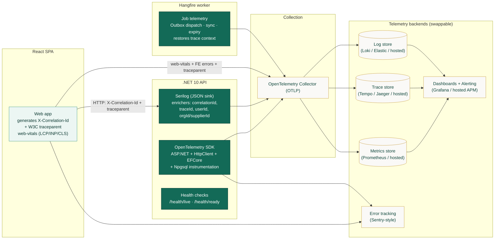
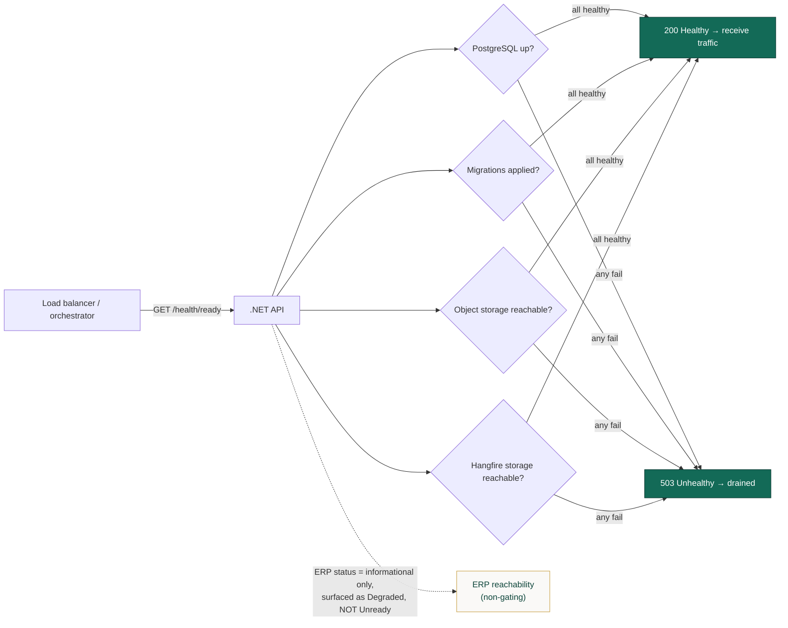
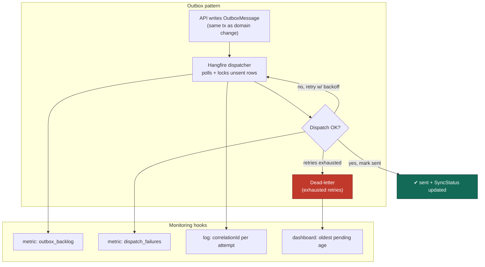

# MOTS Supplier Portal — Observability Architecture

> **Status:** Baseline v1 · **Owner:** Principal Architect · **Date:** 2026-08-26
> Consistent with [`00-foundational-decisions.md`](./00-foundational-decisions.md) (canonical §2, §9).
> Related: [Architecture Overview](./ARCHITECTURE-OVERVIEW.md) ·
> [Deployment](../deployment/DEPLOYMENT-ARCHITECTURE.md) · [Integration](../integration/).

Observability is a first-class NFR here, not an afterthought: the portal must hit **99.5% availability**,
**p95 < 300ms reads / < 800ms writes**, and **audit all state changes** — none of which can be operated
blind. This document defines the three pillars (logs, traces, metrics), correlation-ID propagation from
the browser through the API into background jobs and the ERP adapter, health checks, the RED/USE metric
model, dashboards and alerts, background-job and integration monitoring, error tracking, and the log
hygiene rules that keep secrets and PII out of telemetry.

---

## 1. Principles

| # | Principle |
|---|---|
| O1 | **One trace, end to end.** A user action carries a single correlation/trace identity from the SPA → API → domain events → Outbox → Hangfire jobs → ERP adapter. |
| O2 | **Structured, not prose.** All logs are Serilog **JSON** with typed properties. Grep-able message text is a fallback, not the interface. |
| O3 | **Vendor-neutral export.** OpenTelemetry (OTLP) for traces/metrics/logs so backends (e.g. an OTel collector → Prometheus/Tempo/Loki, or a hosted APM) are swappable. |
| O4 | **No secrets, no PII, ever.** Telemetry is redacted at the source. Business audit lives in `AuditLog`, not in ops logs. |
| O5 | **Every state change is auditable.** The domain `AuditLog` (canonical §5) is the business-truth record; ops telemetry is the technical-truth record. They share the `correlationId`. |
| O6 | **Actionable alerts only.** Alerts map to a symptom a human can act on, tied to an NFR or an integration SLA — no noise. |

---

## 2. The three pillars & the telemetry pipeline



| Pillar | Tooling | Purpose |
|---|---|---|
| **Logs** | Serilog → JSON → OTLP | What happened, with structured context. Debugging, audit-adjacent forensics. |
| **Traces** | OpenTelemetry (auto + manual spans) | Where time went across the request/job/ERP path. Latency root-cause. |
| **Metrics** | OpenTelemetry Metrics (RED/USE) | Aggregate health, SLO tracking, alerting. |
| **Client** | web-vitals + FE error boundary | Real-user LCP/INP/CLS + JS errors, tied to the same correlation identity. |

---

## 3. Correlation & trace propagation (FE → API → jobs → ERP)

The single most important observability capability: **follow one user action everywhere**.

```mermaid
sequenceDiagram
    autonumber
    participant UI as React SPA
    participant API as .NET API
    participant DB as PostgreSQL<br/>(domain + Outbox + AuditLog)
    participant W as Hangfire worker
    participant ACL as ERP adapter (ACL)
    participant ERP as ERPNext

    UI->>UI: generate correlationId (uuid) + W3C traceparent
    UI->>API: request headers: X-Correlation-Id, traceparent
    API->>API: middleware reads/creates correlationId;<br/>opens root span; enriches Serilog LogContext
    API->>DB: persist aggregate + AuditLog(correlationId)<br/>+ OutboxMessage(correlationId, traceparent)
    API-->>UI: response header: X-Correlation-Id (echoed)
    Note over W,DB: async, later
    W->>DB: claim OutboxMessage
    W->>W: restore correlationId + trace context from row
    W->>ACL: dispatch integration event (same correlationId)
    ACL->>ERP: REST call (propagate correlationId as header/meta)
    ACL->>DB: persist ExternalId / SyncStatus (same correlationId)
```

**Rules**

- The SPA **generates** a `correlationId` per user-initiated action and sends it as `X-Correlation-Id`,
  plus a W3C `traceparent` for distributed tracing.
- API middleware **accepts** an inbound `X-Correlation-Id` (trusting the FE) or **generates** one at the
  edge if absent, and **echoes** it back in the response so the SPA can show it in error toasts ("reference
  code") for support.
- The `correlationId` and `traceparent` are **persisted onto the `OutboxMessage`** so async jobs and the
  ERP adapter resume the *same* logical trace hours later — closing the loop across the async boundary.
- The **`AuditLog` row shares the same `correlationId`** (canonical §5), so a governance/audit query and a
  technical trace can be joined.

**Standard enrichment properties on every log line & span**

| Property | Source | Example |
|---|---|---|
| `correlationId` | FE header / edge-generated | `c-9f2a…` |
| `traceId` / `spanId` | OpenTelemetry | W3C trace id |
| `userId` | authenticated principal | GUIDv7 |
| `supplierId` / `organizationId` | RBAC scope | GUIDv7 (row-scope) |
| `slice` | endpoint/handler name | `proposal.submit` |
| `environment` | config | `stage` / `prod` |
| `version` | build metadata | git SHA / semver |

---

## 4. Structured logging (Serilog JSON)

- **Format:** compact JSON (one object per line), OTLP-exported. No multi-line stack traces breaking the
  line contract — exceptions are structured properties.
- **Levels:** `Fatal` (process cannot continue), `Error` (request/job failed unexpectedly), `Warning`
  (degraded but handled — e.g. ERP unreachable, retry scheduled), `Information` (state transitions, key
  business events), `Debug`/`Verbose` (dev/troubleshooting only, off in prod by default).
- **What we log at `Information`:** authentication events, state-machine transitions (e.g. RFQ
  `Published`, Proposal `Submitted`, Award `Approved`), Outbox dispatch outcomes, ERP sync results,
  document lifecycle events (uploaded/approved/expired).
- **Sampling:** errors/warnings always kept; high-volume `Information` on hot read endpoints may be
  sampled; `Debug` never emitted in prod.

**Example log line (redacted, illustrative)**

```json
{
  "@t": "2026-08-26T10:14:22.481Z",
  "@l": "Information",
  "@m": "Proposal PRO-2026-000451 transitioned Submitted",
  "event": "proposal.state.changed",
  "from": "Draft",
  "to": "Submitted",
  "rfqCode": "RFQ-2026-000123",
  "correlationId": "c-9f2a5d7c",
  "traceId": "4b1e...c9",
  "userId": "018f...7a",
  "supplierId": "018f...02",
  "slice": "proposal.submit",
  "environment": "prod",
  "version": "1.4.0+ab12cd"
}
```

> Note: the message names the **short code** (`PRO-2026-000451`, `RFQ-2026-000123`), never an internal
> GUID PK in prose, and carries **no** legal names, tax IDs, prices, or contact PII (see §9 hygiene).

---

## 5. Health checks

Two ASP.NET Core Health Check endpoints, distinguished by purpose. The **worker** exposes its own liveness.

| Endpoint | Purpose | Checks | Consumer |
|---|---|---|---|
| `/health/live` | **Liveness** — is the process up? | Process responsive; no external dependency checks. | Orchestrator restart probe. |
| `/health/ready` | **Readiness** — can it serve traffic? | PostgreSQL connectivity, migrations applied, object storage reachable, Hangfire storage reachable. **ERP is NOT a readiness gate** (portal is ERP-independent — canonical §1/§9). | Load balancer / rollout gate. |



**ERP is reported as a `Degraded`/informational health entry** (visible on dashboards) but never fails
readiness — an ERP outage must not drain the portal. See canonical §1 (portal never blocks on ERP).

---

## 6. Metrics — RED (services) & USE (resources)

### 6.1 RED — for request-serving components (API, worker jobs)

| Metric | Definition | Tied to |
|---|---|---|
| **Rate** | Requests/sec per endpoint & per job type. | Capacity, traffic anomalies. |
| **Errors** | Error ratio (5xx, unhandled, failed jobs, domain-conflict rate). | Reliability SLO. |
| **Duration** | Latency histogram (p50/p95/p99) per endpoint & job. | **p95 < 300ms reads / < 800ms writes** (canonical §9). |

### 6.2 USE — for resources (Postgres, object storage, host)

| Metric | Definition | Tied to |
|---|---|---|
| **Utilization** | CPU/memory of API & worker; DB connection-pool usage; disk. | Saturation warning. |
| **Saturation** | Queue depth (Hangfire pending jobs, Outbox backlog), DB wait/lock time. | Backpressure detection. |
| **Errors** | DB connection errors, storage 5xx, deadlocks. | Infrastructure health. |

### 6.3 Domain & business metrics (portal-specific)

Beyond generic RED/USE, these procurement-specific gauges/counters power governance and early warning:

| Metric | Type | Why it matters |
|---|---|---|
| `outbox_backlog` | gauge | Undispatched integration events — leading indicator of ERP-sync lag. |
| `outbox_dispatch_failures` | counter | Failing integration events → dead-letter growth. |
| `erp_sync_status{state}` | gauge | Count of aggregates `Pending`/`Synced`/`Failed` (`SyncStatus`). |
| `supplier_documents_expiring{window}` | gauge | Documents entering `ExpiringSoon`/`Expired` — drives reminders & compliance. |
| `rfq_submission_window_open` | gauge | Open RFQs accepting proposals — activity health. |
| `proposals_submitted_total` | counter | Supplier engagement. |
| `evaluation_pending_consolidation` | gauge | Evaluations stuck before `Consolidated` — committee bottleneck. |
| `auth_failed_logins_total` | counter | Security signal (brute-force). |
| `email_send_failures_total` | counter | Notification-delivery health. |

---

## 7. Dashboards

| Dashboard | Audience | Key panels |
|---|---|---|
| **Service Health (RED)** | On-call / platform | Request rate, error ratio, p50/p95/p99 latency per endpoint; slow-query top-N; 4xx vs 5xx split. |
| **Resource (USE)** | Platform | API/worker CPU/mem, DB connections & locks, disk, Hangfire queue depth, Outbox backlog. |
| **Background Jobs** | Platform / integrations | Job throughput, retry counts, dead-letter size, oldest pending job age, schedule adherence. |
| **ERP Integration** | Integrations owner | Outbox backlog & failures, `erp_sync_status` breakdown, ERP call latency/error rate, last-successful-sync age, reconciliation gaps. |
| **Web Vitals (RUM)** | Frontend | LCP/INP/CLS distributions (mobile vs desktop, ar vs en), route-level load times, FE error rate. |
| **Business / Governance** | Product / Ministry-facing ops | Active RFQs, proposals submitted, onboarding funnel, documents expiring, evaluation throughput. |
| **Security** | Security | Failed logins, rate-limit trips, authz denials, refresh-token reuse detections. |

---

## 8. Alerts

Alerts are symptom-based and tied to an NFR or an integration SLA. Severity: **P1** page immediately,
**P2** notify (business hours), **P3** ticket.

| Alert | Condition | Severity | Rationale |
|---|---|---|---|
| API availability breach | `/health/ready` failing across replicas or 5xx ratio > 2% for 5m | **P1** | 99.5% availability NFR. |
| Read latency SLO burn | p95 read latency > 300ms for 10m | **P2** | Canonical §9 read target. |
| Write latency SLO burn | p95 write latency > 800ms for 10m | **P2** | Canonical §9 write target. |
| DB saturation | connection-pool > 90% or lock-wait rising for 5m | **P1** | Precedes cascading failure. |
| Outbox backlog growing | `outbox_backlog` rising & oldest > 15m (no drain) | **P2** | Integration events stalling. |
| Outbox dead-letter | `outbox_dispatch_failures` beyond retry budget → dead-letter | **P2** | Needs human reconciliation. |
| ERP sync failing | `erp_sync_status{Failed}` > 0 sustained OR last-successful-sync age > threshold | **P2** | ERP integration health (non-gating to portal). |
| Hangfire worker down | no worker heartbeat for 2m | **P1** | Async work halted (notifications, sync). |
| Email delivery failing | `email_send_failures_total` spike | **P2** | Verification/notification breakage. |
| Web vitals regression | INP p75 > 200ms or LCP p75 > 2.5s sustained | **P3** | Canonical §9 web perf. |
| Auth abuse | `auth_failed_logins_total` spike / rate-limit trips surge | **P2** | Security signal. |
| Document-expiry surge | `supplier_documents_expiring` above expected | **P3** | Compliance workload heads-up. |

---

## 9. Background-job & integration monitoring

The async tier (Hangfire + Outbox + ERP adapter) is where failures are easiest to hide, so it gets
dedicated instrumentation.



- **Hangfire dashboard** (secured, admin-only) exposes queues, retries, and failed jobs directly.
- **Every job carries the originating `correlationId`** so a failed sync links back to the user action.
- **Dead-letter is a first-class, alertable state**, not a silent drop — reconciliation is a deliberate
  admin workflow.
- **ERP call telemetry:** each adapter call is a child span with latency, HTTP status, and retry count;
  `last_successful_sync_at` per aggregate type feeds the integration dashboard.

---

## 10. Error tracking

- **Backend:** unhandled exceptions map to `ProblemDetails` (never leaking internals), are logged at
  `Error` with full structured context + `correlationId`, and forwarded to an error-tracking backend
  (Sentry-style) grouped by exception fingerprint + slice.
- **Frontend:** a React error boundary + global handlers capture render/runtime errors and unhandled
  promise rejections, attach the active `correlationId`, route, locale (`ar`/`en`), and app version, and
  ship to the same error backend — so a user-visible "reference code" ties the FE crash to BE traces.
- **Correlation as support currency:** error toasts show the `correlationId`; support/ops paste it to
  retrieve the full FE→API→job trace.

---

## 11. Log hygiene — no secrets, no PII

**Hard rules (enforced in code review and, where feasible, by redaction middleware):**

| Never in telemetry | Instead |
|---|---|
| Passwords, password hashes, JWT/refresh tokens, API keys, connection strings | Nothing — redacted at source; secrets come from the secret store, never logged. |
| Supplier legal names, tax IDs, bank account numbers, national/registration IDs | Log the **short code** / GUIDv7 reference only; sensitive fields belong in the DB + `AuditLog`, access-controlled. |
| Contact emails/phones in message text | `userId` / `supplierId` reference; contact data stays in the domain store. |
| Commercial values (proposal prices, award amounts) in ops logs | Reference by code; commercial data is domain + audit, subject to RBAC (ministry-visibility is `[ASSUMPTION / REQUIRES BUSINESS CONFIRMATION]`). |
| Full request/response bodies on sensitive endpoints (auth, documents, proposals) | Log metadata (size, content-type, result), not payloads. |
| Raw file contents | Object key + size + type only. |

**Additional controls**

- Serilog **destructuring policies** strip known-sensitive properties globally; a deny-list of property
  names (`password`, `token`, `taxId`, `iban`, `secret`, …) is redacted before any sink.
- **PII scope separation:** operational telemetry is technical-truth (redacted); the domain `AuditLog`
  is business-truth (access-controlled, retained per policy). They correlate via `correlationId`, but ops
  telemetry never becomes a shadow PII store.
- **Retention:** ops logs/traces/metrics retained per environment policy (shorter than the audit trail);
  the `AuditLog` retention follows business/governance requirements
  `[ASSUMPTION / REQUIRES BUSINESS CONFIRMATION]`.
- **Access:** telemetry backends and the Hangfire dashboard are authenticated and role-restricted
  (`system_admin`); no anonymous dashboards.

---

## 12. Summary — observability coverage matrix

| Layer | Logs | Traces | Metrics | Health | Errors |
|---|---|---|---|---|---|
| React SPA | FE console → error backend | traceparent origin | web-vitals (LCP/INP/CLS) | — | error boundary |
| API (.NET) | Serilog JSON | OTel spans (ASP.NET/HttpClient/EFCore) | RED + domain metrics | `/health/live`, `/health/ready` | ProblemDetails + Error logs |
| Hangfire worker | job logs w/ correlationId | resumed trace context | job RED + Outbox/queue gauges | worker heartbeat | dead-letter + Error logs |
| PostgreSQL | slow-query logs | EFCore/Npgsql spans | USE (connections/locks) | readiness dependency | connection/deadlock errors |
| Object storage | access metadata | HttpClient spans | storage USE | readiness dependency | storage 5xx |
| ERP adapter (ACL) | sync logs w/ correlationId | child spans per ERP call | `erp_sync_status`, call latency | non-gating degraded entry | dead-letter + Error logs |

See [Deployment Architecture](../deployment/DEPLOYMENT-ARCHITECTURE.md) for where these components run and
how telemetry backends are provisioned per environment.
