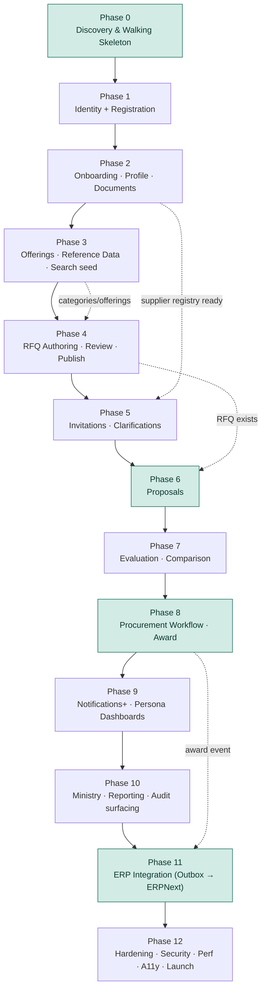
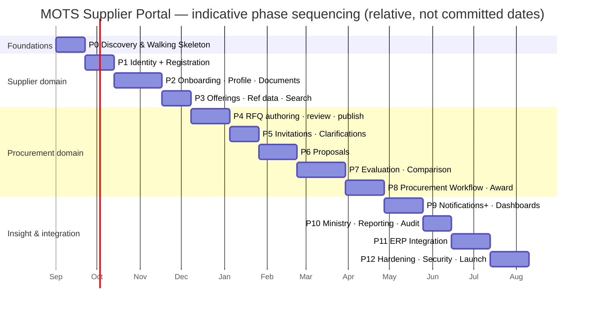

# Implementation Roadmap — MOTS Supplier Portal

> **Status:** Baseline v1 · **Owner:** Principal Architect + Delivery Lead · **Date:** 2026-08-26
> **Canonical sources (must remain consistent):**
> [`00-foundational-decisions.md`](../architecture/00-foundational-decisions.md) ·
> [`DISCOVERY-REPORT.md`](../product/DISCOVERY-REPORT.md)
> **Related:** [`BACKLOG.md`](./BACKLOG.md) · [`PHASE-0-DELIVERABLES.md`](./PHASE-0-DELIVERABLES.md) ·
> [`FUNCTIONAL-REQUIREMENTS.md`](../product/FUNCTIONAL-REQUIREMENTS.md) ·
> [`BUSINESS-PROCESSES.md`](../product/BUSINESS-PROCESSES.md) ·
> [`ARCHITECTURE-OVERVIEW.md`](../architecture/ARCHITECTURE-OVERVIEW.md) ·
> [`DOMAIN-MODEL.md`](../architecture/DOMAIN-MODEL.md)

---

## 1. How to read this roadmap

This document turns the Phase 0→12 delivery approach from the foundational brief (§11) into an
**executable, vertical-slice roadmap**. It is the "when and in what order" companion to the
[`BACKLOG.md`](./BACKLOG.md) ("what") and the [`FUNCTIONAL-REQUIREMENTS.md`](../product/FUNCTIONAL-REQUIREMENTS.md)
("what precisely").

**Non-negotiable delivery principle — vertical slices.** Every phase ships one or more *thin,
end-to-end* slices, each cutting through all layers so the increment is demoable, testable, and
shippable:

```
UI (React/TS, AR-first RTL, a11y)
  → API (Minimal API endpoint + policy authz + FluentValidation)
    → Application (command/query handler, direct dispatch)
      → Domain (aggregate + state machine + invariants)
        → Infrastructure (EF Core 10 / PostgreSQL 17, IFileStorage, Outbox)
          → Tests (unit + integration [Testcontainers] + component + E2E [Playwright] + axe a11y)
```

A slice is **not "done"** until: the domain rejects illegal transitions (not just the UI), authz is
enforced at the API and re-checked for affordance-hiding in the UI, the happy path plus at least the
primary error/denied paths are covered by tests, the screens pass axe-core and manual RTL review in
**both `ar` and `en`**, and every state change writes an **AuditLog** entry. UX quality and business
correctness gate "done" (foundational brief §11).

**Cross-cutting from day one.** Security, audit-on-transition, localization (AR/EN + RTL),
accessibility (WCAG 2.2 AA), responsiveness, observability, and the ERP `ExternalId`/Outbox seam are
**built into every slice**, not deferred to a phase. The dedicated hardening phases (11–12) *deepen
and verify* these, they do not introduce them.

**MoSCoW / complexity legend** — priorities `M`/`S`/`C`/`W`; complexity `S`/`M`/`L`/`XL`. Epics use
`EPIC-##` ids from [`BACKLOG.md`](./BACKLOG.md).

---

## 2. Epic ↔ Phase map

| # | Epic | Primary phase(s) | Cross-cutting into |
|---|---|---|---|
| EPIC-01 | Identity & Access | **1** | every phase |
| EPIC-02 | Supplier Registration | **1** | 2 |
| EPIC-03 | Onboarding | **2** | 9, 10 |
| EPIC-04 | Supplier Profile | **2** | 3, 11 |
| EPIC-05 | Documents | **2** | 6, 9 |
| EPIC-06 | Offerings | **3** | 5, 7 |
| EPIC-07 | RFQ (authoring & lifecycle) | **4** | 5, 8, 13 |
| EPIC-08 | Invitations | **5** | 6, 9 |
| EPIC-09 | Proposals | **6** | 7, 11 |
| EPIC-10 | Clarifications | **5** | 4-note: parallels Invitations |
| EPIC-11 | Evaluation | **7** | 12, 14 |
| EPIC-12 | Comparison | **7** | 14 |
| EPIC-13 | Procurement Workflow (orchestration) | **8** | 4–7 |
| EPIC-14 | Award | **8** | 11, 15 |
| EPIC-15 | Notifications | seeded **1**, deepened **9** | every phase |
| EPIC-16 | Supplier Dashboard | seeded **2**, deepened **9** | 5, 6, 9 |
| EPIC-17 | Procurement Dashboard | seeded **4**, deepened **9** | 5–8 |
| EPIC-18 | Ministry Dashboard | **10** | 19 |
| EPIC-19 | Reporting | **10** | 12, 18 |
| EPIC-20 | Search | seeded **3**, deepened **10** | 2–9 |
| EPIC-21 | Administration | seeded **3**, deepened throughout | 1, 5, 11 |
| EPIC-22 | Audit & Compliance | seeded **1**, surfaced **10** | every phase |
| EPIC-23 | ERP Integration | **11** | 2, 8 |
| EPIC-24 | Security | seeded **0/1**, hardened **12** | every phase |
| EPIC-25 | Observability | seeded **0**, hardened **12** | every phase |
| EPIC-26 | Performance | verified per-slice, hardened **12** | every phase |
| EPIC-27 | Localization (AR-first/RTL/i18n) | seeded **0**, verified **12** | every phase |
| EPIC-28 | Responsive / Mobile | seeded **0**, verified **12** | every phase |

> Cross-cutting epics (15, 20, 21, 22, 24–28) are intentionally **not** single-phase. They are
> *seeded* early as thin capability, then a specific phase *deepens/verifies* them. This is what keeps
> slices vertical: a proposal screen delivered in Phase 6 already emits notifications, is searchable,
> audited, secured, localized, responsive, and observable.

---

## 3. Phase sequencing





> Durations are **indicative sizing**, not commitments. The critical path runs through the
> procurement domain (P4→P8); Phases 9–10 can partially parallelize once P8 stabilizes, and the ERP
> integration (P11) can start design/stubbing as early as P2 behind the ACL.

---

## 4. Phase details

Each phase below lists: **Goal**, **Vertical slices** (the demoable end-to-end increments),
**Entry criteria**, **Exit criteria (gate)**, **Dependencies**, and **Epics advanced**.

---

### Phase 0 — Discovery & Walking Skeleton

**Goal.** Prove the whole stack end-to-end with a trivial but *real* vertical slice, and land the
foundations every later slice reuses: repo structure, CI/CD, design system tokens, app shells,
i18n/RTL scaffolding, health/observability, and a migration pipeline.

**Vertical slices delivered end-to-end.**
- **Walking-skeleton slice:** an authenticated-less `GET /health` + a "hello" reference-data read
  (e.g. `GET /api/v1/reference/currencies`) rendered by a themed React shell — travels UI → Minimal
  API → Application query → EF Core → PostgreSQL (Testcontainers-backed test) → OpenTelemetry trace →
  Serilog JSON log. This exercises every layer and CI stage before any business logic exists.
- **Design-system slice:** brand tokens (evergreen-teal/stone/gold), typography (IBM Plex Sans
  Arabic + Inter), spacing/radius/shadow, light/dark, RTL logical properties, and 6–8 base Radix-built
  components (Button, Input, Select, Dialog, Toast, Table, Badge, Field) in Storybook with axe checks.
- **App-shell slice:** two shells (Supplier app, Back-office app) with TanStack Router, language
  switch (`ar`/`en`) flipping `dir`, layout scaffold (top bar, nav, content), and a 404/403/500
  boundary — all localized and RTL-correct.

**Entry criteria.** Phase-0 product/UX/architecture docs published
([`PHASE-0-DELIVERABLES.md`](./PHASE-0-DELIVERABLES.md)); canonical brief signed off.

**Exit criteria (gate).**
- CI green on PR: build, unit, integration (Testcontainers Postgres), lint, typecheck, `NetArchTest`
  architecture rules, axe smoke, Playwright smoke; container image builds; EF migration applies to a
  clean DB and rolls back.
- Design tokens match brief §7 exactly; Storybook deployed; language switch flips `dir` with no layout
  breakage; LCP budget instrumented.
- Serilog JSON + OTel traces visible for the skeleton request with a propagated `correlationId`.

**Dependencies.** None (greenfield).

**Epics advanced.** EPIC-24 (Security baseline), EPIC-25 (Observability), EPIC-27 (Localization),
EPIC-28 (Responsive), EPIC-21 (reference-data read seed), EPIC-26 (perf budgets wired).

---

### Phase 1 — Identity & Access + Supplier Registration

**Goal.** A prospective supplier can self-register, verify email, and sign in; the platform has
real authn/authz (JWT access + rotating refresh, policy-based permission claims, row-scoping) that
every later slice builds on. This is the **first business vertical slice** (Discovery §7.3).

**Vertical slices.**
- **Registration + email verification** (`FR-REG-001..007`, `FR-IAM-006`): AR-first registration form
  (RHF+Zod) → `POST /api/v1/registrations` → creates **Supplier** `OnboardingState=Draft` + a
  `supplier_admin` **User** → verification email (durable job) → `Draft → EmailVerified`. Duplicate
  prevention on legal id/email. Advances **EPIC-02**.
- **Authentication** (`FR-IAM-001..003,005,012`): login → JWT access + rotating refresh, reuse-detection
  invalidates token family, lockout with backoff, self-service password reset, all auth events audited.
  Advances **EPIC-01**.
- **AuthZ kernel** (`FR-IAM-008..010`): policy-based `resource.action` permission handlers, seeded
  roles per persona, server-side row-scoping helper (SupplierId/OrganizationId), UI affordance-hiding
  that never trusts the client. Advances **EPIC-01**.

**Entry criteria.** Phase 0 gate passed.

**Exit criteria (gate).**
- Register → verify → login → land on an (empty) supplier dashboard works in `ar` and `en`, RTL-correct.
- Illegal auth flows rejected server-side (reused refresh token, expired verify token, locked account);
  authz denials return `403` and hide affordances in UI.
- Integration tests cover happy + denied + duplicate paths; auth events present in **AuditLog** with
  `correlationId`; password/token handling reviewed against OWASP ASVS L2 (EPIC-24).
- MFA (TOTP) enrolment scaffolded behind a policy flag (`FR-IAM-004`, may be `S`).

**Dependencies.** Phase 0.

**Epics advanced.** EPIC-01, EPIC-02; seeds EPIC-15 (verification/reset emails), EPIC-22 (auth audit),
EPIC-24 (authn/z), EPIC-16 (empty dashboard shell).

---

### Phase 2 — Onboarding · Profile · Documents

**Goal.** A verified supplier completes a rich profile and uploads required documents; a reviewer
approves/rejects/requests-info through the full onboarding state machine — turning "a login" into a
"trusted, approved supplier in the registry."

**Vertical slices.**
- **Profile capture** (`FR-PROF-001..011`): profile sections (legal/trade name AR+EN, LegalInfo VO,
  Addresses, Contacts/Representatives, Branches, BankAccounts) with AR/EN inputs, tabular numerals,
  delegated `supplier_user` management. Advances **EPIC-04**.
- **Documents lifecycle** (`FR-DOC-001..009`): DocumentType-driven required set, upload via
  `IFileStorage` (local dev / S3 prod) with MIME/size/virus validation, issue/expiry capture, reviewer
  review `Uploaded → UnderReview → Approved|Rejected`, scheduled `Approved → ExpiringSoon → Expired`
  (Hangfire), versioned re-upload, audited view/download. Advances **EPIC-05**.
- **Onboarding workflow** (`FR-ONB-001..012`): completeness checklist gating submission; supplier
  submit `ProfileInProgress → Submitted`; reviewer queue with SLA/aging; `Submitted → UnderReview →
  (InfoRequested → Resubmitted → UnderReview)* → Approved|Rejected`; on approval emit supplier-master
  sync event to **Outbox** (stubbed adapter). Post-approval `Active ↔ Suspended → Deactivated`.
  Advances **EPIC-03**.

**Entry criteria.** Phase 1 gate; `IFileStorage` abstraction and Hangfire wired (from Phase 0/1).

**Exit criteria (gate).**
- End-to-end: verified supplier → completes profile → uploads docs → submits → reviewer requests info →
  supplier resubmits → reviewer approves → supplier `Active`. Rejection path also demoable.
- Domain rejects illegal transitions (e.g. submit with incomplete checklist, approve with pending
  required docs); every transition audited; expiry timer moves an Approved doc to ExpiringSoon in test.
- Outbox row written on approval (adapter stub); document access authorized, time-limited, audited.
- Reviewer back-office screens desktop-optimized; supplier screens mobile+desktop; both RTL/AR-first.

**Dependencies.** Phase 1 (identity/roles/scoping), Phase 0 (IFileStorage, jobs).

**Epics advanced.** EPIC-03, EPIC-04, EPIC-05; seeds EPIC-16 (supplier dashboard completeness),
EPIC-15 (info-requested/approval notifications), EPIC-23 (Outbox seam), EPIC-22 (transition audit).

---

### Phase 3 — Offerings · Reference Data · Search (seed)

**Goal.** Suppliers publish a catalog of offerings mapped to the buyer **Category** tree; admins
manage the reference data (Category, DocumentType, Currency, UoM, Incoterm, Region) that the whole
platform depends on; first real search/list surfaces appear.

**Vertical slices.**
- **Reference data administration** (`FR-ADM-004`, subset of **EPIC-21**): CRUD for Category tree,
  DocumentType, Currency, UnitOfMeasure, Incoterm, Region — permission-guarded (`admin.*`), audited,
  localized labels (AR/EN).
- **Offerings** (`FR-OFF-001..005`): create/edit/deactivate Offering (AR/EN, category, UoM, indicative
  price+currency, JSONB flexible attributes with typed inputs); visibility gated to `Active` suppliers.
  Advances **EPIC-06**.
- **Search seed** (`FR-SRCH-001,003,004,005`): server-side paginated, sorted, faceted lists (TanStack
  Table) for supplier's own offerings/documents and (for staff) a scoped supplier search — row-scoping
  enforced so nothing leaks cross-scope. Advances **EPIC-20**.

**Entry criteria.** Phase 2 gate (suppliers exist and can be Active).

**Exit criteria (gate).**
- Admin can build the Category tree and document types; a supplier can publish offerings against them.
- Scoped supplier search returns only in-scope rows (verified by an authz/negative test).
- All new list/table views paginate server-side, are RTL-aware, sortable, filterable, and accessible.

**Dependencies.** Phase 2.

**Epics advanced.** EPIC-06, EPIC-21 (reference-data slice), EPIC-20 (search seed).

---

### Phase 4 — RFQ Authoring · Internal Review · Publish

**Goal.** A procurement officer authors an RFQ with items, requirements, attachments, and a bound
evaluation template; it passes internal review/approval and is published — pivoting the platform from
the supplier domain into the procurement domain.

**Vertical slices.**
- **RFQ authoring** (`FR-RFQ-001..004,011,012,013`): create `Draft` RFQ (title, org, currency,
  timeline), add **RfqItem[]** and **Requirement[]**, attach specs via `IFileStorage`, bind an
  **EvaluationTemplate** (`EvaluationTemplateRef`), opaque public ref (`RFQ-2026-000123`), state-gated
  editing. Advances **EPIC-07**.
- **Evaluation templates** (`FR-ADM-005`, part of **EPIC-21**/**EPIC-11** prep): reusable weighted
  criteria (name, weight, max, threshold, scoring type) manageable by admin/manager.
- **Internal review & publish** (`FR-RFQ-005,006,010`): `Draft → InternalReview → Approved →
  Published` with permission-guarded `rfq.publish`, return-to-draft with comments, and cancel-with-
  reason from any pre-Awarded state. Advances **EPIC-07** + seeds **EPIC-13**.
- **Procurement dashboard seed** (`FR-DSH-003`): RFQ pipeline by state. Seeds **EPIC-17**.

**Entry criteria.** Phase 3 (categories/UoM/currency exist for RFQ items and templates).

**Exit criteria (gate).**
- Author → submit for review → approve → publish an RFQ, all permission-guarded and audited; cancel
  path demoable with reason + notification.
- Editing constraints enforced by state (full in Draft, locked after Published except addenda);
  illegal transitions rejected by the domain.
- Evaluation template binds and is immutable-by-reference once the RFQ leaves Draft.

**Dependencies.** Phase 3.

**Epics advanced.** EPIC-07, EPIC-11 (template authoring), EPIC-21, seeds EPIC-13, EPIC-17.

---

### Phase 5 — Invitations · Clarifications

**Goal.** Buyers invite Active suppliers to a published RFQ and run a structured, fair clarification
(Q&A) channel; suppliers see and respond to invitations.

**Vertical slices.**
- **Invitations** (`FR-INV-001..007`): invite Active suppliers (candidate suggestions from
  categories/offerings), status tracking (invited/viewed/responding/submitted/declined), notify with
  deep link, decline-with-reason, late-invite while `SubmissionOpen`, buyer-visible status. Row-scoped
  visibility so only invited suppliers see RFQ detail. Advances **EPIC-08**.
- **Clarifications** (`FR-CLR-001..006`): suppliers post questions in-window; buyer answers privately
  or publishes to all (asker anonymized); addenda notify all invited suppliers; windows bounded by
  timeline; fully audited/notified. Advances **EPIC-10**.
- **Submission window automation** (`FR-RFQ-007`): scheduled `Published → SubmissionOpen →
  SubmissionClosed` (Hangfire), early-close-with-reason. Advances **EPIC-07**/**EPIC-13**.

**Entry criteria.** Phase 4 (published RFQ exists), Phase 2 (Active suppliers exist).

**Exit criteria (gate).**
- Buyer invites suppliers → supplier receives notification + sees RFQ → posts a clarification → buyer
  publishes answer to all with asker anonymized → addendum notifies all.
- Only invited, in-scope suppliers can open RFQ detail (authz negative test); out-of-window posts
  rejected by the domain; window automation survives a job-host restart (durability test).

**Dependencies.** Phase 4; Phase 2.

**Epics advanced.** EPIC-08, EPIC-10; deepens EPIC-15 (invite/clarification notifications), EPIC-07.

---

### Phase 6 — Proposals

**Goal.** An invited supplier builds and submits a structured, revisable proposal with draft safety
and submission guardrails — completing the RFQ→Invitation→Proposal triad. **Key milestone.**

**Vertical slices.**
- **Proposal authoring** (`FR-PRP-001..005`): one **Proposal** per Supplier per RFQ; **ProposalItem[]**
  line pricing against RFQ items with auto totals; **CommercialTerms** VO (payment/lead time/incoterm/
  validity) + **TechnicalResponse** to requirements; **ProposalDocument[]** via `IFileStorage`;
  auto-save draft safety, private until submitted. Advances **EPIC-09**.
- **Submission guardrails** (`FR-PRP-006,007,008,012`): pre-submission validation (all required items
  priced, mandatory responses/docs present), submit only while `SubmissionOpen` (domain rejects
  late), multi-currency display currency, withdraw-while-open, cross-supplier confidentiality enforced
  server-side. Advances **EPIC-09**.
- **Supplier dashboard deepening** (`FR-DSH-001`): active invitations + proposal statuses. Deepens
  **EPIC-16**.

**Entry criteria.** Phase 5 (invitation + open submission window exist).

**Exit criteria (gate).**
- Invited supplier drafts (auto-saved) → validates → submits before close; a late submit is rejected
  by the domain; withdraw-while-open works; a second supplier cannot see the first's contents (authz +
  negative test).
- Totals compute correctly across currencies; drafts never lost across reload/session (persistence test).
- Fully mobile+desktop, AR-first, RTL, accessible; every action audited/notified.

**Dependencies.** Phase 5.

**Epics advanced.** EPIC-09; deepens EPIC-16, EPIC-15, EPIC-20.

---

### Phase 7 — Evaluation · Comparison

**Goal.** Multiple evaluators independently score submitted proposals against the RFQ's weighted
criteria; results consolidate and finalize; buyers compare proposals side-by-side.

**Vertical slices.**
- **Evaluation** (`FR-EVL-001..011`): assign evaluators (`NotStarted → Assigned`), independent/blind
  scoring per criterion with comments (`Assigned → InProgress → EvaluatorSubmitted`), weighted
  computation with per-criterion thresholds, lock-on-submit with permissioned override,
  consolidation into **ConsolidatedResult** with ranking (`→ Consolidated → Finalized`). Advances
  **EPIC-11**.
- **Comparison** (`FR-CMP-001..006`): side-by-side matrix (line prices, totals, terms, technical
  responses, scores/ranking), best-per-line + threshold pass/fail highlighting, multi-currency
  normalization to a display currency, blindness-respecting until finalized, export (PDF/print),
  responsive/RTL sticky-header table. Advances **EPIC-12**.
- **Evaluator dashboard** (`FR-DSH-004`): assignments, progress, deadlines. Deepens **EPIC-17**.

**Entry criteria.** Phase 6 (submitted proposals exist), Phase 4 (evaluation template bound).

**Exit criteria (gate).**
- Assign 2+ evaluators → each scores blind (cannot see peers) → submit locks scores → consolidate →
  finalize; below-threshold flags/disqualifies per template; override requires permission + audit.
- Comparison matrix renders normalized multi-currency, honors blindness until finalized, exports for
  the award file; evaluator UI is keyboard-navigable, RTL-correct, tablet-friendly.

**Dependencies.** Phase 6; Phase 4.

**Epics advanced.** EPIC-11, EPIC-12; deepens EPIC-17, EPIC-19 (export foundations), EPIC-22.

---

### Phase 8 — Procurement Workflow (orchestration) · Award

**Goal.** The RFQ lifecycle is presented as a guided, gated workspace, and the award flow completes
the loop: recommendation → approval → award → non-winners notified → award event enqueued for ERP.
**Key milestone — core procurement value fully delivered end-to-end.**

**Vertical slices.**
- **Workflow orchestration** (`FR-PWF-001..005`): RFQ workspace showing `RfqState`, permitted next
  actions, blockers, stage-gate prerequisites (no `UnderEvaluation` before `SubmissionClosed`; no
  recommendation before evaluation `Finalized`), timeline automation resilient to restarts, `RowVersion`
  concurrency with localized conflict prompts. Advances **EPIC-13**.
- **Award** (`FR-AWD-001..008`): produce **Recommendation** grounded in evaluation/comparison, route
  for approval (`Recommended → PendingApproval`), approve/reject with reason (`→ Approved|Rejected`),
  issue award (`→ Awarded`) transitioning winning proposal to `AwardOffered/Awarded` and others to
  `NotSelected`, notify all suppliers, enqueue **Outbox** award event → (ERP PO, adapter stub for now),
  store immutable award file (justification + comparison snapshot). Advances **EPIC-14**.
- RFQ closes `AwardApproval → Awarded → Completed` in step with the Award aggregate.

**Entry criteria.** Phase 7 (finalized evaluation + comparison exist).

**Exit criteria (gate).**
- Recommend → approve → award → non-winners `NotSelected` + notified → RFQ `Completed`; reject-returns-
  to-recommendation path demoable; award requires `award.approve`, fully audited.
- Award enqueues an Outbox event (adapter stub) without blocking; award file is immutable and
  retrievable; stage gates reject out-of-order transitions in the domain.
- A full **register → onboard → RFQ → invite → propose → evaluate → award** journey is demoable E2E.

**Dependencies.** Phase 7.

**Epics advanced.** EPIC-13, EPIC-14; deepens EPIC-15, EPIC-22, EPIC-23 (award→PO seam).

---

### Phase 9 — Notifications+ · Persona Dashboards

**Goal.** Elevate the notification architecture and every persona dashboard from "seeded" to
first-class, so each role has a role-appropriate operational home.

**Vertical slices.**
- **Notifications** (`FR-NOT-001..007`): full in-app notification center (unread/read, grouping, deep
  links, history), localized AR/EN email templates via durable retrying jobs, per-category/channel
  preferences, de-duplicated deadline reminders, Outbox-decoupled generation, SMS designed-for/disabled.
  Advances **EPIC-15**.
- **Dashboards** (`FR-DSH-001..008`): Supplier, Onboarding/Compliance, Procurement, and Evaluator
  dashboards themed with Recharts/bespoke SVG, row-scoped widgets, responsive/RTL/accessible. Deepens
  **EPIC-16**, **EPIC-17**.

**Entry criteria.** Phase 8 (all lifecycle events now exist to notify/visualize).

**Exit criteria (gate).**
- Every lifecycle event surfaces an in-app notification and (where applicable) a localized email;
  preferences honored; reminders de-duplicated.
- Each persona dashboard renders only in-scope data, meets LCP/INP budgets, passes axe, and is correct
  in `ar` RTL and `en` LTR.

**Dependencies.** Phase 8.

**Epics advanced.** EPIC-15, EPIC-16, EPIC-17; deepens EPIC-26 (perf on data-heavy views).

---

### Phase 10 — Ministry Dashboard · Reporting · Audit surfacing

**Goal.** Deliver governance-level oversight for the Ministry, cross-cutting reporting/exports, and
first-class audit access.

**Vertical slices.**
- **Ministry governance dashboard** (`FR-DSH-005`): cross-organization, **read-only** aggregate metrics
  (RFQ volumes, cycle times, participation, awards) with the commercial-visibility policy flag
  ([ASSUMPTION / REQUIRES BUSINESS CONFIRMATION]). Advances **EPIC-18**.
- **Reporting** (`FR-CMP-005`, `FR-AUD-004`, governance reports): parameterized, localized, exportable
  (PDF/CSV) procurement and compliance reports respecting scope. Advances **EPIC-19**.
- **Audit & compliance surfacing** (`FR-AUD-001..006`): append-only audit read UI, filter/search by
  entity/actor/action/date, exportable, correlated to OTel traces; suppliers see their own trail.
  Advances **EPIC-22**.
- **Search deepening** (`FR-SRCH-002,006`): cross-scope RFQ search for Ministry, optional full-text.
  Deepens **EPIC-20**.

**Entry criteria.** Phase 9 (data + notifications mature enough to aggregate/report).

**Exit criteria (gate).**
- Ministry sees only permitted aggregate/anonymized metrics (authz test on commercial-visibility flag);
  reports export correctly localized/RTL; audit UI is read-only and provably immutable.

**Dependencies.** Phase 9.

**Epics advanced.** EPIC-18, EPIC-19, EPIC-22, EPIC-20.

---

### Phase 11 — ERP Integration (Outbox → ERPNext)

**Goal.** Turn the Outbox seams (seeded since Phase 2) into a real, resilient ERPNext integration via
the Anti-Corruption Layer + adapters — **without** the portal ever blocking on ERP availability.

**Vertical slices.**
- **Outbox dispatcher** (`FR-INT-001,002,006,009`): durable background publisher with backoff, retry,
  dead-letter, and admin-visible health/status; `SyncStatus/LastSyncedAt/RowVersion` maintained;
  conflicts queued, never silently overwritten.
- **Supplier master sync** (`FR-INT-003,005`): on approval, map portal Supplier superset → ERPNext
  `Supplier` subset; store nullable string **`ExternalId`** (never an integer FK).
- **Award → Purchase Order** (`FR-INT-004`): ACL translates the award event to an ERPNext **Purchase
  Order**; store returned PO key as `ExternalPurchaseOrderRef`/`ExternalId`.
- **Resilience & inbound** (`FR-INT-007,008`): full portal journey works with ERP down; pending syncs
  drain on recovery; optional inbound reference sync passes through the ACL preserving domain invariants
  ([ASSUMPTION / REQUIRES BUSINESS CONFIRMATION] on direction/scope).

**Entry criteria.** Phase 8 (award events exist), Phase 2 (approval events exist); ERPNext test
instance/contract available.

**Exit criteria (gate).**
- With ERP up: approved supplier appears in ERPNext with a stored `ExternalId`; an award produces an
  ERP PO with `ExternalPurchaseOrderRef`.
- With ERP down: the whole portal journey still completes; messages queue and drain on recovery;
  contract mismatch dead-letters + alerts (fails safe, not silent); admin sees integration health.

**Dependencies.** Phase 8; Phase 2; ERPNext environment.

**Epics advanced.** EPIC-23; deepens EPIC-21 (integration admin), EPIC-25 (integration telemetry).

---

### Phase 12 — Hardening · Security · Performance · Accessibility · Launch

**Goal.** Verify and deepen the cross-cutting non-functionals to production bar and prepare launch.
Nothing new business-wise — this phase *proves* the platform meets the brief §9 targets.

**Vertical slices (verification-led).**
- **Security** (**EPIC-24**): OWASP ASVS L2 pass, dependency/secret scanning, authz fuzzing of
  row-scoping, MFA enforcement for `system_admin`/`procurement_manager`, rate limiting, security review
  ([`security-review`]). Pen-test remediation.
- **Performance** (**EPIC-26**): meet API p95 <300ms reads / <800ms writes, LCP <2.5s, INP <200ms on
  mid-range mobile; load/soak tests; DB indexing/query review; route-level code splitting audit.
- **Accessibility & UX** (**EPIC-27**, **EPIC-28**): WCAG 2.2 AA audit across all flows in `ar`+`en`;
  keyboard/screen-reader passes; RTL/mirroring/numeral review; responsive review mobile→desktop.
- **Observability & resilience** (**EPIC-25**): dashboards/alerts (traces/metrics/logs), Outbox/job
  health alerting, backups + PITR restore drill, availability (99.5%) validation, runbooks.

**Entry criteria.** Phases 0–11 gates passed; feature-complete for v1 scope.

**Exit criteria (gate — launch readiness).**
- All brief §9 NFR targets met and evidenced; ASVS L2 checklist satisfied; a11y audit passes AA in both
  locales; PITR restore drill succeeds; runbooks + on-call in place; go/no-go signed off.

**Dependencies.** All prior phases.

**Epics advanced.** EPIC-24, EPIC-25, EPIC-26, EPIC-27, EPIC-28 (verification/hardening).

---

## 5. Milestones & demoable increments

| Milestone | End of phase | Demoable capability |
|---|---|---|
| **M0 Walking skeleton** | P0 | Themed AR/EN shell reads real data through all layers; CI green. |
| **M1 First business slice** | P1 | Self-register → verify email → sign in with real authn/z. |
| **M2 Trusted registry** | P2 | Supplier onboarded, documents reviewed, **Approved/Active**. |
| **M3 Buyer can publish RFQ** | P4 | RFQ authored, reviewed, published with public ref. |
| **M4 Suppliers can respond** | P6 | Invited supplier submits a guarded, revisable proposal. |
| **M5 Evaluate & compare** | P7 | Blind multi-evaluator scoring, consolidation, comparison matrix. |
| **M6 End-to-end procurement** | P8 | Register→onboard→RFQ→invite→propose→evaluate→**award**. |
| **M7 Insight & governance** | P10 | Persona dashboards + Ministry oversight + audit/reporting. |
| **M8 ERP-integrated** | P11 | Approved supplier & award sync to ERPNext, ERP-outage-resilient. |
| **M9 Launch-ready** | P12 | NFR/security/a11y/perf targets evidenced; go-live. |

---

## 6. Cross-cutting delivery rules (apply to every phase)

1. **Vertical or it doesn't ship.** No horizontal "backend-only" or "UI-only" sprints; each PR moves a
   slice through all layers with tests.
2. **Domain owns invariants.** Illegal state transitions are rejected by the aggregate, not just hidden
   by the UI ([`BUSINESS-PROCESSES.md`](../product/BUSINESS-PROCESSES.md)).
3. **Authz at the API, affordance-hiding in the UI.** Never trust the client; add a negative/denied
   test per protected endpoint.
4. **Audit on every state change.** Actor, timestamp, from→to, reason, `correlationId`.
5. **AR-first, RTL-correct, AA-accessible, responsive** — reviewed in both `ar` and `en` before "done".
6. **ERP seam always present.** ERP-syncable entities carry `ExternalId?`, `SyncStatus`,
   `LastSyncedAt`, `RowVersion`; integration is async via Outbox even when the adapter is a stub.
7. **Observability & perf budgets per slice.** Structured logs, traces, and LCP/INP/API-latency budgets
   are checked in CI, not retrofitted.

---

## 7. Risks to sequencing (see [`RISK-REGISTER.md`](../product/RISK-REGISTER.md))

| Risk | Impact on roadmap | Mitigation |
|---|---|---|
| Syrian legal/tax/registration rules unconfirmed | Profile/registration fields (P1–P2) stay generic | Fields captured generically + `[ASSUMPTION]`; confirm before P12 launch. |
| Approval-hierarchy scope (RFQ publish, award) | P4/P8 workflow complexity | Ship single-approver configurable; design for multi-step. |
| Ministry commercial-value visibility undecided | P10 dashboard scope | Build behind a policy flag; default to aggregate/anonymized. |
| ERPNext contract/environment availability | P11 slippage | ACL + adapter stubs from P2 let P0–P10 proceed unblocked. |
| Evaluation blindness rules | P7 correctness | Assume blind-until-consolidated (brief §5); confirm before P7 gate. |

---

*End of ROADMAP. The task-level breakdown of every epic lives in [`BACKLOG.md`](./BACKLOG.md).*
