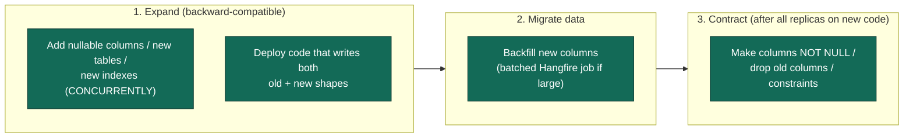
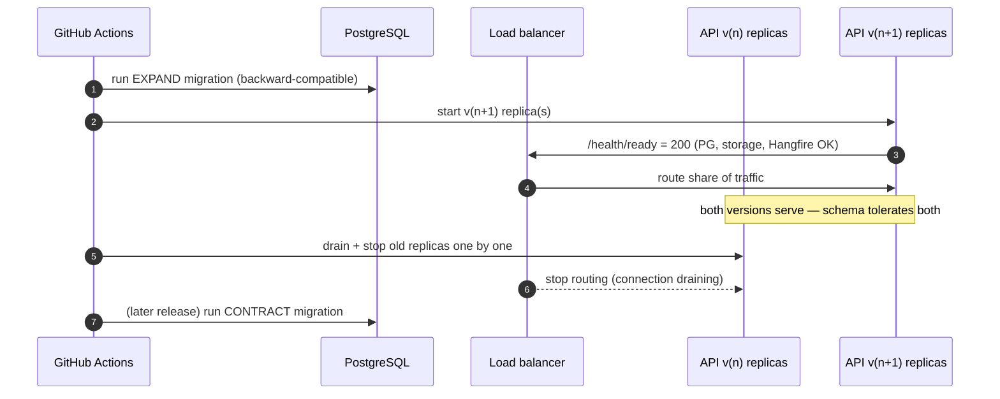
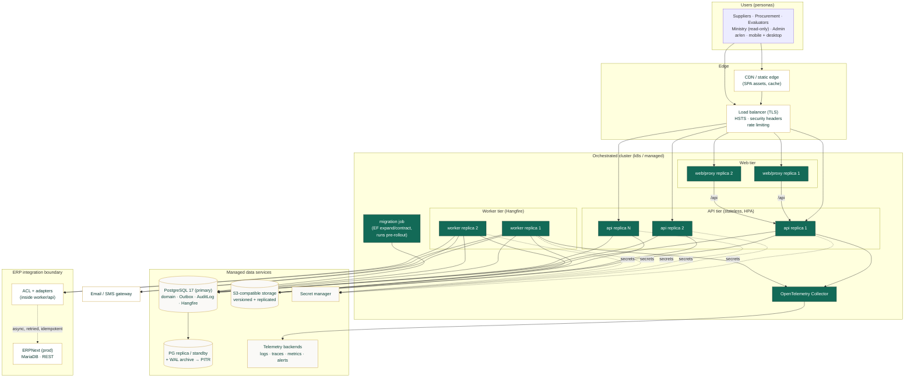

# MOTS Supplier Portal — Deployment Architecture

> **Status:** Baseline v1 · **Owner:** Principal Architect · **Date:** 2026-08-26
> Consistent with [`00-foundational-decisions.md`](../architecture/00-foundational-decisions.md) (canonical §2, §9, §10).
> Related: [Architecture Overview](../architecture/ARCHITECTURE-OVERVIEW.md) ·
> [Observability](../architecture/OBSERVABILITY-ARCHITECTURE.md) · [Integration](../integration/).

This document defines how the portal is built, packaged, configured, and run across environments; the
CI/CD pipeline that gets code from a pull request to production safely; how database migrations (EF Core)
and zero-downtime deploys are handled; and the backup/PITR/DR posture that satisfies the **99.5%
availability** and **backups + PITR** requirements (canonical §9). The portal is **standalone and
independently deployable** and must run fully **without the ERP** (canonical §1).

---

## 1. Deployment principles

| # | Principle |
|---|---|
| D1 | **Independently deployable.** No runtime dependency on ERPNext; the ERP is reached async and its absence never blocks a deploy or core flow. |
| D2 | **Immutable, containerized artifacts.** Every build produces versioned OCI images (API, worker, SPA/proxy) promoted **unchanged** dev → stage → prod. |
| D3 | **Config out of the image.** Images carry code only; environment differences come from config + secrets injected at runtime (12-factor). |
| D4 | **Zero-downtime by default.** Rolling deploys behind health checks; migrations are expand/contract and backward-compatible. |
| D5 | **Everything reproducible.** Infrastructure and pipeline defined as code; no click-ops in prod. |
| D6 | **Recoverable.** Automated backups + point-in-time recovery; DR runbook with defined RPO/RTO. |
| D7 | **Secure supply chain.** Build, test, dependency scan, image scan, and secret scan gate every release. |

---

## 2. Environments

| Environment | Purpose | Data | Scale | ERP target | Access |
|---|---|---|---|---|---|
| **dev** | Local & shared integration; fast iteration. | Synthetic/seeded; disposable. | 1 replica each; Postgres + MinIO in Docker Compose. | Mock/stub `IErpGateway`. | Engineers. |
| **stage** | Pre-prod validation, UAT, migration rehearsal, perf/a11y checks. | Anonymized/synthetic prod-like. | Prod-shaped but smaller. | ERP **sandbox** (or stub) — never prod ERP. | Team + business UAT. |
| **prod** | Live service. | Real; backups + PITR. | HA: ≥2 API replicas, ≥1–2 worker replicas, managed Postgres, S3/MinIO. | ERP **production** via ACL (async). | Restricted; audited. |

**Config parity:** all three run the **same images**; only injected config/secrets and scale differ (D2/D3).
Default currency **SYP**, locale **ar** default — set via config, not code (canonical §8).

---

## 3. Containerization (Docker)

Three first-class images, each with a minimal, non-root, multi-stage build.

| Image | Base (build → runtime) | Contents | Notes |
|---|---|---|---|
| `supplier-portal-api` | `sdk:10` → `aspnet:10` (chiseled/distroless-style) | .NET 10 Minimal API (Api/Application/Domain/Infrastructure). | Non-root; reads config from env; exposes `/health/live`+`/health/ready`. |
| `supplier-portal-worker` | `sdk:10` → `runtime:10` | Hangfire server: Outbox dispatch, jobs, ERP sync. | Same solution, worker entrypoint; own liveness heartbeat. |
| `supplier-portal-web` | `node:22` (Vite build) → static-serving proxy | Built React SPA assets + reverse proxy config (TLS, headers, `/api` routing, gzip/brotli). | Ships hashed, cache-busted assets; SPA fallback routing. |

**Backing services** (managed in prod, containerized in dev):

- **PostgreSQL 17** — domain data + Outbox + AuditLog + Hangfire storage.
- **S3-compatible object storage** — MinIO (dev/self-host) or cloud S3 (prod) via `IFileStorage`.
- **OpenTelemetry Collector** + telemetry backends (see [Observability](../architecture/OBSERVABILITY-ARCHITECTURE.md)).

> **API and worker are the same codebase, different entrypoints.** This keeps domain logic single-sourced
> while letting the async tier scale independently (canonical §2 Hangfire + Outbox).

---

## 4. Orchestration options

The images are orchestrator-agnostic. Chosen per operational maturity; the pipeline targets whichever is
configured without changing application code.

| Option | Fit | Trade-off |
|---|---|---|
| **Docker Compose** | dev, small stage, or a single-VM pilot. | Simplest; no auto-heal/rolling across hosts. Recommended for dev + early stage. |
| **Kubernetes** | prod at scale: HPA, rolling deploys, health-gated rollout, secrets, PDBs. | Most operational power; highest ops cost. Recommended prod target for HA/99.5%. |
| **Managed container runtime** (e.g. cloud App/Container service) | prod without full k8s ops. | Less control than k8s, less overhead. Valid middle ground. |

**Recommended baseline:** Compose for dev, **Kubernetes** (or a managed equivalent) for stage/prod to get
health-gated rolling deploys, horizontal scaling of API + worker, and pod disruption budgets for the 99.5%
target. `[ASSUMPTION / REQUIRES BUSINESS CONFIRMATION]` — final hosting (on-prem vs. cloud, sovereignty
constraints for the Syrian public-sector context) is a business/infra decision.

---

## 5. CI/CD pipeline (GitHub Actions)

```mermaid
graph LR
    PR["Pull request /<br/>push to main"] --> B["Build<br/>.NET restore/build<br/>SPA install/build"]
    B --> T["Test<br/>xUnit + Testcontainers(PG)<br/>NetArchTest · Vitest<br/>Playwright + axe-core"]
    T --> S["Scan<br/>SAST · deps (audit)<br/>image scan · secret scan"]
    S --> PK["Package<br/>build + tag OCI images<br/>(api · worker · web)<br/>push to registry"]
    PK --> G1{"Env gate"}
    G1 -->|auto| STG["Deploy → stage<br/>run EF migrations<br/>smoke + health checks"]
    STG --> UAT["UAT / perf / a11y<br/>on stage"]
    UAT --> G2{"Manual approval"}
    G2 -->|approved| PRD["Deploy → prod<br/>expand migration →<br/>rolling deploy →<br/>health-gated"]
    PRD --> V["Verify<br/>/health/ready · smoke<br/>golden signals"]
    V -->|fail| RB["Rollback<br/>previous image +<br/>contract migration deferred"]

    classDef ok fill:#136A57,stroke:#0A3730,color:#fff;
    classDef gate fill:#C8A045,stroke:#8a6d24,color:#0A3730;
    classDef bad fill:#C0392B,stroke:#7d2018,color:#fff;
    class STG,PRD,V ok;
    class G1,G2 gate;
    class RB bad;
```

### 5.1 Stages

| Stage | Actions | Gate |
|---|---|---|
| **Build** | `dotnet restore/build` (warnings-as-errors), SPA `npm ci` + `vite build`, generate OpenAPI. | Compile clean. |
| **Test** | Backend: xUnit + FluentAssertions + **Testcontainers (real Postgres)** + WebApplicationFactory + **NetArchTest** (dependency-rule enforcement). Frontend: Vitest + RTL; **Playwright** E2E; **axe-core** a11y. | All green; coverage threshold. |
| **Scan** | SAST (code), dependency vulnerability audit (`dotnet`/`npm`), **container image scan**, **secret scan** (block committed secrets). | No high/critical unresolved. |
| **Package** | Build + tag images `:{semver}+{gitsha}`; push to registry; generate SBOM. | Signed, versioned artifacts. |
| **Deploy → stage** | Apply config/secrets, run **EF migrations (expand)**, rolling deploy, smoke + `/health/ready`. | Automatic on `main`. |
| **UAT / quality** | Business UAT + perf (LCP/INP, p95 latency) + a11y verification on stage. | Sign-off. |
| **Deploy → prod** | **Manual approval**, then expand-migrate → rolling deploy → health-gated → optional contract-migrate. | Human approval + green verify. |
| **Verify / rollback** | Post-deploy smoke + golden-signal watch; auto/one-click rollback to previous image on breach. | Auto-guard. |

> The **same image** promoted through stage → prod (D2). Migrations run as an explicit, ordered pipeline
> step (§7), never implicitly on app start in prod.

---

## 6. Configuration & secrets management

| Concern | Approach |
|---|---|
| **Config source** | Environment variables / mounted config (12-factor). No environment-specific values baked into images (D3). |
| **Precedence** | `appsettings.json` (safe defaults) → `appsettings.{Environment}.json` → env vars → secret store (highest). |
| **Secrets** | External secret manager (e.g. cloud secret manager / Vault / k8s Secrets sealed). Injected at runtime; **never** in git, images, or logs. Rotatable. |
| **What is a secret** | DB connection string, JWT signing keys (+ refresh secrets), object-storage credentials, SMTP/SMS keys, ERP API credentials, telemetry backend keys. |
| **Local dev** | `.env` (git-ignored) + user-secrets; MinIO/Postgres via Compose with dev-only credentials. |
| **Rotation** | JWT signing keys rotate with overlap (kid-based) so tokens survive rotation; DB/storage/ERP creds rotate via secret store without image rebuild. |
| **Hygiene** | Secret scanning in CI (§5); redaction in telemetry (Observability §11). |

`[ASSUMPTION / REQUIRES BUSINESS CONFIRMATION]` — the specific secret-manager product depends on the
chosen hosting (§4).

---

## 7. Database migrations strategy (EF Core)

**EF Core 10 migrations, applied as an explicit pipeline step**, using an **expand/contract** pattern so
schema changes are backward-compatible and enable zero-downtime rolling deploys.

**Rules**

- Migrations are **generated at build**, reviewed in PR, and applied by a dedicated pipeline step (a
  migration job/init container) **before** the new app version serves traffic — **never** auto-applied on
  app startup in stage/prod (dev may auto-apply for convenience).
- **Expand before deploy, contract after:** a deploy never ships a schema change that the currently-running
  (old) code cannot tolerate — this is what makes rolling deploys safe (D4).
- **Additive first:** new columns nullable/defaulted; destructive changes (drop/rename/NOT NULL) happen in a
  **later** release once no running code depends on the old shape.
- **Large backfills** run as **Hangfire** batched jobs, not blocking migrations.
- **Indexes** created `CONCURRENTLY` on Postgres to avoid write locks.
- **Every migration is forward-tested on stage** (real data-shaped) before prod, and reversibility is
  considered (down-migration or a documented forward-fix).
- Hangfire and Identity schema migrations follow the same discipline.

---

## 8. Zero-downtime deployment

- **Rolling update** behind the load balancer; new replicas admitted only after `/health/ready` passes
  (Observability §5). Old replicas **drained** (graceful shutdown finishes in-flight requests + lets
  Hangfire finish/relinquish jobs).
- **Backward-compatible schema** (expand/contract, §7) means old and new code run simultaneously safely.
- **Worker deploys** the same way; Hangfire's durable storage means an in-flight job survives a worker
  restart (re-queued), so no work is lost.
- **Stateless API** (canonical §2) — no sticky sessions to drain; JWT auth means no server session state.
- **Rollback** = redeploy the previous image (fast, since images are immutable); because contract
  migrations are deferred, the previous version's schema expectations still hold.

---

## 9. Backups, PITR & disaster recovery

Satisfies canonical §9 (**backups + PITR**) and the 99.5% availability posture.

| Concern | Approach |
|---|---|
| **PostgreSQL backups** | Automated daily full + continuous **WAL archiving** for **point-in-time recovery (PITR)**. Retention per policy `[ASSUMPTION / REQUIRES BUSINESS CONFIRMATION]`. |
| **PITR** | Restore to any moment within the retention window (recovers from bad migration/data corruption/human error). |
| **Object storage** | Versioning + lifecycle + cross-location replication for documents; documents are immutable once uploaded (new versions, not overwrites). |
| **Backup verification** | Periodic **restore drills** into an isolated environment — a backup is only trusted once test-restored. |
| **Encryption** | At rest (DB + object storage) and in transit (TLS everywhere), including backups. |
| **DR runbook** | Documented recovery steps, ordered dependencies (DB → storage → app), and contacts. |
| **RPO / RTO** | **RPO** minimized by continuous WAL (target minutes); **RTO** targeted to meet 99.5%. Exact numbers `[ASSUMPTION / REQUIRES BUSINESS CONFIRMATION]`. |
| **ERP independence in DR** | Portal recovery does **not** depend on ERP; on recovery, the Outbox replays pending integration events idempotently once the ERP is reachable (canonical §1, Observability §9). |
| **Config/secrets recovery** | Secrets in the external manager (re-injectable); infra-as-code redeploys the stack; images pulled from the registry. |

---

## 10. Production deployment topology (Mermaid)

**Topology notes**

- **API tier is stateless** and horizontally auto-scaled; **worker tier scales independently** for async
  load (sync, notifications, expiry sweeps).
- **Migration job runs before rollout** (§7/§8), separate from app pods.
- **Data services are managed/HA:** Postgres primary + standby with WAL archiving (PITR); object storage
  versioned + replicated.
- **ERP is outside the availability envelope** — the ACL retries idempotently and the portal serves fully
  during ERP outages (canonical §1).

---

## 11. Deployment checklist (per release)

| # | Gate |
|---|---|
| 1 | CI green: build + tests (incl. Testcontainers + NetArchTest) + a11y (axe) + E2E (Playwright). |
| 2 | Scans clean: SAST, dependency audit, image scan, secret scan. |
| 3 | Versioned images pushed + SBOM generated. |
| 4 | Config/secrets present for target env; no secrets in image/logs. |
| 5 | EF **expand** migration reviewed, rehearsed on stage, applied pre-rollout. |
| 6 | Rolling deploy health-gated on `/health/ready`; old replicas drained gracefully. |
| 7 | Post-deploy smoke + golden signals within SLO (Observability §6–§8). |
| 8 | Outbox draining; ERP sync status nominal (or expected-degraded if ERP down — non-blocking). |
| 9 | Rollback path confirmed; contract migration deferred until all replicas on new code. |
| 10 | Backup + PITR healthy; last restore drill within policy window. |

---

## 12. Cross-references

- **What runs where & why** → [Architecture Overview](../architecture/ARCHITECTURE-OVERVIEW.md).
- **How we watch it** → [Observability Architecture](../architecture/OBSERVABILITY-ARCHITECTURE.md).
- **ERP async boundary** → [Integration](../integration/).
- **Canonical decisions** → [`00-foundational-decisions.md`](../architecture/00-foundational-decisions.md).
