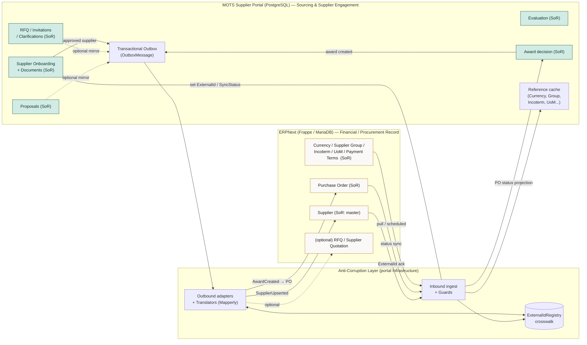

# ERP Integration Boundary — Bounded Context & Anti-Corruption Layer

> **Status:** Baseline v1 · **Owner:** Principal Architect · **Date:** 2026-08-26
> Canonical parents: [`00-foundational-decisions.md`](../architecture/00-foundational-decisions.md) ·
> [`DISCOVERY-REPORT.md`](../product/DISCOVERY-REPORT.md)
> Sibling: [`INTEGRATION-ARCHITECTURE.md`](./INTEGRATION-ARCHITECTURE.md)

This document defines **where the MOTS Supplier Portal ends and ERPNext begins**: the source-of-truth
split, the translation between the portal's rich domain and ERPNext's `buying` doctypes, the
external-ID mapping strategy, and the non-negotiable principle that **the portal never blocks a core
flow on ERP availability**.

It is a *contract-alignment* document, not a code-reuse document. Per
[foundational decision §1](../architecture/00-foundational-decisions.md#1-erp-boundary-non-negotiable),
we deliberately do **not** reuse ERPNext's stack, schema, or patterns. We align the *shape of the
data we exchange* to the real ERPNext doctypes inspected under `/Users/issamshadid/Repos/ERP`.

---

## 1. Two bounded contexts, one seam

There are two independently-owned models. Neither is authoritative over the other's internal concepts;
they meet at a **thin, versioned, async seam** guarded by an Anti-Corruption Layer (ACL).

| Bounded context | System | Language of the model | Persistence |
|---|---|---|---|
| **Sourcing & Supplier Engagement** | MOTS Supplier Portal | Onboarding, RFQ, Proposal, Evaluation, Award, Clarification | PostgreSQL 17 (portal-owned) |
| **Financial / Procurement Record** | ERPNext (Frappe) | `Supplier`, `Request for Quotation`, `Supplier Quotation`, `Purchase Order`, `Supplier Scorecard` | MariaDB (ERP-owned) |

The seam is **downstream of the portal for master data the portal produces** (an approved supplier, an
award) and **upstream of the portal for reference/financial data ERP owns** (currencies, groups,
payment terms, PO lifecycle). The portal is the **upstream/customer** for sourcing; ERPNext is the
**upstream/supplier** for financial reference data. The ACL translates both directions so that neither
model's vocabulary leaks into the other.

### Relationship pattern (DDD context-mapping terms)

- **Portal → ERP (supplier master, award):** *Customer/Supplier* with an **Open-Host-like publish**.
  The portal publishes intent (`SupplierUpserted`, `AwardCreated`); an outbound ERP adapter conforms
  those to ERPNext's API. ERPNext is not modified to accommodate us.
- **ERP → Portal (reference data, PO status):** *Conformist-guarded-by-ACL*. We accept ERPNext's data
  but never store its shapes raw — the ACL maps `Supplier Group`, `Currency`, `Incoterm`, PO status,
  etc., into portal reference entities and enums.

---

## 2. Source-of-truth split (authoritative table)

The single most important rule: **exactly one system owns each fact.** The other system holds at most
a *projection* (a cached, non-authoritative copy) clearly marked as such.

| Domain fact | Owner (system of record) | Other side holds | Sync direction | Notes |
|---|---|---|---|---|
| Supplier **registration & onboarding state** (`Draft…Approved`) | **Portal** | — (ERP never sees pre-approval states) | none pre-approval | ERP only learns of a supplier once **Approved**. |
| Supplier **documents & compliance** (licenses, expiry) | **Portal** | — | none | Purely portal governance; not an ERP concept. |
| **Approved supplier master** (name, tax_id, group, currency, bank, contacts, addresses) | **Portal authors → ERP is SoR post-approval** | Portal keeps authoritative onboarding copy + `ExternalId` | Portal → ERP (upsert) | Split ownership by lifecycle: portal owns *how it became approved*; ERP owns the *canonical financial master* once created. See §2.1. |
| Supplier `ExternalId` (naming-series string, e.g. `SUP-2026-00042`) | **ERP** (ERP mints it) | Portal stores nullable `ExternalId` | ERP → Portal (on ack) | Portal never invents ERP IDs. |
| **RFQ** authoring, internal review, publication, timeline | **Portal** | Optional mirror as ERPNext `Request for Quotation` `[ASSUMPTION — see §6]` | Portal → ERP (optional) | RFQ is buyer-internal in ERPNext; the premium authoring/clarification UX is portal-only. |
| **RFQ Invitations** (invited suppliers, sent state) | **Portal** | `Request for Quotation Supplier` rows if RFQ mirrored | Portal → ERP (optional) | — |
| **Proposal** (supplier response, line pricing, docs, revisions) | **Portal** | Optional ERPNext `Supplier Quotation` `[ASSUMPTION]` | Portal → ERP (optional) | Portal owns draft-safety, revisions, clarifications ERP lacks. |
| **Evaluation** (criteria, independent scoring, consolidation) | **Portal** | ERPNext `Supplier Scorecard` is a *separate, periodic* concept, **not** synced 1:1 | none (see §5) | Do not conflate per-RFQ evaluation with ERPNext's periodic scorecard. |
| **Award decision** (recommendation, approvals, winner) | **Portal** | — | Portal → ERP | ERP does not model the pre-award committee flow. |
| **Purchase Order** (financial commitment against an award) | **ERP** | Portal stores `ExternalPurchaseOrderRef` + projected PO status | Portal → ERP (create) then ERP → Portal (status) | The PO **is created in ERP**; the portal shows a read-only projection. |
| **Financial postings, tax, accounting** | **ERP** | — | none | Out of portal scope entirely. |
| **Reference: Currency, Supplier Group, Categories, Incoterm, UoM, Payment Terms** | **ERP** (post-integration) | Portal caches as reference entities | ERP → Portal | Portal ships seeded defaults so it works standalone; ERP becomes SoR when connected. |
| Notifications, audit log, clarifications Q&A | **Portal** | — | none | No ERP equivalent. |

### 2.1 The split-ownership case: approved supplier master

The approved supplier is the one fact with genuinely **shared lifecycle ownership**, and it is worth
being precise:

- The **portal is the system of record for how a supplier became approved** and for everything the ERP
  does not model: onboarding history, uploaded documents, expiry tracking, representative delegation,
  offerings catalog, suspension/deactivation governance.
- **ERPNext becomes the system of record for the canonical financial master** (`Supplier` doctype) the
  moment the portal successfully creates it — because downstream ERP objects (POs, invoices, payments)
  reference *that* record by its naming-series ID.
- Therefore: after approval, **portal-side edits to fields that ERP owns** (e.g. `default_currency`,
  `supplier_group`, `tax_id`, bank accounts) are **re-published** to ERP via `SupplierUpserted`; ERP is
  the tie-breaker on those fields. Fields ERP does not have (documents, onboarding notes) never leave
  the portal. This is enforced by the **field-ownership map** in
  [`INTEGRATION-ARCHITECTURE.md §3`](./INTEGRATION-ARCHITECTURE.md#3-integration-contracts).

> Conflict rule: if the same ERP-owned field diverges on both sides, **last-writer-wins is not used**.
> The portal treats ERP as authoritative for ERP-owned fields and surfaces a reconciliation flag rather
> than silently overwriting. See [reconciliation](./INTEGRATION-ARCHITECTURE.md#7-reconciliation-jobs).

---

## 3. The Anti-Corruption Layer (ACL)

The ACL is the **only** place ERPNext vocabulary is allowed to exist on the portal side. It is a set of
adapters + translators in the `Infrastructure` layer, invoked exclusively by Outbox dispatchers
(outbound) and pull/ingest jobs (inbound). The `Domain` and `Application` layers never reference an
ERPNext field name, doctype, or naming series.

```
Portal Domain  ─────►  Application (ports/interfaces)  ─────►  ACL adapters (Infrastructure)  ─────►  ERPNext REST
  (Supplier,            IErpSupplierGateway                     ErpNextSupplierAdapter               /api/resource/Supplier
   Award…)              IErpPurchaseOrderGateway                 + SupplierTranslator (Mapperly)
                        IErpReferenceDataGateway                 + PoTranslator
                                                                 + ExternalIdRegistry
```

Responsibilities of the ACL:

1. **Translate** portal DTOs ⇄ ERPNext doctype JSON (field renames, enum mapping, unit/shape changes).
2. **Guard** — reject or quarantine malformed ERP payloads; never let a null/renamed ERP field crash a
   portal handler. Unknown ERP enum values map to a portal `Unknown`/`Unmapped` sentinel + alert.
3. **Own the wire concerns** — auth, base URL, retries, timeouts, idempotency headers, versioning.
4. **Isolate ERP outages** — a down ERP surfaces to the rest of the portal only as a `SyncStatus` and a
   queued Outbox message, never as a failed user request.

### 3.1 Anti-patterns explicitly forbidden

- ❌ A portal service calling ERPNext synchronously inside a user-facing command handler.
- ❌ Storing ERPNext's integer `docstatus`, `idx`, or child-table shapes in portal tables.
- ❌ Using an ERP naming-series string as a portal primary/foreign key.
- ❌ Leaking `supplier_group`, `naming_series`, `docstatus` names into `Domain`/`Application`.

---

## 4. External-ID (naming-series) mapping strategy

ERPNext primary keys are **naming-series strings** (`SUP-.YYYY.-00001`, `PUR-ORD-.YYYY.-00001`,
`PUR-SQTN-.YYYY.-`, `PUR-RFQ-.YYYY.-`), confirmed from the doctype JSONs (`autoname: "naming_series:"`).
The portal therefore **never** models an integer FK to ERP.

### 4.1 Rules

1. Every ERP-syncable aggregate carries the canonical quartet from
   [foundational §4](../architecture/00-foundational-decisions.md#4-core-domain--aggregates--boundaries):
   `ExternalId (string?)`, `SyncStatus`, `LastSyncedAt`, `RowVersion`.
2. Portal internal PKs are **GUIDv7**; public references are opaque slugs/short codes
   (`RFQ-2026-000123`). Neither is ever sent as an ERP ID.
3. `ExternalId` is **null until ERP acknowledges creation** and mints its naming-series string. It is
   **set once** and thereafter treated as immutable (ERP `set_only_once` on `naming_series` mirrors this).
4. A dedicated **`ExternalIdRegistry`** (a mapping table in the ACL) records
   `(portalEntityType, portalId, erpDoctype, externalId, firstSyncedAt, lastConfirmedAt)`. This is the
   authoritative crosswalk; aggregates cache `ExternalId` for read convenience.
5. **Idempotency is keyed on portal identity, not ERP identity** — because ERP identity doesn't exist
   yet at first publish. See [idempotency](./INTEGRATION-ARCHITECTURE.md#4-idempotency).

### 4.2 Crosswalk shape

| Portal entity | Portal id (internal) | ERP doctype | ERP `ExternalId` (naming series) |
|---|---|---|---|
| Supplier | `018f… (GUIDv7)` | `Supplier` | `SUP-2026-00042` |
| Award → PO | `018f…` | `Purchase Order` | `PUR-ORD-2026-00311` |
| RFQ *(if mirrored)* | `018f…` | `Request for Quotation` | `PUR-RFQ-2026-00088` |
| Proposal *(if mirrored)* | `018f…` | `Supplier Quotation` | `PUR-SQTN-2026-00190` |

---

## 5. Evaluation vs. ERPNext Supplier Scorecard (a deliberate non-mapping)

The Discovery Report validated a *configurable, weighted* evaluation model against ERPNext's
`Supplier Scorecard` (criteria + `max_score` + `weight` + `weighting_function`). **This validates the
shape but is not a sync target.** They are different temporal concepts:

- **Portal `Evaluation`** = per-RFQ committee scoring event (independent scorers → consolidation →
  finalize), tied to one sourcing decision.
- **ERPNext `Supplier Scorecard`** = a *periodic* (`Per Week/Month/Year`) rolling performance metric
  with a decay `weighting_function`.

They are **not** synced 1:1. Optionally (future, `[ASSUMPTION — REQUIRES BUSINESS CONFIRMATION]`) the
portal may *feed* finalized award/delivery outcomes into ERP as scorecard *inputs*, but the per-RFQ
evaluation stays portal-owned and is never overwritten by an ERP scorecard.

---

## 6. The portal never blocks on ERP (availability principle)

**Availability target 99.5% is for the portal, ERP-independent** (foundational §9). Concretely:

- Every ERP write is a **transactional Outbox message** committed in the same DB transaction as the
  domain change, then dispatched asynchronously. A user's "Approve supplier" or "Award" click succeeds
  and returns even if ERP is entirely offline.
- Every ERP read (reference data) has a **portal-seeded default** so the portal is fully functional
  standalone; ERP sync only *refreshes/augments* it.
- ERP unavailability manifests as **`SyncStatus = Pending/Retrying`** on the affected aggregate and a
  monitoring signal — never as an HTTP 5xx to the user or a blocked workflow.
- **Degraded mode** is a first-class, tested state, not an exception path. See
  [failure & degraded mode](./INTEGRATION-ARCHITECTURE.md#9-failure--degraded-mode-behavior).

`[ASSUMPTION — REQUIRES BUSINESS CONFIRMATION]` Whether RFQ and Proposal are mirrored into ERPNext at
all (they may remain purely portal-side until PO time) is a business decision; the architecture supports
both — mirroring is an optional, non-blocking Outbox flow.

---

## 7. Boundary & data-ownership diagram



**Legend:** solid arrows = authoritative sync; dotted = optional/business-confirmation-pending;
`(SoR)` marks the system of record for that fact. The ACL is the **only** two-way crossing.

---

## 8. Consistency, versioning & security of the seam

| Concern | Decision |
|---|---|
| **Consistency model** | Eventual, async. Portal-local invariants are strong (single DB transaction); cross-system is eventually consistent via Outbox + reconciliation. |
| **Contract versioning** | Integration DTOs are versioned (`SupplierUpserted.v1`). Additive changes only within a major; breaking changes bump the major and run dual-write during migration. |
| **Auth to ERP** | ERPNext token/OAuth via a secrets-managed credential in the adapter; never in `Domain`/`Application`. `[ASSUMPTION]` exact ERP auth mechanism (API key/secret vs OAuth2) to be confirmed. |
| **PII / data minimization** | Only fields ERP needs cross the seam (per field-ownership map). Onboarding documents and internal notes never leave the portal. |
| **Auditability** | Every seam crossing writes an `IntegrationLog` entry with correlationId, linking to the domain `AuditLog`. |

See [`INTEGRATION-ARCHITECTURE.md`](./INTEGRATION-ARCHITECTURE.md) for the concrete patterns, DTOs,
idempotency, retry/DLQ, reconciliation, and sequence diagrams.
