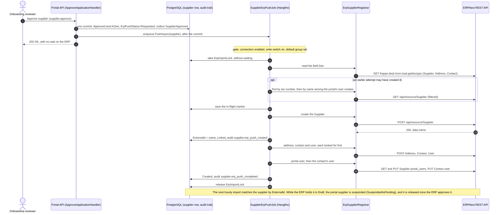
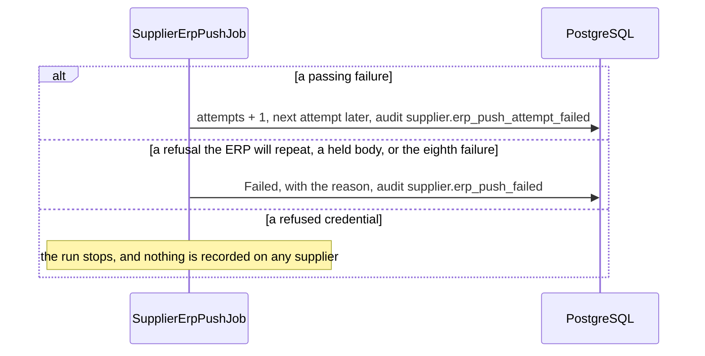

# Integration Architecture — Patterns, Contracts & Resilience

> **Status:** Baseline v1, corrected to the code on 2026-10-01 · **Owner:** Principal Architect ·
> **Date:** 2026-08-26
> Canonical parents: [`00-foundational-decisions.md`](../architecture/00-foundational-decisions.md) ·
> [`DISCOVERY-REPORT.md`](../product/DISCOVERY-REPORT.md)
> Sibling: [`ERP-INTEGRATION-BOUNDARY.md`](./ERP-INTEGRATION-BOUNDARY.md)

> **Since this was written.** This page was the plan, written before any ERP code existed. On
> 2026-09-30 it was corrected to what was built. Where the plan and the code differed, the page now says
> what the code does. The planned parts that were never built have been taken out rather than left to
> read as though they exist: the `SupplierUpserted.v1` and `AwardCreated.v1` contracts and their Mapperly
> translators, the `ExternalIdRegistry` crosswalk, the `IntegrationLog` table, the outbox's idempotency
> keys, attempt counts and `SKIP LOCKED` claiming, the dead-letter console, the circuit breaker, the
> webhooks, the reference-data sync, the scheduled reconciliation jobs and the seven-value sync status.
> §1 says which flows exist. The developer who changes a supplier flow should read
> [`docs/handbook/ERP-IMPORT.md`](../handbook/ERP-IMPORT.md), and the push's field map is
> [`ERP-SUPPLIER-FIELD-MAP.md`](./ERP-SUPPLIER-FIELD-MAP.md) §8. Where this page and the code disagree,
> the code is right.

This page says **how** the portal and ERPNext exchange data today: for each flow, the mechanism, the
calls, how a repeated request is kept from making a duplicate, the retries and timeouts, what a failure
does, and what a person sees. The ownership split it builds on is in the
[boundary doc](./ERP-INTEGRATION-BOUNDARY.md).

Technology in play: **.NET 10 / ASP.NET Core**; **Hangfire (Postgres)** for the background jobs and the
outbox dispatch; **Serilog + OpenTelemetry** for logs and metrics; **EF Core 10 / PostgreSQL 17** for the
outbox and the sync state. The ERP is reached over its REST API with plain `HttpClient`s.

---

## 1. Integration flows at a glance

| # | Flow | Direction | As built |
|---|---|---|---|
| F1 | **Supplier create** (approval → ERP `Supplier`, `Address`, `Contact`, `User`) | Portal → ERP | **Built.** `SupplierErpPushJob` runs straight after the approval and on a five-minute sweep, behind a write switch that is off by default, for approved suppliers in service. It only creates: nothing is updated in the ERP afterwards. A supplier approved before the push was added is not pushed. §2 to §10. |
| F2 | **Award → Purchase Order** | Portal → ERP | **A stand-in.** `AwardErpSyncJob` runs, but the only adapter sends nothing and invents a reference. §11. |
| F3 | **PO status sync** | ERP → Portal | Not built. |
| F4 | **Reference-data sync** (currency, supplier group, categories, incoterm, UoM, payment terms) | ERP → Portal | Not built. The portal runs on its seeded reference data. The one reference read is the list of the ERP's supplier groups, read when the Connected systems screen asks for it (§3.1). |
| F5 | **ExternalId acknowledgement** | ERP → Portal | **Built, as part of F1.** The ERP's name for the new Supplier comes back in the create's answer and is saved as `Supplier.ExternalId` at once. |
| F6 | **RFQ / Proposal mirror** | Portal → ERP | Not built. |
| F7 | **Reconciliation** | Both | Not built as a job of its own. For suppliers, the hourly import (F8) plays that part (§7). |
| F8 | **Supplier import** (not in the original plan) | ERP → Portal | **Built.** Every hour, and by hand from **Supplier import**. The ERP is the master for the suppliers it holds: the import creates, updates, suspends and releases them in the portal. [`ERP-IMPORT.md`](../handbook/ERP-IMPORT.md) §1 to §7. |

### Mechanism principles, as built

1. **An approval or an award never waits on the ERP.** Each records its request on its own row, in its
   own commit, and a background job does the rest. The screens that exist to talk to the ERP do call it
   while the person waits: **Run the import**, **Test connection** and the supplier-group list. Each
   says so when the ERP fails.
2. **The ERP's supplier data comes in by a scheduled pull.** The import reads every supplier each hour.
   There are no webhooks.
3. **Reference data is seeded, not synced.**

---

## 2. The outbox, and what the supplier create uses instead

**The outbox as built.** `OutboxMessage` has `Id`, `Type`, `PayloadJson`, `CreatedAt`, `SyncStatus`
(`Pending`, `Sent`, `Failed`) and `ProcessedAt`, and it is written in the same commit as the change that
caused it. `OutboxDispatcher` (`outbox-dispatch`, every five minutes) takes a bounded batch of pending
messages. A notification message becomes a notification row. Every other message goes to
`IOutboxTransport`, whose only implementation, `LoggingOutboxTransport`, writes a log line. A failure is
final and is not retried; a transport that only logs cannot produce one. An approval writes a
`SupplierApproved` message, and an executed award an `AwardApproved` one. Both reach that log line and no
ERP.

**The supplier create does not use the outbox.** Its request is state on the supplier row
(`ErpPushStatus` and the other `ErpPush*` fields), written in the approval's commit, so the approval and
the request still commit together. `SupplierErpPushJob` acts on the request, and records on the same row
how far the push got: the ERP's name, the failed attempts, the next attempt and the last error. That is
what lets a push that stopped part-way carry on from where it got.

```
[ ApproveApplicationHandler ]
   ├── Supplier.Approve → ErpPushStatus = Requested         ┐  ONE commit
   └── INSERT OutboxMessage(SupplierApproved) → a log line   ┘
                    │  after the commit
   enqueue SupplierErpPushJob.PushAsync(supplier)      and the sweep, RunAsync, every 5 min from :02
                    │
   gate: connection enabled, write switch on, default group set
   due: approved, in service, Requested or Linked, next attempt passed
   ErpImportLock (the import's advisory lock) for the whole run
                    │
   ErpSupplierRegistrar  ──REST──►  ERPNext
                    │
   Supplier created: its name saved as ExternalId at once        → Linked
   address, contact, user, portal user, the contact's user       → Created
   a passing failure: attempts + 1, the next attempt later
   a refusal the ERP will repeat, or the 8th failure             → Failed, waits for a person
```

---

## 3. Integration contracts

The push sends the ERP's own record bodies, built from the portal's supplier by `ErpSupplierPayload`,
rather than a versioned contract of the portal's. Each body holds only the fields that ERP has, read from
the ERP once per run, because the ERP's test server and the real one have different fields. The
field-by-field map is [`ERP-SUPPLIER-FIELD-MAP.md`](./ERP-SUPPLIER-FIELD-MAP.md) §8.

### 3.1 The calls

Every call carries `Authorization: token <key>:<secret>`, with the scheme word `token` in lower case; the
ERP answers a capitalised `Token` with a 403 and an empty body. The address and the credential are read
from the ERP connection on each call: the row saved on Connected systems, or the `Erp:*` settings while
no address is saved there.

| Step | Call | What is sent | What is used from the answer |
|---|---|---|---|
| Once per run | `GET /api/method/frappe.desk.form.load.getdoctype?doctype=Supplier`, and the same for `Address` and `Contact` | — | Each field's name, type, Select options and length. |
| Before a create that could repeat one | `GET /api/resource/Supplier` filtered on `tax_id`; then `GET /api/method/frappe.auth.get_logged_user` and `GET /api/resource/Supplier` filtered on `supplier_name`, `owner` and `creation` | — | The ERP suppliers that could be this one. |
| 1 | `POST /api/resource/Supplier` | The Supplier body | `data.name`, saved as `ExternalId` |
| Before 2 and 3 | `GET /api/resource/Address` and `GET /api/resource/Contact`, filtered on their link to the Supplier | — | What an earlier attempt already made. |
| 2 | `POST /api/resource/Address` | The Address body, with `links: [{link_doctype: "Supplier", link_name: <name>}]` | — |
| 3 | `POST /api/resource/Contact` | First and last name, `email_ids`, `phone_nos`, the links as above | The contact's name |
| Before 4 | `GET /api/resource/User` filtered on `email` | — | A user the ERP already has. |
| 4 | `POST /api/resource/User` | `email`, `first_name`, `last_name`, `user_type: "Website User"`, `roles: [{role: "Supplier"}]`, `send_welcome_email: 0`, and no password | The user's name |
| 5 | `GET /api/resource/Supplier/<name>`, then `PUT` to the same path | `portal_users`: every row the Supplier had, plus `{user: <email>}` | — |
| 6 | `PUT /api/resource/Contact/<contact name>` | `{user: <email>}`, only when the contact was made before the user | — |
| For the screen | `GET /api/resource/Supplier Group` filtered on `is_group` = 0 | — | The groups an administrator may choose as the default. |

A refusal keeps the ERP's `exc_type`, and its `_server_messages` unwrapped into plain sentences. Those
sentences are what a person reads on a failed push.

The import makes the same `frappe.auth.get_logged_user` read once per run, through the same code
(`ErpWire.ApiUserAsync`), to recognise the push's own creates (§4, item 6).

### 3.2 Award → Purchase Order

No contract is sent. See §11.

---

## 4. Idempotency

The ERP has no idempotency key, and it makes a second Supplier for a second request, which only the ERP
team can remove. The push keeps a repeated attempt from making a duplicate with six things, in
`SupplierErpPushJob` and `Supplier`:

1. **The in-flight marker** (`ErpPushStartedAt`) is saved before the Supplier's POST.
2. **The ERP's name is saved as `ExternalId` straight after the POST**, in a write of its own, before any
   other call. An attempt for a supplier that has an `ExternalId` never posts a Supplier again.
3. **An attempt that may follow an earlier create looks before it posts.** That is an attempt that finds
   the marker still set or the last attempt failed (the last error stays through a retry and a new
   approval), and any create that got no answer or was refused as a duplicate. It looks by tax number,
   then by `supplier_name` among the Suppliers the portal's own API user created since fifteen minutes
   before the push was first requested. A later approval does not move that time, so the look still
   reaches a create lost before it. One match is linked; several fail the push for a person to settle.
4. **The other records are looked for before they are made**: the address by its first line and city,
   the contact by its email, the user by its email, and the portal users by reading the list before the
   PUT.
5. **One portal supplier per ERP supplier.** A unique index on `Supplier.ExternalId`, and a match that
   another portal supplier already carries is never taken. When every match the look finds is carried
   by another portal supplier, the push fails for a person, naming them, rather than post again.
6. **The import leaves the push's creates to the push.** The push holds the import's advisory lock
   (`ErpImportLock`) for its whole run, so within one run the import cannot come between the ERP's create
   and the saved name. A create whose answer was lost, or whose save failed, is linked only by a later
   run, with the lock free in between. So the import also refuses, with a note, any ERP supplier that the
   portal's own API user owns and no portal supplier carries (`ErpSyncPlan.HeldForPush`), and the push's
   next attempt finds and links it. Without that, the import would make a second portal supplier from
   it, and the push, finding the record carried, would fail for a person.

The first attempt of a push posts without looking. Whether it should first look for a supplier with the
same tax number is an open decision (`ERP-IMPORT.md` §6). There is no reference field of the portal's on
the ERP's Supplier to look by.

---

## 5. Retry, backoff & timeouts

For the supplier create:

| Aspect | As built |
|---|---|
| **Classification** | `ErpFailure.ClassifyPush` sorts each failed call by its method, its status and the ERP's `exc_type`. **Permission**: 401 or 403. **AlreadyExists**: a create answered 409, or `DuplicateEntryError` or `UniqueValidationError` under any status, since Frappe answers a clash on a unique field with 417. **Permanent**: 404, or 417 otherwise, such as a missing mandatory field or a link to a value the ERP does not hold. **OutcomeUnknown**: a create with no answer, a 408 or any 5xx. **Transient**: 429 and everything else, including a 5xx on a read or a PUT. |
| **What each does** | Permission stops the run and marks no supplier. Permanent fails the push with the ERP's own message. AlreadyExists and OutcomeUnknown on the Supplier's create look in the ERP first (§4). Everything else is a failed attempt, tried again later. |
| **Backoff** | After failed attempt 1, 2 and 3, the next waits 1, 5 and 15 minutes; after each one from the fourth, an hour. The sweep runs every five minutes, from two minutes past the hour, and serves each wait. |
| **Max attempts** | 8. The eighth failure in a row fails the push, about four and a half hours after the first. |
| **Timeouts** | 30 seconds per call, on the writer's typed client. A create that runs past it may still finish on the ERP's side, so it is an unknown outcome and never a reason to post again. The import's reads keep the client's default. |
| **Batch** | At most five suppliers per run, so that a run against an ERP that stops answering part-way stays within the five minutes between sweeps. |
| **Scheduler retries** | None. The job keeps its own count on each supplier. |
| **Circuit breaker** | None. A refused credential stops each run at its first call. |
| **Held before sending** | A body the ERP would refuse fails the push at once, and nothing is sent: no default group, no address, a country other than Syria, no representative, a value longer than the ERP's field or one its Select field does not offer. |
| **The shared lock** | The push and the import take one lock, without waiting. A push that finds it taken steps aside until the next sweep. An import that finds it taken is refused: a 409 for **Run the import**, and one more try two minutes later for the hourly job, which skips that hour only if the lock is still taken then. |

---

## 6. A failed push, and its retry

There is no dead-letter queue. A push that fails for good stays on its supplier as
`ErpPushStatus = Failed`, with `ErpPushLastError`: up to 500 characters, in the ERP's own words where it
sent any. The job never picks it up again by itself. The supplier's review page shows **ERP: failed** and
the last error, and a **Retry** button to anyone holding `admin.integrations.manage`, which only the
system administrator holds by default. That is the permission of Connected systems, where the push is
switched on. It is not `integration.retry`: that one retries an award's send through the caller's
organisation and may be granted to an organisation's role, while the push is one queue for the whole
registry. Retry posts to `/api/v1/review/{referenceCode}/retry-erp-push`. It moves the push back to
where it stopped (`Requested`, or `Linked` when the ERP has the Supplier record), restarts the count,
writes `supplier.erp_push_retried` with the person as the actor, and runs the push at once. It refuses,
with a 409, a push that has not failed and a supplier out of service.

The push never changes whether a supplier may trade: it writes only its own state and `ExternalId`, and
a failed push leaves the supplier's standing in the portal as it was. Whether the ERP lets the supplier
be used is the import's to read (§7). The other way round, the portal's standing decides whether the
push runs at all: only a supplier in service is pushed, meaning active, or suspended only by the
import's own hold while the ERP approves it. A supplier suspended by a person or by the document-expiry
job, or deactivated, keeps its push where it is, because it would otherwise get a website user with the
Supplier role in the ERP.

Every write the push makes to the supplier row is a targeted update of its own columns and `ExternalId`,
and each one moves the supplier's version, as a person's **Retry** does by saving through the record. A
save that read the push before either write is then refused as stale rather than writing the old push
state back. The review routes answer `Cache-Control: no-store`, so the page always reads the push as it
stands.

---

## 7. Reconciliation jobs

No job reconciles the two systems as such. For suppliers, the hourly import brings the portal into line
with the ERP. It reads every supplier the ERP holds, matches the portal's by `ExternalId`, the pushed ones
included, copies the fields the ERP sends, and suspends a supplier the ERP no longer returns, has disabled
or has not yet approved. It overwrites rather than flags: the ERP is the master for the fields it sends,
and a difference is not queued for a person. Two rules are there for the push: an ERP supplier the
push created that no portal supplier carries yet is left for the push to link (§4, item 6), and a
pushed supplier seen for the first time in Draft is suspended on its own, outside the limit on how many
one run may suspend. Its rules and limits are in `ERP-IMPORT.md` §3 to §6 and §8.5.
Nothing reconciles awards or purchase orders.

---

## 8. Sync status, logging & monitoring

### 8.1 The state each record keeps

| Record | Field | Values | Written by |
|---|---|---|---|
| Supplier | `ErpPushStatus` | `NotRequested`, `Requested`, `Linked`, `Created`, `Failed` | The approval and the push (F1). |
| Supplier | `SyncStatus` | `Pending`, `Synced`, `Failed`, `RemovedFromErp`, `MarkedRemovedFromErp` | The import (F8). Nothing writes `Failed`. `Pending` until an import finds the supplier in the ERP, a pushed one included. The last two are the import's memory of a supplier leaving the ERP, which is why the push has a status of its own. |
| Supplier | `ErpDisabledState` | `NotDisabled`, `MarkedDisabled`, `SuspendedAsDisabled`, `SuspendedAsPending` | The import, and a person acting on a supplier the import holds. |
| Supplier | `ExternalId`, `LastSyncedAt` | The ERP's name, up to 140 characters; the last time the ERP changed or re-linked the supplier | `ExternalId`: the import, or the push once. `LastSyncedAt`: the import. |
| Award | `ErpSyncStatus` | `NotRequested`, `Requested`, `Synced`, `Failed` | Executing the award, `AwardErpSyncJob` and a person's retry (F2). |
| Outbox message | `SyncStatus` | `Pending`, `Sent`, `Failed` | `OutboxDispatcher`. |

**Where a person sees it.** The supplier's review page shows the push as a chip (none for
`NotRequested`) and, for a failed push, its last error and **Retry**. **Connected systems** shows the ERP
connection's last test, the last import's outcome and summary, the push's switch and group, and how many
approved suppliers in service wait for the push. The Operations screen lists the jobs, `supplier-erp-push` and
`erp-supplier-sync` among them.

### 8.2 Logging

There is no `IntegrationLog` table. The push writes one audit row per outcome on the supplier's trail,
with "system" as the actor: `supplier.erp_push_created`, `supplier.erp_push_completed`,
`supplier.erp_push_attempt_failed` and `supplier.erp_push_failed`. What concerns no one supplier, such as
the gate, the lock and a refused credential, goes to log lines that start "Supplier push to the ERP". The import writes
its own rows (`ERP-IMPORT.md` §3). No alert is raised for the push; a refused credential shows only in
the log.

---

## 9. Failure & degraded-mode behavior

For the supplier create:

| Failure | What a person sees | What the system does |
|---|---|---|
| The ERP is **down**, or does not answer | Nothing on the approval. The chip says **ERP: waiting**. | Each attempt is a failed attempt, tried again later. A Supplier create with no answer is looked for in the ERP before the next attempt posts. After the eighth, **ERP: failed**. |
| The ERP is **slow** | Nothing. | 30 seconds per call. A create that runs past it is an unknown outcome and is looked for, never posted again. |
| The credential is **refused** (401 or 403) | Nothing, except in the API log. | Each run stops at its first call and marks no supplier. It carries on once the rights are fixed. |
| A **refusal the ERP will repeat** (404, 417) | **ERP: failed**, with the ERP's own sentence. | The push waits for a person to fix the cause and retry. |
| The ERP already holds a **duplicate** | Nothing when the portal can tell which ERP supplier it is, because the push links it. Otherwise **ERP: failed**, naming the candidates. | §4. |
| A **body the ERP would refuse** | **ERP: failed**, with every reason at once. | Nothing is sent. |
| The **write switch is off**, or no group is set | The chip says **ERP: waiting**. | Nothing is sent, and no attempt is counted. The requests wait for the switch. |
| The supplier is **out of service**: suspended by a person or the document-expiry job, or deactivated | The chip stays as it was, beside the supplier's state. **Retry** is refused. | Nothing is sent, and no attempt is counted, until the supplier is back in service. |
| An **import runs between two attempts** after a create whose answer was lost | Nothing. | The import refuses that ERP supplier with a note, and the push links it on its next attempt (§4). |
| A push **holds the lock as the hour turns** | Nothing. | The hourly import tries once more two minutes later (§5). |
| The **portal** is down | — | The requests are rows on the suppliers. The first sweep after the restart picks them up. |

The award flow sends nothing today (§11). Reference data is seeded, so an ERP that cannot be reached
changes nothing there. The import's failures are in `ERP-IMPORT.md` §3.

---

## 10. Sequence diagram — Supplier create (F1 + F5)



When a call fails, the job records it on the supplier in place of the steps that follow:



---

## 11. Award → Purchase Order (F2), as built

Executing an award sets its `ErpSyncStatus` to `Requested` and writes an `AwardApproved` outbox message,
in one commit. `AwardErpSyncJob` (`award-erp-sync`, every five minutes) takes up to 50 awarded awards
that are `Requested` and calls `IErpPurchaseOrderAdapter.CreatePurchaseOrderAsync`. The only
implementation, `StubErpPurchaseOrderAdapter`, sends nothing: it logs, and returns a synthetic
`PO-STUB-...` reference, which the job stores on the award as it marks it `Synced` and completes the
RFQ. A failure marks the award `Failed` and notifies the system administrators, and
`POST /api/v1/rfqs/{referenceCode}/award/retry-erp-sync` asks for it again. Nothing holds an award back
until its supplier has an `ExternalId`, and no purchase-order status comes back from the ERP.

---

## 12. Testing the integration

No test calls a real ERP. The tests use hand-written fakes, and no package such as WireMock.

- **Unit** (`src/backend/Tests/Unit`): the push's domain methods, the connection's switch, the payload
  (one test per mapped field and per omission), the writer through a `RoutedHandler` that checks each
  call's method, path, header and exact body, and the failure classes.
- **Integration** (`src/backend/Tests/Integration`, Testcontainers PostgreSQL): the push job against a
  real database and `FakeErp`, a fake of the port that remembers what it was sent. It covers the
  colleague's order, never a second create, resuming part-way, the lock both ways, the waits, and the
  round trip with the real import. The retry route, the connection's routes and the writer's
  registration have their own classes.
- **Frontend**: the Connected systems card and the review page's chip.

`ERP-IMPORT.md` §8.9 lists the files, and how to try the push on the ERP's test server without touching
the real registry.

---

## 13. Open assumptions

- **Decided:** the ERP is reached with an API key and secret, sent as `token <key>:<secret>`. Its address
  and credential are saved on Connected systems per environment.
- **Decided:** one default ERP supplier group, chosen on Connected systems, for every supplier the portal
  creates. The portal's categories are not mapped to the ERP's groups.
- **Decided:** no reference field of the portal's on the ERP's Supplier. An earlier create is found by
  tax number, and by name among the Suppliers the portal's own API user created (§4).
- `[ASSUMPTION]` Whether RFQ and Proposal are mirrored to the ERP at all (F6), or stay portal-only.
- `[ASSUMPTION]` How a portal RFQ item maps to an ERP `Item`, or whether purchase-order lines carry a
  description only.
- `[ASSUMPTION]` How payment terms map between the portal and the ERP.
- `[ASSUMPTION / REQUIRES BUSINESS CONFIRMATION]` Any Syrian tax or withholding fields on the supplier
  master. Kept generic, never invented.
