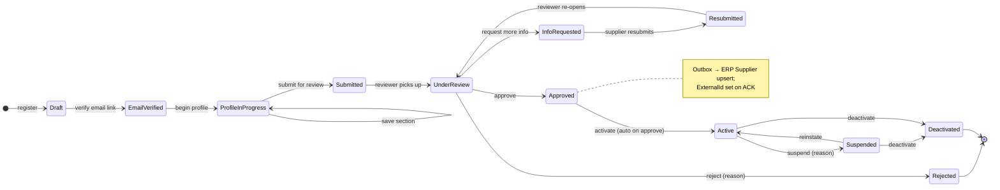
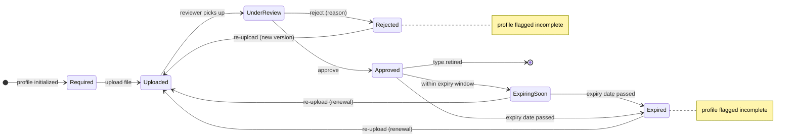
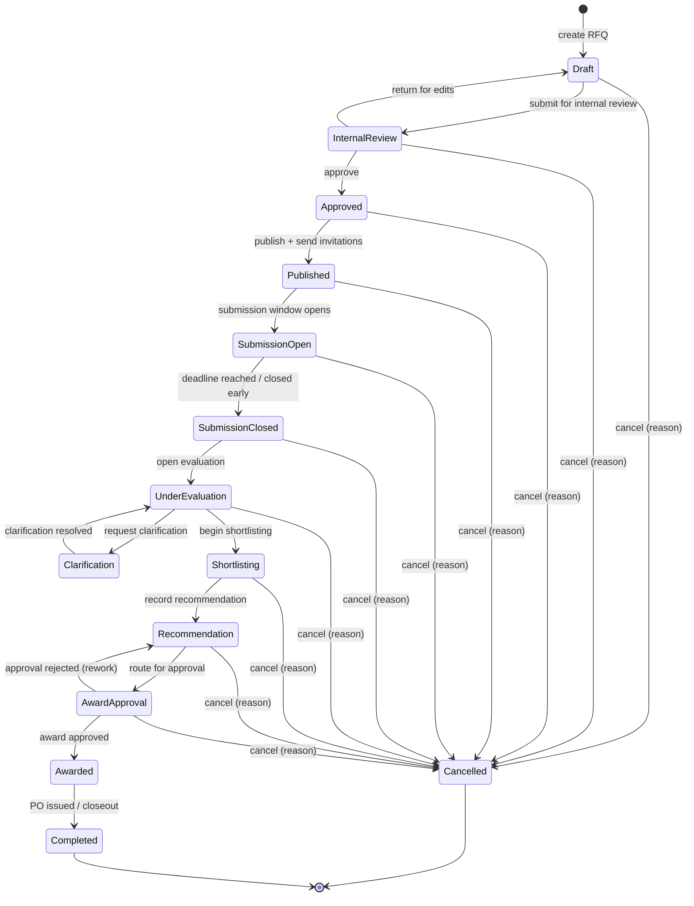
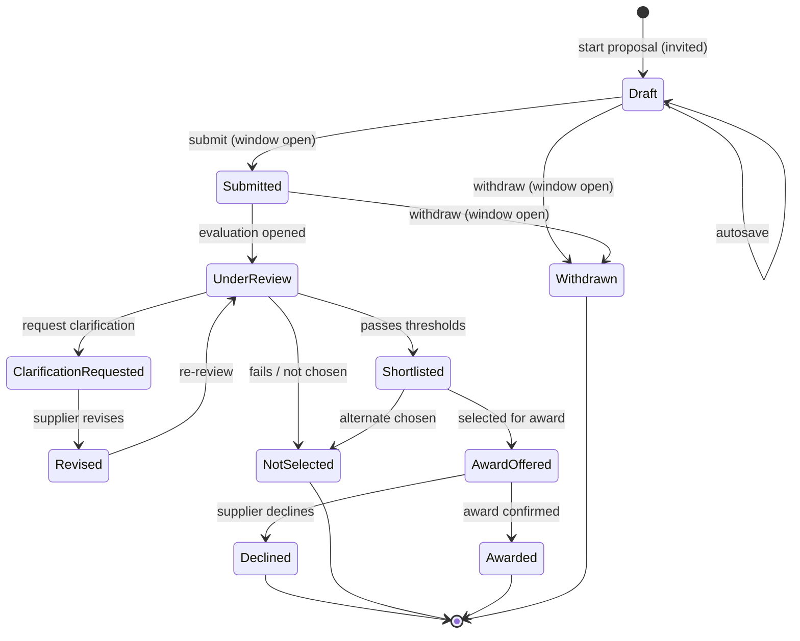
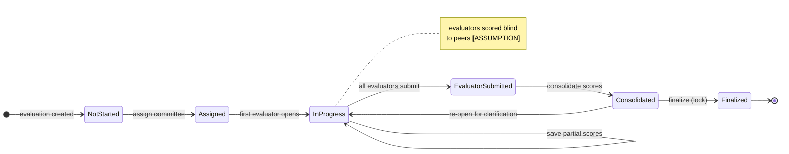
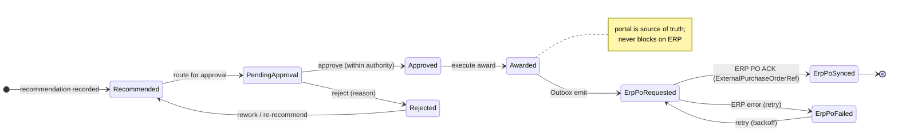
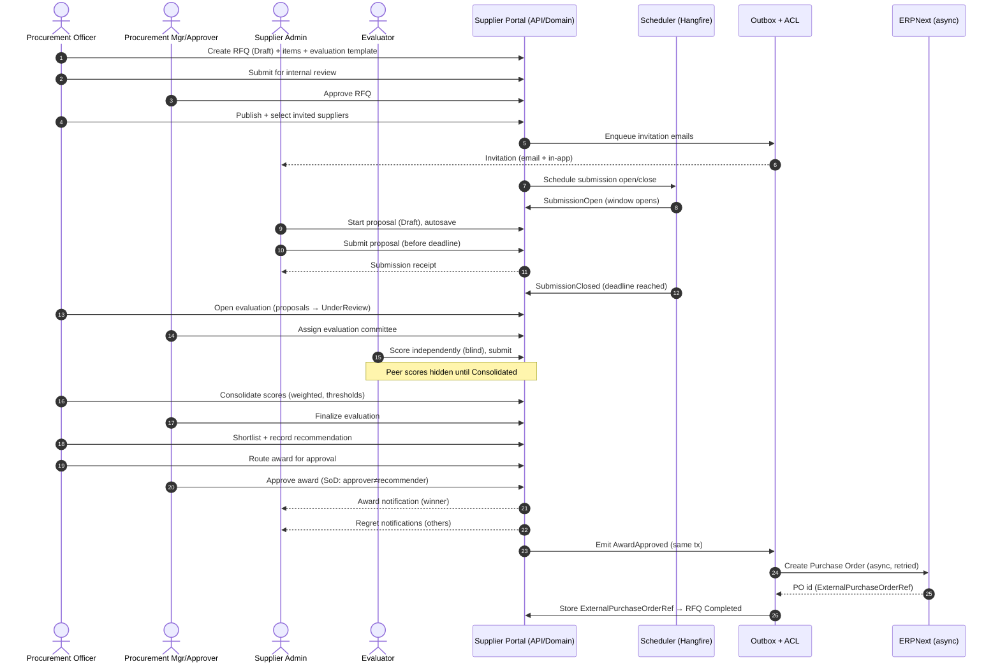

# MOTS Supplier Portal — Business Processes & State Machines

> **Status:** Baseline v1 · **Phase:** 0 (Discovery) · **Owner:** Principal Architect · **Date:** 2026-08-26
>
> This document is the **authoritative expansion** of the canonical state machines declared in
> [`../architecture/00-foundational-decisions.md`](../architecture/00-foundational-decisions.md) §5,
> and must remain 100% consistent with it. Every diagram below matches those transitions exactly.
> Domain aggregates referenced here are defined in
> [`../architecture/DOMAIN-MODEL.md`](../architecture/DOMAIN-MODEL.md); personas in
> [`PERSONAS.md`](PERSONAS.md); rules in [`BUSINESS-RULES.md`](BUSINESS-RULES.md).

## How to read this document

- Each process has: a **Mermaid `stateDiagram-v2`** matching the canonical transitions, a **transition
  table** (from → to, trigger, actor/permission, guard/preconditions, side effects, notifications,
  audit event), and explicit **cancellation / rejection / deadline / exception** paths.
- **Permissions** use the canonical `resource.action` RBAC form (§6). Enforcement is at the **API
  policy layer** and re-checked in UI for affordance-hiding only. Illegal transitions are rejected by
  the **domain**, not just the UI.
- Every transition emits an **AuditLog** entry `(actor, timestamp, from→to, reason?, correlationId)`
  and, where cross-boundary, a transactional **Outbox** message.
- `[ASSUMPTION / REQUIRES BUSINESS CONFIRMATION]` tags mark any behavior not yet business-confirmed;
  these mirror [`ASSUMPTIONS.md`](ASSUMPTIONS.md).

### Actor / persona legend

| Key | Persona | Surface |
|---|---|---|
| `supplier_admin` | Supplier Admin (primary representative) | Supplier app |
| `supplier_user` | Supplier User (delegated) | Supplier app |
| `onboarding_reviewer` | Onboarding / Compliance Reviewer | Back-office |
| `procurement_officer` | Procurement Officer (buying entity) | Back-office |
| `procurement_manager` | Procurement Manager / Approver | Back-office |
| `evaluator` | Evaluation Committee Member | Back-office |
| `ministry_viewer` | Ministry Analyst/Supervisor (read-only) | Governance |
| `system_admin` | System Administrator | Admin |
| `system` | Automated (scheduler / Hangfire / Outbox) | — |

---

## 1. Supplier Onboarding

**Canonical:** `Draft → EmailVerified → ProfileInProgress → Submitted → UnderReview →
(InfoRequested → Resubmitted → UnderReview)* → Approved | Rejected`; post-approval lifecycle
`Active ↔ Suspended → Deactivated`.

**Aggregate:** `Supplier.OnboardingState`. **ExternalId** is written only on `Approved` (portal is
source of truth pre-approval; ERP Supplier master is populated via Outbox after approval).

### 1.1 Transition table — onboarding (pre-approval)

| From | To | Trigger | Actor / permission | Guard / preconditions | Side effects | Notifications | Audit event |
|---|---|---|---|---|---|---|---|
| — | Draft | Self-registration submitted | Public / `supplier.register` | Registration open ([ASSUMPTION] self-registration allowed); unique email; valid captcha | Create `User`(supplier_admin) + `Supplier`; issue email-verification token (TTL) | Verification email to registrant | `supplier.registered` |
| Draft | EmailVerified | Click verification link | `supplier_admin` / `supplier.verify_email` | Token valid & unexpired | Mark email verified; enable login | Welcome / next-steps email | `supplier.email_verified` |
| EmailVerified | ProfileInProgress | Open onboarding wizard | `supplier_admin`,`supplier_user` / `supplier.profile.edit` | Authenticated; email verified | Initialize profile sections + **Required** documents from active `DocumentType` set | — | `supplier.profile_started` |
| ProfileInProgress | ProfileInProgress | Save a section / upload doc | `supplier_admin`,`supplier_user` / `supplier.profile.edit` | Section schema valid (Zod/FluentValidation) | Persist partial; recompute completeness % | — | `supplier.profile_section_saved` |
| ProfileInProgress | Submitted | Submit for review | `supplier_admin` / `supplier.profile.submit` | All **mandatory** profile fields complete; all **required** documents `Uploaded`+; at least one active `Representative`; T&C accepted | Lock profile for edit (except via InfoRequested); snapshot submission | In-app + email to supplier; queue to onboarding review pool | `supplier.submitted` |
| Submitted | UnderReview | Reviewer opens case | `onboarding_reviewer` / `supplier.review` | Case unassigned or assigned to actor | Assign reviewer; start review SLA timer | — | `supplier.review_started` |
| UnderReview | InfoRequested | Request more info | `onboarding_reviewer` / `supplier.request_info` | Reviewer provides **reason + itemized checklist** | Unlock only flagged fields/docs; pause SLA | Email + in-app to supplier with checklist | `supplier.info_requested` |
| InfoRequested | Resubmitted | Supplier resubmits | `supplier_admin` / `supplier.profile.submit` | All flagged items addressed; re-validate | Re-lock; snapshot revision `n+1` | In-app + email to reviewer | `supplier.resubmitted` |
| Resubmitted | UnderReview | Reviewer re-opens | `onboarding_reviewer` / `supplier.review` | — | Resume SLA timer | — | `supplier.review_resumed` |
| UnderReview | Approved | Approve | `onboarding_reviewer` / `supplier.approve` | No unresolved required docs `Rejected`/`Expired`; no blocking flags | Set `OnboardingState=Approved`; **auto → Active**; enqueue **Outbox** `SupplierApproved` → ERP upsert; on ACK set `ExternalId`,`SyncStatus=Synced` | Approval email + portal access to RFQ features | `supplier.approved` |
| UnderReview | Rejected | Reject | `onboarding_reviewer` / `supplier.reject` | **Reason mandatory** | Terminal (re-application per [ASSUMPTION] policy); retain audit | Rejection email with reason | `supplier.rejected` |

### 1.2 Transition table — post-approval lifecycle

| From | To | Trigger | Actor / permission | Guard / preconditions | Side effects | Notifications | Audit event |
|---|---|---|---|---|---|---|---|
| Approved | Active | Auto on approval | `system` | — | Supplier eligible for invitations & proposals | — | `supplier.activated` |
| Active | Suspended | Suspend | `onboarding_reviewer`,`system_admin` / `supplier.suspend` | Reason mandatory (e.g. expired critical doc, compliance) | Block **new** proposal submissions & new invitations; existing open proposals per [ASSUMPTION] policy | Email to supplier; flag to procurement orgs | `supplier.suspended` |
| Suspended | Active | Reinstate | `onboarding_reviewer`,`system_admin` / `supplier.reinstate` | Blocking cause resolved | Restore eligibility | Email to supplier | `supplier.reinstated` |
| Active / Suspended | Deactivated | Deactivate | `system_admin` / `supplier.deactivate` | Reason mandatory; no in-flight award depending on supplier ([ASSUMPTION]) | Revoke logins; hide from new selection; retain history (soft state) | Email to supplier + procurement orgs | `supplier.deactivated` |

### 1.3 Exception & edge paths

- **Verification token expiry:** `Draft` with expired token → user may request re-send (`system`
  regenerates token; audit `supplier.verification_resent`). No state change.
- **Auto-suspend on critical document expiry:** when a document tagged *critical* moves to `Expired`
  (see §2), `system` may move `Active → Suspended` with reason `document_expired`
  `[ASSUMPTION / REQUIRES BUSINESS CONFIRMATION]` — which document types are award-blocking.
- **Abandoned draft:** `Draft`/`ProfileInProgress` inactive > retention window → `system` housekeeping
  reminder emails; hard-delete only after policy window with audit `[ASSUMPTION]`.
- **ERP sync failure on approve:** approval **still succeeds** (portal is source of truth); Outbox
  retries with backoff; `SyncStatus=Pending/Failed` surfaced to `system_admin`. Core flows never block
  on ERP (canonical §1).

---

## 2. Supplier Document Lifecycle

**Canonical:** `Required → Uploaded → UnderReview → Approved | Rejected(reason)`; time-based
`Approved → ExpiringSoon → Expired`. Rejected/Expired ⇒ **profile flagged incomplete**.

**Aggregate:** `Supplier.SupplierDocument[]` (each of a `DocumentType`). One current version per type;
superseding uploads create a new version and reset review.

### 2.1 Transition table — document lifecycle

| From | To | Trigger | Actor / permission | Guard / preconditions | Side effects | Notifications | Audit event |
|---|---|---|---|---|---|---|---|
| — | Required | Profile initialized / type added | `system` | `DocumentType.active`; applies to supplier category | Create placeholder; mark profile section incomplete until satisfied | — | `document.required_created` |
| Required | Uploaded | Upload file | `supplier_admin`,`supplier_user` / `supplier.document.upload` | Allowed MIME/type & size (see [BRULE](BUSINESS-RULES.md)); AV scan clean; optional expiry date entered if type requires | Store via `IFileStorage`; compute checksum; version=1 | — | `document.uploaded` |
| Uploaded | UnderReview | Reviewer opens | `onboarding_reviewer` / `supplier.document.review` | — | Assign reviewer | — | `document.review_started` |
| UnderReview | Approved | Approve | `onboarding_reviewer` / `supplier.document.approve` | File legible; matches declared type; expiry date valid | Compute `ExpiringSoon` trigger date = expiry − window; clear incomplete flag if all required satisfied | In-app to supplier | `document.approved` |
| UnderReview | Rejected | Reject | `onboarding_reviewer` / `supplier.document.reject` | **Reason mandatory** | Flag **profile incomplete**; block onboarding approval | Email + in-app with reason | `document.rejected` |
| Rejected | Uploaded | Re-upload | `supplier_admin`,`supplier_user` / `supplier.document.upload` | New file passes validation | New version `n+1`; reset to review queue | — | `document.reuploaded` |
| Approved | ExpiringSoon | Enters expiry window | `system` (Hangfire daily scan) | `today ≥ expiry − window` ([ASSUMPTION] default 30 days) | Raise reminder; keep valid | Email + in-app reminder to supplier (escalating) | `document.expiring_soon` |
| ExpiringSoon / Approved | Expired | Expiry date passed | `system` (Hangfire daily scan) | `today > expiry` | Flag **profile incomplete**; may trigger supplier auto-suspend for critical types ([ASSUMPTION]) | Email + in-app; alert to onboarding pool | `document.expired` |
| Expired / ExpiringSoon | Uploaded | Renewal upload | `supplier_admin`,`supplier_user` / `supplier.document.upload` | New file + new expiry | New version; back to review | — | `document.renewed` |
| Approved | (removed) | Type retired | `system_admin` / `admin.reference.manage` | `DocumentType` deactivated | Archive; no longer required | — | `document.type_retired` |

### 2.2 Exception & edge paths

- **No-expiry documents:** types without expiry never enter `ExpiringSoon/Expired`.
- **Superseding an approved doc:** uploading over an `Approved` doc creates a new version → returns to
  `Uploaded`; prior approved version retained in history; profile temporarily incomplete for that type.
- **Bulk expiry sweep** runs daily (Hangfire); idempotent; single audit batch correlationId.

---

## 3. RFQ (Request for Quotation)

**Canonical:** `Draft → InternalReview → Approved → Published → SubmissionOpen → SubmissionClosed →
UnderEvaluation → Clarification* → Shortlisting → Recommendation → AwardApproval → Awarded →
Completed`; `Cancelled` reachable from **any pre-Awarded** state (with reason + audit).

**Aggregate:** `RFQ.RfqState`. Owns `RfqItem[]`, `Requirement[]`, `Invitation[]`, `Clarification[]`,
`EvaluationTemplateRef`, `Timeline`. Public reference `RFQ-YYYY-NNNNNN`.

### 3.1 Transition table — RFQ

| From | To | Trigger | Actor / permission | Guard / preconditions | Side effects | Notifications | Audit event |
|---|---|---|---|---|---|---|---|
| — | Draft | Create RFQ | `procurement_officer` / `rfq.create` | Scoped to actor's `OrganizationId` | Assign `RFQ-YYYY-NNNNNN`; init timeline | — | `rfq.created` |
| Draft | InternalReview | Submit for review | `procurement_officer` / `rfq.submit_review` | ≥1 `RfqItem`; deadlines set & future; `EvaluationTemplateRef` bound; ≥1 candidate supplier identified | Lock editing; notify approver pool | In-app to `procurement_manager` | `rfq.submitted_for_review` |
| InternalReview | Draft | Return for edits | `procurement_manager` / `rfq.review` | Reason/comments provided | Unlock editing | In-app to officer | `rfq.returned` |
| InternalReview | Approved | Approve RFQ | `procurement_manager` / `rfq.approve` | Complete & compliant; template valid | Mark approved; ready to publish | In-app to officer | `rfq.approved` |
| Approved | Published | Publish + invite | `procurement_officer` / `rfq.publish` | Approved; invited suppliers are `Active`; submission open/close dates valid | Create `Invitation[]`; generate access; **Outbox** invitation emails | Email + in-app to each invited supplier | `rfq.published` |
| Published | SubmissionOpen | Window opens | `system` (or immediate on publish) | `now ≥ submissionOpenAt` | Enable proposal creation for invitees; open Q&A window | In-app to invitees | `rfq.submission_opened` |
| SubmissionOpen | SubmissionClosed | Deadline / close early | `system` (deadline) or `procurement_officer` / `rfq.close` | `now ≥ submissionCloseAt` **or** manual close with reason | Freeze new/edited proposals; auto-lapse `Draft` proposals ([ASSUMPTION]) | In-app to invitees + committee | `rfq.submission_closed` |
| SubmissionClosed | UnderEvaluation | Open evaluation | `procurement_officer`,`procurement_manager` / `evaluation.open` | ≥1 `Submitted` proposal ([ASSUMPTION] else re-tender/cancel); committee assignable | Create `Evaluation`; unlock scoring (see §5) | In-app to `evaluator`s | `rfq.evaluation_opened` |
| UnderEvaluation | Clarification | Request clarification | `procurement_officer`,`evaluator` / `rfq.clarify` | Reason; targeted supplier(s) | Post clarification request; may re-open a proposal for `Revised` (§4) | Email + in-app to targeted supplier | `rfq.clarification_requested` |
| Clarification | UnderEvaluation | Clarification resolved | `procurement_officer` / `rfq.clarify` | Response received or window elapsed | Resume evaluation | In-app to committee | `rfq.clarification_resolved` |
| UnderEvaluation | Shortlisting | Begin shortlisting | `procurement_officer`,`procurement_manager` / `evaluation.consolidate` | Evaluation `Consolidated`/`Finalized` (§5) | Apply thresholds; compute ranking | In-app to committee | `rfq.shortlisting_started` |
| Shortlisting | Recommendation | Record recommendation | `procurement_officer`,`procurement_manager` / `award.recommend` | ≥1 proposal passes thresholds; justification captured | Create `Award.Recommendation`; set proposal(s) `Shortlisted` | In-app to approver | `rfq.recommendation_recorded` |
| Recommendation | AwardApproval | Route for approval | `procurement_officer` / `award.recommend` | Recommendation complete | Create `Approval` request (§6) | In-app + email to approver(s) | `rfq.award_routed` |
| AwardApproval | Awarded | Award approved | `procurement_manager` / `award.approve` | Approver ≠ recommender ([ASSUMPTION] segregation of duties); within threshold authority | Set winning proposal `AwardOffered→Awarded`; **Outbox** `AwardApproved` → ERP PO | Email + in-app: winner (award), others (regret) | `rfq.awarded` |
| AwardApproval | Recommendation | Approval rejected | `procurement_manager` / `award.reject` | Reason mandatory | Return for rework / alternate recommendation | In-app to officer | `rfq.award_rejected` |
| Awarded | Completed | PO issued / closeout | `system` (ERP PO ACK) or `procurement_manager` / `rfq.complete` | ERP `ExternalPurchaseOrderRef` received **or** manual completion | Store `ExternalPurchaseOrderRef`; archive RFQ | In-app to stakeholders | `rfq.completed` |
| any pre-Awarded | Cancelled | Cancel RFQ | `procurement_manager` / `rfq.cancel` | **Reason mandatory**; not yet `Awarded` | Void open invitations & proposals (→ `NotSelected`/closed); stop timers | Email + in-app to all invitees & committee | `rfq.cancelled` |

### 3.2 Deadline, cancellation & exception paths

- **Submission deadline** is enforced server-side by `system` (Hangfire) → `SubmissionOpen →
  SubmissionClosed`; client countdown is advisory only. Late submissions are rejected by the domain.
- **Deadline extension** while `Published`/`SubmissionOpen`: `procurement_officer` may extend
  `submissionCloseAt` (audit `rfq.deadline_extended`, notify all invitees). Shortening the window
  requires `procurement_manager` `[ASSUMPTION]`.
- **No responses at close:** `SubmissionClosed` with zero `Submitted` proposals → officer chooses
  **Cancel** or **re-tender** (new RFQ referencing prior) `[ASSUMPTION]`.
- **Cancellation** is reason-mandatory, audited, notifies all parties, and voids downstream work.
  Not permitted once `Awarded`.
- **Amendment after publish** `[ASSUMPTION / REQUIRES BUSINESS CONFIRMATION]`: material changes require
  re-publish + invitee re-acknowledgement; modeled as addendum with mandatory notification.

---

## 4. Proposal

**Canonical:** `Draft → Submitted → UnderReview → (ClarificationRequested → Revised → UnderReview)* →
Shortlisted | NotSelected → AwardOffered → Awarded | Declined`; supplier-initiated **`Withdrawn`**
allowed while `SubmissionOpen`.

**Aggregate:** `Proposal.ProposalState` — **one per Supplier per RFQ**. Owns `ProposalItem[]`,
`ProposalDocument[]`, `CommercialTerms(VO)`, `TechnicalResponse`, `Validity`.

### 4.1 Transition table — proposal

| From | To | Trigger | Actor / permission | Guard / preconditions | Side effects | Notifications | Audit event |
|---|---|---|---|---|---|---|---|
| — | Draft | Start proposal | `supplier_admin`,`supplier_user` / `proposal.create` | Supplier is `Active` **and** holds a valid `Invitation` to this RFQ; no existing proposal for this RFQ (uniqueness) | Create `Proposal` bound to RFQ+Supplier | — | `proposal.started` |
| Draft | Draft | Autosave / edit | `supplier_admin`,`supplier_user` / `proposal.edit` | RFQ `SubmissionOpen` | Persist partial; validate items | — | `proposal.saved` |
| Draft | Submitted | Submit | `supplier_admin` / `proposal.submit` | RFQ `SubmissionOpen`; `now < submissionCloseAt`; all required items priced; mandatory `ProposalDocument`s attached; `Validity` ≥ RFQ minimum; T&C accepted | Lock proposal; snapshot; timestamp | Email + in-app receipt to supplier; counter to procurement | `proposal.submitted` |
| Draft / Submitted | Withdrawn | Withdraw | `supplier_admin` / `proposal.withdraw` | RFQ still `SubmissionOpen` (window open) | Release from consideration; re-submission allowed while window open (new draft) | In-app to supplier + procurement | `proposal.withdrawn` |
| Submitted | UnderReview | Evaluation opened | `system` (on RFQ `UnderEvaluation`) | RFQ moved to evaluation | Make visible to assigned `evaluator`s (scoped) | — | `proposal.under_review` |
| UnderReview | ClarificationRequested | Request clarification | `procurement_officer`,`evaluator` / `rfq.clarify` | Reason; specific questions | Open a bounded revision window ([ASSUMPTION] scope-limited, price-locked unless permitted) | Email + in-app to supplier | `proposal.clarification_requested` |
| ClarificationRequested | Revised | Supplier responds | `supplier_admin` / `proposal.revise` | Within clarification window; only permitted fields changed | New revision `n+1`; snapshot | In-app to committee | `proposal.revised` |
| Revised | UnderReview | Re-review | `system`/`procurement_officer` | — | Return to scoring | — | `proposal.re_review` |
| UnderReview | Shortlisted | Passes thresholds | `procurement_officer`,`procurement_manager` / `evaluation.consolidate` | Consolidated score ≥ thresholds (§5) | Include in shortlist/ranking | In-app (internal) | `proposal.shortlisted` |
| UnderReview / Shortlisted | NotSelected | Not chosen | `procurement_officer`,`procurement_manager` / `award.recommend` | Award decided for another / fails threshold | Regret handling deferred to award notification | (batched at award) | `proposal.not_selected` |
| Shortlisted | AwardOffered | Selected for award | `procurement_manager` / `award.approve` | Winning proposal per approved recommendation | Mark as award candidate | Email + in-app to supplier (offer) | `proposal.award_offered` |
| AwardOffered | Awarded | Award confirmed | `procurement_manager` / `award.approve` (or supplier accept, [ASSUMPTION]) | Approval complete; (optional supplier acceptance) | Bind to `Award`; feed ERP PO Outbox | Email + in-app confirmation | `proposal.awarded` |
| AwardOffered | Declined | Supplier declines | `supplier_admin` / `proposal.decline` | Within acceptance window ([ASSUMPTION]) | Free the award for alternate; RFQ returns to `Recommendation` | In-app to procurement | `proposal.declined` |

### 4.2 Revision, withdrawal & exception paths

- **Revision windows:** free editing only while `Draft` and RFQ `SubmissionOpen`. After submission,
  changes occur **only** via `ClarificationRequested → Revised`, scoped to requested items
  `[ASSUMPTION / REQUIRES BUSINESS CONFIRMATION]` on whether commercial (price) revisions are allowed.
- **Withdrawal window:** allowed only while RFQ `SubmissionOpen`. Once `SubmissionClosed`, withdrawal
  is blocked by the domain; supplier must contact procurement (out-of-band).
- **Late submission:** rejected server-side (`now ≥ submissionCloseAt`).
- **Draft at close:** unsubmitted `Draft` proposals auto-lapse (closed, non-considered) at
  `SubmissionClosed` `[ASSUMPTION]`.
- **RFQ cancelled:** all non-terminal proposals move to a closed/`NotSelected` outcome with mandatory
  notification.

---

## 5. Evaluation

**Canonical:** `NotStarted → Assigned → InProgress → EvaluatorSubmitted → Consolidated → Finalized`.
`[ASSUMPTION]` evaluators score **independently (blind to peers)** before consolidation.

**Aggregate:** `Evaluation.EvaluationState`. Owns `EvaluationAssignment[]`, `EvaluatorScore[]`,
`ConsolidatedResult`. Bound to an `EvaluationTemplate` (`Criterion[]`: name, weight, max, threshold,
scoring type).

### 5.1 Transition table — evaluation

| From | To | Trigger | Actor / permission | Guard / preconditions | Side effects | Notifications | Audit event |
|---|---|---|---|---|---|---|---|
| — | NotStarted | Evaluation created | `system` (on RFQ `UnderEvaluation`) | RFQ `UnderEvaluation`; template bound | Instantiate criteria from `EvaluationTemplate`; snapshot weights | — | `evaluation.created` |
| NotStarted | Assigned | Assign committee | `procurement_manager` / `evaluation.assign` | ≥1 `evaluator` assigned; (segregation from suppliers/recommender) | Create `EvaluationAssignment[]`; scope proposals to each | Email + in-app to evaluators | `evaluation.committee_assigned` |
| Assigned | InProgress | First evaluator opens | `evaluator` / `evaluation.score` | Assigned to actor | Start scoring; **peer scores hidden** (blind) | — | `evaluation.scoring_started` |
| InProgress | InProgress | Save partial scores | `evaluator` / `evaluation.score` | Score within `[0..max]`; comment where required | Persist per-criterion draft; recompute own weighted subtotal | — | `evaluation.score_saved` |
| InProgress | EvaluatorSubmitted | Evaluator submits (all) | `evaluator` / `evaluation.submit` | All assigned proposals fully scored by that evaluator; on **all** evaluators submitted → state advances | Lock that evaluator's scores; reveal permitted only post-consolidation | In-app to `procurement_officer` when all in | `evaluation.evaluator_submitted` |
| EvaluatorSubmitted | Consolidated | Consolidate | `procurement_officer`,`procurement_manager` / `evaluation.consolidate` | All evaluators submitted (or quorum policy `[ASSUMPTION]`) | Compute `ConsolidatedResult` = weighted aggregate across evaluators/criteria; apply thresholds; rank | In-app to committee | `evaluation.consolidated` |
| Consolidated | Finalized | Finalize / lock | `procurement_manager` / `evaluation.finalize` | Result reviewed; no unresolved clarification | Lock evaluation; feed shortlisting/recommendation (§3) | In-app to committee | `evaluation.finalized` |
| Consolidated | InProgress | Re-open | `procurement_manager` / `evaluation.reopen` | Reason mandatory (e.g. clarification changes a bid) | Unlock affected assignments; audit | In-app to affected evaluators | `evaluation.reopened` |

### 5.2 Independence, consolidation & exception paths

- **Independence (blind scoring)** `[ASSUMPTION]`: an evaluator cannot see peers' scores/comments while
  `InProgress`/`EvaluatorSubmitted`; enforced by API scoping (each evaluator reads only own scores).
  Consolidated view is available only from `Consolidated` onward, to authorized roles.
- **Consolidation formula:** per criterion, evaluator scores are combined (default **average**,
  `[ASSUMPTION / REQUIRES BUSINESS CONFIRMATION]`), multiplied by `Criterion.weight`, summed to a
  weighted total; **threshold gating** at criterion and total level (see
  [BUSINESS-RULES](BUSINESS-RULES.md)).
- **Conflict of interest / recusal:** an evaluator may be unassigned before submission (`system_admin`/
  `procurement_manager`, audit `evaluation.recused`) `[ASSUMPTION]`.
- **Quorum / missing evaluator:** if an evaluator does not submit by deadline, `procurement_manager`
  may consolidate on quorum policy `[ASSUMPTION]`.
- **Tie-break** at ranking is a business rule (see [BUSINESS-RULES](BUSINESS-RULES.md)), not a state.

---

## 6. Award / Approval

**Canonical:** `Recommended → PendingApproval → Approved | Rejected → Awarded → (Outbox → ERP PO)`.

**Aggregate:** `Award.AwardState`. Owns `Recommendation`, `Approval[]`, `AwardDecision`,
`ExternalPurchaseOrderRef?`.

### 6.1 Transition table — award / approval

| From | To | Trigger | Actor / permission | Guard / preconditions | Side effects | Notifications | Audit event |
|---|---|---|---|---|---|---|---|
| — | Recommended | Recommendation recorded | `procurement_officer`,`procurement_manager` / `award.recommend` | Evaluation `Finalized`; winner passes thresholds; justification captured | Create `Award.Recommendation`; link winning `Proposal` | In-app to approver | `award.recommended` |
| Recommended | PendingApproval | Route for approval | `procurement_officer` / `award.recommend` | Approver resolved by **threshold/authority** matrix (see BRULE) | Create `Approval` task; assign approver(s) | Email + in-app to approver(s) | `award.pending_approval` |
| PendingApproval | Approved | Approve | `procurement_manager` / `award.approve` | Approver **≠** recommender ([ASSUMPTION] SoD); amount within approver authority; supplier still `Active` | Record approval; unlock execution | In-app to officer | `award.approved` |
| PendingApproval | Rejected | Reject | `procurement_manager` / `award.reject` | **Reason mandatory** | Return to `Recommended` for rework / alternate | In-app to officer | `award.rejected` |
| Rejected | Recommended | Re-recommend | `procurement_officer` / `award.recommend` | New/again justification | New recommendation revision | In-app to approver | `award.re_recommended` |
| Approved | Awarded | Execute award | `procurement_manager` / `award.approve` | Approval complete | Set `AwardDecision`; proposal `Awarded`; RFQ `Awarded`; enqueue **Outbox** | Email winner (award) + others (regret); in-app | `award.awarded` |
| Awarded | ErpPoRequested | Outbox emit | `system` | Outbox message committed in same tx as award | Dispatch `AwardApproved` via ACL adapter to ERP | — | `award.erp_po_requested` |
| ErpPoRequested | ErpPoSynced | ERP PO ACK | `system` | ERP returns PO id | Store `ExternalPurchaseOrderRef`; `SyncStatus=Synced`; RFQ → `Completed` | In-app to procurement | `award.erp_po_synced` |
| ErpPoRequested | ErpPoFailed | ERP error/timeout | `system` | Adapter error | Mark failed; schedule retry (backoff); alert `system_admin` | Alert to `system_admin` | `award.erp_po_failed` |
| ErpPoFailed | ErpPoRequested | Retry | `system`,`system_admin` / `integration.retry` | Backoff elapsed or manual | Re-dispatch (idempotent) | — | `award.erp_po_retried` |

### 6.2 Approval thresholds, SoD & exception paths

- **Approval hierarchy** `[ASSUMPTION / REQUIRES BUSINESS CONFIRMATION]`: default **single approver**,
  configurable multi-level by **amount thresholds** (see [BUSINESS-RULES](BUSINESS-RULES.md) approval
  bands). Each level is an `Approval` entry; all required levels must be `Approved` to reach `Awarded`.
- **Segregation of duties** `[ASSUMPTION]`: the approver must differ from the recommender; enforced at
  API policy.
- **Supplier ineligible at approval time** (suspended/expired critical doc): approval is blocked;
  officer must re-recommend or resolve. Domain guard, not UI-only.
- **ERP unavailability:** award is final in the portal regardless; ERP PO is eventually-consistent via
  Outbox retries. This preserves canonical §1 (portal never blocks on ERP).
- **Award decline** (§4): if winner `Declined`, RFQ returns to `Recommendation` for alternate award.

---

## 7. End-to-end happy path (sequence)

RFQ → invitation → proposal → evaluation → award, showing actors, the portal, the scheduler, and the
async ERP boundary.

---

## 8. Cross-process invariants

| Invariant | Where enforced |
|---|---|
| Illegal state transitions rejected by domain (not UI-only) | Domain aggregates (guard clauses) |
| Every transition writes AuditLog `(actor, ts, from→to, reason?, correlationId)` | Domain + interceptor |
| Reason mandatory on all reject / cancel / suspend / deactivate / info-request | Domain + FluentValidation |
| Permission checked per transition (`resource.action`) + row-scoping (Supplier/Org) | API policy handlers |
| One `Proposal` per `Supplier` per `RFQ` | DB unique constraint + domain |
| Deadlines enforced server-side; client countdowns advisory | Scheduler + domain guards |
| Cross-boundary effects (invites, award→PO) via transactional Outbox | Infrastructure (Outbox) |
| Portal never blocks core flows on ERP availability | ACL async adapters |
| Concurrency via `RowVersion` optimistic checks | EF Core + domain |

> **Consistency note:** the six state machines and their terminal/exception states above are a verbatim
> expansion of canonical §5. Any change here must be made in
> [`../architecture/00-foundational-decisions.md`](../architecture/00-foundational-decisions.md) first.
