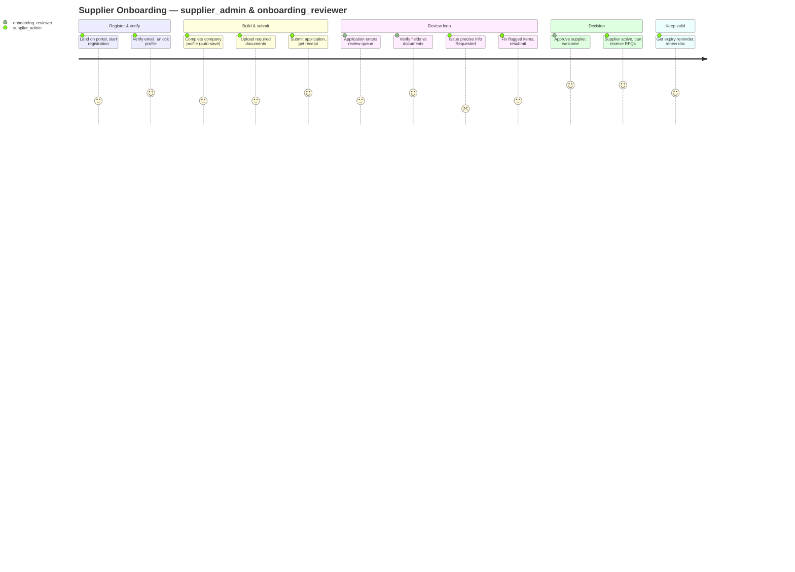
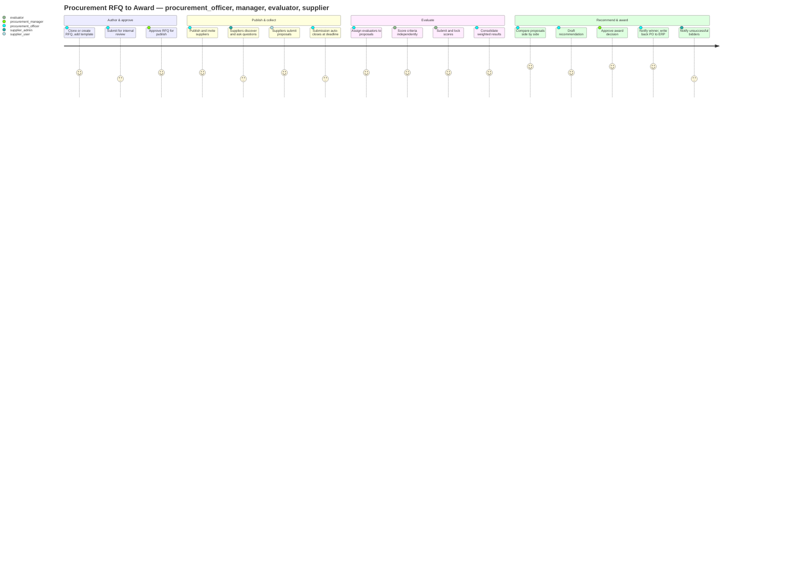

# User Journeys — MOTS Supplier Portal

> **Status:** Baseline v1 · **Phase:** 0 (Discovery) · **Date:** 2026-08-26
> Consistent with [`docs/architecture/00-foundational-decisions.md`](../architecture/00-foundational-decisions.md)
> (§5 state machines, §6 RBAC) and [`DISCOVERY-REPORT.md`](./DISCOVERY-REPORT.md).
> Personas referenced by canonical key — see [`PERSONAS.md`](./PERSONAS.md).
> State machines are authoritative in
> [`BUSINESS-PROCESSES.md`](./BUSINESS-PROCESSES.md) / the foundational brief; this doc maps the
> **human experience** across those states.

## Conventions

- Each journey is a table of **Phase · User action · System response · State (from → to) · Emotion ·
  Pain points · Opportunities**.
- **State** cites the canonical state machines from
  [§5](../architecture/00-foundational-decisions.md#5-canonical-state-machines-authoritative--see-docsproductbusiness-processesmd).
  "—" means no aggregate transition (navigation/read only).
- **Emotion** is the persona's likely feeling — the thing premium UX must protect or repair.
- Every state change is **permission-guarded and audited**; where relevant the required
  `resource.action` permission is named.
- **Arabic-first / RTL** applies throughout; not repeated per row.

## Journey index

1. [Supplier registration → onboarding → approval](#1-supplier-registration--onboarding--approval) — `supplier_admin`, `onboarding_reviewer`
2. [Supplier RFQ discovery → proposal → submission → award result](#2-supplier-rfq-discovery--proposal--submission--award-result) — `supplier_admin`, `supplier_user`
3. [Procurement RFQ creation → invitation → evaluation → comparison → recommendation → approval → award](#3-procurement-rfq-creation--award) — `procurement_officer`, `procurement_manager`
4. [Evaluator assigned → score → submit](#4-evaluator-assigned--score--submit) — `evaluator`
5. [Ministry monitoring](#5-ministry-monitoring) — `ministry_viewer`
6. [Admin setup](#6-admin-setup) — `system_admin`

Two [`journey` Mermaid diagrams](#mermaid-journey-diagrams) close the document.

---

## 1. Supplier registration → onboarding → approval

**Primary personas:** `supplier_admin` (drives) · `onboarding_reviewer` (reviews).
**State machines:** Supplier onboarding
`Draft → EmailVerified → ProfileInProgress → Submitted → UnderReview → (InfoRequested → Resubmitted → UnderReview)* → Approved | Rejected`;
Supplier document `Required → Uploaded → UnderReview → Approved | Rejected(reason)`.

| Phase | User action | System response | State (from → to) | Emotion | Pain points | Opportunities |
|---|---|---|---|---|---|---|
| Discover & start | `supplier_admin` lands on the portal, chooses "Register your company" | Arabic-first landing; clear value prop; simple registration form (company name, email, representative) | Supplier `∅ → Draft` | Curious, slightly cautious | Skepticism vs. old bare ERP web-form; trust unproven | Premium, trustworthy first impression; explain what onboarding involves & est. time upfront |
| Verify email | Submits registration; opens verification email; clicks link | Sends verification email; on click confirms and unlocks profile | `Draft → EmailVerified` | Reassured | Email in spam; link expiry confusion | Clear "resend", visible expiry, inline status; localized email |
| Build profile | Completes multi-step profile: legal info, addresses, contacts, representatives, branches, bank accounts, categories, offerings | Auto-saves each step; progress indicator; per-field validation (Zod); document checklist derived from `DocumentType` reference data | `EmailVerified → ProfileInProgress` | Focused; occasionally overwhelmed | Long form; unsure which Syrian legal/tax fields are required **[ASSUMPTION / REQUIRES BUSINESS CONFIRMATION]** | Save-and-resume; wizard with clear sections; contextual help; generic legal fields flagged, never invented |
| Upload documents | Uploads required documents (registration, licenses, tax, bank proof), each tagged by type & expiry | Each file: `Required → Uploaded`; virus scan/format checks; expiry captured | Document `Required → Uploaded` | Diligent | Re-uploading the same docs they've given other buyers; format/size errors | Reusable document vault per supplier; drag-drop; clear format guidance; expiry captured once |
| Submit for review | Reviews completeness checklist; submits application | Validates completeness; locks editable-critical fields; notifies `onboarding_reviewer` queue | `ProfileInProgress → Submitted` (`supplier.profile.submit`) | Hopeful, a little anxious | Fear of the unknown wait; "did it go through?" | Explicit submission receipt; expected turnaround/SLA shown; status timeline visible |
| Under review | Waits | Reviewer picks up from queue; opens application + documents in one pane | `Submitted → UnderReview` (`supplier.review`) | Waiting | Silence; no ETA | Live status timeline; "in review since…"; proactive status notifications |
| Info requested (loop) | Receives structured `InfoRequested` naming exact fields/documents | Reviewer issues field-level request with reasons; supplier profile flagged incomplete on rejected docs | `UnderReview → InfoRequested`; doc `UnderReview → Rejected(reason)` (`supplier.requestInfo`, `supplier.document.review`) | Frustrated but oriented | Vague "please fix" requests (avoided by design); repeated loops | Precise, itemized requests; deep-link to each field; only the flagged items need action |
| Resubmit | Fixes exactly the flagged items; resubmits | Re-validates; returns to review queue | `InfoRequested → Resubmitted → UnderReview` | Determined | Loop fatigue if it repeats | Minimize loops via precision; show what changed to reviewer |
| Decision — approved | — | Reviewer approves; supplier becomes active; welcome notification; onboarding audit finalized | `UnderReview → Approved`; lifecycle `→ Active` (`supplier.approve`) | Relief, pride | — | Warm, celebratory approval moment; next-step guidance ("you can now receive RFQs") |
| Decision — rejected | — | Reviewer rejects with reason; supplier notified respectfully | `UnderReview → Rejected` (`supplier.reject`) | Disappointed | Feeling dismissed; unclear if reapply possible | Respectful, specific reason; clear re-application path if allowed |
| Ongoing — document validity | Later: a document approaches expiry | System flags `Approved → ExpiringSoon`, then `Expired`; profile flagged incomplete on expiry | Document `Approved → ExpiringSoon → Expired` | Prompted, in control | Silent expiry causing sudden ineligibility | Early reminders (email + in-app) before expiry; one-tap renew from the reminder |

**Cross-cutting opportunities:** a persistent onboarding **status timeline**; a **document vault** that
outlives any single application; and **structured, itemized reviewer requests** that make loops rare and
fast.

---

## 2. Supplier RFQ discovery → proposal → submission → award result

**Primary personas:** `supplier_user` (authors) · `supplier_admin` (reviews & submits).
**State machines:** RFQ (supplier sees `Published → SubmissionOpen → SubmissionClosed → … → Awarded`);
Proposal `Draft → Submitted → UnderReview → (ClarificationRequested → Revised → UnderReview)* → Shortlisted | NotSelected → AwardOffered → Awarded | Declined`; supplier `Withdrawn` allowed while `SubmissionOpen`.

| Phase | User action | System response | State (from → to) | Emotion | Pain points | Opportunities |
|---|---|---|---|---|---|---|
| Get notified | `supplier_admin` receives alert: new RFQ matching categories | Category-matched notification (in-app + email/push); deep link to RFQ | RFQ (as seen) `Published` | Alert, interested | Missing tenders entirely (the #1 legacy pain) | Precise category matching; mobile push; digest of open RFQs |
| Discover & assess | Opens RFQ; reads items, requirements, timeline, attachments | Clear RFQ detail; countdown to close; "bid / not now" affordance; requirement checklist | — | Evaluating | Dense/ambiguous requirements; deadline unclear | Skimmable summary; prominent countdown; requirement checklist; est. effort |
| Clarify | Asks a clarification question | Posts question to RFQ Q&A; officer answers; **answer visible to all invited suppliers** | RFQ `… Clarification*` (Q&A) (`clarification.ask`) | Engaged | Answers going only to one bidder (unfair) | Transparent shared Q&A; notification when answered |
| Start proposal | Creates a proposal; delegates line work to `supplier_user` | Opens proposal builder; **auto-saves** draft; line items seeded from RFQ items | Proposal `∅ → Draft` (`proposal.create`) | Focused | Losing work; blank-page overwhelm | Auto-save everywhere; resume-exactly-where-left; import prior pricing |
| Build proposal | `supplier_user` enters line pricing, commercial terms, technical responses, uploads documents | Per-line validation; running totals in display currency (SYP default, multi-currency capable); completeness checklist | Proposal `Draft` (auto-save) (`proposal.edit`) | In flow | Multi-currency confusion; unclear completeness | Live totals; tax/terms captured generically **[ASSUMPTION]**; "N items left" checklist |
| Review & approve | `supplier_admin` reviews the drafted proposal | Side-by-side of RFQ requirements vs. proposal; flags gaps | Proposal `Draft` | Scrutinizing | Discovering gaps at the last minute | Requirement-coverage check before submit; delta highlights |
| Submit | `supplier_admin` (or delegate if granted `proposal.submit`) submits before close | Validates completeness + deadline; **submission receipt** (on-screen + email); locks proposal | Proposal `Draft → Submitted` (`proposal.submit`) | Confident, relieved | "Did it submit?"; missing the deadline | Unmistakable receipt; countdown warnings; block/allow-withdraw while open |
| Withdraw (optional) | Decides to withdraw while submission still open | Confirms; withdraws proposal; audited | Proposal `→ Withdrawn` (while RFQ `SubmissionOpen`) (`proposal.withdraw`) | Deliberate | Accidental irreversible withdraw | Confirm dialog; only allowed while open; clear consequence |
| Under review / clarification | Waits; may get a clarification request during evaluation | Proposal enters review; if buyer needs detail, requests clarification | Proposal `Submitted → UnderReview → ClarificationRequested` | Anxious then engaged | Silence; unclear if still in contention | Status visibility ("under evaluation"); prompt, scoped clarification asks |
| Revise (loop) | Provides requested clarification/revision | Accepts revision; returns to review | Proposal `ClarificationRequested → Revised → UnderReview` | Hopeful | Endless revision loops | Scoped, time-boxed clarification; show exactly what's asked |
| Shortlist / not selected | — | Notified of shortlist status | Proposal `→ Shortlisted` or `→ NotSelected` | Tense / let down | Not knowing *why* | Respectful outcome messaging; where policy allows, evaluation feedback |
| Award offered → awarded | Receives award offer; accepts | Award offer surfaced; on acceptance, award confirmed; (Outbox → ERP PO downstream) | Proposal `→ AwardOffered → Awarded`; RFQ `→ Awarded` | Elated | Unclear next steps post-award | Celebratory award moment; clear next steps; award record & documents |
| Award declined | Declines the offer | Records decline; audited; buyer may move to runner-up | Proposal `AwardOffered → Declined` | Resolved | — | Frictionless, respectful decline; clear consequence |
| Result — lost | — | Respectful "not awarded this time" with rationale where permitted | RFQ `Awarded` (to another) | Disappointed | Feeling in the dark (the legacy pain) | Transparent, respectful rationale; encouragement to bid again |

**Cross-cutting opportunities:** category-matched **discovery that eliminates missed tenders**;
**draft safety + deadline clarity** as non-negotiables; a **submission receipt** the supplier can trust;
and **transparent, respectful outcomes** that repair the legacy "why did we lose?" pain.

---

## 3. Procurement RFQ creation → invitation → evaluation → comparison → recommendation → approval → award {#3-procurement-rfq-creation--award}

**Primary personas:** `procurement_officer` (runs) · `procurement_manager` (approves).
**State machines:** RFQ
`Draft → InternalReview → Approved → Published → SubmissionOpen → SubmissionClosed → UnderEvaluation → Clarification* → Shortlisting → Recommendation → AwardApproval → Awarded → Completed`;
Award/Approval `Recommended → PendingApproval → Approved | Rejected → Awarded → (Outbox → ERP PO)`.
**Segregation of duties:** the officer who runs the tender is **not** the sole approver of the award.

| Phase | User action | System response | State (from → to) | Emotion | Pain points | Opportunities |
|---|---|---|---|---|---|---|
| Author / clone | `procurement_officer` creates a new RFQ or **clones** a prior one | RFQ authoring wizard; can clone items/requirements/template; auto-save | RFQ `∅ → Draft` (`rfq.create`) | Productive | Rekeying similar RFQs from scratch | Clone & template library; standardized requirement blocks |
| Define items & requirements | Adds `RfqItem`s, `Requirement`s, attachments, timeline | Validates; UoM/currency/incoterm from reference data; timeline sanity checks | RFQ `Draft` (`rfq.edit`) | Focused | Inconsistent criteria across tenders | Reusable requirement/criteria snippets; timeline templates |
| Attach evaluation template | Selects/attaches an `EvaluationTemplate` (weighted criteria) | Binds `EvaluationTemplateRef`; validates weights sum & thresholds | RFQ `Draft` | Confident | Ad-hoc, spreadsheet criteria | Central template catalog; weight validation; preview scoring sheet |
| Submit for internal review | Routes RFQ for approval | Notifies `procurement_manager`; locks critical fields | RFQ `Draft → InternalReview` (`rfq.submitForReview`) | Waiting | Approval bottlenecks | Decision-ready summary for the approver; pipeline visibility |
| Manager review | `procurement_manager` reviews the RFQ | One-screen summary; approve → enables publish, or reject with reason | RFQ `InternalReview → Approved` or `→ Draft` (rejected) (`rfq.approve` / `rfq.reject`) | Accountable | Approving without context | Concise, risk-highlighting summary; one-click approve/reject + reason |
| Publish & invite | Officer publishes; invites suppliers (by category/shortlist) | RFQ visible to invited suppliers; invitations recorded; suppliers notified | RFQ `Approved → Published → SubmissionOpen`; `Invitation` created (`rfq.publish`, `invitation.manage`) | In control | Inviting the wrong/too few suppliers (single-bid risk) | Category-based suggestions; single-bid warnings; bulk invite |
| Run clarifications | Answers supplier clarification questions | Publishes answers to **all** invited suppliers; audited | RFQ `… Clarification*` (`clarification.answer`) | Attentive | One-off answers creating unfairness | Shared Q&A board; templated common answers |
| Close submission | Submission window ends (auto at deadline) | Auto-closes; locks new/edited proposals; opens evaluation setup | RFQ `SubmissionOpen → SubmissionClosed` | Steady | Manual close errors | Automatic deadline close; grace-window policy configurable |
| Set up evaluation | Assigns `evaluator`s to criteria/proposals | Creates `EvaluationAssignment`s; notifies evaluators; independent (blind) scoring per **[ASSUMPTION]** | RFQ `SubmissionClosed → UnderEvaluation`; Evaluation `NotStarted → Assigned` (`evaluation.setup`, `evaluation.assign`) | Organized | Chasing evaluators; reconciling in spreadsheets | Progress tracker per evaluator; reminders; no spreadsheet reconciliation |
| Monitor & consolidate | Monitors scoring; triggers consolidation when all submitted | Aggregates `EvaluatorScore`s into `ConsolidatedResult` (weighted); reveals only after all submit | Evaluation `InProgress → EvaluatorSubmitted → Consolidated` (`evaluation.consolidate`) | Anticipating | Partial/late scores blocking progress | Live completion %; blind until consolidated; auto-weighted totals |
| Compare | Reviews normalized side-by-side comparison | Comparison grid: proposals × criteria × weighted scores + commercials; sort/filter | RFQ `UnderEvaluation → Shortlisting` | Analytical | Apples-to-oranges proposals | Normalized comparison; highlight best value; drill to line detail |
| Recommend | Drafts the recommendation | Generates recommendation from weighted results + officer rationale | RFQ `Shortlisting → Recommendation`; Award `∅ → Recommended` (`recommendation.create`) | Decisive | Justifying the choice defensibly | Auto-drafted rationale from scores; editable narrative; attach evidence |
| Route for award approval | Sends award package to manager | Notifies `procurement_manager`; package = recommendation + comparison + rationale | RFQ `Recommendation → AwardApproval`; Award `Recommended → PendingApproval` | Waiting | Approval delays; back-and-forth | Decision-ready award package; clear score gap surfaced |
| Approve award | `procurement_manager` reviews & approves (or rejects) | Approve → award confirmed & offered to winner; reject → back with reason | Award `PendingApproval → Approved` or `→ Rejected` (`award.approve` / `award.reject`) | Accountable | Rubber-stamping risk / thin-margin awards | Surface score margins & exceptions; attributed, audited decision |
| Award & write-back | Award finalized | Winner notified with offer; **Outbox** emits award event → ACL → **ERP Purchase Order** (async) | RFQ `AwardApproval → Awarded`; Award `Approved → Awarded → (Outbox → ERP PO)` | Satisfied | ERP down blocking the award | Portal never blocks on ERP; async PO write-back with retry/monitoring |
| Complete | Closes out the tender | Marks completed; archives; audit finalized; unsuccessful bidders notified | RFQ `Awarded → Completed` | Done | Loose ends | Auto-notify all bidders; clean archive; exportable record |
| Cancel (any pre-Awarded) | Officer/manager cancels with reason | Cancels RFQ; notifies invited suppliers; audited | RFQ `* → Cancelled` (reason + audit) | Reluctant | Suppliers left uninformed | Mandatory reason; automatic supplier notification; full audit |

**Cross-cutting opportunities:** **templates & cloning** to kill rekeying; **normalized comparison** to
kill spreadsheet reconciliation; **decision-ready packages** to unblock approvals; and **async ERP
write-back** so awards never wait on the ERP.

---

## 4. Evaluator assigned → score → submit

**Primary persona:** `evaluator`.
**State machine:** Evaluation
`NotStarted → Assigned → InProgress → EvaluatorSubmitted → Consolidated → Finalized`.
**[ASSUMPTION]** evaluators score **independently (blind to peers)** before consolidation.

| Phase | User action | System response | State (from → to) | Emotion | Pain points | Opportunities |
|---|---|---|---|---|---|---|
| Assigned | `evaluator` receives assignment notification | Notifies; assignment list shows only assigned proposals for that RFQ | Evaluation `NotStarted → Assigned` (`evaluation.viewAssigned`) | Prompted; maybe unfamiliar | Occasional user — steep learning curve | Guided, minimal UI; only what's assigned; short "how scoring works" primer |
| Review proposals | Opens each assigned proposal & its documents | Split view: proposal/specs ↔ scoring rubric with criterion descriptions, scales, thresholds | Evaluation `Assigned → InProgress` (`proposal.viewForEvaluation`) | Focused | Toggling between proposal and rubric; unclear scales | Side-by-side view; clear 0–max scales; inline criterion guidance |
| Score | Enters `EvaluatorScore` per criterion + justifying note | Validates against max/threshold; auto-saves; running weighted preview (own scores only) | Evaluation `InProgress` (`evaluation.score`) | Deliberate | Peer influence; losing entered scores | **Blind** to peers; auto-save; require notes for defensibility |
| Submit & lock | Submits all scores | Confirms; **locks** scores; removes edit; contributes to consolidation when all evaluators submit | Evaluation `InProgress → EvaluatorSubmitted` (`evaluation.submitScore`) | Done, assured | "Can I still change it?" ambiguity | Explicit lock + confirmation; clear "final" messaging |
| (Consolidation) | — (no evaluator action) | Officer consolidates once all submit; results revealed post-consolidation | Evaluation `EvaluatorSubmitted → Consolidated → Finalized` | Detached / curious | Wanting to see how the committee compared | Post-consolidation summary where policy permits |

**Cross-cutting opportunities:** a **guided, low-learning-curve** scoring surface for occasional users;
**blind independent scoring** enforced by the system, not honor system; and **unambiguous locking** so
"final" means final.

---

## 5. Ministry monitoring

**Primary persona:** `ministry_viewer` (strictly **read-only, cross-organization**).
**States:** none authored — read-only aggregate views over RFQ/Supplier/Award data.

| Phase | User action | System response | State | Emotion | Pain points | Opportunities |
|---|---|---|---|---|---|---|
| Overview | `ministry_viewer` opens the governance dashboard | Cross-org KPIs: active RFQs, supplier participation, cycle times, award distribution | — (`governance.dashboard.view`) | Oriented | No unified cross-entity view today | Single trustworthy ecosystem view; always-live data |
| Drill into trends | Filters by region/category/period; drills into a metric | Interactive charts (Recharts); anomaly highlights (e.g. award concentration, single-bid tenders) | — (`rfq.viewAggregate`, `award.viewAggregate`) | Analytical | Data scattered; manual spreadsheet asks | Self-serve drill-downs; fairness/anomaly flags surfaced |
| Data boundaries | Attempts to view commercial values | Shows aggregate/anonymized by default; commercial-value visibility **[ASSUMPTION / REQUIRES BUSINESS CONFIRMATION]** | — | Cautious | Unclear what she's permitted to see | Explicit, policy-driven boundaries; clear "aggregate only" labeling |
| Report | Exports a governance report | Generates export (respecting data boundaries); audited read | — (`governance.report.export`) | Efficient | Reformatting data for leadership | One-click, boundary-safe exports; scheduled reports (future) |

**Cross-cutting opportunities:** a **trustworthy, always-current** oversight view with **explicit,
policy-gated data boundaries**, and **anomaly/fairness signals** (single-bid tenders, award
concentration) surfaced proactively.

---

## 6. Admin setup

**Primary persona:** `system_admin` (**global** scope; configuration, not business decisions).
**States:** none in the business machines — operates on reference data, users/roles, settings, and
integration health.

| Phase | User action | System response | State | Emotion | Pain points | Opportunities |
|---|---|---|---|---|---|---|
| Provision orgs | Creates organizations / org units (buying entities) | Creates `Organization`/`OrgUnit`; ready for user assignment | — (`admin.org.manage`) | Methodical | Manual, error-prone setup | Guided org provisioning; templates for common entity types |
| Manage users & roles | Invites users; assigns seeded roles per persona; tunes role→permission maps | Creates `User`; binds `Role`/`Permission` claims; scopes by org/supplier | — (`admin.users.manage`, `admin.roles.manage`, `admin.permissions.manage`) | Careful | Over-privileging; ad-hoc requests | Least-privilege defaults; role diff preview; segregation-of-duties warnings |
| Reference data | Maintains `Category` tree, `DocumentType` (+ expiry rules), currencies, UoM, incoterms, regions | Validates; changes propagate to onboarding/RFQ flows | — (`admin.referenceData.manage`) | In control | Stale/inconsistent data breaking flows | Versioned reference data; impact preview before change |
| Evaluation templates | Curates the `EvaluationTemplate` catalog (criteria, weights, thresholds) | Validates weight sums/thresholds; publishes to officers | — (`admin.referenceData.manage`) | Precise | Ad-hoc criteria per tender | Central, reusable, validated templates |
| Localization & notifications | Sets defaults: `ar`/`en`, numerals (Western Arabic default), currency (SYP default), notification templates | Applies platform defaults; per-user overrides respected | — (`admin.settings.manage`, `notification.manage`) | Confident | Inconsistent locale/format handling | Central localization defaults; bilingual notification templates |
| Integration & audit health | Monitors Hangfire jobs, **Outbox → ERP** sync, dead-letters; reads global `AuditLog` | Dashboards for job/outbox health; searchable global audit | — (`admin.integration.monitor`, `audit.read` global) | Watchful | Blind spots when ERP/integration fails | Observable outbox/DLQ; replay tooling; full audit search |

**Cross-cutting opportunities:** **least-privilege by default** with segregation-of-duties guardrails;
**versioned, impact-aware reference data**; and **observable, recoverable integration** so the portal
stays healthy independent of the ERP.

---

## Mermaid journey diagrams

### A. Supplier onboarding (registration → approval)

### B. Procurement RFQ → award

---

## Journey → design & requirement anchors

| Recurring need surfaced by journeys | Where it is anchored |
|---|---|
| Never miss a relevant RFQ (category-matched alerts) | Notification architecture; `Category` reference data ([foundational §4](../architecture/00-foundational-decisions.md#4-core-domain--aggregates--boundaries-see-docsarchitecturedomain-modelmd)) |
| Draft safety & auto-save (proposals, profiles) | Frontend forms (RHF + Zod), TanStack Query optimistic updates ([foundational §2 Frontend](../architecture/00-foundational-decisions.md#frontend)) |
| Submission receipts & deadline clarity | Proposal state machine + notifications ([§5](../architecture/00-foundational-decisions.md#5-canonical-state-machines-authoritative--see-docsproductbusiness-processesmd)) |
| Structured, itemized reviewer requests | Onboarding + document state machines ([§5](../architecture/00-foundational-decisions.md#5-canonical-state-machines-authoritative--see-docsproductbusiness-processesmd)) |
| Blind independent scoring then consolidation | Evaluation state machine + `[ASSUMPTION]` ([§5](../architecture/00-foundational-decisions.md#5-canonical-state-machines-authoritative--see-docsproductbusiness-processesmd)) |
| Normalized proposal comparison | `EvaluationTemplate` weighted criteria; TanStack Table ([§2](../architecture/00-foundational-decisions.md#frontend), [§4](../architecture/00-foundational-decisions.md#4-core-domain--aggregates--boundaries-see-docsarchitecturedomain-modelmd)) |
| Segregation of duties (officer ≠ manager ≠ evaluator) | RBAC ([§6](../architecture/00-foundational-decisions.md#6-rbac-model)) |
| Async ERP write-back never blocks awards | ACL + Outbox ([§1](../architecture/00-foundational-decisions.md#1-erp-boundary-non-negotiable)) |
| Ministry aggregate-only boundary | RBAC read-only scoping + `[ASSUMPTION]` ([§6](../architecture/00-foundational-decisions.md#6-rbac-model)); [`OPEN-QUESTIONS.md`](./OPEN-QUESTIONS.md) |
| Arabic-first, RTL, accessible, responsive throughout | Localization & design tokens ([§7–8](../architecture/00-foundational-decisions.md#7-design-system-tokens-canonical--see-docsuxdesign-systemmd)) |

> Business rules and state transitions are authoritative in
> [`BUSINESS-PROCESSES.md`](./BUSINESS-PROCESSES.md) and the
> [foundational brief §5](../architecture/00-foundational-decisions.md#5-canonical-state-machines-authoritative--see-docsproductbusiness-processesmd);
> personas in [`PERSONAS.md`](./PERSONAS.md); unresolved items in
> [`ASSUMPTIONS.md`](./ASSUMPTIONS.md) and [`OPEN-QUESTIONS.md`](./OPEN-QUESTIONS.md).
