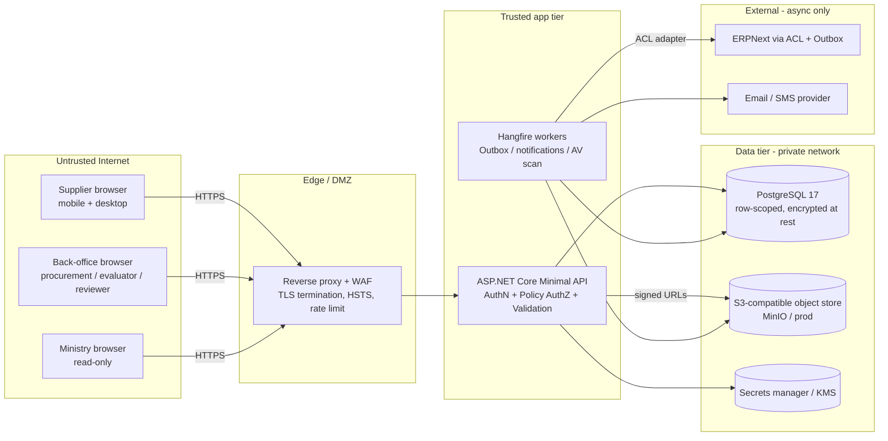
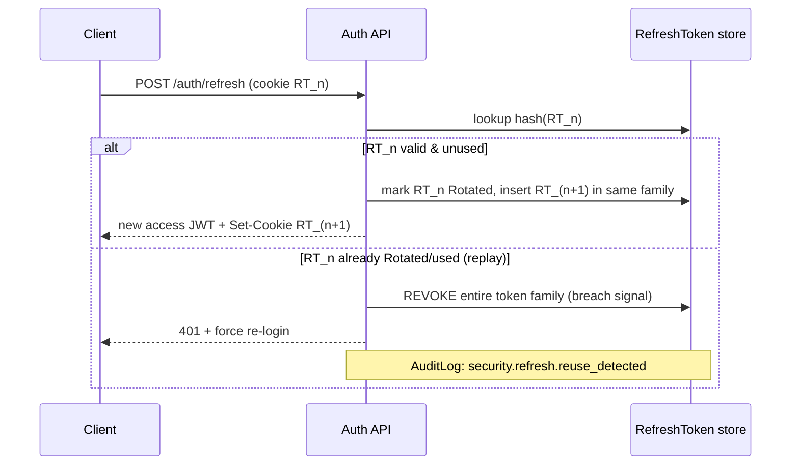
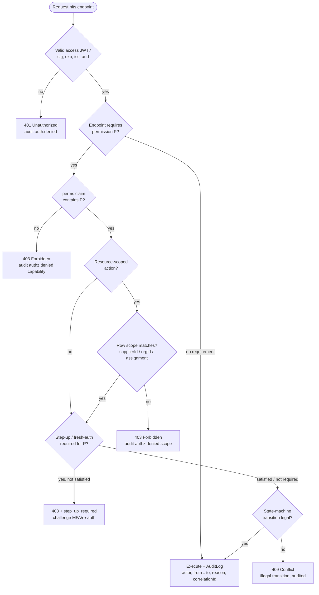
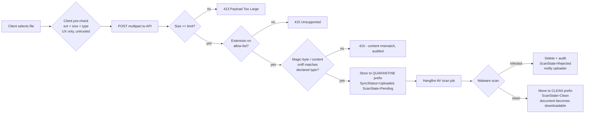

# Security Architecture — MOTS Supplier Portal

> **Status:** Baseline v1 · **Owner:** Principal Architect / Security Lead · **Date:** 2026-08-26
> Consistent with [`00-foundational-decisions.md`](../architecture/00-foundational-decisions.md) and
> [`DISCOVERY-REPORT.md`](../product/DISCOVERY-REPORT.md). Security target: **OWASP ASVS L2**,
> WCAG 2.2 AA is preserved by all security UI (lockout, MFA, verification screens).
> Unknown Syrian legal/regulatory constraints are tagged `[ASSUMPTION / REQUIRES BUSINESS CONFIRMATION]`.

This document defines how the portal protects **suppliers' commercial data**, **RFQ/proposal
confidentiality**, and **procurement integrity** in an Arabic-first, ERP-independent deployment.
It covers authentication, authorization, data protection, secure file handling, API security, an
OWASP ASVS L2 mapping, a STRIDE threat model, and audit logging.

---

## 0. Security principles & trust boundaries

**Guiding principles**

1. **Deny by default.** Every endpoint requires an explicit policy; no endpoint is anonymous unless
   deliberately marked (`register`, `login`, `verify`, `password-reset`).
2. **Defense in depth.** Auth, authorization, row-scoping, validation, and audit are independent
   layers; a defect in one does not collapse the others.
3. **Least privilege.** Permissions are `resource.action` grants; roles compose them; scoping narrows
   them to the caller's Supplier/Organization.
4. **The UI is never trusted.** UI hides affordances for UX only; **the API re-checks every decision**.
5. **Auditable by construction.** All state transitions and security events are recorded in
   `AuditLog` (actor, timestamp, from→to, reason, `correlationId`) — see [state machines](../architecture/00-foundational-decisions.md#5-canonical-state-machines-authoritative--see-docsproductbusiness-processesmd).
6. **ERP-independent security.** No security decision depends on ERP availability; `ExternalId` is a
   string reference only and is never a trust anchor.

**Trust boundaries (high level)**

Everything left of the App tier is untrusted input. The **App tier is the sole policy decision
point**; the data tier sits on a private network reachable only by the app and workers.

---

## 1. Authentication (AuthN)

Local identity via **ASP.NET Core Identity** with **JWT access tokens + rotating refresh tokens**.
The design is **MFA-ready** and **IdP-swappable** (Keycloak/Entra) without touching authorization
code, because authorization consumes claims, not the identity provider.

### 1.1 Token model

| Token | Lifetime | Storage (browser) | Contents | Notes |
|---|---|---|---|---|
| **Access (JWT)** | **15 min** `[ASSUMPTION]` | In-memory (JS heap), never `localStorage` | `sub` (User GUIDv7), `roles`, `perms` (compact permission set), `supplierId?`, `orgId?`, `scope`, `amr`, `jti`, `iat/exp`, `iss`, `aud` | Signed **RS256** (asymmetric) so workers/services verify without the signing key. Short-lived → no server revocation list needed for access tokens. |
| **Refresh** | **14 days** sliding `[ASSUMPTION]`, absolute cap 30 days | **`HttpOnly`, `Secure`, `SameSite=Strict` cookie**, path-scoped to `/api/auth/refresh` | Opaque 256-bit random handle; only a **hash** is stored server-side | **Rotating**: every refresh issues a new refresh token and invalidates the prior one. |

**Why this shape:** the access token is small, self-verifying, and short-lived; the refresh token is
opaque, revocable, and never exposed to JavaScript. Storing the access token in memory (not
`localStorage`) removes the primary XSS token-theft path; storing refresh in an `HttpOnly` cookie
removes the second.

### 1.2 Refresh-token rotation & reuse detection

- Refresh tokens form a **family** (chain) per login session. Presenting an already-rotated token is
  treated as **theft**: the whole family is revoked and the user must re-authenticate. This bounds the
  damage of a stolen refresh token to a single rotation window.
- Server-side record: `{ Id, UserId, TokenHash (SHA-256), FamilyId, ExpiresAt, RotatedAt?, RevokedAt?,
  RevokedReason, CreatedIp, CreatedUserAgentHash, RowVersion }`.
- Logout revokes the current family; "log out all sessions" revokes all families for the user.

### 1.3 Session security

- **Cookie flags:** refresh cookie is `HttpOnly; Secure; SameSite=Strict; Path=/api/auth/refresh`.
- **Absolute + idle timeout:** idle refresh window 14 days, absolute session cap 30 days `[ASSUMPTION]`.
- **Binding:** each refresh record captures IP and a **hashed** user-agent; a mismatch is logged as an
  anomaly (not auto-blocked, to avoid false positives behind NAT/mobile).
- **Concurrent sessions:** allowed; each device is a distinct token family, individually revocable via
  an in-app "Active sessions" screen (`amr`, created time, last-used, coarse device/location).
- **Clock skew:** JWT validation allows ≤ 60s skew; `iss`/`aud` are pinned per environment.
- **Sensitive-action step-up** `[ASSUMPTION]`: high-impact actions (`award.approve`, `admin.users.manage`,
  bank-account change) may require a fresh re-authentication (`max_age`) or MFA challenge even within a
  valid session. Wired as a policy requirement (`FreshAuthRequirement`), enabled per action.

### 1.4 Password policy

Enforced by ASP.NET Identity options + a server-side validator; mirrored (softly) client-side for UX.

| Rule | Value | Rationale |
|---|---|---|
| Minimum length | **12** characters | NIST 800-63B favors length over composition. |
| Composition | No forced symbol/case rules; **encourage** passphrases | Reduces predictable `Password1!` patterns. |
| Breached-password check | Reject known-breached passwords via **k-anonymity range check** (local dataset or HIBP range API) `[ASSUMPTION on external call]` | Blocks credential stuffing at the root. |
| Reuse | Remember last **5** hashes; block reuse | Limits rotation gaming. |
| Hashing | **ASP.NET Identity PBKDF2** (default) with raised iteration count; **path to Argon2id** via custom `IPasswordHasher` `[ASSUMPTION]` | Strong, upgradeable KDF. |
| Rotation | **No forced periodic expiry** | NIST guidance; rotate only on compromise. |
| Input | Max length 256 (DoS guard), full Unicode allowed, no truncation | Supports Arabic passphrases. |

Password inputs are `type=password` with a reveal toggle (RTL-aware), `autocomplete="new-password"` /
`current-password`, and a strength meter driven by length + breach check (never blocking on composition).

### 1.5 MFA readiness

- Identity 2FA is **enabled in the schema and pipeline now**, surfaced **when the business opts in**
  `[ASSUMPTION / REQUIRES BUSINESS CONFIRMATION]`.
- Supported factors (design): **TOTP authenticator** (primary), **email OTP** (fallback), **SMS OTP**
  (optional, gated by SMS provider availability in Syria) `[ASSUMPTION]`.
- Recovery codes: 10 single-use codes generated on enrollment, shown once, stored hashed.
- `amr` claim records how the user authenticated so step-up policies can require MFA for specific
  actions (e.g., `award.approve`).
- Enforcement is **role-driven**: internal/back-office and `system_admin` roles can be required to use
  MFA independently of suppliers.

### 1.6 Email / mobile verification

- **Email verification** is mandatory and gates the onboarding state machine transition
  `Draft → EmailVerified` (see foundational §5). Unverified accounts cannot submit a profile.
- Verification token: single-use, **time-boxed (24h)** `[ASSUMPTION]`, opaque, stored **hashed**;
  the link contains only the opaque token (never the email or user id — see [Privacy §6.4](#64-privacy--pii-in-transit)).
- **Mobile/OTP verification** for representative phone numbers `[ASSUMPTION]`: 6-digit OTP, 5-minute
  expiry, max 5 attempts, rate-limited per number and per IP.
- Re-send is rate-limited (see §5) and does not reveal whether an address exists.

### 1.7 Account recovery & lockout

| Concern | Design |
|---|---|
| **Password reset** | Email a single-use, hashed, 30-minute token to a **path that reveals nothing** (`/reset?token=...`). Response is **identical whether or not the account exists** (anti-enumeration). Successful reset revokes all refresh-token families and all pending reset tokens. |
| **Account lockout** | Identity lockout: **5 failed attempts → 15-minute lock** `[ASSUMPTION]`, exponential backoff on repeat lockouts. Lockout is per-account **and** complemented by per-IP throttling to resist distributed guessing. |
| **Lockout UX** | Localized (ar/en), accessible message with time remaining; never states whether the username exists. |
| **Admin unlock** | `system_admin` can unlock; action is audited (`security.account.unlocked`). |
| **Suspicious login** | New IP/device is logged; optional email notification `[ASSUMPTION]`. |
| **Compromise response** | Admin "force logout + require reset" revokes all families and invalidates active sessions. |

**Anti-enumeration is a first-class rule** across register, login, verify, resend, and reset:
uniform responses, uniform timing (constant-time comparisons + minimum-response-time padding),
and no field-level "email already exists" leakage on public endpoints.

---

## 2. Authorization (AuthZ)

Authorization is **policy-based with permission claims (RBAC)** plus **row/tenant scoping**, exactly
as mandated in foundational §6. Two orthogonal questions are answered on every request:

1. **Capability:** does the caller hold the required `resource.action` permission? (RBAC)
2. **Scope:** is the *specific record* within the caller's Supplier/Organization boundary? (row-scoping)

Both must pass. A `procurement_officer` with `proposal.read` may still be denied a proposal that
belongs to another Organization's RFQ.

### 2.1 Permission model

- **Permission** = `resource.action` string, e.g. `supplier.approve`, `rfq.publish`,
  `proposal.submit`, `evaluation.score`, `award.approve`, `admin.users.manage`, `audit.read`.
- **Role** = named, seeded set of permissions (admin-editable); users hold one or more roles.
- Effective permissions are flattened into the access token's compact `perms` claim at login/refresh,
  so per-request checks are **in-memory** (no DB round-trip for the capability check) — supports the
  API p95 < 300ms read target.
- **Permission changes take effect on next token refresh** (≤ 15 min). For immediate revocation of a
  high-risk permission, admin "force logout" invalidates the session now.

**Seeded role → permission matrix (representative excerpt; canonical set lives with RBAC seed data):**

| Permission | supplier_admin | supplier_user | onboarding_reviewer | procurement_officer | procurement_manager | evaluator | ministry_viewer | system_admin |
|---|:--:|:--:|:--:|:--:|:--:|:--:|:--:|:--:|
| `supplier.profile.edit` | ✅ (own) | ✅ (own) | — | — | — | — | — | ✅ |
| `supplier.document.upload` | ✅ (own) | ✅ (own) | — | — | — | — | — | ✅ |
| `supplier.submit` | ✅ (own) | — | — | — | — | — | — | ✅ |
| `supplier.review` / `supplier.approve` | — | — | ✅ | — | — | — | — | ✅ |
| `rfq.create` / `rfq.edit` | — | — | — | ✅ (own org) | ✅ (own org) | — | — | ✅ |
| `rfq.publish` | — | — | — | — | ✅ (own org) | — | — | ✅ |
| `proposal.create` / `proposal.submit` | ✅ (own) | ✅ (own) | — | — | — | — | — | — |
| `proposal.read` | ✅ (own) | ✅ (own) | — | ✅ (own org) | ✅ (own org) | ✅ (assigned) | ⚠️ aggregate only | ✅ |
| `evaluation.score` | — | — | — | — | — | ✅ (assigned) | — | ✅ |
| `award.recommend` | — | — | — | ✅ (own org) | — | — | — | ✅ |
| `award.approve` | — | — | — | — | ✅ (own org) | — | — | ✅ |
| `audit.read` | — | — | — | ⚠️ (own org) | ⚠️ (own org) | — | ✅ (read-only) | ✅ |
| `admin.users.manage` | ⚠️ (own supplier users) | — | — | — | — | — | — | ✅ |

Legend: ✅ granted · ⚠️ granted but tightly scoped/limited · — not granted. `(own)`/`(own org)`/
`(assigned)` denote row-scoping applied on top of the capability.

### 2.2 Policy handlers & the decision flow

Authorization is expressed as **ASP.NET Core authorization policies** backed by
`IAuthorizationHandler` implementations. Endpoints declare requirements
(`.RequirePermission("rfq.publish")`); handlers evaluate capability, then a **resource-scoped handler**
(`AuthorizationHandler<ScopeRequirement, TResource>`) evaluates row ownership using the loaded entity.

Key properties:
- **Capability before scope before state:** cheap in-memory checks precede DB-dependent ones.
- **Illegal state transitions are rejected by the domain**, not just the UI (foundational §5) — a
  `409` even for a permitted, in-scope caller who tries e.g. to publish an RFQ that is not `Approved`.
- Every deny path emits a structured audit event with the **reason class** (`auth`, `capability`,
  `scope`, `step_up`, `state`) — never the sensitive record contents.

### 2.3 Row / tenant scoping & isolation

The portal is **multi-tenant by data isolation**, not physical separation. Isolation is enforced at
the **query layer**, so a missing `WHERE` clause cannot leak data.

- **Ambient scope:** an `IUserContext` (from validated claims) exposes `UserId`, `SupplierId?`,
  `OrgId?`, `Roles`, `Perms`, `Scope`.
- **EF Core global query filters** apply tenant predicates automatically on scoped aggregates:
  - Supplier-owned data (`Supplier`, `Offering`, `SupplierDocument`, `Proposal`) filtered by
    `SupplierId == ctx.SupplierId` for supplier personas.
  - Org-owned data (`RFQ`, `Invitation`, `Evaluation`, `Award`) filtered by `OrgId == ctx.OrgId` for
    procurement/evaluator personas.
  - `evaluator` is further narrowed to **assigned** evaluations via `EvaluationAssignment`.
- **Cross-cutting overrides:** `system_admin` bypasses filters (global); `ministry_viewer` gets a
  **read-only, cross-organization** filter that exposes governance/aggregate views only.
- **Defense in depth:** even with global filters, resource-scoped policy handlers independently verify
  ownership of the specific record being mutated — the filter prevents *reading* foreign rows; the
  handler prevents *acting* on a mis-supplied id.
- **IDOR resistance:** public references are **opaque slugs/short codes** (`RFQ-2026-000123`); internal
  GUIDv7/integer PKs are never in URLs (foundational §4). Guessing a neighbor's id still fails scope.

### 2.4 Supplier / organization isolation specifics

| Boundary | Rule |
|---|---|
| Supplier ↔ Supplier | A supplier user sees **only** their `SupplierId`. Proposals, documents, and clarifications are strictly partitioned. |
| Supplier ↔ RFQ | A supplier sees an RFQ **only** if invited (`Invitation` exists) or (if open tendering is enabled `[ASSUMPTION]`) the RFQ is `Published`. Competitor proposals are **never** visible to a supplier. |
| Org ↔ Org | Procurement in Org A cannot see Org B's RFQs, proposals, or evaluations (many-to-many supplier↔org supported per Discovery §3.2, but authoring is org-scoped). |
| Evaluator blindness | `[ASSUMPTION]` evaluators score **independently/blind**; an evaluator cannot read peers' scores until `Consolidated` (foundational §5). Enforced by state + scope. |
| Ministry read-only | `ministry_viewer` has **no write permission anywhere**; access is aggregate/governance. Whether it may see **commercial values vs anonymized aggregates** is `[ASSUMPTION / REQUIRES BUSINESS CONFIRMATION]` (Discovery §5) — default: **anonymized/aggregate**, no per-proposal commercial line values. |

---

## 3. Data protection

### 3.1 Encryption in transit

- **TLS 1.3** (1.2 minimum) everywhere; HTTP redirects to HTTPS at the edge.
- **HSTS** `max-age=63072000; includeSubDomains; preload`.
- Internal app→DB and app→object-store traffic uses TLS on the private network; certificates managed
  by the platform/secret manager.
- Modern cipher suites only; no TLS compression (CRIME); OCSP stapling at the edge.

### 3.2 Encryption at rest

| Asset | Mechanism |
|---|---|
| PostgreSQL data + WAL + backups | **Volume/disk encryption (AES-256)** + encrypted, access-controlled backups with **PITR** (foundational §9). |
| Object store (documents) | Server-side encryption (SSE) on the S3-compatible bucket; bucket is **private**, no public read. |
| Application-level field encryption | Selected **high-sensitivity fields** (e.g., bank account numbers) encrypted at the application layer via a KMS-backed data key `[ASSUMPTION]`, so a raw DB dump does not expose them. |
| Secrets | Never in the DB; see §3.3. |

### 3.3 Secrets management

- **No secrets in source, images, or appsettings committed to git.** `.env`/user-secrets in dev only.
- Production secrets (DB creds, JWT signing keys, object-store keys, SMTP/SMS creds, ERP adapter creds)
  live in a **secrets manager / KMS** (e.g., Vault / cloud KMS / Kubernetes sealed secrets)
  `[ASSUMPTION on platform]`, injected at runtime as env/mounted files.
- **JWT signing keys (RS256)** are rotated on a schedule; the API publishes a **JWKS** so old tokens
  validate through the rotation window. Key rotation is zero-downtime.
- Least-privilege service credentials: the app's DB role cannot `DROP`; the object-store credential is
  scoped to the single bucket/prefix.
- Secret access is audited at the platform layer.

### 3.4 PII handling

- **PII inventory** (representative): person names, emails, phone numbers, national/commercial
  registration identifiers `[ASSUMPTION — Syrian specifics unconfirmed]`, addresses, bank details,
  uploaded identity/legal documents.
- **Data minimization:** collect only what onboarding/procurement requires; optional fields are truly
  optional. No invented Syrian legal fields — captured generically and tagged (Discovery §5).
- **Purpose limitation & access:** PII is reachable only through scoped queries; `ministry_viewer`
  sees governance aggregates, not raw PII by default `[ASSUMPTION]`.
- **Retention & deletion:** soft-delete where lifecycle demands, otherwise hard delete + audit
  (foundational §9). A data-subject deletion/export capability is **designed-for** but the legal basis
  and retention periods are `[ASSUMPTION / REQUIRES BUSINESS CONFIRMATION]`.
- **Right-to-access/export** produces a structured bundle of the subject's own data only.

### 3.5 Log hygiene

- Serilog JSON logs **never** contain: passwords, tokens (access/refresh/reset/OTP), full bank
  numbers, or raw document bytes. A **redaction/enricher pipeline** masks known-sensitive keys
  (`password`, `token`, `authorization`, `secret`, `iban`, `otp`) by default (deny-list + allow-list
  of safe fields).
- Identifiers in logs are **GUIDs/opaque codes and `correlationId`**, not PII. Emails/phones are
  hashed or truncated when they must appear.
- Request logging records method, route template (not the raw URL with tokens), status, latency,
  `userId`, `correlationId` — never request/response bodies for auth or document endpoints.
- Logs are access-controlled and shipped via OpenTelemetry; retention is bounded `[ASSUMPTION]`.

---

## 4. Secure file upload & document access

Documents (legal/registration files, proposal attachments) are the highest-risk untrusted input.
All file handling goes through the **`IFileStorage` abstraction** (local disk dev / S3-compatible
prod) mandated in foundational §2, and through a mandatory validation + scan pipeline.

### 4.1 Upload validation pipeline

**Controls:**

| Control | Rule |
|---|---|
| **Size limit** | Per-file cap (e.g., **20 MB** documents, larger for specific types) `[ASSUMPTION]`; enforced at edge (request body limit) **and** app. Multipart part-count limit to resist zip-of-parts DoS. |
| **Type allow-list** | Documents: PDF, common images (PNG/JPG), Office formats as required `[ASSUMPTION]`. **Allow-list only**, never a deny-list. Executables/scripts/HTML/SVG-with-script rejected. |
| **Content sniffing** | Server verifies **magic bytes / actual content type** against the declared/allow-listed type; the client-supplied `Content-Type` and extension are **not** trusted. SVG (if ever allowed) is sanitized or blocked due to script risk. |
| **Filename handling** | Original filename stored as metadata only; the stored object key is a **generated GUID + safe extension** — no path traversal, no user-controlled paths, no rendering of the raw filename as HTML. |
| **Quarantine-first** | Uploads land in a **quarantine** location and are **not downloadable** until the scan passes. |
| **AV / malware scan** | A background scan job (via storage abstraction) integrates a scanner (e.g., ClamAV / cloud AV) `[ASSUMPTION on scanner]`; result drives `ScanState ∈ {Pending, Clean, Rejected}`. Infected files are deleted and the upload is rejected + audited. |
| **Content-Disposition** | Downloads served as **`attachment`** with the correct type; documents are **never** served inline from the app origin in a way that could execute in the user's session. |
| **Image reprocessing** | `[ASSUMPTION]` images may be re-encoded to strip embedded payloads/metadata. |

### 4.2 Signed URLs & document access control

- Documents are **never** publicly accessible. Every access is **authorized first** (capability +
  scope: a supplier document is readable only by that supplier's users, the assigned reviewer, and
  admins; a proposal attachment only by the owning supplier and the RFQ's org procurement/assigned
  evaluators subject to blindness rules).
- After the authorization check, the API mints a **short-lived, single-purpose signed URL** (e.g.,
  **5-minute** expiry `[ASSUMPTION]`) to the object store, scoped to that exact object. The browser
  fetches directly from storage; the URL cannot be reused for other objects and expires quickly.
- Signed URLs are **audited** (`document.access.granted` with `documentId`, `actor`, `correlationId`)
  and are not written to application logs (they embed a signature — see §3.5).
- Uploads use the same pattern in reverse where supported (pre-signed PUT to a quarantine key), keeping
  large bytes off the API path while preserving validation via the post-upload scan job.
- Object-store bucket policy: private, no public list/read, TLS-only, SSE enabled.

---

## 5. API security

### 5.1 Rate limiting & abuse controls

Layered: edge/WAF coarse limits + ASP.NET Core **rate-limiting middleware** for fine-grained,
per-identity policies.

| Surface | Policy `[ASSUMPTION on exact numbers]` |
|---|---|
| `POST /auth/login` | Per-IP + per-account sliding window (e.g., 10/min), then exponential backoff; feeds lockout. |
| `POST /auth/register`, `/verify/resend`, `/password-reset` | Strict per-IP + per-target limits to prevent enumeration/spam. |
| OTP verify | Max 5 attempts per code; per-number and per-IP caps. |
| Authenticated read APIs | Generous per-user token-bucket. |
| Write/mutation APIs | Tighter per-user limits; idempotency keys on submit/award endpoints to prevent double-submit. |
| File upload | Concurrency + count caps per user. |
| Global | Per-IP ceiling at the edge to absorb volumetric abuse. |

Rate-limit responses use `429` with `Retry-After`; limits are localized in the UI (ar/en, accessible).

### 5.2 Input validation & output encoding

- **FluentValidation** on every command/query DTO (foundational §2): type, length, range, allow-listed
  enums, format (email/phone), and cross-field rules. **Zod** schemas on the client are shared-in-spirit
  but the **server is authoritative**.
- **Parameterized queries only** via EF Core; no string-concatenated SQL. Any raw SQL uses parameters.
- **Output encoding:** React escapes by default; **`dangerouslySetInnerHTML` is banned** (lint rule).
  Any server-rendered content (emails) is templated with contextual encoding.
- **Mass-assignment guard:** endpoints bind to explicit DTOs, never directly to domain entities;
  server-controlled fields (`SupplierId`, `OrgId`, state, `ExternalId`, timestamps) are **never**
  settable from the request body.
- **Canonical error contract:** validation failures return **RFC 7807 ProblemDetails** with field
  errors; server exceptions return a generic problem doc with a `correlationId` — **no stack traces or
  internal details** leak to clients.

### 5.3 CORS

- **Explicit origin allow-list** per environment (the SPA origins only); **no `*`**, especially not
  with credentials.
- `AllowCredentials` is enabled only for the exact SPA origin (needed for the refresh cookie);
  methods/headers restricted to what the API uses.
- Preflight cached briefly; unknown origins receive no CORS headers.

### 5.4 CSRF stance for token auth

- The **access token is sent in the `Authorization: Bearer` header** (from JS memory), which is
  **not** automatically attached by the browser → the primary API is inherently CSRF-resistant.
- The **only cookie** is the refresh token, and it is `SameSite=Strict`, `HttpOnly`, and **path-scoped
  to `/api/auth/refresh`**. The refresh endpoint additionally requires the call to originate from an
  allow-listed origin (CORS) and accepts no state-changing side effects beyond rotation. `[ASSUMPTION]`
  a double-submit/anti-forgery token may be added to `/auth/refresh` as belt-and-suspenders.
- No ambient-authority cookie is used for business endpoints, so classic CSRF against RFQ/proposal/
  award actions is not applicable.

### 5.5 Secure headers & CSP

Applied at the edge and/or middleware for all responses (HTML app shell especially):

| Header | Value (intent) |
|---|---|
| `Strict-Transport-Security` | `max-age=63072000; includeSubDomains; preload` |
| `Content-Security-Policy` | `default-src 'self'; script-src 'self'; style-src 'self' https://fonts.googleapis.com; font-src 'self' https://fonts.gstatic.com; img-src 'self' data: blob:; connect-src 'self'; object-src 'none'; frame-ancestors 'none'; base-uri 'self'; form-action 'self'` — tightened to the app's real needs (fonts per foundational §2). **No inline scripts**; nonces/hashes if unavoidable. |
| `X-Content-Type-Options` | `nosniff` |
| `X-Frame-Options` / `frame-ancestors` | `DENY` / `'none'` (clickjacking) |
| `Referrer-Policy` | `strict-origin-when-cross-origin` |
| `Permissions-Policy` | Disable unused features (camera, microphone, geolocation) |
| `Cross-Origin-Opener-Policy` / `Resource-Policy` | `same-origin` |
| `Cache-Control` | `no-store` on auth and document responses |

CSP is defined once and reused; it must accommodate the RTL/Arabic font strategy without opening
`unsafe-inline`/`unsafe-eval`.

### 5.6 Dependency & supply-chain scanning

- **Backend:** `dotnet list package --vulnerable` + a scanner (e.g., OWASP Dependency-Check / GitHub
  Dependabot) in CI; build fails on known-critical CVEs.
- **Frontend:** `npm audit` / Dependabot; lockfile pinned; `npm ci` in CI.
- **SAST/lint:** analyzers (Roslyn security analyzers, ESLint security rules) and secret-scanning
  (e.g., gitleaks) run in CI on every PR.
- **NetArchTest** enforces architectural boundaries (e.g., Domain has no infrastructure dependency),
  which also constrains where trust decisions may live.
- **Container/image scanning** and SBOM generation `[ASSUMPTION on platform]`.
- Lockfiles committed; only necessary licenses (the stack deliberately avoids commercially-restricted
  libs — MediatR/AutoMapper — per foundational §2, reducing supply-chain/license risk).

---

## 6. OWASP ASVS L2 mapping

Target: **ASVS v4.x Level 2**. Representative control mapping (not exhaustive; the full traceability
matrix is maintained with the test suite).

| ASVS chapter | Requirement (summary) | How the portal meets it | Where |
|---|---|---|---|
| **V1 Architecture** | Documented trust boundaries, threat model | This document; STRIDE table §7; boundary diagram §0 | §0, §7 |
| **V2 Authentication** | Strong auth, breached-password check, no forced rotation, secure recovery | Identity + PBKDF2/Argon2id path, breach check, lockout, anti-enumeration | §1.4, §1.7 |
| **V2 (MFA)** | MFA capability for high-value accounts | Identity 2FA ready; step-up on sensitive actions | §1.5, §1.3 |
| **V3 Session** | Secure token handling, rotation, revocation, logout | Rotating refresh w/ reuse detection, HttpOnly cookie, session list | §1.1–§1.3 |
| **V4 Access Control** | Deny by default, RBAC, IDOR resistance, tenant isolation | Policy handlers, row-scoping, opaque ids, EF global filters | §2 |
| **V5 Validation/Encoding** | Server-side validation, output encoding, no injection | FluentValidation, parameterized EF, React escaping, ProblemDetails | §5.2 |
| **V6 Cryptography** | Strong TLS, at-rest encryption, key management | TLS 1.3, disk/SSE encryption, KMS, RS256 JWKS rotation | §3.1–§3.3 |
| **V7 Errors & Logging** | No sensitive data in logs, audit of security events | Redaction pipeline, structured audit, no stack traces to client | §3.5, §5.2, §8 |
| **V8 Data Protection** | PII minimization, retention, secure transport of PII | Data minimization, scoping, no PII in URLs, retention design | §3.4, §6-privacy |
| **V9 Communications** | TLS everywhere, HSTS, no downgrade | Edge TLS, HSTS preload, internal TLS | §3.1, §5.5 |
| **V10 Malicious code** | File upload scanning, no dangerous sinks | AV pipeline, content sniffing, banned `dangerouslySetInnerHTML` | §4, §5.2 |
| **V11 Business logic** | State-machine integrity, anti-automation | Domain-enforced transitions, idempotency, rate limits | §2.2, §5.1 |
| **V12 Files & Resources** | Safe upload/download, no path traversal, signed access | Allow-list, quarantine, generated keys, signed URLs | §4 |
| **V13 API/Web service** | Secure REST, CORS, mass-assignment guard | DTO binding, CORS allow-list, ProblemDetails | §5.2, §5.3 |
| **V14 Configuration** | Secure headers, CSP, dependency management, secrets | Header set + CSP, dependency scanning, secrets manager | §5.5, §5.6, §3.3 |

---

## 7. Threat model (STRIDE)

Scope: the top assets and abuse cases. STRIDE = Spoofing, Tampering, Repudiation, Information
disclosure, Denial of service, Elevation of privilege.

### 7.1 Top assets

1. **Supplier commercial data & proposals** (confidentiality is the crown jewel).
2. **RFQ integrity & evaluation fairness** (procurement legitimacy).
3. **Authentication & session tokens.**
4. **Uploaded documents** (legal/identity files).
5. **Audit trail** (governance evidence).
6. **Award decisions & the ERP write-back path.**

### 7.2 STRIDE table

| # | Asset / Flow | STRIDE | Threat scenario | Mitigation(s) | Residual / owner |
|---|---|---|---|---|---|
| T1 | Login / tokens | **S**poofing | Credential stuffing / password guessing to impersonate a supplier | Breached-password check, lockout + per-IP throttle, anti-enumeration, MFA-ready, optional step-up | Low; monitor login anomalies |
| T2 | Session | **S/I** | Stolen refresh token replayed from attacker device | HttpOnly+Secure+SameSite cookie, **rotation with family reuse-detection revokes on replay**, session list + force-logout | Low |
| T3 | Access control | **E**levation | Supplier user forges `supplierId`/ids to read a competitor's proposal (IDOR) | Row-scoping + EF global filters + resource policy handlers, opaque slugs, deny-by-default | Low |
| T4 | Cross-org data | **I**nfo disclosure | Procurement in Org A reads Org B's RFQ/evaluation | Org-scoped filters + policy handlers; ministry read-only aggregate default | Low |
| T5 | Evaluation | **T**ampering | Evaluator sees peers' scores or edits after submit, biasing outcome | Blind-until-consolidated state + scope; domain-enforced transitions; immutable submitted scores | Low; `[ASSUMPTION]` blindness confirmed |
| T6 | RFQ/Proposal state | **T** | Skip/force an illegal transition (e.g., award without approval) | State machines enforced in **domain**, permission-guarded, 409 on illegal, fully audited | Low |
| T7 | Documents | **T/E** (malware) | Malicious file uploaded to compromise reviewers or other users | Allow-list + content sniffing, quarantine + AV scan, `attachment` disposition, generated keys, CSP | Low; depends on scanner freshness |
| T8 | Documents | **I** | Direct object-store URL guessed/leaked to read others' files | Private bucket, authorization-gated **short-lived signed URLs**, per-object scope, access audit | Low |
| T9 | API | **D**oS | Volumetric or targeted request floods degrade the portal | Edge/WAF + ASP.NET rate limiting, body-size/part limits, upload concurrency caps, idempotency | Medium under sustained DDoS → edge/WAF owner |
| T10 | Injection | **T/I** | SQL/command/XSS injection via inputs | Parameterized EF, FluentValidation, React escaping (no `dangerouslySetInnerHTML`), CSP `script-src 'self'` | Low |
| T11 | Audit trail | **R**epudiation | Actor denies performing an award/approval; or tampers with logs | Append-only `AuditLog` (actor, from→to, reason, correlationId), integrity via hash-chain `[ASSUMPTION]`, restricted `audit.read` | Low |
| T12 | Secrets/keys | **I/E** | Leaked JWT signing key or DB creds forges tokens or dumps data | Secrets manager/KMS, RS256 + JWKS rotation, least-privilege DB role, no secrets in git, secret scanning | Low |
| T13 | Password reset / verify | **S** | Account takeover via reset-token interception or enumeration | Single-use hashed short-TTL tokens, uniform responses/timing, revoke sessions on reset | Low |
| T14 | ERP write-back | **T/R** | Forged/duplicate award event creates a bogus ERP PO | Transactional **Outbox**, ACL adapter with idempotency + signed/authenticated channel, async retry with dead-letter, audited | Medium; ERP-side controls out of scope |
| T15 | Ministry access | **I** | Read-only viewer infers sensitive commercial values | Aggregate/anonymized default, no write perms, scoped views | `[ASSUMPTION]` — confirm what Ministry may see |
| T16 | Supply chain | **T** | Compromised dependency ships malicious code | Dependabot/audit + SAST + secret scan in CI, pinned lockfiles, license-clean stack, SBOM | Medium; ongoing CI vigilance |

---

## 8. Audit logging

Audit is a **canonical, first-class aggregate** (`AuditLog`, foundational §4/§5), not a byproduct of
application logs. It is the governance evidence base for a procurement platform.

- **What is audited:** every **state transition** (supplier onboarding, document, RFQ, proposal,
  evaluation, award), every **security event** (login success/fail, lockout, MFA change, password
  reset, refresh reuse detection, permission/role change, document access grant, session revoke), and
  every **admin action**.
- **Record shape:** `{ Id (GUIDv7), OccurredAt (UTC), Actor (UserId + display), OnBehalfOf?, Action
  (resource.action), TargetType, TargetId, FromState?, ToState?, Reason?, CorrelationId, Ip,
  UserAgentHash, Result (Success/Denied), DenyClass? }`.
- **Correlation:** `correlationId` flows from the edge through API, handlers, Outbox, and Hangfire jobs
  (Serilog + OpenTelemetry), so a single business action is reconstructable end-to-end.
- **Integrity:** audit is **append-only**; no update/delete API. Optional **hash-chaining** (each row
  references the prior row's hash) makes tampering detectable `[ASSUMPTION]`.
- **Confidentiality:** audit records reference ids and reasons, **not** sensitive payloads (no
  passwords, tokens, bank numbers, or document bytes — consistent with §3.5). Reading audit requires
  `audit.read` and is itself scoped (org for procurement, cross-org read-only for ministry, global for
  admin).
- **Retention:** bounded and business-defined `[ASSUMPTION / REQUIRES BUSINESS CONFIRMATION]`; audit
  outlives soft-deleted records so history survives deletion.
- **Separation from ops logs:** operational Serilog/OTel telemetry (performance, errors) is distinct
  from the business `AuditLog`; the former is redacted and short-retention, the latter is durable and
  governance-grade.

---

## 9. Security in the delivery process

- **Every vertical slice ships its own authz + validation + tests** (foundational §11): a slice is not
  "done" without policy coverage, negative-path (403/409) tests, and input-validation tests.
- **Automated checks in CI:** dependency scan, SAST, secret scan, `axe-core` a11y (so security screens
  stay WCAG 2.2 AA), and integration tests against a real Postgres (Testcontainers) that assert
  scoping and illegal-transition rejection.
- **Threat model is living:** revisited when a new aggregate, external integration, or persona is
  added; the STRIDE table (§7) is the change checklist.
- **Open security questions** are tracked with product assumptions
  ([`ASSUMPTIONS.md`](../product/ASSUMPTIONS.md), [`OPEN-QUESTIONS.md`](../product/OPEN-QUESTIONS.md)):
  Ministry data visibility, Syrian legal/PII field set, retention periods, MFA enforcement policy,
  and SMS-provider availability for OTP.

---

### Related documents

- [Foundational Decisions](../architecture/00-foundational-decisions.md) — canonical stack, RBAC, state machines, NFRs
- [Discovery Report](../product/DISCOVERY-REPORT.md) — ERP boundary and integration surface
- [Domain Model](../architecture/DOMAIN-MODEL.md) — aggregates referenced above
- [Integration](../integration/) — ACL + Outbox + adapters for the ERP write-back path
