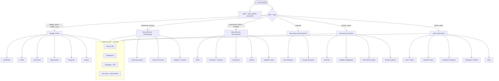

# Information Architecture — MOTS Supplier Portal

> **Status:** Baseline v1 · **Owner:** UX Lead · **Date:** 2026-08-26
> Canonical inputs: [`00-foundational-decisions.md`](../architecture/00-foundational-decisions.md) ·
> [`DISCOVERY-REPORT.md`](../product/DISCOVERY-REPORT.md) · [`DESIGN-SYSTEM.md`](./DESIGN-SYSTEM.md) ·
> [`USER-FLOWS.md`](./USER-FLOWS.md)
>
> This document defines the **navigation model, route map, and role-based visibility** for every
> persona. It is Arabic-first (default `ar`, RTL) with English (`en`, LTR) secondary. All spacing and
> layout described here use **CSS logical properties**; "start/end" replace "left/right" throughout.

---

## 1. Surfaces & shells

The portal is one deployable SPA (React 19 + TanStack Router) presenting **four experience shells**
selected by the authenticated principal's role and scope. A user never chooses a shell manually — the
shell is resolved from role + scope at login and reflected in the URL namespace.

| Shell | Namespace | Personas | Chrome | Density |
|---|---|---|---|---|
| **Supplier** | `/s/*` | `supplier_admin`, `supplier_user` | Top bar + collapsible start-rail | Comfortable (mobile-first) |
| **Back-office** | `/bo/*` | `onboarding_reviewer`, `procurement_officer`, `procurement_manager`, `evaluator` | Persistent start-sidebar + top bar | Compact (desktop-first) |
| **Governance** | `/gov/*` | `ministry_viewer` | Persistent start-sidebar + top bar | Compact, read-only |
| **Admin** | `/admin/*` | `system_admin` | Persistent start-sidebar + top bar | Compact |

Notes:
- A single human may hold roles in **multiple** shells (e.g. an `onboarding_reviewer` who is also a
  `procurement_officer`). In that case an **app switcher** in the user menu lets them move between the
  shells their roles grant; the last-used shell is remembered per user.
- Route namespaces are **short opaque codes** (`/s`, `/bo`, `/gov`, `/admin`), never role names, so URLs
  do not leak the RBAC model. Deep resource URLs use public slugs/short codes (`RFQ-2026-000123`,
  supplier short code), never internal GUID/integer PKs — per canonical §4.
- `dir` (rtl/ltr) is applied at `<html>`; the sidebar is always on the **inline-start** edge and
  therefore renders on the right in Arabic and the left in English automatically.

---

## 2. Global elements (all shells)

These persist in the top bar across every shell; individual affordances are permission-gated.

| Element | Placement (logical) | Behavior | Visible to |
|---|---|---|---|
| **Brand / home** | inline-start | Evergreen-teal wordmark; routes to the shell's default dashboard | All |
| **Global search** (`⌘/Ctrl + K`) | center | Command palette: scoped entity search (suppliers, RFQs, proposals, documents) + quick actions; results row-scoped by RBAC (a supplier searches only their own data) | All (result set scoped) |
| **Notifications bell** | inline-end | Unread count badge; opens a panel grouped by *Actionable* / *Informational*; deep-links to the source entity; full history at `…/notifications` | All |
| **Language switch** | inline-end | `ع / EN` toggle; flips `dir`, fonts (IBM Plex Sans Arabic ↔ Inter), and numeral system; persists per user | All |
| **Help / support** | inline-end | Contextual help drawer + contact channel | All |
| **User menu** (avatar) | inline-end | Profile, organization/supplier context chip, **app switcher** (multi-shell users), theme, sign out | All |
| **Environment ribbon** | top edge | Non-production banner (e.g. "Staging") | All (non-prod only) |
| **Impersonation banner** | top edge | Shown when an admin is impersonating; prominent "exit impersonation" | Admin only |

Cross-cutting behaviors:
- **Breadcrumbs** render under the top bar in Back-office/Governance/Admin (desktop density); the
  Supplier shell uses a back affordance + section title instead (mobile-first).
- **Skip-to-content** link, visible focus rings, and landmark regions on every shell (WCAG 2.2 AA).
- **Notifications** and **search** never expose data outside the principal's scope — the scope filter is
  applied server-side, not just hidden in UI (canonical §6).

---

## 3. Role-based navigation visibility — the rules

Navigation is generated from **permission claims**, not hard-coded per role, so seeded-role edits by an
admin re-shape menus automatically.

1. **Shell membership** decides which namespace(s) a user can enter (`/s`, `/bo`, `/gov`, `/admin`).
2. **A nav item renders only if** the user holds at least one permission that its destination requires
   (e.g. the *Evaluations* item requires `evaluation.read`; *Awards → Approve* requires `award.approve`).
3. **Row-scoping** further filters content inside a screen: suppliers see only their `SupplierId`;
   procurement/evaluators are scoped to their `OrganizationId`; ministry gets read-only cross-org
   aggregates; admin is global.
4. **Affordance hiding is cosmetic only.** Every route also enforces the same policy server-side; a user
   deep-linking to a forbidden URL gets a **403 boundary screen**, not a blank page.
5. **Empty-but-authorized** states show an explanatory empty state, never a hidden menu — so users learn
   what a section is for before they have data in it.
6. Manager-only actions (approve/award) appear as **disabled with tooltip** for officers who can see but
   not perform them, making the approval chain legible.

---

## 4. Navigation model per persona

Legend for permission tags: items list the **primary permission** that gates them (see canonical §6 RBAC).

### 4.1 Supplier — `supplier_admin`, `supplier_user` (shell `/s`)

Mobile-first. Primary nav is a bottom tab bar on phones and an inline-start rail on desktop.

**Primary nav**

| Item | Route | Gate | Notes |
|---|---|---|---|
| Dashboard | `/s` | `supplier.self.read` | Onboarding progress, action items, deadlines, invitation count |
| Company Profile | `/s/profile` | `supplier.self.read` | Legal info, addresses, contacts, representatives, branches, bank accounts, categories, offerings |
| Documents | `/s/documents` | `supplier.document.read` | Upload/track lifecycle; expiry warnings |
| Opportunities | `/s/opportunities` | `rfq.invited.read` | Invitations + open RFQs the supplier is eligible for |
| Proposals | `/s/proposals` | `proposal.read` | Drafts, submitted, revisions, outcomes |
| Awards | `/s/awards` | `award.read` | Won awards + offered awards to accept/decline |
| Notifications | `/s/notifications` | — | Full history |

**Secondary nav** (within areas)

- Company Profile → `Overview · Legal & Registration · Addresses · Contacts · Representatives · Branches ·
  Bank Accounts · Categories · Offerings`
- Documents → filter tabs `All · Required · Under Review · Approved · Rejected · Expiring · Expired`
- Opportunities → tabs `Invitations · Open RFQs · Declined`
- Proposals → tabs `Drafts · Submitted · Under Clarification · Outcome`
- Awards → tabs `Offered · Accepted · Declined · History`

**Route map**

```
/s                                     Supplier dashboard
/s/onboarding                          Onboarding wizard (stepper; see USER-FLOWS §2)
/s/onboarding/:step                    Wizard step (identity, legal, contacts, categories, offerings, documents, review)
/s/profile                             Company profile overview
/s/profile/legal                       Legal & registration info
/s/profile/addresses                   Addresses (HQ + branches)
/s/profile/contacts                    Contacts & representatives (invite delegated supplier_user)
/s/profile/bank-accounts               Bank accounts
/s/profile/categories                  Category enrollment (tree)
/s/profile/offerings                   Offerings catalog
/s/documents                           Document center (list + lifecycle)
/s/documents/:documentId               Document detail / re-upload / rejection reason
/s/opportunities                       Invitations + eligible open RFQs
/s/opportunities/:rfqCode              RFQ detail (requirements, items, timeline, Q&A)
/s/opportunities/:rfqCode/clarifications  Submit clarification question / read answers
/s/proposals                           Proposals list
/s/proposals/new?rfq=:rfqCode          Start proposal from an invitation
/s/proposals/:proposalCode             Proposal workspace (draft/edit)
/s/proposals/:proposalCode/items       Line pricing
/s/proposals/:proposalCode/technical   Technical response
/s/proposals/:proposalCode/documents   Proposal attachments
/s/proposals/:proposalCode/review      Pre-submission review + guardrails
/s/awards                              Awards (offered / history)
/s/awards/:awardCode                   Award detail + accept/decline
/s/notifications                       Notification history
/s/settings                            Language, numerals, notification prefs, security (MFA)
```

Visibility differences within the Supplier shell:
- `supplier_admin` additionally sees **Team** management (invite/deactivate `supplier_user`, assign
  who may submit), bank-account edit, and onboarding submission (`supplier.self.manage`,
  `supplier.team.manage`).
- `supplier_user` sees the same areas **read/contribute** but the **Submit** and **Team** actions are
  hidden unless delegated `proposal.submit` / `supplier.self.manage`.

---

### 4.2 Procurement Officer & Manager (shell `/bo`)

Desktop-first. Persistent inline-start sidebar. The **Manager** is a superset of the **Officer** plus
approval/award authority.

**Primary nav (sidebar)**

| Item | Route | Officer | Manager | Gate |
|---|---|---|---|---|
| Dashboard | `/bo` | ✅ | ✅ | `dashboard.read` |
| RFQs | `/bo/rfqs` | ✅ | ✅ | `rfq.read` |
| Suppliers (directory) | `/bo/suppliers` | ✅ (read) | ✅ | `supplier.read` |
| Proposals | `/bo/proposals` | ✅ | ✅ | `proposal.read` |
| Evaluations | `/bo/evaluations` | ✅ (manage) | ✅ | `evaluation.read` |
| Awards | `/bo/awards` | view/recommend | approve/award | `award.read` / `award.approve` |
| Clarifications inbox | `/bo/clarifications` | ✅ | ✅ | `rfq.clarification.manage` |
| Reports | `/bo/reports` | ✅ (org) | ✅ (org) | `report.read` |
| Notifications | `/bo/notifications` | ✅ | ✅ | — |

**Secondary nav**

- RFQs → tabs by `RfqState`: `Draft · In Review · Approved · Published · Submission Open · Submission
  Closed · Under Evaluation · Recommendation · Award Approval · Awarded · Completed · Cancelled`
- RFQ detail → sub-tabs `Overview · Items · Requirements · Attachments · Invitations · Q&A/Clarifications ·
  Timeline · Evaluation · Recommendation · Award · Audit`
- Suppliers → tabs `All · Active · Suspended · By Category`; a supplier profile is **read-only** here
  (onboarding decisions live in the Onboarding shell).
- Proposals → grouped **per RFQ**; comparison view launches from here.
- Evaluations → tabs `Setup · Assignments · In Progress · Submitted · Consolidated · Finalized`.
- Awards → tabs `Pending Recommendation · Pending Approval · Approved · Awarded · Declined`.

**Route map**

```
/bo                                    Procurement dashboard (org-scoped KPIs, deadlines, queues)
/bo/rfqs                               RFQ list (state-filtered)
/bo/rfqs/new                           RFQ authoring wizard
/bo/rfqs/:rfqCode                      RFQ detail
/bo/rfqs/:rfqCode/items                Line items
/bo/rfqs/:rfqCode/requirements         Requirements
/bo/rfqs/:rfqCode/attachments          Attachments
/bo/rfqs/:rfqCode/invitations          Invite suppliers (directory picker; see USER-FLOWS §5)
/bo/rfqs/:rfqCode/clarifications       Manage Q&A (publish answers to all invitees)
/bo/rfqs/:rfqCode/timeline             Milestones & deadlines
/bo/rfqs/:rfqCode/evaluation           Evaluation setup + progress
/bo/rfqs/:rfqCode/proposals            Received proposals (per RFQ)
/bo/rfqs/:rfqCode/compare              Proposal comparison matrix
/bo/rfqs/:rfqCode/recommendation       Draft/submit recommendation  [Officer]
/bo/rfqs/:rfqCode/award                Award approval + decision      [Manager only]
/bo/rfqs/:rfqCode/audit                Audit trail for this RFQ
/bo/suppliers                          Supplier directory (read)
/bo/suppliers/:supplierCode            Supplier profile (read)
/bo/proposals                          Proposals across RFQs (org-scoped)
/bo/proposals/:proposalCode            Proposal detail (evaluator/procurement view)
/bo/evaluations                        Evaluations across RFQs
/bo/evaluations/:evaluationCode        Evaluation consolidation view
/bo/clarifications                     Cross-RFQ clarifications inbox
/bo/awards                             Awards across RFQs
/bo/reports                            Org procurement reports
/bo/notifications                      Notifications
/bo/settings                           Preferences
```

Officer vs Manager visibility:
- **Officer** authors RFQs, manages invitations, runs clarifications, sets up evaluations, and drafts the
  **Recommendation**. The `/bo/rfqs/:rfqCode/award` decision controls are **disabled with tooltip**.
- **Manager** sees everything the Officer sees **plus** enabled `Approve RFQ publication`, `Approve
  award`, and `Award` controls (`rfq.approve`, `award.approve`). Manager dashboard adds an **approvals
  queue** widget.

---

### 4.3 Evaluator — `evaluator` (shell `/bo`, restricted)

Enters the Back-office shell but sees only evaluation-relevant areas. Desktop/tablet.

**Primary nav (sidebar)**

| Item | Route | Gate | Notes |
|---|---|---|---|
| Dashboard | `/bo` | `dashboard.read` | "My assignments" queue, due dates |
| My Evaluations | `/bo/my-evaluations` | `evaluation.score` | Only RFQs/proposals assigned to this evaluator |
| Notifications | `/bo/notifications` | — | Assignment + reminder notices |

**Secondary nav**

- My Evaluations → tabs `Assigned · In Progress · Submitted`.
- Scoring workspace sub-tabs `Instructions · Criteria & Scores · Proposal Documents · Notes`.

**Route map**

```
/bo                                    Evaluator dashboard (assignments, deadlines)
/bo/my-evaluations                     Assigned evaluations list
/bo/my-evaluations/:evaluationCode     Evaluation overview for one RFQ (assigned proposals)
/bo/my-evaluations/:evaluationCode/proposals/:proposalCode/score   Scoring workspace
/bo/notifications                      Notifications
/bo/settings                           Preferences
```

Visibility rules:
- The evaluator **cannot** see RFQ authoring, invitations, awards, other evaluators' scores, or the
  supplier identity where **[ASSUMPTION / REQUIRES BUSINESS CONFIRMATION]** blind evaluation is enabled
  (canonical §5 assumes independent, peer-blind scoring before consolidation). Under blind mode, proposals
  are shown by anonymized reference until consolidation.
- After `EvaluatorSubmitted`, the workspace becomes **read-only** for that evaluator; edits require a
  reopen action by procurement (audited).

---

### 4.4 Ministry — `ministry_viewer` (shell `/gov`)

Read-only governance. Cross-organization aggregates only; **no write actions anywhere**.

**Primary nav (sidebar)**

| Item | Route | Gate | Notes |
|---|---|---|---|
| Overview | `/gov` | `gov.dashboard.read` | Ecosystem KPIs (supplier base, RFQ throughput, award cycle time) |
| Suppliers | `/gov/suppliers` | `gov.supplier.read` | Aggregate supplier registry & category coverage |
| Procurement Activity | `/gov/rfqs` | `gov.rfq.read` | RFQ volumes, states, timelines across orgs |
| Awards | `/gov/awards` | `gov.award.read` | Award outcomes and cycle metrics |
| Reports | `/gov/reports` | `gov.report.read` | Exportable governance reports |
| Notifications | `/gov/notifications` | — | Governance notices |

**Secondary nav**

- Overview → segmented ranges `This Month · Quarter · Year · Custom`.
- Procurement Activity → tabs `By Organization · By Category · By State · Timeline`.
- Awards → tabs `By Organization · By Category · Cycle Time`.

**Route map**

```
/gov                                   Governance overview
/gov/suppliers                         Aggregate supplier registry
/gov/suppliers/:supplierCode           Supplier summary (non-commercial detail)
/gov/rfqs                              Procurement activity
/gov/rfqs/:rfqCode                     RFQ summary (governance lens)
/gov/awards                            Award analytics
/gov/reports                           Governance reports & exports
/gov/notifications                     Notifications
/gov/settings                          Preferences
```

Visibility rules:
- **[ASSUMPTION / REQUIRES BUSINESS CONFIRMATION]** whether Ministry may see commercial values (prices,
  proposal amounts) or only aggregate/anonymized metrics (canonical §5 open question). Default: Ministry
  sees **aggregate and anonymized** figures; individual proposal prices and evaluator scores are hidden.
  A `gov.commercial.read` permission, off by default, unlocks commercial detail if business confirms.

---

### 4.5 Onboarding Reviewer — `onboarding_reviewer` (shell `/bo`, back-office)

Compliance/onboarding queue. Desktop.

**Primary nav (sidebar)**

| Item | Route | Gate | Notes |
|---|---|---|---|
| Dashboard | `/bo` | `dashboard.read` | Queue counts, SLA at-risk, resubmissions |
| Onboarding Queue | `/bo/onboarding` | `supplier.review` | Submitted / under-review / info-requested |
| Suppliers | `/bo/suppliers` | `supplier.read` | Full supplier directory incl. lifecycle actions |
| Document Reviews | `/bo/document-reviews` | `supplier.document.review` | Cross-supplier document queue |
| Reports | `/bo/reports` | `report.read` | Onboarding funnel, rejection reasons, expiry pipeline |
| Notifications | `/bo/notifications` | — | Submission + resubmission notices |

**Secondary nav**

- Onboarding Queue → tabs by `OnboardingState`: `Submitted · Under Review · Info Requested ·
  Resubmitted · Approved · Rejected`.
- Supplier review workspace → sub-tabs `Profile · Legal · Documents · Categories · History · Decision`.
- Document Reviews → tabs `Uploaded · Under Review · Approved · Rejected · Expiring · Expired`.

**Route map**

```
/bo                                    Onboarding dashboard
/bo/onboarding                         Onboarding queue (state-filtered)
/bo/onboarding/:supplierCode           Supplier onboarding review workspace
/bo/onboarding/:supplierCode/documents Document-by-document review
/bo/onboarding/:supplierCode/decision  Approve / Reject / Request info (with reason)
/bo/suppliers                          Supplier directory (with lifecycle actions)
/bo/suppliers/:supplierCode            Supplier profile
/bo/suppliers/:supplierCode/lifecycle  Suspend / Reactivate / Deactivate (audited)
/bo/document-reviews                   Cross-supplier document review queue
/bo/document-reviews/:documentId       Single document review
/bo/reports                            Onboarding & compliance reports
/bo/notifications                      Notifications
/bo/settings                           Preferences
```

Visibility rules:
- The onboarding reviewer's **Suppliers** area exposes lifecycle transitions
  (`Active ↔ Suspended → Deactivated`, canonical §5) with mandatory reason capture; procurement's
  Suppliers area is read-only by contrast.
- Approve/Reject/Request-info require `supplier.approve` / `supplier.review`; each writes to AuditLog.

---

### 4.6 Admin — `system_admin` (shell `/admin`)

Global scope. Configuration and operational oversight; no procurement authoring.

**Primary nav (sidebar)**

| Item | Route | Gate | Notes |
|---|---|---|---|
| Dashboard | `/admin` | `admin.read` | System health, job/queue status, integration state |
| Users | `/admin/users` | `admin.users.manage` | Create/deactivate users; assign roles; impersonate (audited) |
| Roles & Permissions | `/admin/roles` | `admin.roles.manage` | Edit roles, permission sets |
| Organizations | `/admin/organizations` | `admin.org.manage` | Buying entities, org units |
| Reference Data | `/admin/reference` | `admin.reference.manage` | Categories, document types, currencies, UoM, incoterms, regions |
| Evaluation Templates | `/admin/evaluation-templates` | `admin.template.manage` | Criteria, weights, thresholds, scoring types |
| Notifications | `/admin/notification-config` | `admin.notify.manage` | Templates, channels, triggers |
| Integration | `/admin/integration` | `admin.integration.manage` | Outbox monitor, ERP sync status, dead-letter, replay |
| Audit Log | `/admin/audit` | `audit.read` | Global searchable audit trail |
| Jobs | `/admin/jobs` | `admin.jobs.manage` | Hangfire dashboard link, recurring jobs |
| Settings | `/admin/settings` | `admin.settings.manage` | System-wide defaults (locale, currency, numerals) |

**Secondary nav**

- Reference Data → tabs `Categories (tree) · Document Types · Currencies · Units · Incoterms · Regions`.
- Integration → tabs `Outbox · Sync Status · Dead-letter · Adapters · External ID Map`.
- Audit → filters `Actor · Entity · Action · Date range · Correlation ID`.

**Route map**

```
/admin                                 Admin dashboard
/admin/users                           User management
/admin/users/:userId                   User detail (roles, scope, sessions, impersonate)
/admin/roles                           Roles list
/admin/roles/:roleId                   Role editor (permission matrix)
/admin/organizations                   Organizations
/admin/organizations/:orgId            Org detail + org units
/admin/reference                       Reference data hub
/admin/reference/categories            Category tree editor
/admin/reference/document-types        Document types + expiry rules
/admin/reference/currencies            Currencies
/admin/reference/units                 Units of measure
/admin/reference/incoterms             Incoterms
/admin/reference/regions               Regions
/admin/evaluation-templates            Templates list
/admin/evaluation-templates/:id        Template editor (criteria, weight, max, threshold, scoring type)
/admin/notification-config             Notification templates & triggers
/admin/integration                     Integration monitor
/admin/integration/outbox              Outbox messages
/admin/integration/dead-letter         Dead-letter + replay
/admin/integration/external-ids        External ID mapping
/admin/audit                           Global audit log
/admin/jobs                            Background jobs
/admin/settings                        System settings
```

Visibility rules:
- **Impersonation** is admin-only, always shows the global impersonation banner, and every impersonated
  action is audited with the real actor + impersonated principal.
- Reference-data and template edits are **config**, not procurement; they never grant the admin visibility
  into commercial proposal values.

---

## 5. Shared, cross-shell routes

```
/                       Locale/entry resolver → redirects to the user's default shell dashboard
/auth/login             Sign in
/auth/register          Supplier self-registration  [ASSUMPTION: open vs invite-only — see §7]
/auth/verify-email      Email verification landing (token)
/auth/forgot-password   Password reset request
/auth/reset-password    Password reset (token)
/auth/mfa               MFA challenge / setup (Identity 2FA)
/accept-invite          Delegated-user or buyer-user invitation acceptance (token)
/403                    Forbidden boundary (authorized-shell, disallowed action)
/404                    Not found
/error                  Unexpected error boundary
/offline                Offline / degraded (ERP-independent core still works)
```

Auth routes are shell-agnostic and locale-aware; after authentication the entry resolver at `/` routes
to the correct shell using role + last-used-shell.

---

## 6. IA overview diagram



---

## 7. Open IA questions (tracked in [`OPEN-QUESTIONS.md`](../product/OPEN-QUESTIONS.md))

| # | Question | IA impact | Default assumed |
|---|---|---|---|
| IA-1 | Supplier self-registration **open** vs **invite-only**? | Whether `/auth/register` is public or gated at `/accept-invite` | **[ASSUMPTION / REQUIRES BUSINESS CONFIRMATION]** open self-registration; email verification then review |
| IA-2 | Single vs **multi buying-entity tenancy**? | Whether procurement scope is one org or org-switchable | **[ASSUMPTION]** org-scoped with many-to-many supplier↔org capability (per Discovery §3.2) |
| IA-3 | Ministry commercial visibility? | Presence of prices/scores in `/gov/*` | **[ASSUMPTION]** aggregate/anonymized only; `gov.commercial.read` off |
| IA-4 | Approval hierarchy depth (single vs multi-approver)? | Whether `award`/`rfq.approve` need a multi-step queue | **[ASSUMPTION]** single configurable approver (Discovery §5) |
| IA-5 | Blind evaluation on/off? | Whether evaluator sees supplier identity/peer scores | **[ASSUMPTION]** blind, independent-then-consolidated (canonical §5) |

---

## 8. Responsiveness, RTL & accessibility of the IA

- **Supplier shell** is mobile-first: bottom tab bar (≤ `md`), inline-start rail (≥ `md`). Back-office,
  Governance, and Admin are desktop-first with a collapsible sidebar that becomes an off-canvas drawer on
  narrow widths.
- **RTL**: the sidebar/rail is anchored to `inline-start`, so it sits on the **right** in Arabic and the
  **left** in English with no separate CSS; directional icons (back, next, breadcrumb chevrons) mirror.
- **Keyboard**: command palette (`⌘/Ctrl+K`), `g`-prefixed go-to shortcuts to primary nav items, roving
  tab-index in menus, and focus-trapped drawers/dialogs.
- **Landmarks**: one `header`, one `nav` (primary), `main`, and contextual `aside`; breadcrumbs use
  `aria-current="page"`.
- Every nav item exposes a stable, translatable label key (i18next) — no text baked into icons.
