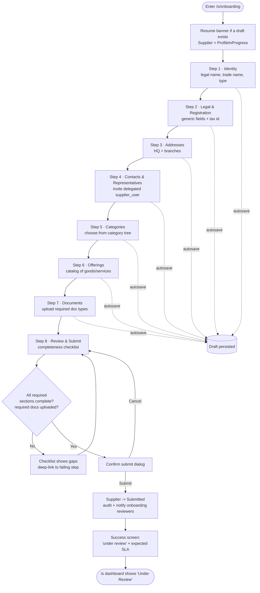
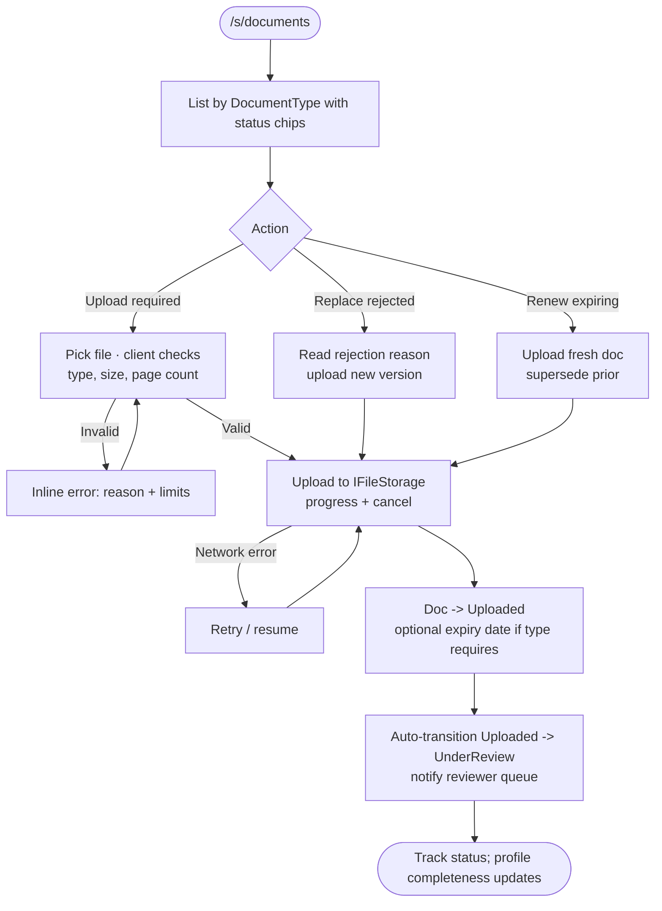
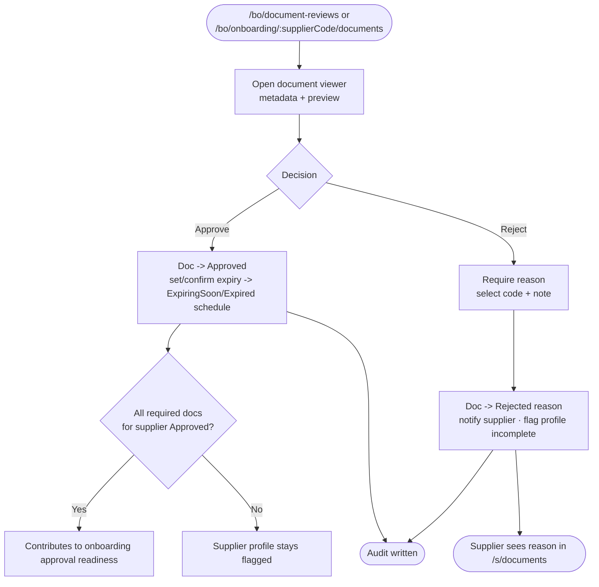
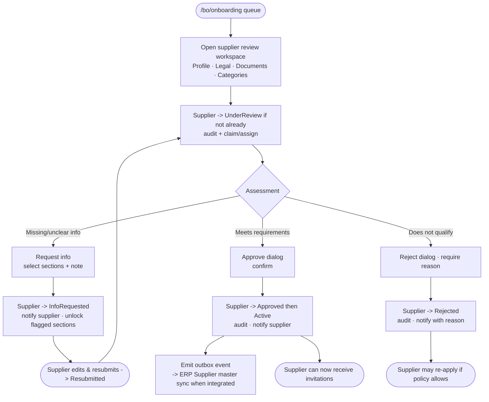
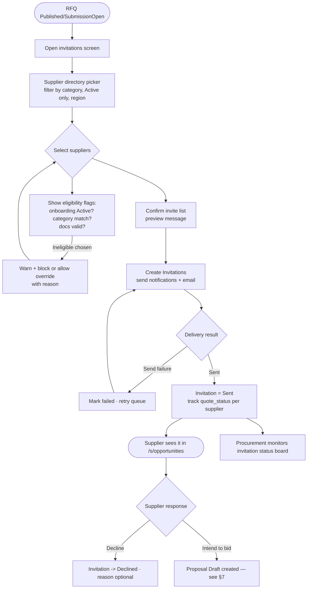
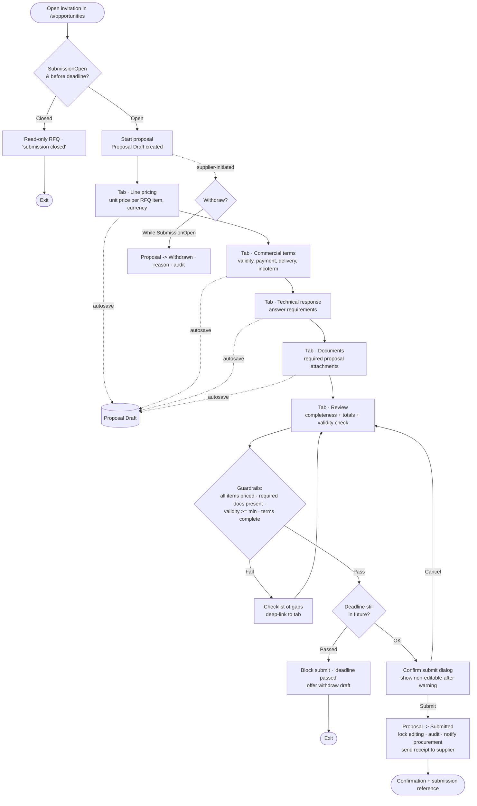
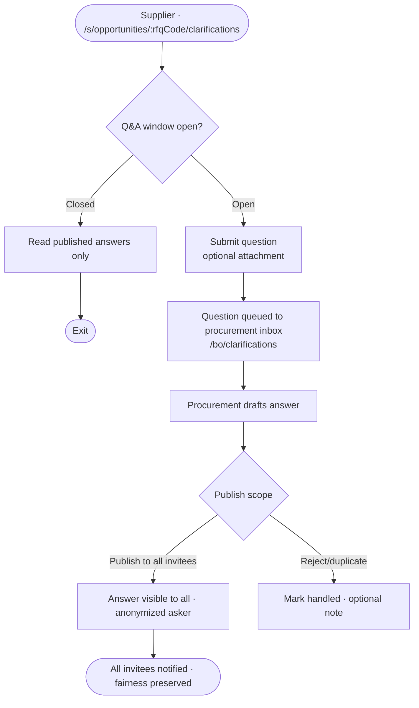
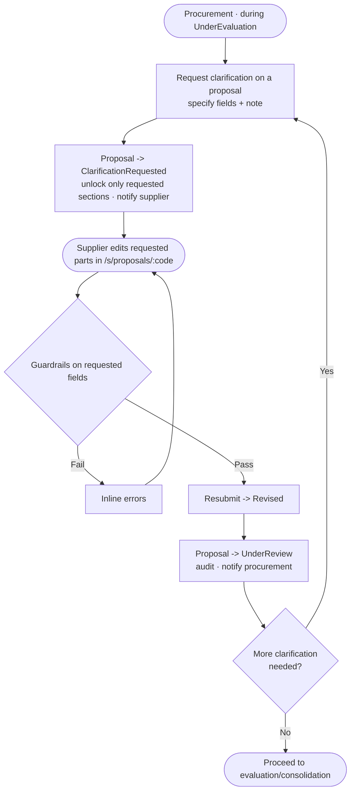
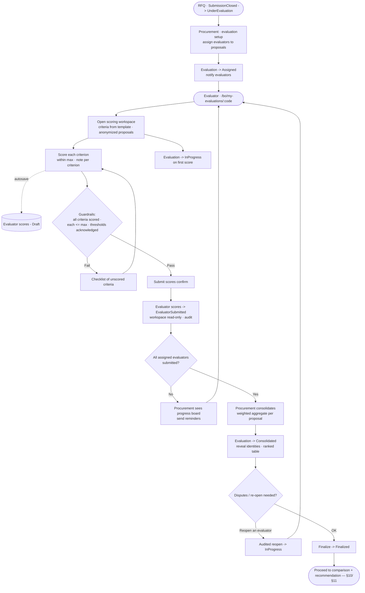

# User Flows — MOTS Supplier Portal

> **Status:** Baseline v1 · **Owner:** UX Lead · **Date:** 2026-08-26
> Canonical inputs: [`00-foundational-decisions.md`](../architecture/00-foundational-decisions.md) ·
> [`DISCOVERY-REPORT.md`](../product/DISCOVERY-REPORT.md) ·
> [`INFORMATION-ARCHITECTURE.md`](./INFORMATION-ARCHITECTURE.md) · [`DESIGN-SYSTEM.md`](./DESIGN-SYSTEM.md)
>
> Screen-level UX flows for the critical journeys. Every flow is **Arabic-first / RTL**, keyboard- and
> screen-reader-accessible (WCAG 2.2 AA), and mobile-responsive where the persona is mobile-first
> (Supplier). State names in these flows are the **canonical state machines** from foundational §5;
> illegal transitions are rejected by the **domain**, not merely hidden in the UI. Every state change is
> written to **AuditLog** (actor, timestamp, from→to, reason, correlationId).

## Legend & conventions

- **Guardrail** = a client + server validation gate that blocks progression until satisfied.
- **Autosave** = drafts persist server-side continuously; navigating away never loses work.
- **Error branches** are drawn explicitly; validation is inline (field-level) plus a form-level summary
  focused on submit.
- Optimistic UI is used only for reversible actions; irreversible actions (submit, publish, award) show a
  confirm step and a success/audit toast.

---

## 1. Registration + email verification

Persona: prospective **Supplier Admin**. Route: `/auth/register` → `/auth/verify-email`.
Onboarding state entered: `Draft → EmailVerified` (canonical §5).

```mermaid
flowchart TD
  A([Visit /auth/register]) --> B{Self-registration<br/>enabled?}
  B -->|"Invite-only<br/>[ASSUMPTION]"| B1[Show 'request access' + redirect to /accept-invite] --> Z1([Exit])
  B -->|Open| C[Registration form:<br/>company name, admin name,<br/>email, phone, password, locale]
  C --> D{Client validation<br/>Zod schema}
  D -->|Invalid| D1[Inline errors + summary] --> C
  D -->|Valid| E[POST create account]
  E --> F{Email already<br/>registered?}
  F -->|Yes| F1[Neutral message:<br/>'if this email exists, we sent instructions'] --> Z2([Exit — no enumeration])
  F -->|No| G[Create User + Supplier in Draft<br/>send verification email]
  G --> H[Show 'check your inbox' screen<br/>resend w/ cooldown]
  H --> I([Open email link /auth/verify-email?token])
  I --> J{Token valid<br/>& unexpired?}
  J -->|Expired| J1[Offer resend] --> H
  J -->|Invalid| J2[Error boundary + support link] --> Z3([Exit])
  J -->|Valid| K[Supplier -> EmailVerified<br/>audit + auto sign-in]
  K --> L{MFA required?}
  L -->|Yes| L1[/auth/mfa setup] --> M
  L -->|No| M[Redirect to /s/onboarding<br/>step 1]
  M --> Z([Onboarding wizard])
```

Notes & guardrails:
- **No account enumeration**: duplicate-email path returns the same neutral message as success.
- Password strength meter; breached-password check; MFA is **available now** (Identity 2FA) and may be
  enforced by policy — **[ASSUMPTION / REQUIRES BUSINESS CONFIRMATION]** whether MFA is mandatory for
  suppliers.
- Verification tokens are single-use, expiring; resend has a cooldown to prevent abuse.
- Errors are announced via `aria-live`; the resend timer is not the only cue.

---

## 2. Onboarding wizard

Persona: **Supplier Admin**. Route: `/s/onboarding/:step`. States:
`ProfileInProgress → Submitted → UnderReview` (canonical §5). Autosave throughout.

Steps: **1 Identity → 2 Legal & Registration → 3 Addresses → 4 Contacts & Representatives →
5 Categories → 6 Offerings → 7 Documents → 8 Review & Submit.**



Guardrails & UX:
- The stepper allows **non-linear** navigation among visited steps; each step shows a validity badge.
- **Documents** step enforces the required `DocumentType` set (from reference data); optional docs
  clearly marked. File constraints (type/size) validated client + server; upload to `IFileStorage`.
- Legal/tax fields are captured **generically** and tagged **[ASSUMPTION / REQUIRES BUSINESS
  CONFIRMATION]** — no invented Syrian legal/registration/tax rules (canonical §8).
- Submit is blocked until the **completeness checklist** passes; the CTA is disabled with an explanatory
  tooltip listing the remaining items.
- After submission the profile is **locked for editing** except where the reviewer requests changes
  (see §4).

---

## 3. Document upload & review

Two coordinated actors: **Supplier** (upload) and **Onboarding Reviewer** (review). Document states:
`Required → Uploaded → UnderReview → Approved | Rejected(reason)`; time-based
`Approved → ExpiringSoon → Expired` (canonical §5).

### 3.1 Supplier upload



### 3.2 Reviewer decision



Guardrails & UX:
- **Rejection requires a reason** (structured code + free text); rejection re-flags the profile as
  incomplete (canonical §5) and notifies the supplier with the exact reason.
- **Expiry** is scheduled via a background job (Hangfire): `Approved → ExpiringSoon` at a configurable
  lead time, then `→ Expired`, each notifying the supplier to renew. **[ASSUMPTION / REQUIRES BUSINESS
  CONFIRMATION]** expiry windows and which document types expire.
- Document preview is accessible (keyboard-navigable viewer, alt text for non-text content where
  possible); large files stream.

---

## 4. Onboarding review & decision (clarification/resubmission loop)

Persona: **Onboarding Reviewer**. State loop:
`Submitted → UnderReview → (InfoRequested → Resubmitted → UnderReview)* → Approved | Rejected`;
post-approval `Active` (canonical §5).



Guardrails & UX:
- **Request info** unlocks only the specified sections for supplier editing; everything else stays locked,
  keeping the review scoped.
- **Approve** emits a transactional **Outbox** event; ERP sync is **async** and never blocks approval —
  the portal works with the ERP offline (canonical §1). `ExternalId` is populated when the ERP
  acknowledges; until then `SyncStatus = Pending`.
- Every decision (request-info / approve / reject) requires the appropriate permission
  (`supplier.review` / `supplier.approve`) and writes an audit entry with reason.

---

## 5. RFQ creation

Persona: **Procurement Officer** (author), **Manager** (publish approval). States:
`Draft → InternalReview → Approved → Published → SubmissionOpen` (canonical §5).
Route: `/bo/rfqs/new` then `/bo/rfqs/:rfqCode/*`.

```mermaid
flowchart TD
  A([/bo/rfqs/new]) --> B[Step 1 · Basics<br/>title, category, currency, description]
  B --> C[Step 2 · Line items<br/>item, qty, UoM, spec]
  C --> D[Step 3 · Requirements<br/>mandatory criteria, incoterms, delivery]
  D --> E[Step 4 · Timeline<br/>publish, Q&A window, submission deadline]
  E --> F[Step 5 · Evaluation template<br/>pick template criteria+weights]
  F --> G[Step 6 · Attachments]
  G --> H[Step 7 · Review]
  B -.autosave.-> DB[(RFQ Draft)]
  C -.autosave.-> DB
  D -.autosave.-> DB
  E -.autosave.-> DB

  H --> V{Validation:<br/>>=1 item, deadline in future,<br/>weights sum to 100, template set}
  V -->|Fail| V1[Summary of gaps<br/>deep-link to step] --> H
  V -->|Pass| S{Approval required?<br/>[ASSUMPTION: yes, single approver]}
  S -->|Yes| W[Submit for review<br/>RFQ -> InternalReview · notify Manager]
  W --> X{Manager decision}
  X -->|Request changes| X1[RFQ -> Draft · reason · notify author] --> B
  X -->|Approve| Y[RFQ -> Approved]
  S -->|No| Y
  Y --> P[Publish action<br/>RFQ -> Published -> SubmissionOpen]
  P --> Q([Invitations become sendable — see §6])
```

Guardrails & UX:
- **Weights must sum to 100** and each criterion has max/threshold/scoring type from the chosen
  `EvaluationTemplate` (canonical §4). Timeline dates must be coherent (Q&A window closes before
  submission deadline).
- **[ASSUMPTION / REQUIRES BUSINESS CONFIRMATION]** approval hierarchy for publication — default single
  configurable approver (Discovery §5). If disabled, `InternalReview` is skipped.
- Author cannot self-approve when approval is required (segregation of duties); the Approve control is
  disabled with tooltip for the author.
- Cancellation is reachable from any pre-`Awarded` state with a mandatory reason (canonical §5).

---

## 6. Supplier invitation

Persona: **Procurement Officer**. Route: `/bo/rfqs/:rfqCode/invitations`. Creates **Invitation** entities;
supplier proposal state seeds at `Draft` on acceptance/response.



Guardrails & UX:
- Only **Active** suppliers (onboarding `Approved → Active`) with a **matching category** are eligible;
  ineligible selections are flagged. Override (if permitted) requires a reason and is audited.
- Re-invitations / additional invitees can be sent while `SubmissionOpen`; a running **invitation status
  board** shows Sent / Viewed / Declined / Responded per supplier (maps to ERPNext `quote_status`,
  Discovery §3.1).
- Emails go through the notification architecture; failures land in a retry queue, never silently lost.

---

## 7. Proposal creation & submission (draft safety + guardrails)

Persona: **Supplier Admin** or delegated **Supplier User** with `proposal.submit`. States:
`Draft → Submitted` (canonical §5). One proposal per supplier per RFQ. Autosave throughout.
Route: `/s/proposals/new?rfq=:rfqCode` → `/s/proposals/:proposalCode/*`.



Guardrails & UX:
- **Autosave + explicit draft**: a supplier can leave and return; the dashboard surfaces "draft in
  progress" with the deadline countdown.
- **Submission guardrails** block submit until every RFQ line item is priced, required proposal documents
  are attached, validity meets the minimum, and commercial terms are complete.
- **Hard deadline**: once the submission deadline passes, submit is impossible (server-enforced); the UI
  reflects the closed window and stops the countdown. Clock skew is avoided by trusting server time.
- **Withdraw** is supplier-initiated and allowed only while `SubmissionOpen` (canonical §5), with reason
  and audit.
- After `Submitted`, the proposal is **read-only** unless procurement requests a clarification/revision
  (see §8).
- Multi-currency: proposal currency may differ from RFQ display currency; totals show both with tabular
  numerals; numeral system respects user preference (canonical §7).

---

## 8. Clarification loop

Two directions: **RFQ clarifications** (public Q&A among all invitees) and **Proposal clarifications**
(private request for revision to one supplier). Proposal state:
`UnderReview → (ClarificationRequested → Revised → UnderReview)*` (canonical §5).

### 8.1 RFQ public Q&A



### 8.2 Proposal revision request



Guardrails & UX:
- **Fairness**: public Q&A answers are broadcast to **all** invitees; the asker is anonymized. Private
  proposal clarifications unlock **only** the named sections, preventing wholesale re-bidding outside
  process. **[ASSUMPTION / REQUIRES BUSINESS CONFIRMATION]** whether price may be changed during
  clarification — default: price-affecting fields require explicit procurement authorization.
- Q&A window is bounded by the RFQ timeline; late questions are read-only against published answers.

---

## 9. Evaluation & scoring

Personas: **Procurement Officer** (setup/consolidate), **Evaluators** (independent scoring). States:
`NotStarted → Assigned → InProgress → EvaluatorSubmitted → Consolidated → Finalized` (canonical §5).
Evaluators score **independently / blind** — **[ASSUMPTION]** peer-blind before consolidation.



Guardrails & UX:
- **Independence**: an evaluator cannot see other evaluators' scores or, under blind mode, supplier
  identities until `Consolidated`. Each evaluator's submission is atomic and locks their workspace.
- **Weighted scoring** uses the template's criterion weights, max, threshold, and scoring type
  (canonical §4). A proposal failing a **mandatory threshold** is flagged (and may be disqualified per
  policy — **[ASSUMPTION / REQUIRES BUSINESS CONFIRMATION]**).
- **Reopen** is an audited, permissioned action; it never silently overwrites submitted scores.
- Progress board shows per-evaluator completion so procurement can nudge without seeing scores.

---

## 10. Proposal comparison

Persona: **Procurement Officer / Manager**. Route: `/bo/rfqs/:rfqCode/compare`. Read/analytical; drives the
recommendation. Uses TanStack Table (headless), RTL-aware, with sticky first column.

```mermaid
flowchart TD
  A([Consolidated evaluation ready]) --> B[Comparison matrix<br/>rows = proposals · columns = criteria+price+total score]
  B --> C[Toggle views:<br/>Technical · Commercial · Combined]
  C --> D[Sort/filter · highlight best per column<br/>tabular numerals · both currencies]
  D --> E{Threshold flags}
  E -->|Below threshold| E1[Row flagged · optional 'disqualify' with reason]
  E -->|OK| F[Weighted total + rank shown]
  F --> G[Select preferred proposal(s)<br/>capture rationale]
  G --> H([Proceed to recommendation — §11])
  B --> X[Export comparison<br/>audit-logged download]
```

Guardrails & UX:
- Side-by-side, screen-reader-friendly matrix; the best value per criterion is highlighted (not color
  alone — icon + text, for accessibility).
- **[ASSUMPTION]** Ministry does not see this commercial matrix; visibility follows `gov.commercial.read`
  (IA §4.4). Export is permissioned and audited.
- Disqualification requires a reason and is auditable; it does not delete the proposal, only marks it.

---

## 11. Recommendation → approval → award

Personas: **Procurement Officer** (recommend), **Procurement Manager** (approve/award). States:
RFQ `Recommendation → AwardApproval → Awarded → Completed`; Award
`Recommended → PendingApproval → Approved | Rejected → Awarded → (Outbox → ERP PO)`;
Proposal `Shortlisted → AwardOffered → Awarded | Declined` (canonical §5).

```mermaid
flowchart TD
  A([From comparison · §10]) --> B[Officer drafts recommendation<br/>selected supplier(s) · rationale · attach comparison]
  B --> C{Guardrails:<br/>evaluation Finalized · winner selected ·<br/>rationale present}
  C -->|Fail| C1[Block · list gaps] --> B
  C -->|Pass| D[Submit recommendation<br/>RFQ -> Recommendation · Award -> Recommended<br/>notify Manager]
  D --> E([Manager · /bo/rfqs/:rfqCode/award])
  E --> F{Manager decision<br/>award.approve}
  F -->|Reject| F1[Award -> Rejected · reason · notify officer] --> B
  F -->|Approve| G[Award -> Approved -> Awarded<br/>RFQ -> Awarded · audit]
  G --> H[Selected proposal -> AwardOffered<br/>notify winning supplier]
  H --> I([Supplier · /s/awards/:code])
  I --> J{Supplier response<br/>[ASSUMPTION: acceptance required]}
  J -->|Accept| K[Proposal -> Awarded]
  J -->|Decline| K1[Proposal -> Declined · reason]
  K1 --> K2{Re-award to next?}
  K2 -->|Yes| B
  K2 -->|No| L1[RFQ stays Awarded/handle per policy]
  K --> L[Emit Outbox event<br/>award -> ERP Purchase Order]
  L --> M{ERP available?}
  M -->|Yes| M1[Adapter creates PO · ExternalPurchaseOrderRef set · SyncStatus=Synced]
  M -->|No / later| M2[Event durable in Outbox · retried<br/>portal marks Awarded regardless]
  M1 --> N[RFQ -> Completed]
  M2 --> N
  F -->|Notify losers| O[Unsuccessful proposals -> NotSelected · courteous notice]
  N --> Z([Awarded + audit trail complete])
```

Guardrails & UX:
- **Segregation of duties**: the recommending officer cannot approve their own award when approval is
  required; controls disable with tooltip. **[ASSUMPTION / REQUIRES BUSINESS CONFIRMATION]** single vs
  multi-step approval (Discovery §5) — modeled as a configurable approval chain.
- **ERP write-back is async** via transactional Outbox: the award is final in the portal even if the ERP
  is down; the PO is created when the adapter next succeeds, populating `ExternalPurchaseOrderRef` and
  flipping `SyncStatus` (canonical §1). The portal **never blocks the award** on ERP availability.
- **Unsuccessful suppliers** receive a respectful `NotSelected` notice; **[ASSUMPTION]** whether scores
  are disclosed to losing bidders — default: outcome only, no scores.
- Every transition (recommend, approve/reject, award, accept/decline, complete) is permission-guarded and
  audited with actor, reason, and correlationId.

---

## 12. Cross-cutting error & edge handling (applies to all flows)

| Situation | Behavior |
|---|---|
| **Session expiry mid-form** | Autosaved draft preserved; re-auth returns to the same step/tab; no data loss. |
| **Concurrent edit** (two supplier users) | `RowVersion` optimistic concurrency; on conflict, show a merge/refresh prompt, never silent overwrite (canonical §4). |
| **Forbidden deep-link** | `/403` boundary within the authorized shell; the nav item was already hidden (IA §3). |
| **File upload failure** | Resumable/retry; clear reason (size/type/network); partial uploads discarded. |
| **ERP unavailable** | Core flows continue; integration events queue in Outbox; a subtle sync-status chip communicates "pending sync", never an error blocking work. |
| **Deadline boundary** | Server time is authoritative; countdowns stop at closure; late submit/withdraw blocked server-side. |
| **Validation** | Inline field errors + focused form-level summary; `aria-live` announcements; submit CTA disabled with reason until valid. |
| **RTL/LTR** | All flows verified in both directions; directional icons mirror; numerals per user preference (canonical §7). |
| **Notifications delivery failure** | Retry queue; in-app notification is the source of truth, email is best-effort. |

---

## 13. Traceability

| Flow | RFQ/Proposal/etc. states touched | Primary permissions | IA routes |
|---|---|---|---|
| §1 Registration | Supplier `Draft→EmailVerified` | public / `supplier.self.*` | `/auth/*`, `/s/onboarding` |
| §2 Onboarding wizard | `ProfileInProgress→Submitted→UnderReview` | `supplier.self.manage` | `/s/onboarding/:step` |
| §3 Documents | Doc `Required→…→Approved/Rejected/Expired` | `supplier.document.*`, `supplier.document.review` | `/s/documents`, `/bo/document-reviews` |
| §4 Onboarding review | `UnderReview→InfoRequested/Approved/Rejected→Active` | `supplier.review`, `supplier.approve` | `/bo/onboarding/*` |
| §5 RFQ creation | `Draft→InternalReview→Approved→Published→SubmissionOpen` | `rfq.create`, `rfq.approve`, `rfq.publish` | `/bo/rfqs/new`, `/bo/rfqs/:code` |
| §6 Invitation | Invitation `Sent→Declined/Responded` | `rfq.invite` | `/bo/rfqs/:code/invitations` |
| §7 Proposal | `Draft→Submitted`, `Withdrawn` | `proposal.create`, `proposal.submit` | `/s/proposals/*` |
| §8 Clarification | `ClarificationRequested→Revised→UnderReview` | `rfq.clarification.manage`, `proposal.revise` | `/bo/clarifications`, `/s/opportunities/:code/clarifications` |
| §9 Evaluation | `Assigned→InProgress→EvaluatorSubmitted→Consolidated→Finalized` | `evaluation.manage`, `evaluation.score` | `/bo/evaluations`, `/bo/my-evaluations` |
| §10 Comparison | (analytical over `Consolidated`) | `proposal.read`, `report.read` | `/bo/rfqs/:code/compare` |
| §11 Recommend/Award | `Recommended→PendingApproval→Approved→Awarded→Completed` | `award.recommend`, `award.approve` | `/bo/rfqs/:code/recommendation`, `/…/award`, `/s/awards` |
