# Supplier Portal — a walk through the whole system

Every screenshot in `screenshots/` was taken while driving the real application against a database
that started empty. Nothing here was seeded by a script: each supplier, tender, proposal and award
below came into existence through the interface, in the order a real procurement would produce them.

## Accounts this walk created

| Persona | Email | Password |
|---|---|---|
| system_admin (bootstrap) | `admin@mots.local` | `motsadmin2026` + TOTP |
| procurement_officer | `officer@mots.local` | `Walkthrough2026!` |
| procurement_manager | `manager@mots.local` | `Walkthrough2026!` |
| procurement_manager | `manager2@mots.local` | `Walkthrough2026!` |
| evaluator | `evaluator@mots.local` | `Walkthrough2026!` |
| onboarding_reviewer | `reviewer@mots.local` | `Walkthrough2026!` |
| ministry_viewer | `ministry@mots.local` | `Walkthrough2026!` |
| supplier_admin | `supplier@gulfcatering.example` | `Walkthrough2026!` |

## Two things that are decisions, not defects

- **The Ministry dashboard shows no commercial figures.** That is a deliberate hold until MOT Legal
  answers on what the Ministry may see. Aggregates only, by BRULE-086.
- **`clamd` must be running or every document upload is refused.** Fail-closed by design: the scanner
  folds any failure into "infected" rather than letting an unscanned file through.

## The walk

### 01. Landing page

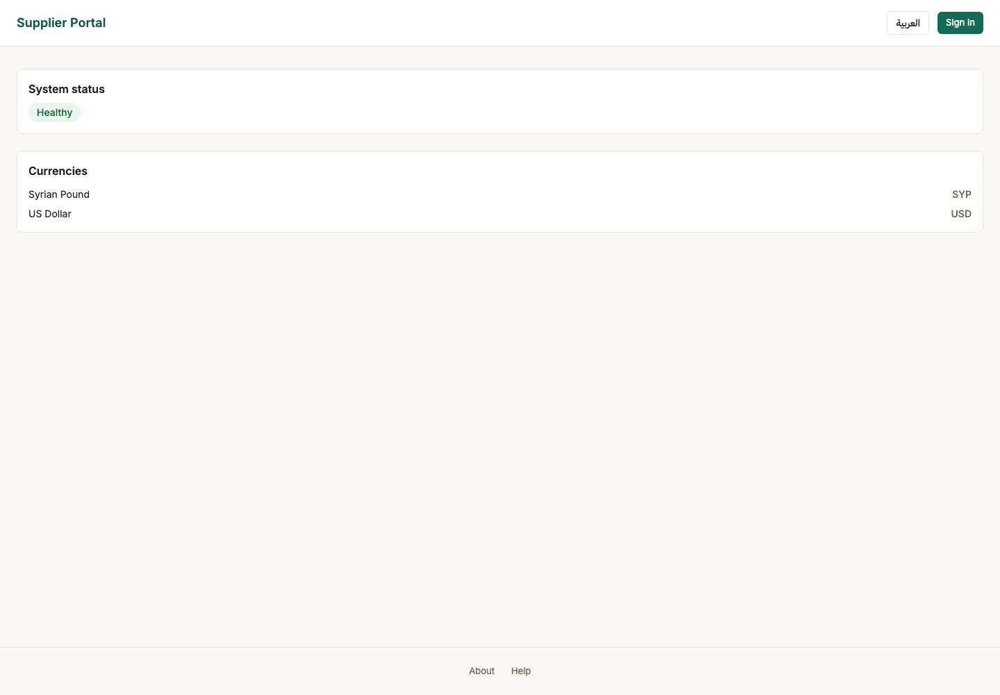

- **Persona:** anonymous
- **Screen:** Landing page — `/`
- **What just happened:** The portal answers with a live health check and the currencies the system booted with. This is a clean database: reference data only.
- **What the user does next:** Click Sign in, or About in the footer to see which build is deployed.

### 02. About

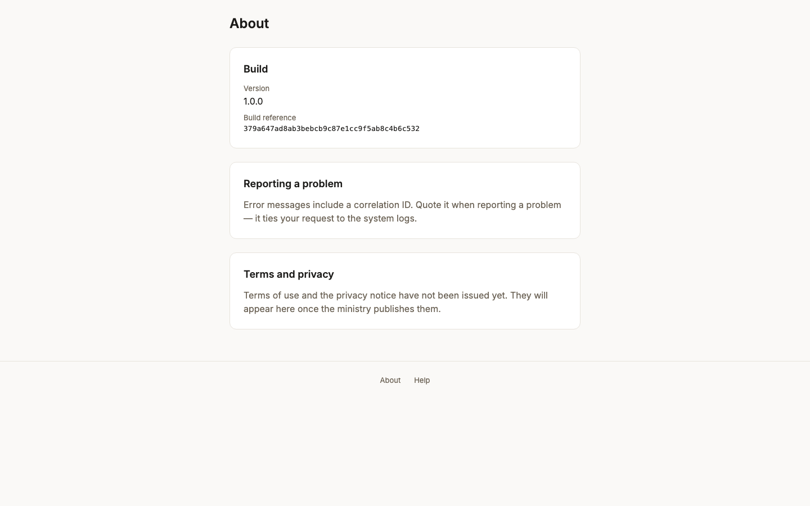

- **Persona:** anonymous
- **Screen:** About — `/about`
- **What just happened:** Reached by clicking the footer, not by typing the address — this screen had no link to it until batch 12. It names the version and the exact commit deployed.
- **What the user does next:** Quote the build reference when reporting a problem. Go back and sign in.

### 03. Choose your language

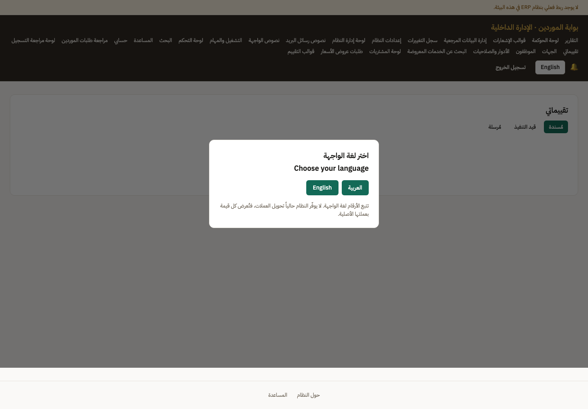

- **Persona:** system_admin
- **Screen:** Choose your language — `/evaluation`
- **What just happened:** SCR-010, asked once and only of someone who has not answered it. The product ships Arabic-first, so this is the first thing a new account sees, in both languages at once — a language chooser written only in the language you cannot read is no use.
- **What the user does next:** Pick a language. The choice is stored against the account, so it is not asked again on any device.

### 04. Back-office landing

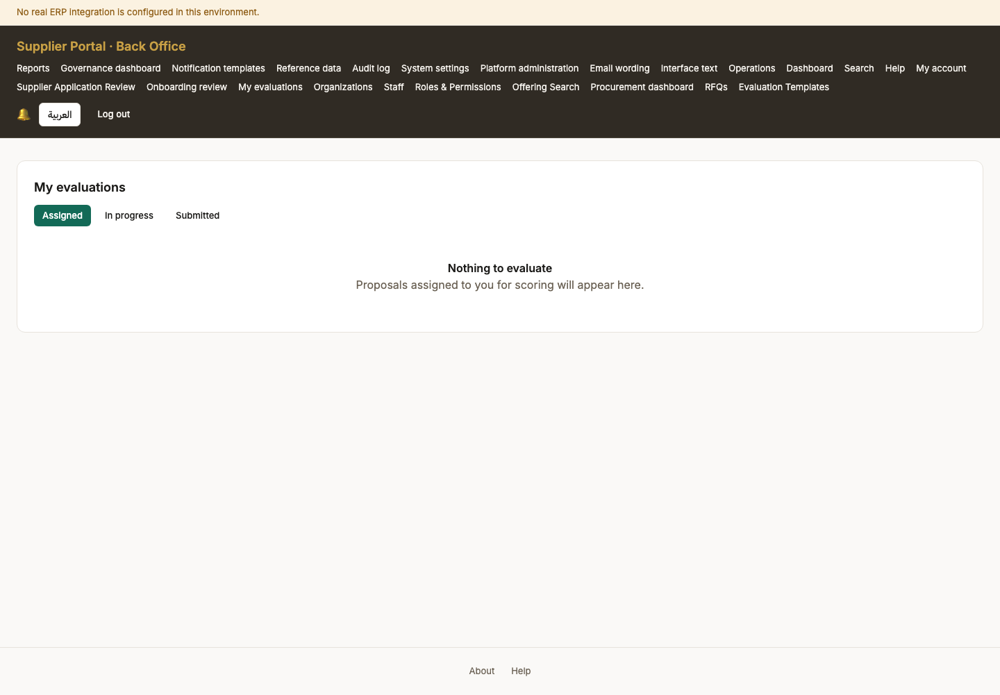

- **Persona:** system_admin
- **Screen:** Back-office landing — `/evaluation`
- **What just happened:** Signed in as the bootstrap administrator — the only account that exists on a fresh database. It required a six-digit authenticator code: system_admin is the one role for which MFA is mandatory.
- **What the user does next:** Open Staff to create the people who actually run a tender.

### 05. Organizations (empty)

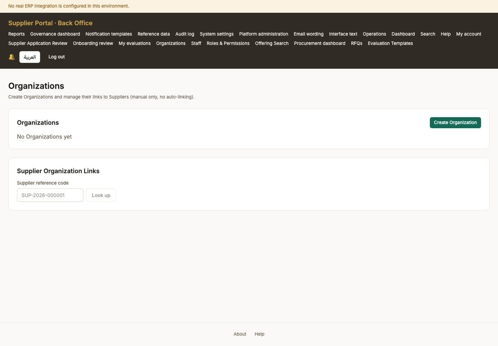

- **Persona:** system_admin
- **Screen:** Organizations (empty) — `/back-office/organizations`
- **What just happened:** No buying bodies yet. An organization is the unit a tender belongs to and the boundary every query is scoped by, so nothing procurement-shaped can exist before one does.
- **What the user does next:** Create the directorate that will run this tender.

### 06. Buying body created

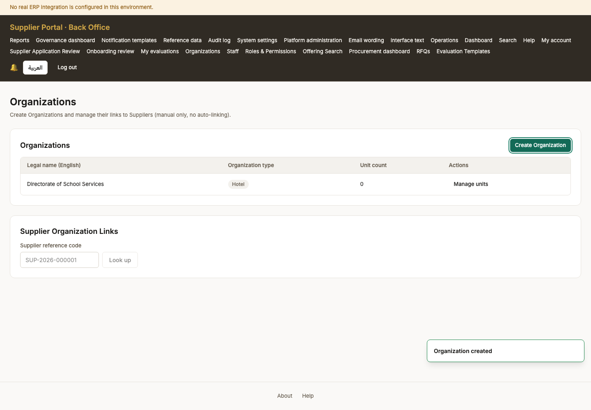

- **Persona:** system_admin
- **Screen:** Buying body created — `/back-office/organizations`
- **What just happened:** The directorate exists. Staff invited into it inherit its scope, and a tender they raise belongs to it.
- **What the user does next:** Invite the people who will run the procurement.

### 07. Staff

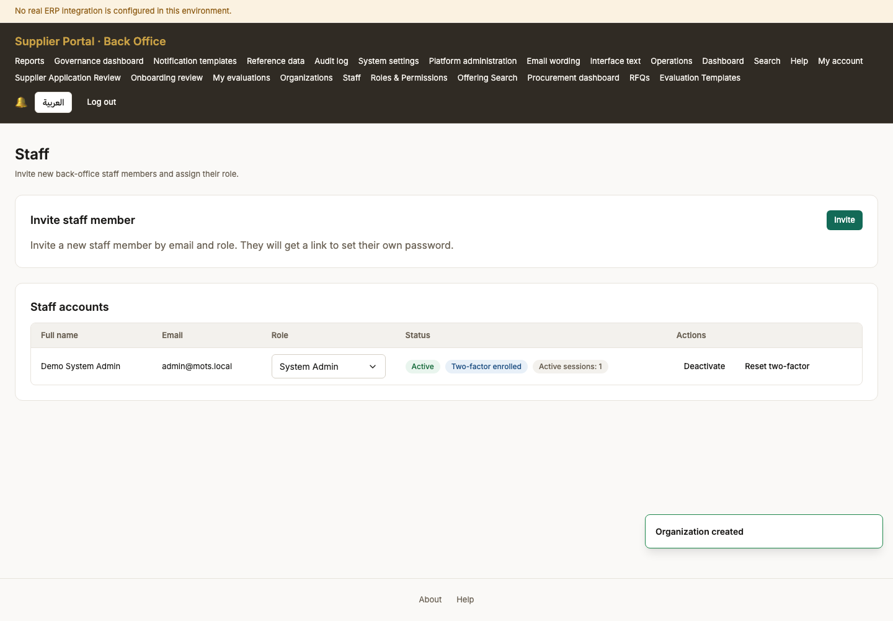

- **Persona:** system_admin
- **Screen:** Staff — `/back-office/staff`
- **What just happened:** The staff list, empty apart from the administrator. There is no other way in: registration only ever creates a supplier, so ministry accounts must be invited from here.
- **What the user does next:** Invite each role the procurement needs — officer, manager, evaluator, reviewer and the Ministry viewer.

### 08. Staff after invitations

- **Persona:** system_admin
- **Screen:** Staff after invitations — `/back-office/staff`
- **What just happened:** Six invitations sent. Each recipient gets an email with a single-use link; nobody has a password until they set one, so an unaccepted invitation is not a live account.
- **What the user does next:** Each person opens their invitation and sets a password.

### 09. Register

- **Persona:** anonymous
- **Screen:** Register — `/register`
- **What just happened:** The only self-service account creation in the product, and it always produces a supplier. Ministry staff cannot register; they are invited.
- **What the user does next:** Fill in the company name in both languages and an email, then submit.

### 10. Register — filled in

- **Persona:** anonymous
- **Screen:** Register — filled in — `/register`
- **What just happened:** Every required field answered. The company name is asked in both languages because the tender record it will appear on is bilingual.
- **What the user does next:** Submit. Nothing is trusted until the email address is proven.

### 11. Registered — check your email

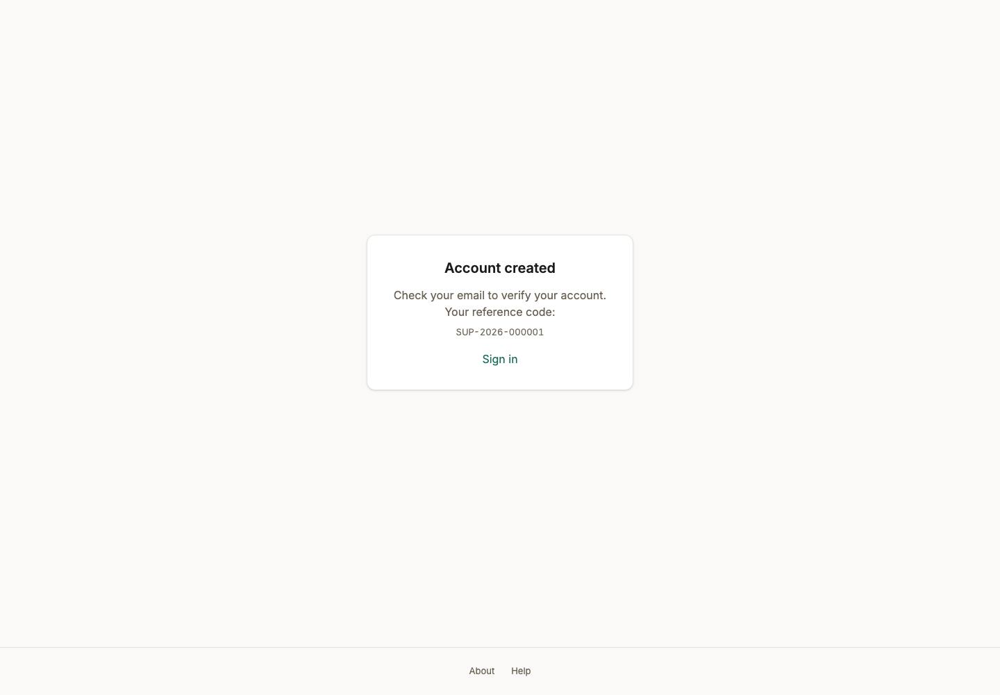

- **Persona:** supplier_admin
- **Screen:** Registered — check your email — `/register`
- **What just happened:** The account exists but cannot sign in yet. Nothing is trusted until the address is proven.
- **What the user does next:** Open the verification email and follow its link.

### 12. Email verified

- **Persona:** supplier_admin
- **Screen:** Email verified — `/verify-email?token=oa2TddVBP81t2fucqWJVf_xKACQG1bgzp_MNObFlcmM`
- **What just happened:** The address is proven and the account is live. The supplier is in Draft: registered, not yet allowed to bid.
- **What the user does next:** Sign in and complete the company profile.

### 13. Supplier dashboard (new account)

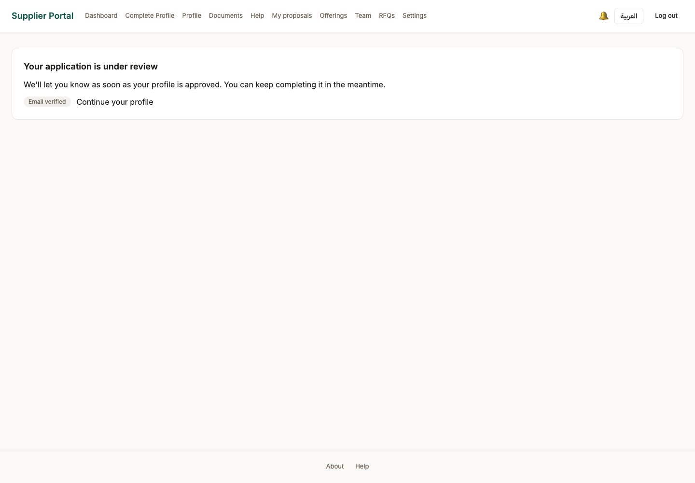

- **Persona:** supplier_admin
- **Screen:** Supplier dashboard (new account) — `/dashboard`
- **What just happened:** The supplier can sign in now. There is no tender activity yet and the screen says so rather than showing empty widgets: what it offers instead is the completeness of the profile that stands between this account and bidding.
- **What the user does next:** Open Onboarding and fill in the company record.

### 14. Onboarding — checklist

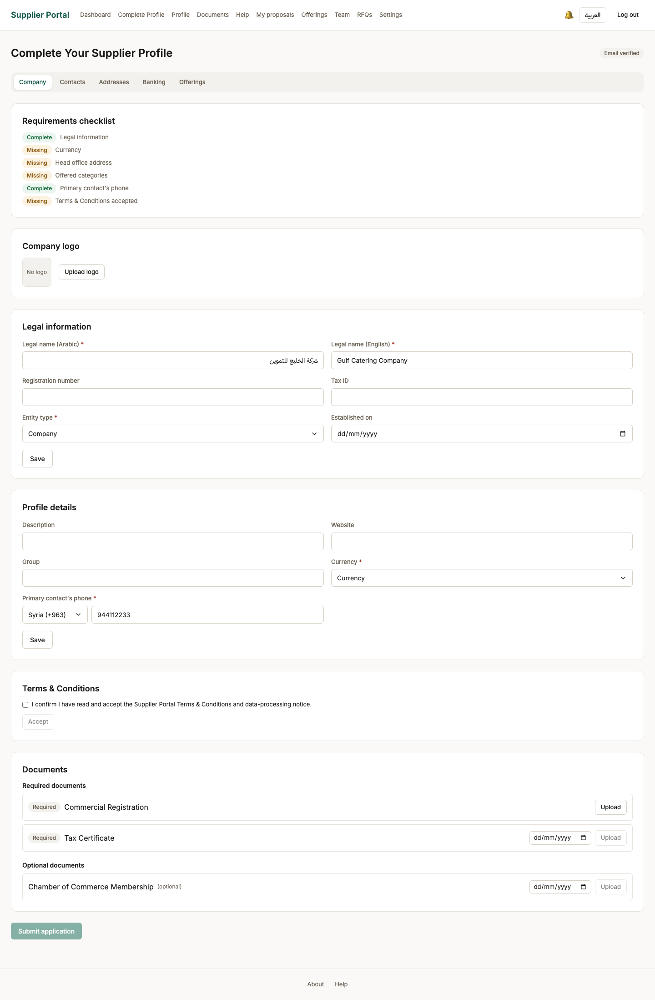

- **Persona:** supplier_admin
- **Screen:** Onboarding — checklist — `/onboarding`
- **What just happened:** The checklist is the gate. Each item is a condition the server enforces on submission, so this screen and the refusal cannot disagree.
- **What the user does next:** Fill in the legal information first.

### 15. Onboarding — legal information saved

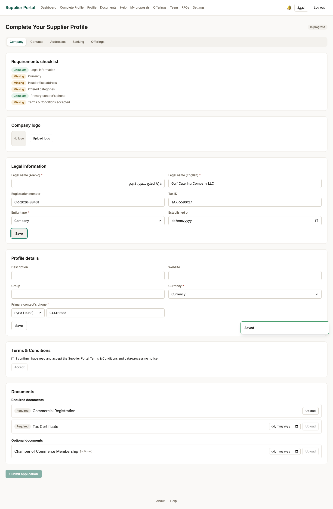

- **Persona:** supplier_admin
- **Screen:** Onboarding — legal information saved — `/onboarding`
- **What just happened:** The legal identity is recorded. This is the block a reviewer checks against the registration certificate.
- **What the user does next:** Fill in the company profile below it — currency and the contact phone are both required.

### 16. Onboarding — company profile saved

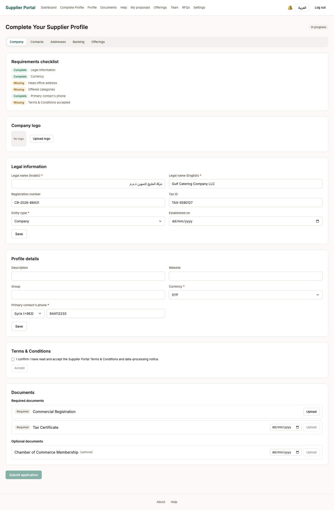

- **Persona:** supplier_admin
- **Screen:** Onboarding — company profile saved — `/onboarding`
- **What just happened:** Currency and a reachable contact are recorded. The currency matters later: a proposal is priced in it, and the comparison matrix refuses to convert between currencies it was never told the rate for.
- **What the user does next:** Add a head-office address, a bank account, and the categories this company supplies.

### 17. Onboarding — contacts

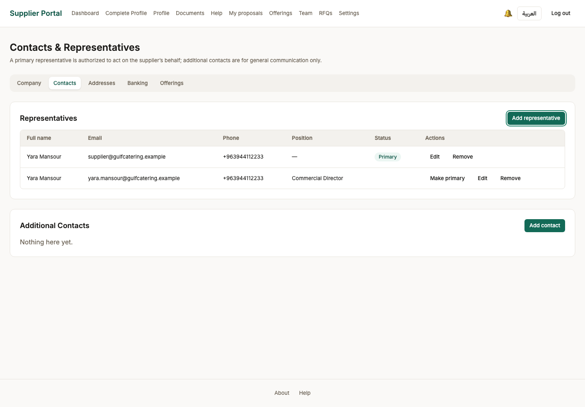

- **Persona:** supplier_admin
- **Screen:** Onboarding — contacts — `/onboarding/contacts`
- **What just happened:** A primary representative is recorded. This is the person a buyer addresses a clarification to, and the completeness rule requires their phone number specifically — a supplier nobody can reach mid-tender is one a buyer cannot include.
- **What the user does next:** Add the head-office address.

### 18. Onboarding — addresses

- **Persona:** supplier_admin
- **Screen:** Onboarding — addresses — `/onboarding/addresses`
- **What just happened:** A head-office address, which is one of the completeness conditions: an approved supplier with no registered address is one nobody can serve notice on.
- **What the user does next:** Add the bank account an award would be paid into.

### 19. Onboarding — banking

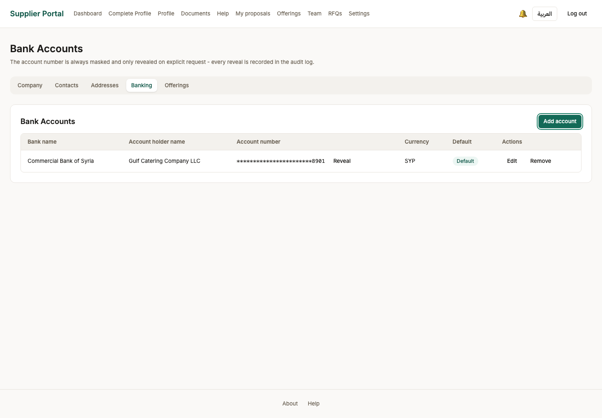

- **Persona:** supplier_admin
- **Screen:** Onboarding — banking — `/onboarding/banking`
- **What just happened:** Where an award would be paid. The account number is masked everywhere it is shown again, including on the reviewer's screen.
- **What the user does next:** Choose the categories this company supplies.

### 20. Onboarding — categories

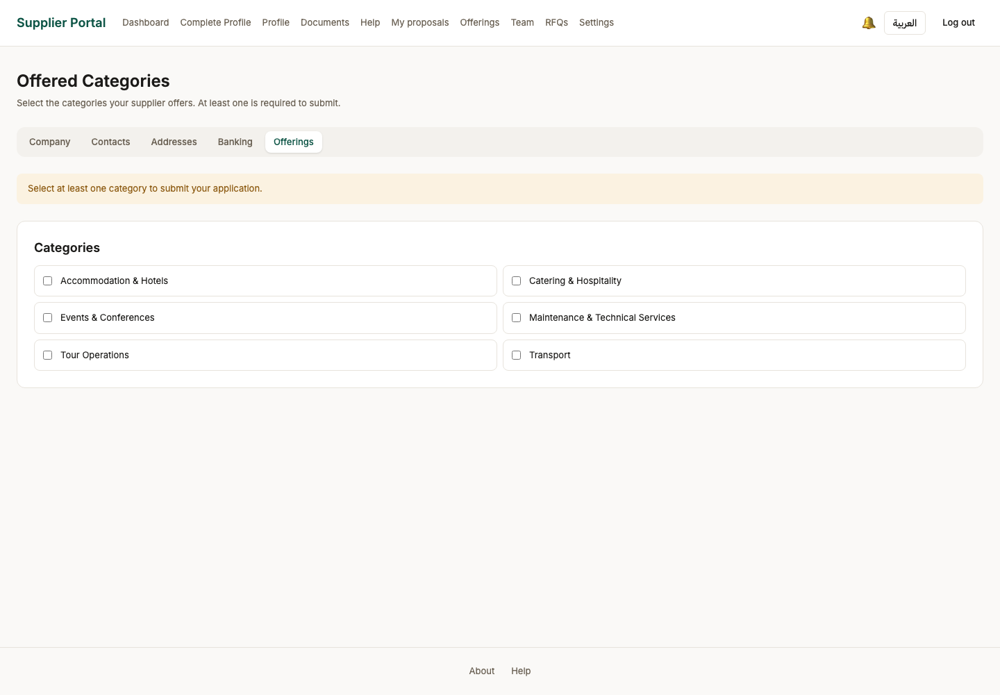

- **Persona:** supplier_admin
- **Screen:** Onboarding — categories — `/onboarding/offerings`
- **What just happened:** What this company supplies, chosen from the ministry-maintained category list rather than typed. Invitations are matched against these.
- **What the user does next:** Tick at least one category — a supplier with none cannot be matched to any tender.

### 21. Onboarding — category chosen

- **Persona:** supplier_admin
- **Screen:** Onboarding — category chosen — `/onboarding/offerings`
- **What just happened:** The category link is recorded and the completeness checklist drops one item.
- **What the user does next:** Upload the documents the ministry requires before an application can be submitted.

### 22. Onboarding — document uploaded

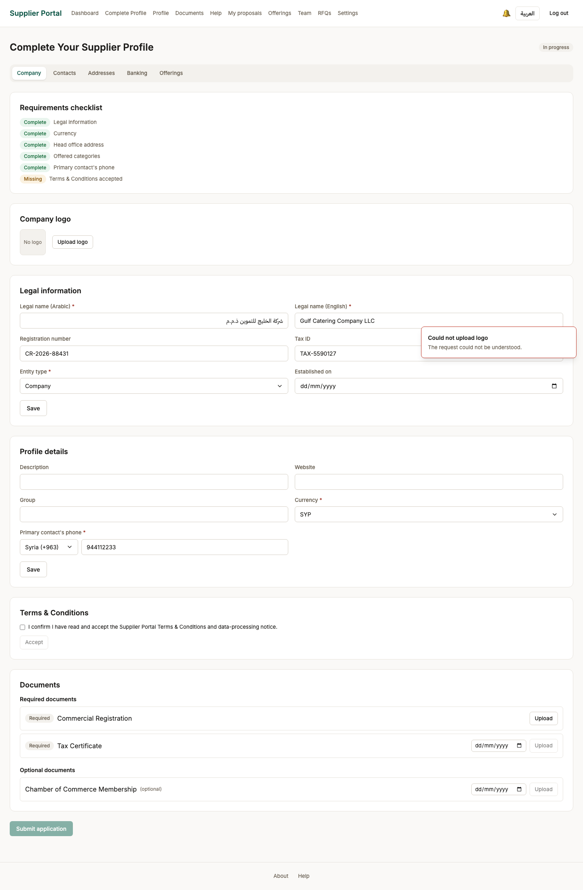

- **Persona:** supplier_admin
- **Screen:** Onboarding — document uploaded — `/onboarding`
- **What just happened:** The file went to object storage and ClamAV scanned it before it was accepted. That scan is fail-closed by design: with clamd stopped the upload is REFUSED rather than stored unscanned, so a portal that cannot scan does not quietly accept attachments.
- **What the user does next:** Upload the remaining required documents, giving an expiry date where the type tracks one.

### 23. Onboarding — terms accepted

- **Persona:** supplier_admin
- **Screen:** Onboarding — terms accepted — `/onboarding`
- **What just happened:** The terms are accepted, recorded against a named version and a timestamp. The tick alone was not the acceptance: a separate button is, so that what is stored is an action somebody took rather than a box that happened to be ticked.
- **What the user does next:** Every condition is now met. Submit the application.

### 24. Onboarding — ready to submit

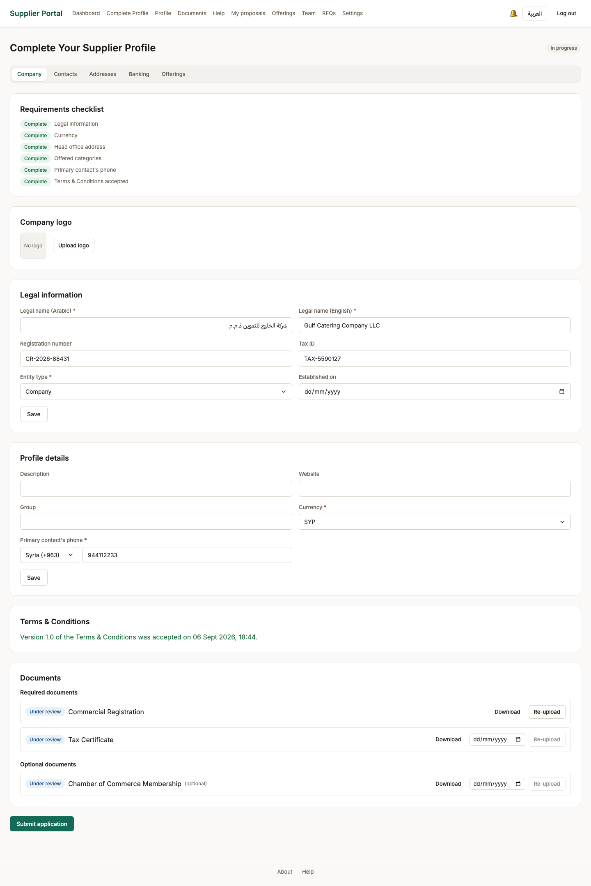

- **Persona:** supplier_admin
- **Screen:** Onboarding — ready to submit — `/onboarding`
- **What just happened:** Every required document is uploaded and scanned. The submit button is offered only now: the server enforces the same list, so a submission that looks possible here is one that will be accepted.
- **What the user does next:** Submit the application for review.

### 25. Application submitted

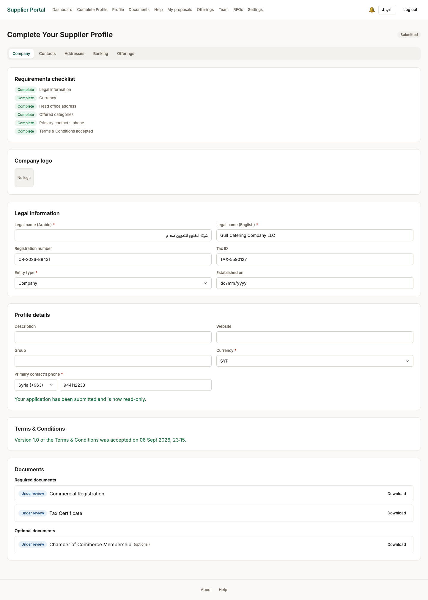

- **Persona:** supplier_admin
- **Screen:** Application submitted — `/onboarding`
- **What just happened:** The profile is now read-only and sits in the reviewer queue. The supplier cannot edit what is being judged while it is being judged.
- **What the user does next:** Wait for the ministry reviewer. Sign in as the reviewer to see the other side.

### 26. Reviewer landing

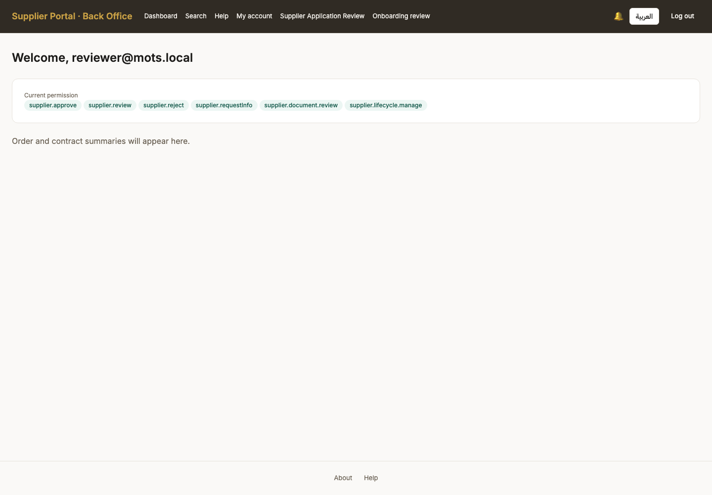

- **Persona:** onboarding_reviewer
- **Screen:** Reviewer landing — `/back-office/dashboard`
- **What just happened:** The onboarding reviewer signs in. Their navigation carries exactly two working links — the review queue and its dashboard — because supplier.review is the only permission this role holds.
- **What the user does next:** Open the reviewer dashboard.

### 27. Reviewer dashboard

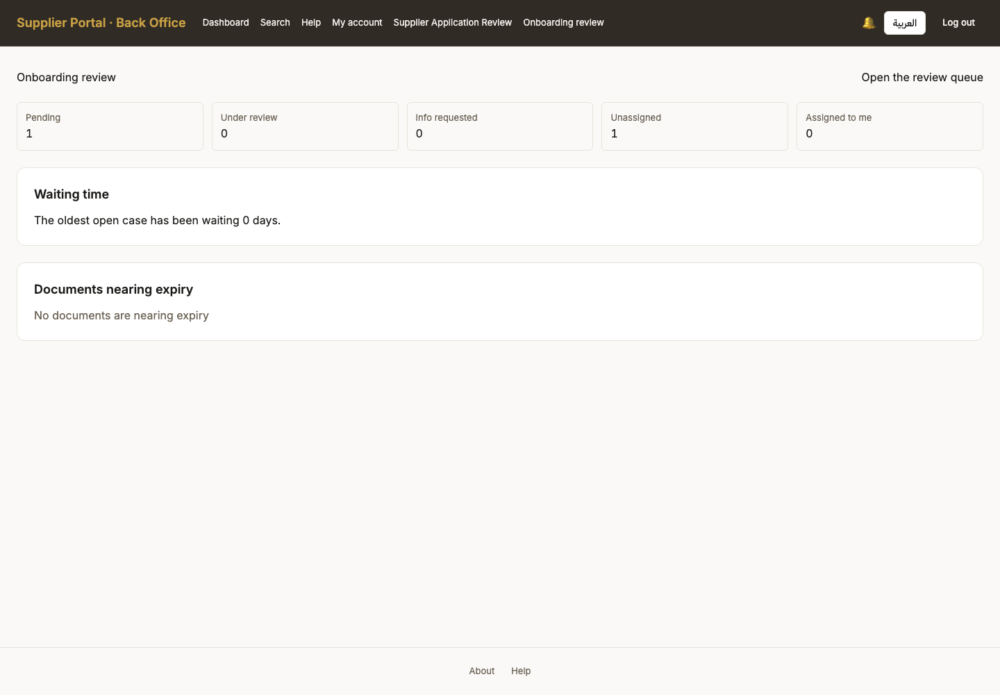

- **Persona:** onboarding_reviewer
- **Screen:** Reviewer dashboard — `/back-office/review-dashboard`
- **What just happened:** SCR-300, and until batch 12 nothing in the app linked to it. It reports the oldest waiting case and the queue age, which is the question a reviewer actually opens the product to answer.
- **What the user does next:** Open the review queue and take the waiting application.

### 28. Review queue

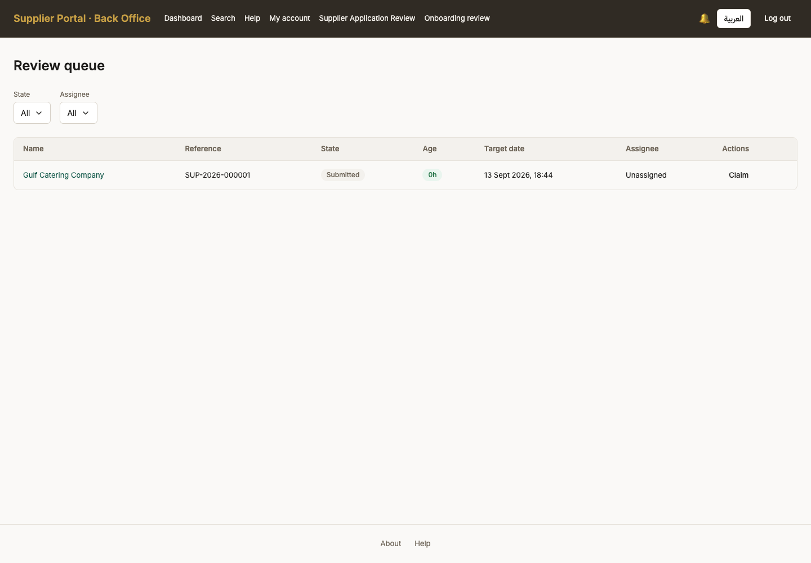

- **Persona:** onboarding_reviewer
- **Screen:** Review queue — `/back-office/review`
- **What just happened:** One application waiting — the one created in act 3. The queue is row-scoped: a reviewer sees applications, never tender data.
- **What the user does next:** Open the application and check it against its documents.

### 29. Application detail

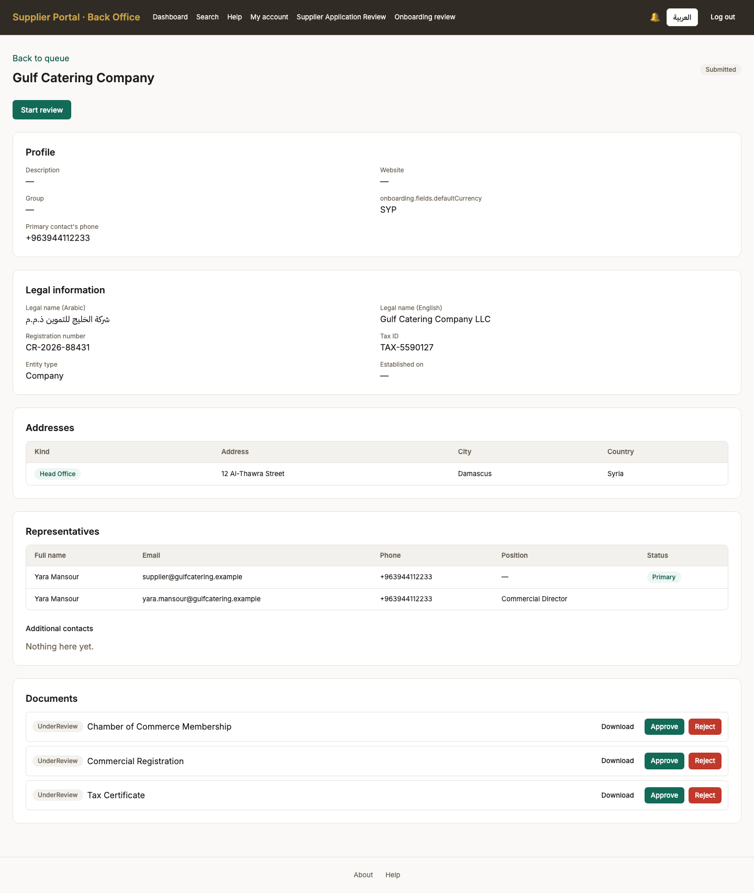

- **Persona:** onboarding_reviewer
- **Screen:** Application detail — `/back-office/review/SUP-2026-000001`
- **What just happened:** The whole submitted profile in one place, with every uploaded document downloadable. This is the screen the completeness rules exist to make answerable.
- **What the user does next:** Approve, reject, or request more information. Each one demands a written reason.

### 30. Review started

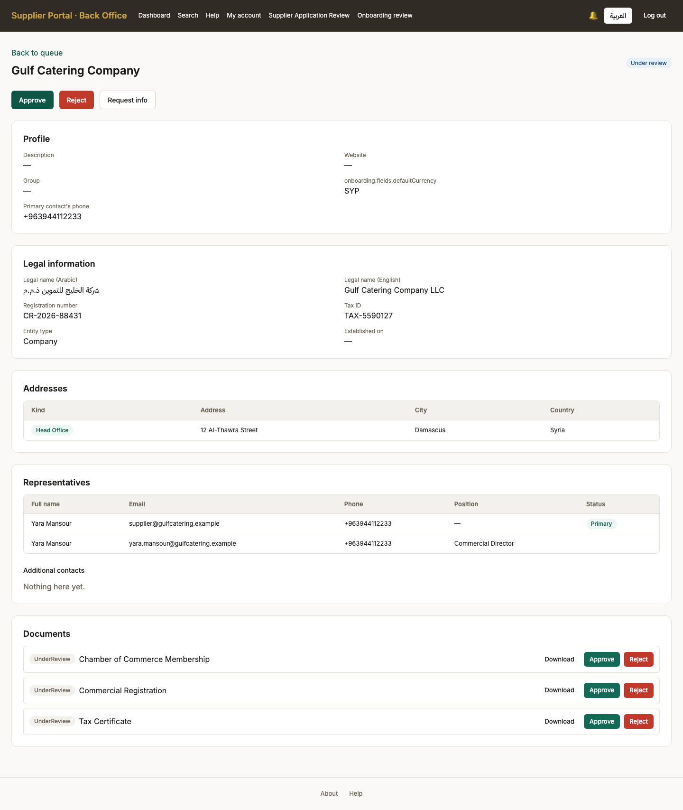

- **Persona:** onboarding_reviewer
- **Screen:** Review started — `/back-office/review/SUP-2026-000001`
- **What just happened:** Claimed. The decision controls appear only now, and the queue records who took it - which is what stops two reviewers working the same application without knowing.
- **What the user does next:** Check the documents, then approve, reject, or ask for more information.

### 31. Application approved

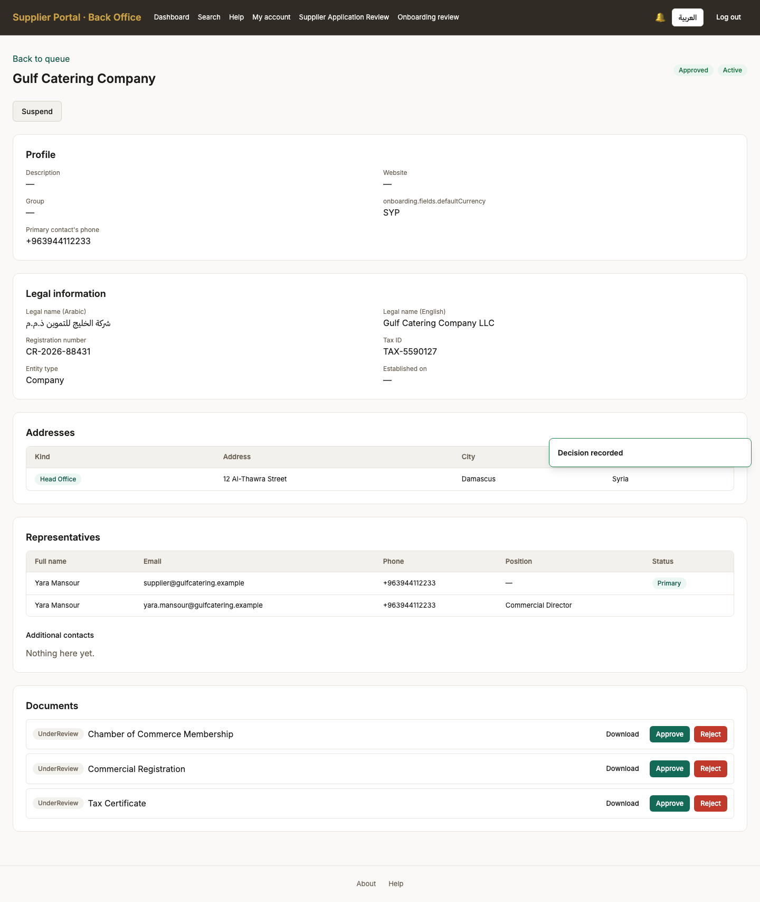

- **Persona:** onboarding_reviewer
- **Screen:** Application approved — `/back-office/review/SUP-2026-000001`
- **What just happened:** Approved, with a written reason recorded against the decision. The reason is not decoration: an approval nobody can account for later is the thing an audit trail exists to prevent.
- **What the user does next:** The supplier is now Active and can be invited to tenders. Sign in as the procurement officer.

### 32. Offerings (empty)

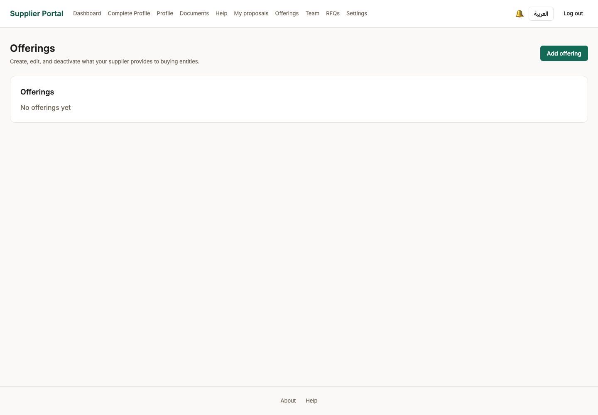

- **Persona:** supplier_admin
- **Screen:** Offerings (empty) — `/offerings`
- **What just happened:** Ticking a category during onboarding said what this company does in principle. An offering is the concrete thing it sells, and this is the list a buyer is matched against - the invitation suggestions on a tender are built from OFFERINGS, not from the categories chosen at sign-up.
- **What the user does next:** Add an offering in the catering category.

### 33. Offering listed

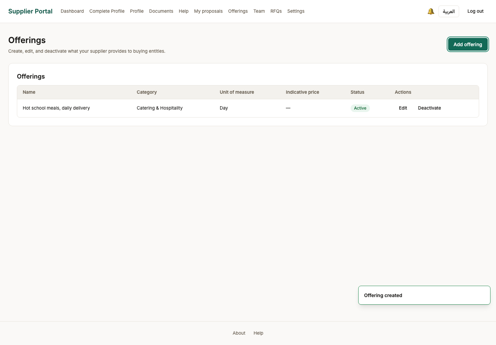

- **Persona:** supplier_admin
- **Screen:** Offering listed — `/offerings`
- **What just happened:** The company is now findable. A tender whose line items carry this category will suggest this supplier to the officer writing it — which is the whole mechanism by which a buyer discovers who can bid.
- **What the user does next:** Back to the officer, who writes the tender.

### 34. Evaluation templates (empty)

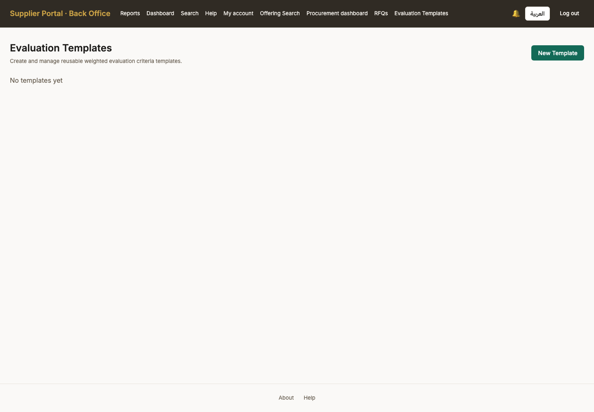

- **Persona:** procurement_manager
- **Screen:** Evaluation templates (empty) — `/back-office/evaluation-templates`
- **What just happened:** How bids get scored is decided before any bid exists, and by the manager rather than the officer who writes the tender. A template is reusable and versioned: activating one freezes it, and changing it later forks a new version rather than editing history.
- **What the user does next:** Create the template this tender will be judged against.

### 35. Template created (Draft)

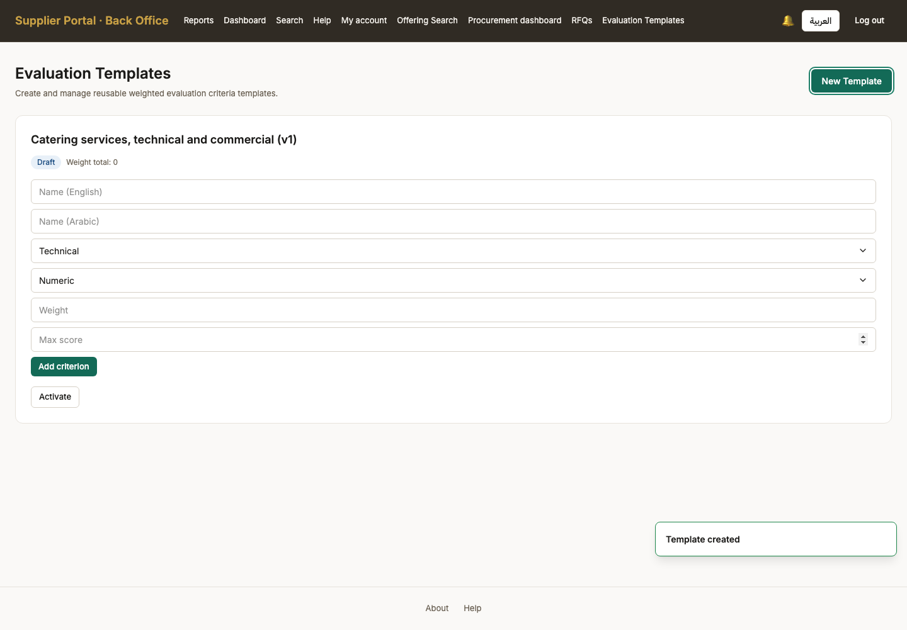

- **Persona:** procurement_manager
- **Screen:** Template created (Draft) — `/back-office/evaluation-templates`
- **What just happened:** The template exists in draft. It scores nothing yet: criteria carry the weights, and the weights have to total 100 before it can be activated.
- **What the user does next:** Add the criteria bids will be scored on.

### 36. Criteria added, weights total 100

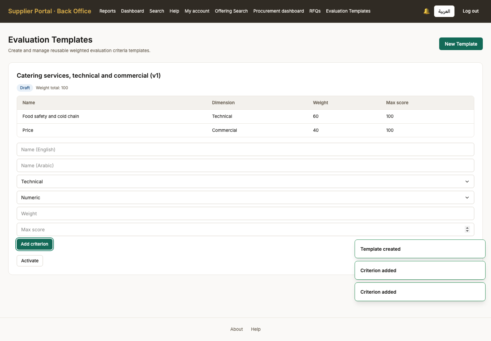

- **Persona:** procurement_manager
- **Screen:** Criteria added, weights total 100 — `/back-office/evaluation-templates`
- **What just happened:** Two criteria across two of the four dimensions the product offers - Technical, Commercial, Compliance and Delivery. The weight total is shown because activation refuses anything but 100 — a template that does not add up would produce rankings nobody could defend.
- **What the user does next:** Activate it so a tender can bind it.

### 37. Template activated

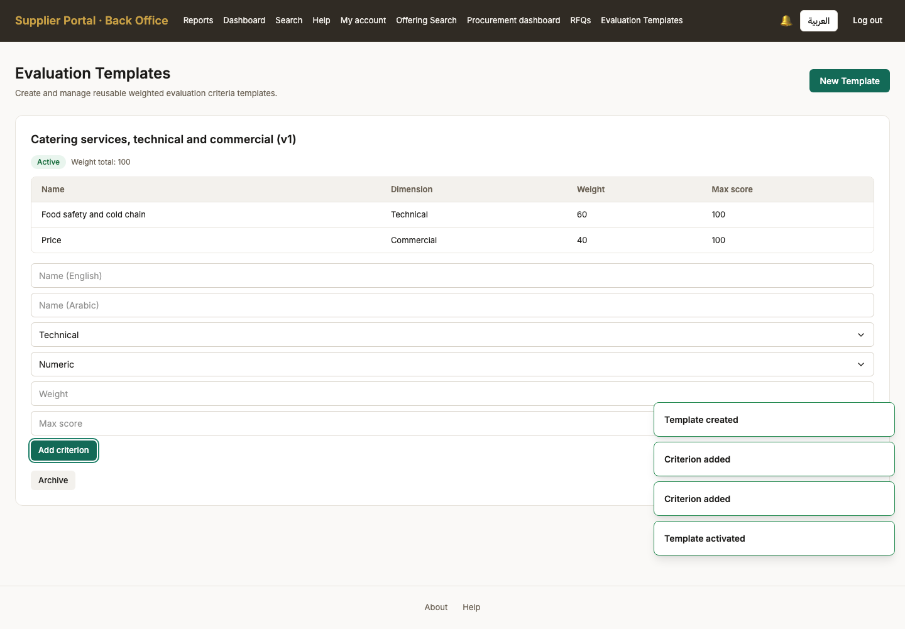

- **Persona:** procurement_manager
- **Screen:** Template activated — `/back-office/evaluation-templates`
- **What just happened:** Activated and now bindable. From here it is frozen: a tender that binds it keeps this exact set of criteria and weights even if a later version is created.
- **What the user does next:** Hand back to the officer to write the tender.

### 38. Officer landing

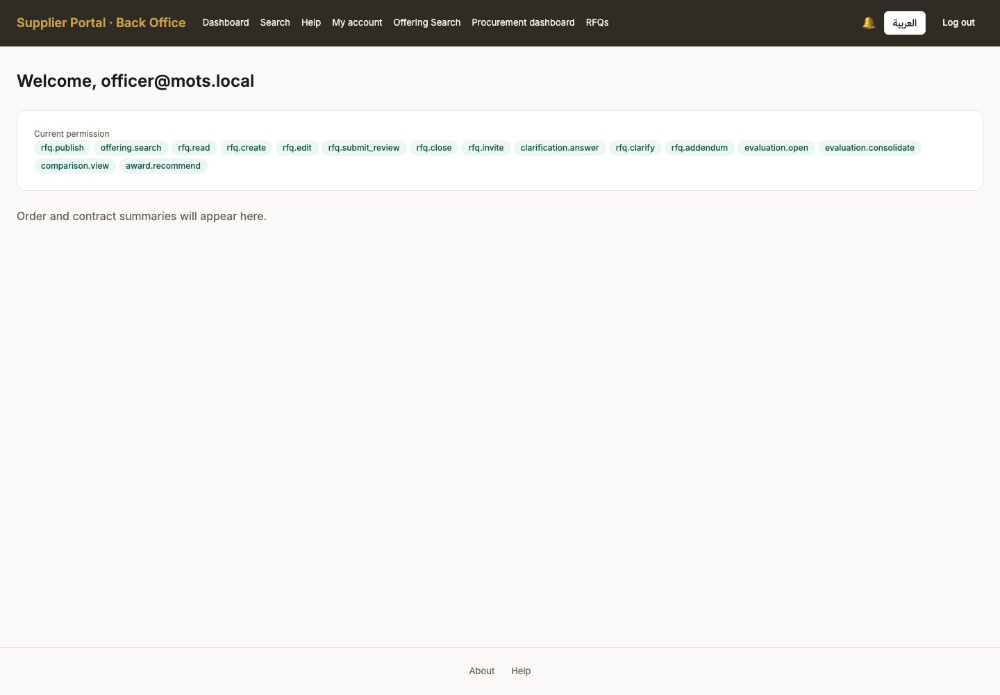

- **Persona:** procurement_officer
- **Screen:** Officer landing — `/back-office/dashboard`
- **What just happened:** The procurement officer signs in. Their navigation carries the procurement dashboard, the tender list, the offering catalogue and search — the RFQ-facing half of the back office.
- **What the user does next:** Open the procurement dashboard, which is this role's home screen.

### 39. Procurement dashboard

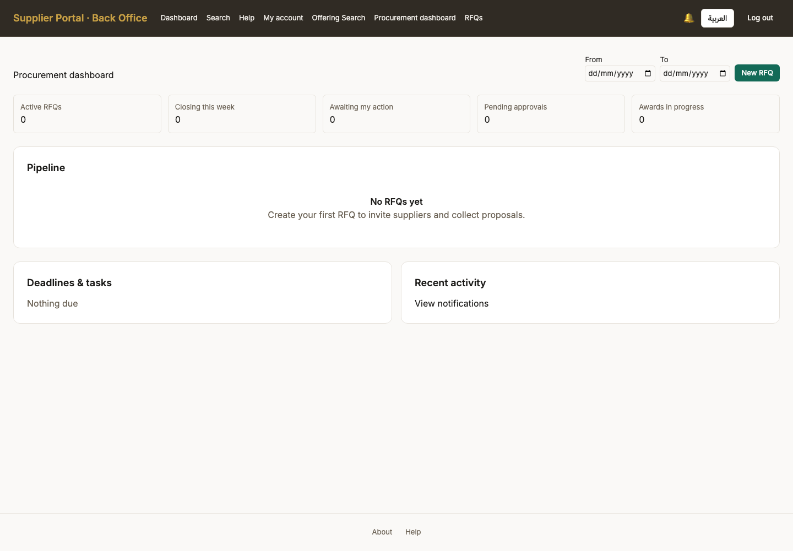

- **Persona:** procurement_officer
- **Screen:** Procurement dashboard — `/back-office/procurement`
- **What just happened:** SCR-400, and until batch 12 nothing in the app linked to it. Tenders by state, approvals waiting, deadlines — the officer's actual home screen, reachable at last by clicking.
- **What the user does next:** Open the tender list and create one.

### 40. Tender list (empty)

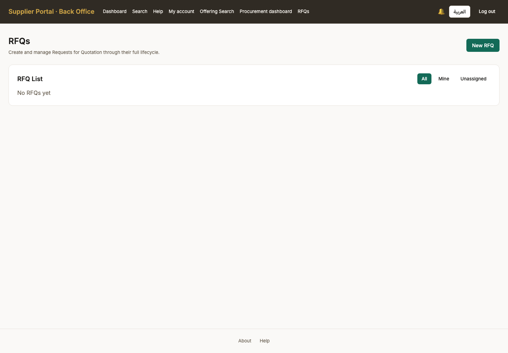

- **Persona:** procurement_officer
- **Screen:** Tender list (empty) — `/back-office/rfqs`
- **What just happened:** No tenders exist yet: this database started empty and everything in it so far was created through these screens.
- **What the user does next:** Create the first RFQ.

### 41. Tender created (Draft)

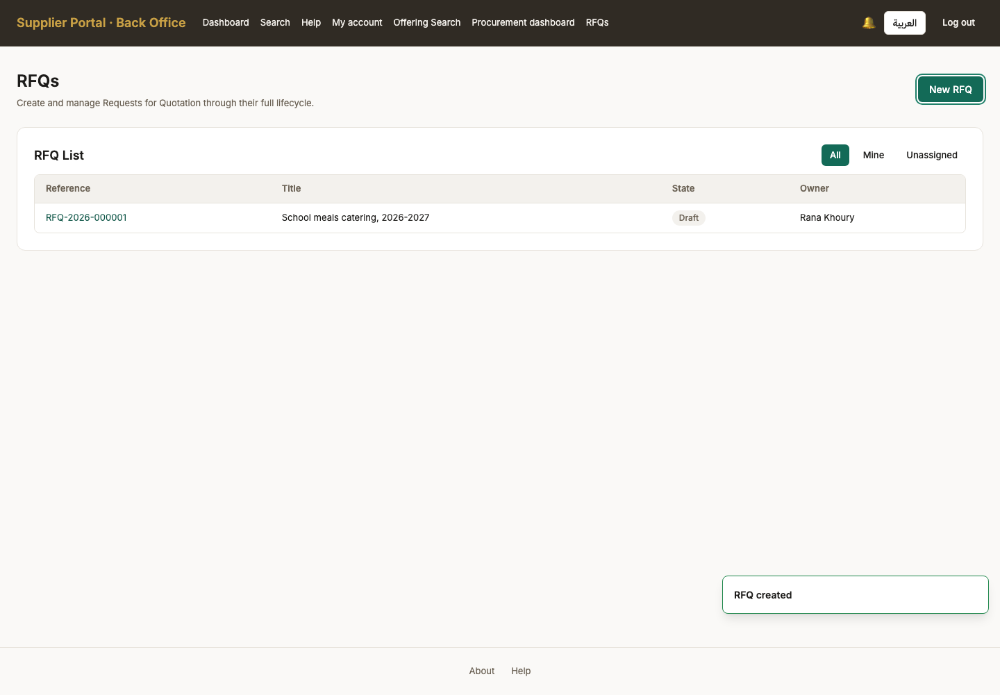

- **Persona:** procurement_officer
- **Screen:** Tender created (Draft) — `/back-office/rfqs`
- **What just happened:** The tender exists in Draft, with a reference code allocated by the server. Everything on it is editable while it stays in Draft and nothing is visible to a supplier yet.
- **What the user does next:** Add the line items being bought, and the requirements bidders must answer.

### 42. Tender detail (Draft)

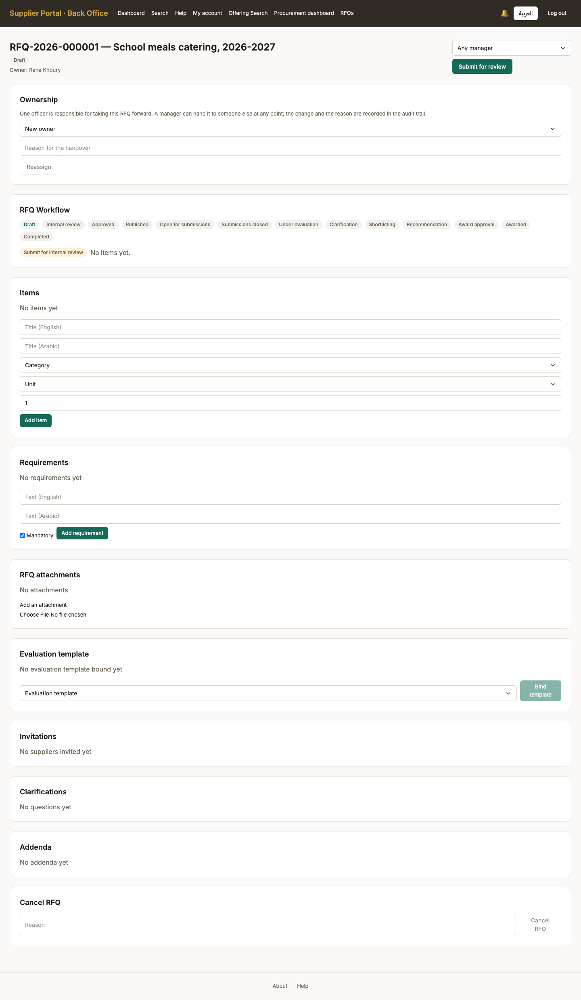

- **Persona:** procurement_officer
- **Screen:** Tender detail (Draft) — `/back-office/rfqs/RFQ-2026-000001`
- **What just happened:** The tender in Draft. Items, requirements, attachments and the evaluation template are all editable here and nowhere else: once it leaves Draft the editing controls disappear rather than failing on use.
- **What the user does next:** Add the line item being bought.

### 43. Line item added

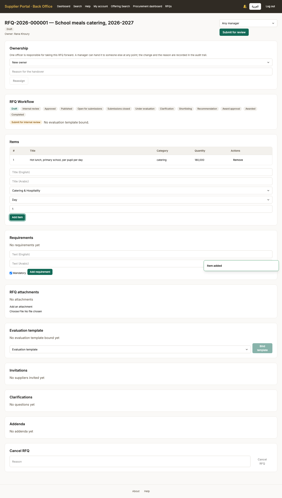

- **Persona:** procurement_officer
- **Screen:** Line item added — `/back-office/rfqs/RFQ-2026-000001`
- **What just happened:** One line, priced per pupil per day, with a quantity for the school year. A bid is priced against these lines, so the comparison matrix later compares like with like.
- **What the user does next:** Add a requirement bidders must answer in words.

### 44. Requirement added

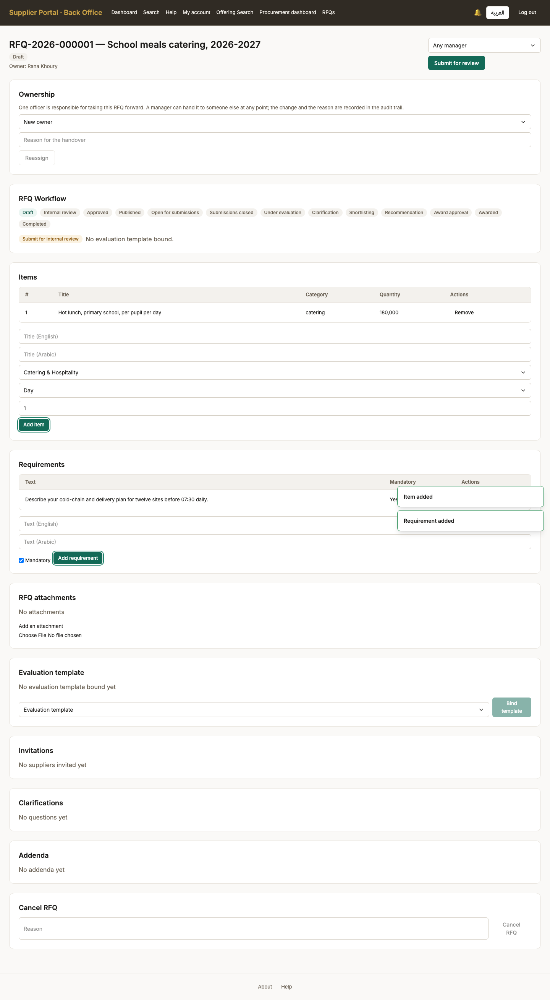

- **Persona:** procurement_officer
- **Screen:** Requirement added — `/back-office/rfqs/RFQ-2026-000001`
- **What just happened:** A requirement is answered in prose and scored by an evaluator, which is what separates it from a line item. The two halves of a bid — the technical answer and the price — are sealed from each other until consolidation.
- **What the user does next:** Attach the tender documents suppliers need to read.

### 45. Tender document attached

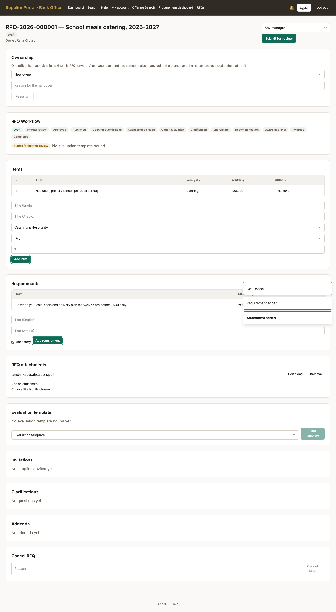

- **Persona:** procurement_officer
- **Screen:** Tender document attached — `/back-office/rfqs/RFQ-2026-000001`
- **What just happened:** The specification suppliers will bid against. It is scanned on upload like every other file here, and it becomes readable to a supplier only once the tender is published to them.
- **What the user does next:** Submit the tender for internal review.

### 46. Evaluation template bound

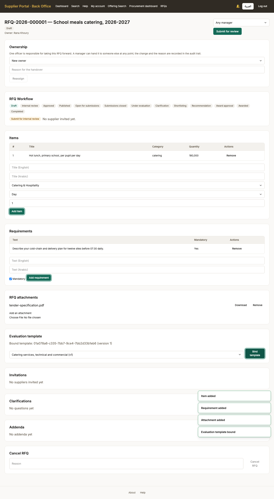

- **Persona:** procurement_officer
- **Screen:** Evaluation template bound — `/back-office/rfqs/RFQ-2026-000001`
- **What just happened:** The tender now carries the criteria it will be judged by, frozen at the version bound. Bidders can see what they are being scored on before they bid, which is the point of binding it this early.
- **What the user does next:** Submit the tender for internal review.

### 47. Supplier invited

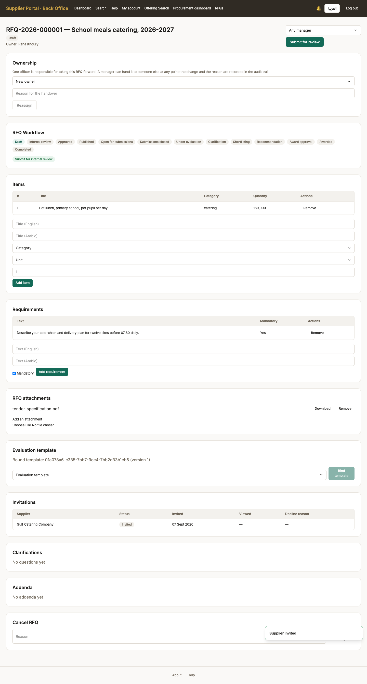

- **Persona:** procurement_officer
- **Screen:** Supplier invited — `/back-office/rfqs/RFQ-2026-000001`
- **What just happened:** Invited by name from the approved list — a tender cannot be sent to a company that has not been through onboarding. The invitation is also a precondition of review: an approver is shown who the tender is going to.
- **What the user does next:** Submit the tender for internal review.

### 48. Submitted for internal review

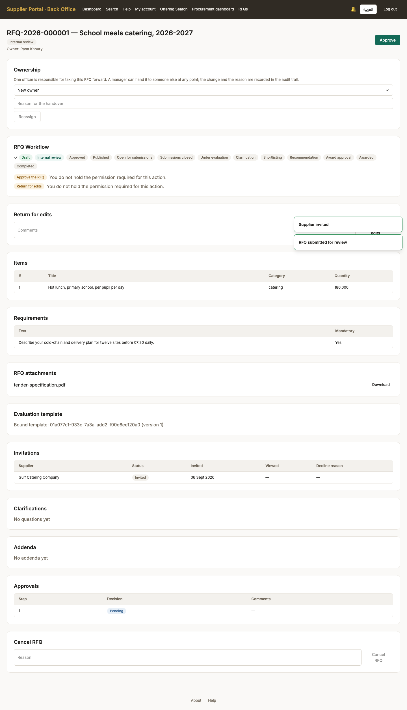

- **Persona:** procurement_officer
- **Screen:** Submitted for internal review — `/back-office/rfqs/RFQ-2026-000001`
- **What just happened:** The tender moves to InternalReview and the officer can no longer edit it. Authorship and approval are separated deliberately: the person who wrote the tender is not the person who lets it out.
- **What the user does next:** Sign in as the procurement manager to approve it.

### 49. Tender awaiting approval

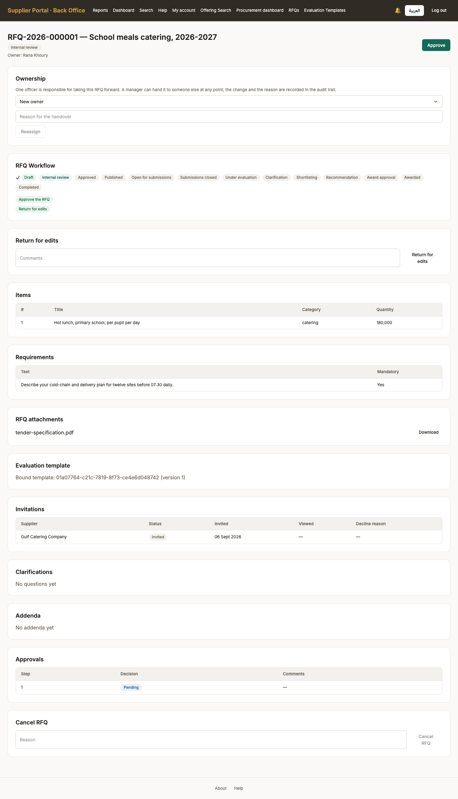

- **Persona:** procurement_manager
- **Screen:** Tender awaiting approval — `/back-office/rfqs/RFQ-2026-000001`
- **What just happened:** The manager sees the same tender with a different set of controls: approve or return for edits, and no way to alter its contents. Reviewing something you can silently change is not a review.
- **What the user does next:** Approve it.

### 50. Tender approved

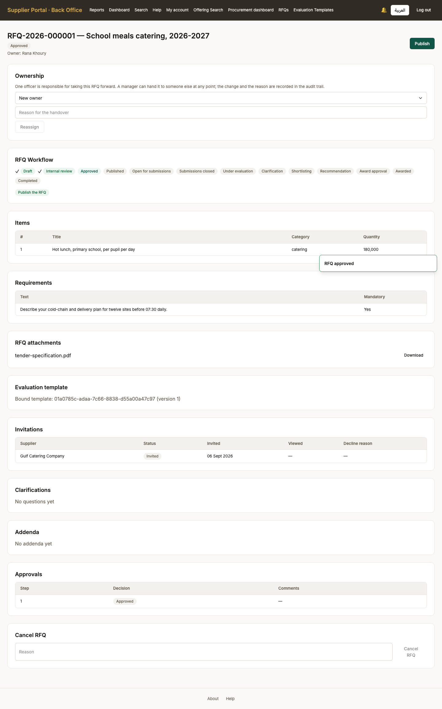

- **Persona:** procurement_manager
- **Screen:** Tender approved — `/back-office/rfqs/RFQ-2026-000001`
- **What just happened:** Approved. It is not yet visible to any supplier: approval and publication are separate steps, so a tender can be signed off and released on a chosen date.
- **What the user does next:** Hand back to the officer to publish and invite.

### 51. Tender published

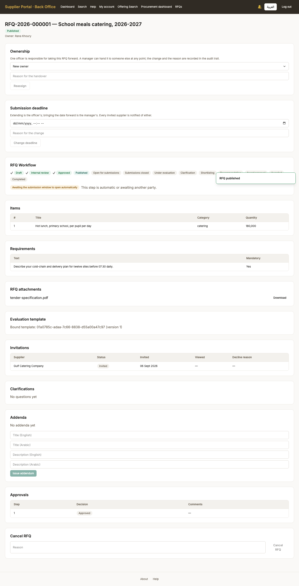

- **Persona:** procurement_officer
- **Screen:** Tender published — `/back-office/rfqs/RFQ-2026-000001`
- **What just happened:** Published. The submission window opens on its own when the start time passes - a scheduled job moves it, not a person - so the tender becomes biddable without anyone having to be at a desk.
- **What the user does next:** Wait for the window to open, then bid as the supplier.

### 52. Submission window open

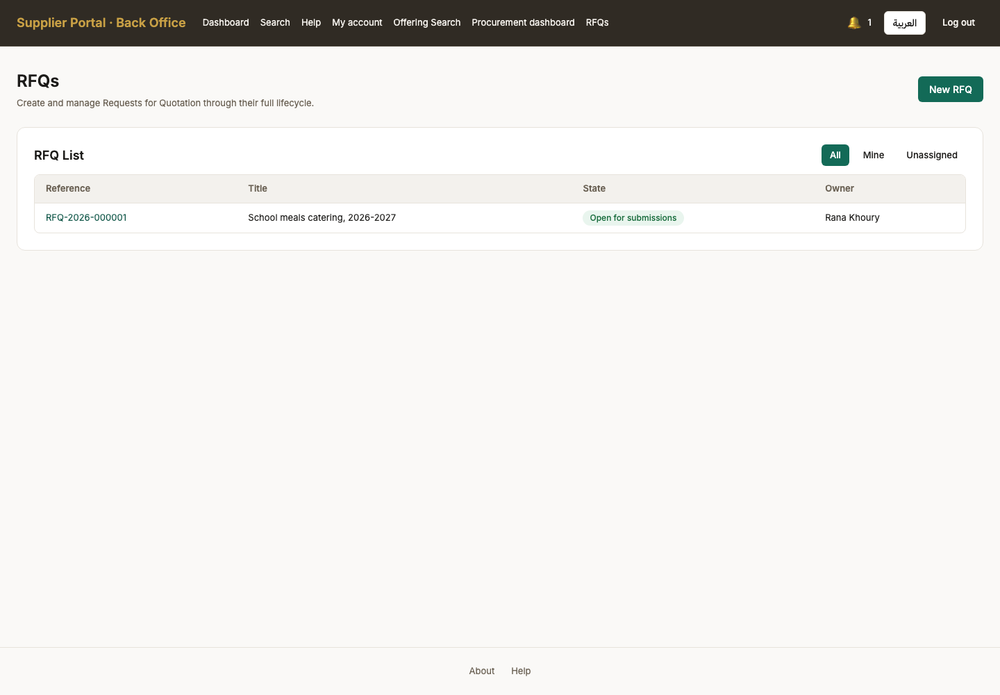

- **Persona:** procurement_officer
- **Screen:** Submission window open — `/back-office/rfqs`
- **What just happened:** The window opened on its own. A scheduled job moves the tender from Approved to SubmissionOpen when the start time passes - nobody has to be at a desk for bidding to begin.
- **What the user does next:** Sign in as the invited supplier.

### 53. Invited tenders

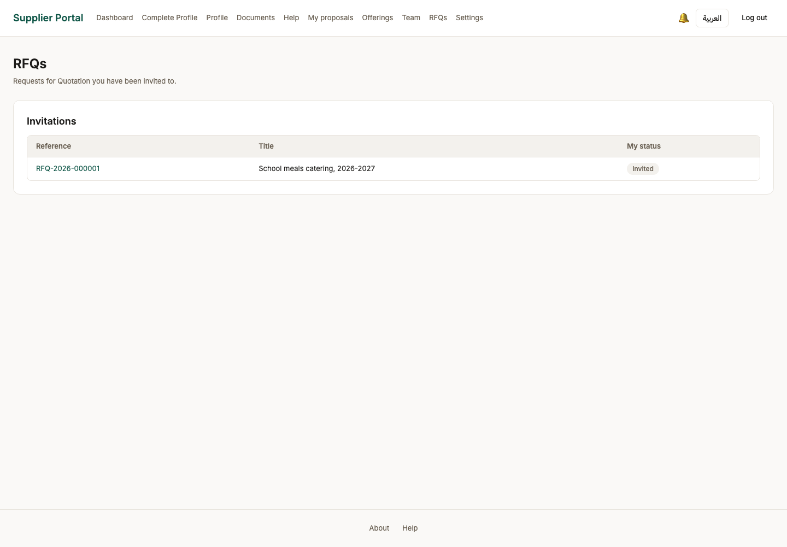

- **Persona:** supplier_admin
- **Screen:** Invited tenders — `/rfqs`
- **What just happened:** The supplier sees the tender because they were invited to it. This list is scoped to invitations: a supplier cannot browse tenders they were not asked to bid on.
- **What the user does next:** Open it and read what is being bought.

### 54. Tender as the supplier sees it

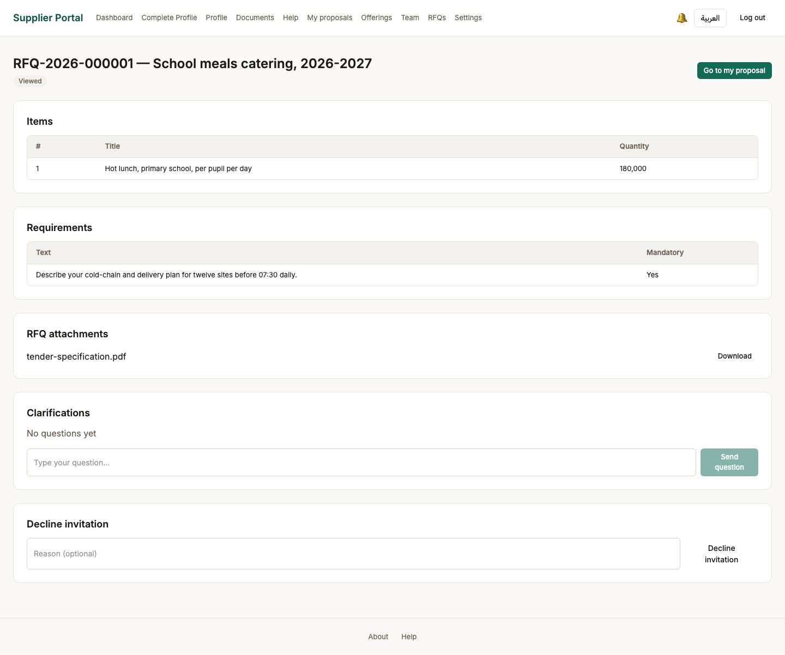

- **Persona:** supplier_admin
- **Screen:** Tender as the supplier sees it — `/rfqs/RFQ-2026-000001`
- **What just happened:** The same tender from the other side: the line items, the requirements to answer, the deadline, and the attached specification to download. The evaluation criteria are visible too, so a bidder knows what they are being scored on before they bid.
- **What the user does next:** Ask a clarification question.

### 55. Question sent

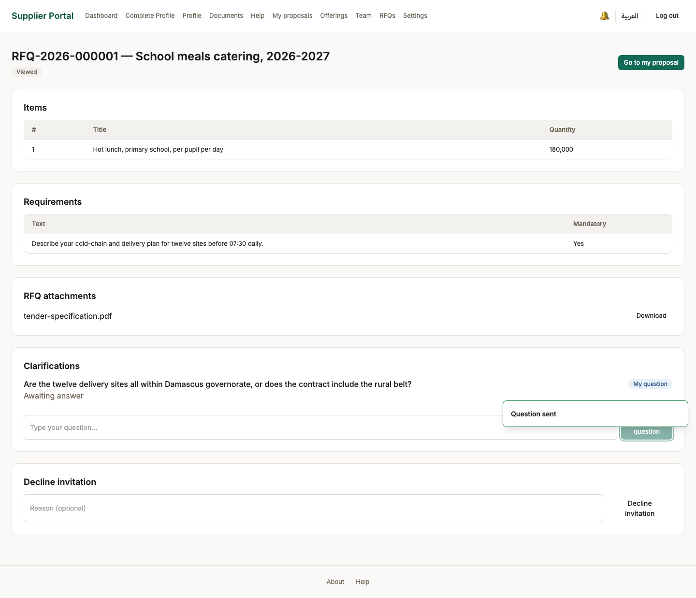

- **Persona:** supplier_admin
- **Screen:** Question sent — `/rfqs/RFQ-2026-000001`
- **What just happened:** The question is recorded against the tender and waits for the buyer. The supplier cannot see other bidders' questions until an answer is published to everyone.
- **What the user does next:** The officer answers it.

### 56. Clarification waiting

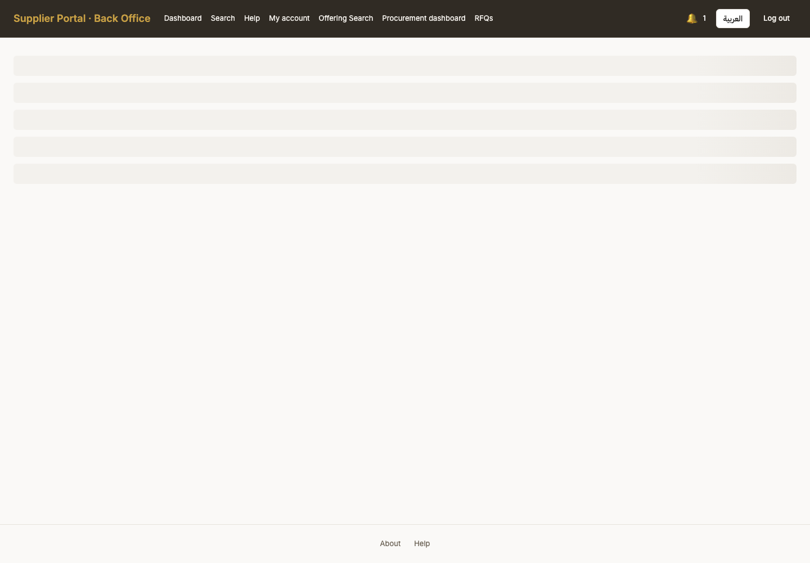

- **Persona:** procurement_officer
- **Screen:** Clarification waiting — `/back-office/rfqs/RFQ-2026-000001`
- **What just happened:** The buyer sees the question. Who asked it is deliberately not the point: an answer goes to every invited supplier, so a question cannot be used to work out who else is bidding.
- **What the user does next:** Write an answer and publish it to all invitees.

### 57. Answer published to all invitees

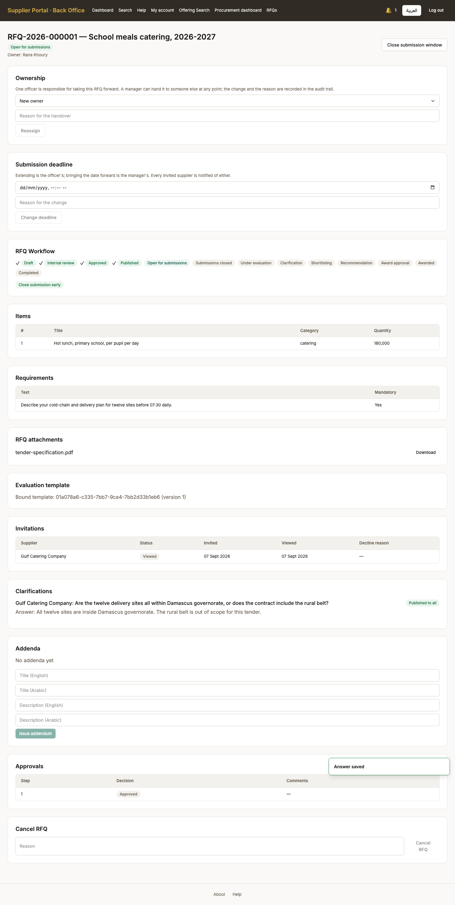

- **Persona:** procurement_officer
- **Screen:** Answer published to all invitees — `/back-office/rfqs/RFQ-2026-000001`
- **What just happened:** Published to every invited supplier at once, with the asker anonymised. That is the rule this screen exists to enforce: one bidder's question must not tell the others who is in the room, and no bidder may receive information the rest do not.
- **What the user does next:** Back to the supplier to price the bid.

### 58. The published answer, seen by the bidder

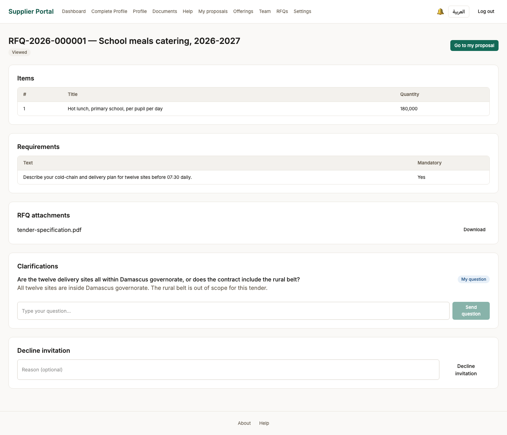

- **Persona:** supplier_admin
- **Screen:** The published answer, seen by the bidder — `/rfqs/RFQ-2026-000001`
- **What just happened:** The answer is here, attributed to the buyer and not to whoever asked. Every invited supplier sees the same text at the same time, which is what keeps a clarification from becoming an advantage.
- **What the user does next:** Start a proposal.

### 59. Proposal started (Draft)

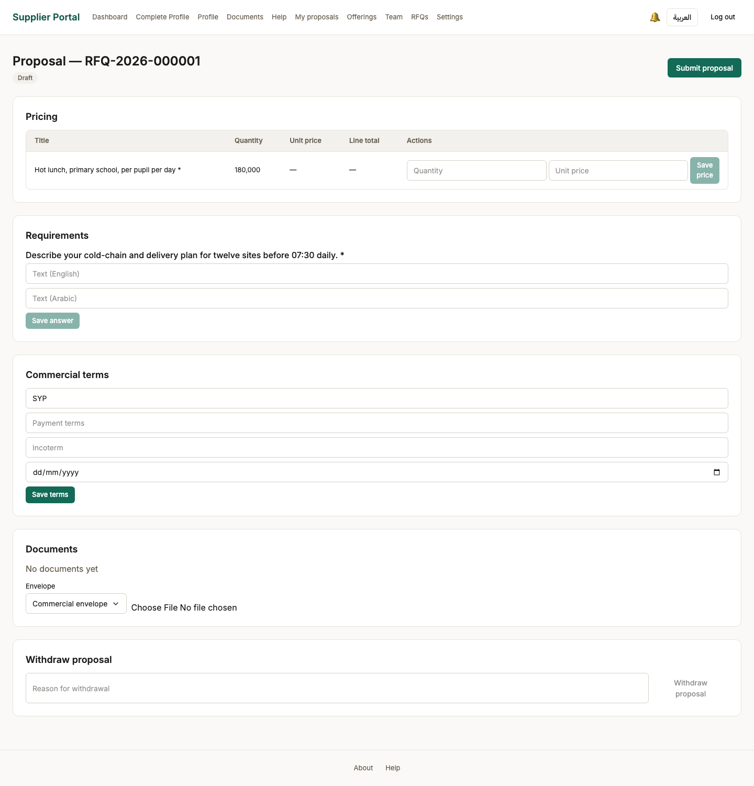

- **Persona:** supplier_admin
- **Screen:** Proposal started (Draft) — `/rfqs/RFQ-2026-000001/proposal`
- **What just happened:** A draft proposal, private to this supplier. The two envelopes are visible as separate sections: the technical answers and the commercial figures are stored apart because the buyer is allowed to see them at different times.
- **What the user does next:** Price the line items.

### 60. Line item priced

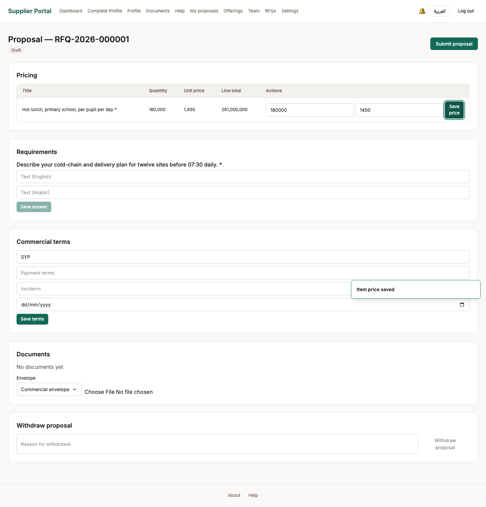

- **Persona:** supplier_admin
- **Screen:** Line item priced — `/rfqs/RFQ-2026-000001/proposal`
- **What just happened:** A unit price against the line the buyer specified. The total is derived from the quantity on the tender rather than typed, so the two cannot disagree.
- **What the user does next:** Answer the requirement.

### 61. Requirement answered

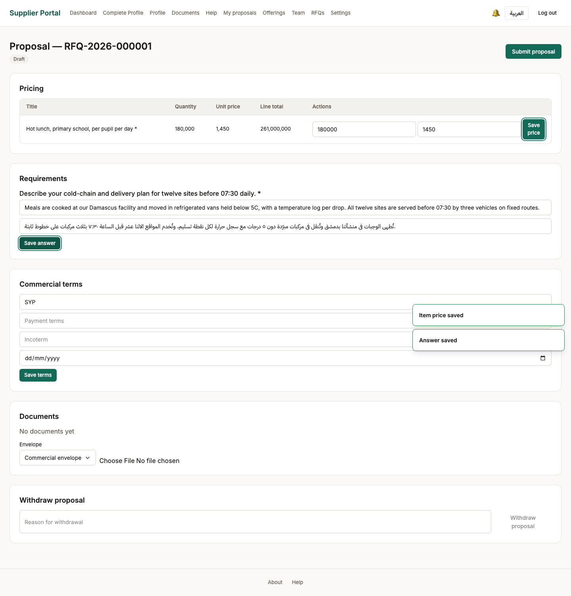

- **Persona:** supplier_admin
- **Screen:** Requirement answered — `/rfqs/RFQ-2026-000001/proposal`
- **What just happened:** The technical half of the bid. This is what an evaluator scores, and it is sealed from the price until the buyer consolidates.
- **What the user does next:** Set the commercial terms and attach a document.

### 62. Terms set and document attached

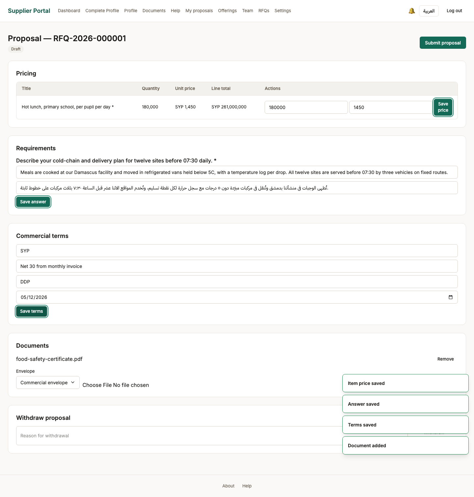

- **Persona:** supplier_admin
- **Screen:** Terms set and document attached — `/rfqs/RFQ-2026-000001/proposal`
- **What just happened:** Payment terms and a supporting document. Everything a bid consists of is now on the record and still editable, because nothing has been submitted yet.
- **What the user does next:** Submit the bid.

### 63. Bid submitted

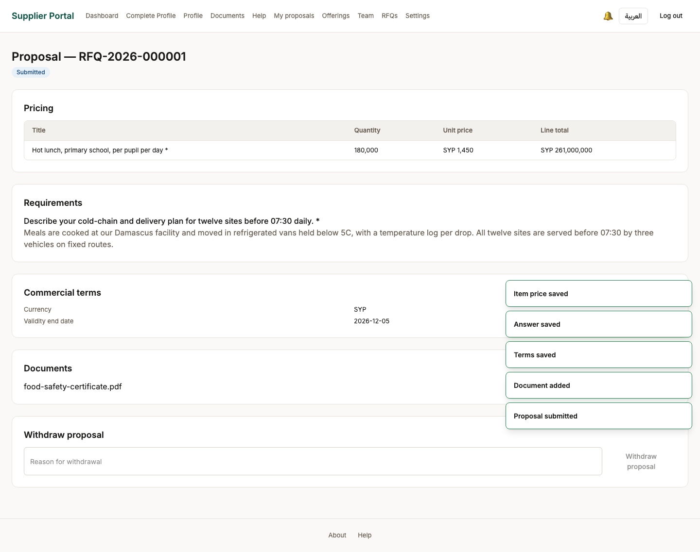

- **Persona:** supplier_admin
- **Screen:** Bid submitted — `/rfqs/RFQ-2026-000001/proposal`
- **What just happened:** Submitted, and now read-only to the supplier. From here the buyer cannot see the commercial half until the submission window closes and the evaluation is consolidated - that is the two-envelope seal, and it is enforced on the server rather than by hiding a column.
- **What the user does next:** The officer closes the window and opens evaluation.
