# Supplier Portal — a walk through the whole system

Every screenshot in `screenshots/` was taken while driving the real application against a database
that started empty. Nothing here was seeded by a script: each supplier, tender, proposal and award
below came into existence through the interface, in the order a real procurement would produce them.

## Accounts this walk created

| Persona | Email | Password |
|---|---|---|
| system_admin (bootstrap) | `admin@mots.local` | `motsadmin2026` + TOTP |
| procurement_officer | `officer@mots.local` | `Walkthrough2026!` |
| procurement_manager | `manager@mots.local` | `Walkthrough2026!` |
| procurement_manager | `manager2@mots.local` | `Walkthrough2026!` |
| evaluator | `evaluator@mots.local` | `Walkthrough2026!` |
| onboarding_reviewer | `reviewer@mots.local` | `Walkthrough2026!` |
| ministry_viewer | `ministry@mots.local` | `Walkthrough2026!` |
| supplier_admin | `supplier@gulfcatering.example` | `Walkthrough2026!` |

## Two things that are decisions, not defects

- **The Ministry dashboard shows no commercial figures.** That is a deliberate hold until MOT Legal
  answers on what the Ministry may see. Aggregates only, by BRULE-086.
- **`clamd` must be running or every document upload is refused.** Fail-closed by design: the scanner
  folds any failure into "infected" rather than letting an unscanned file through.

## The walk

### 01. Landing page

- **Persona:** anonymous
- **Screen:** Landing page — `/`
- **What just happened:** The portal answers with a live health check and the currencies the system booted with. This is a clean database: reference data only.
- **What the user does next:** Click Sign in, or About in the footer to see which build is deployed.

### 02. About

- **Persona:** anonymous
- **Screen:** About — `/about`
- **What just happened:** Reached by clicking the footer, not by typing the address — this screen had no link to it until batch 12. It names the version and the exact commit deployed.
- **What the user does next:** Quote the build reference when reporting a problem. Go back and sign in.

### 03. Choose your language

- **Persona:** system_admin
- **Screen:** Choose your language — `/evaluation`
- **What just happened:** SCR-010, asked once and only of someone who has not answered it. The product ships Arabic-first, so this is the first thing a new account sees, in both languages at once — a language chooser written only in the language you cannot read is no use.
- **What the user does next:** Pick a language. The choice is stored against the account, so it is not asked again on any device.

### 04. Back-office landing

- **Persona:** system_admin
- **Screen:** Back-office landing — `/evaluation`
- **What just happened:** Signed in as the bootstrap administrator — the only account that exists on a fresh database. It required a six-digit authenticator code: system_admin is the one role for which MFA is mandatory.
- **What the user does next:** Open Staff to create the people who actually run a tender.

### 05. Staff

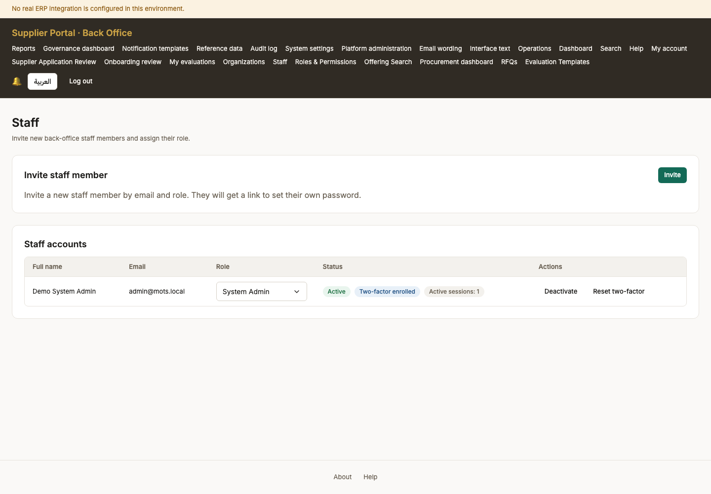

- **Persona:** system_admin
- **Screen:** Staff — `/back-office/staff`
- **What just happened:** The staff list, empty apart from the administrator. There is no other way in: registration only ever creates a supplier, so ministry accounts must be invited from here.
- **What the user does next:** Invite each role the procurement needs — officer, manager, evaluator, reviewer and the Ministry viewer.

### 06. Staff after invitations

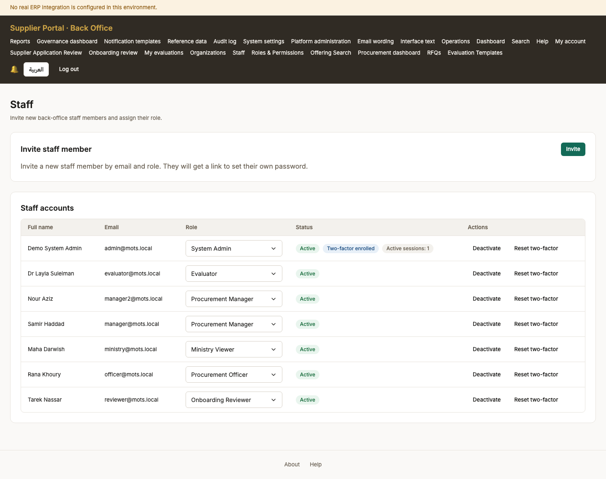

- **Persona:** system_admin
- **Screen:** Staff after invitations — `/back-office/staff`
- **What just happened:** Six invitations sent. Each recipient gets an email with a single-use link; nobody has a password until they set one, so an unaccepted invitation is not a live account.
- **What the user does next:** Each person opens their invitation and sets a password.

### 07. Register

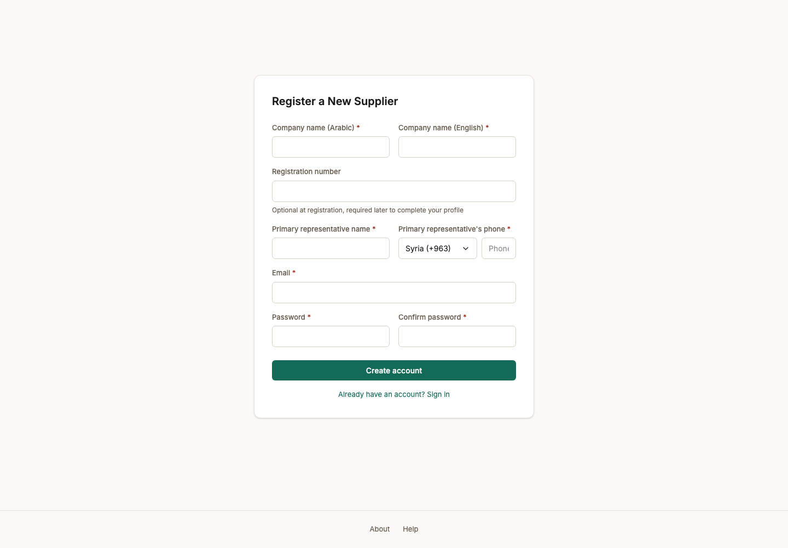

- **Persona:** anonymous
- **Screen:** Register — `/register`
- **What just happened:** The only self-service account creation in the product, and it always produces a supplier. Ministry staff cannot register; they are invited.
- **What the user does next:** Fill in the company name in both languages and an email, then submit.

### 08. Register — filled in

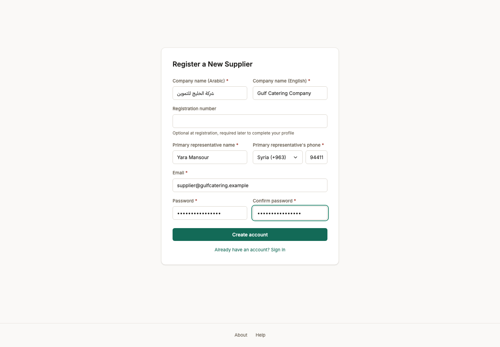

- **Persona:** anonymous
- **Screen:** Register — filled in — `/register`
- **What just happened:** Every required field answered. The company name is asked in both languages because the tender record it will appear on is bilingual.
- **What the user does next:** Submit. Nothing is trusted until the email address is proven.

### 09. Registered — check your email

- **Persona:** supplier_admin
- **Screen:** Registered — check your email — `/register`
- **What just happened:** The account exists but cannot sign in yet. Nothing is trusted until the address is proven.
- **What the user does next:** Open the verification email and follow its link.

### 10. Email verified

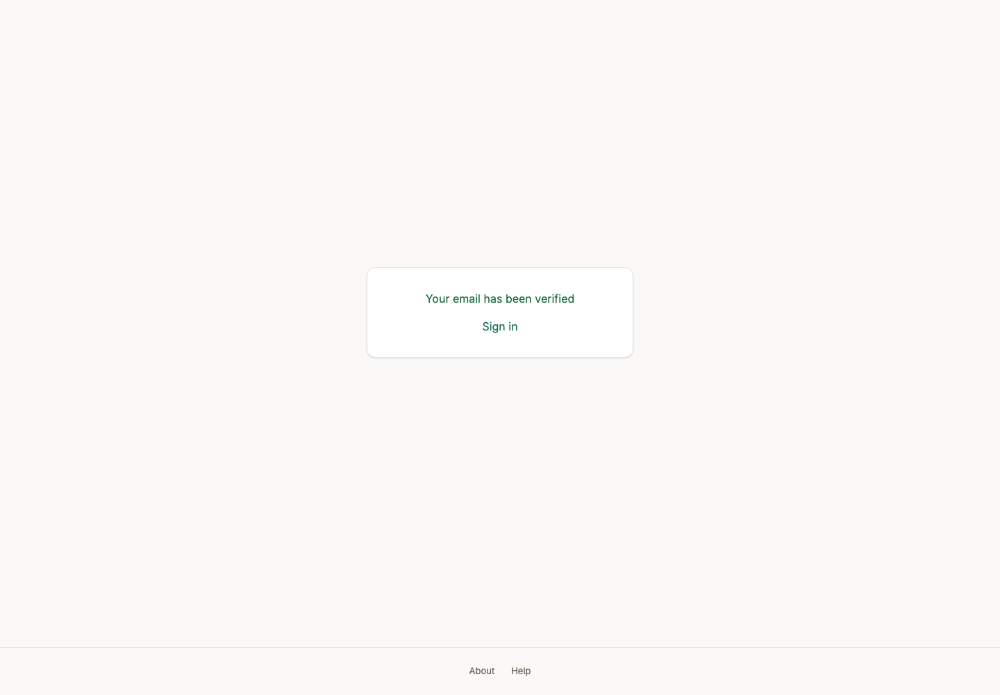

- **Persona:** supplier_admin
- **Screen:** Email verified — `/verify-email?token=rtmVdimLl1DupC262mtiIBfF11tkDRtTt-Fz4qCGgNc`
- **What just happened:** The address is proven and the account is live. The supplier is in Draft: registered, not yet allowed to bid.
- **What the user does next:** Sign in and complete the company profile.

### 11. Supplier dashboard (new account)

- **Persona:** supplier_admin
- **Screen:** Supplier dashboard (new account) — `/dashboard`
- **What just happened:** The supplier can sign in now. There is no tender activity yet and the screen says so rather than showing empty widgets: what it offers instead is the completeness of the profile that stands between this account and bidding.
- **What the user does next:** Open Onboarding and fill in the company record.

### 12. Onboarding — checklist

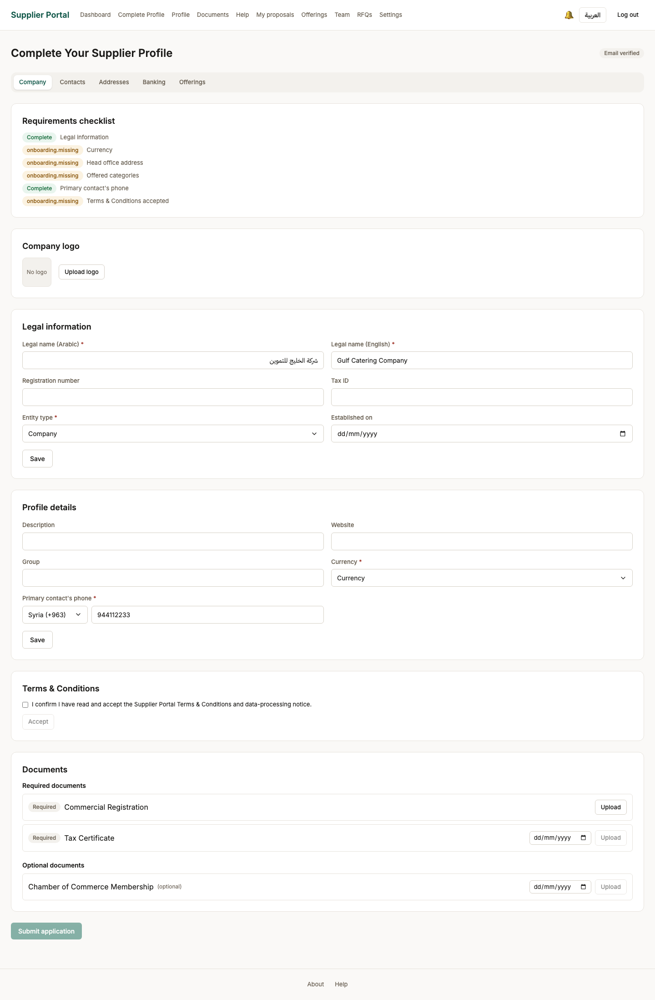

- **Persona:** supplier_admin
- **Screen:** Onboarding — checklist — `/onboarding`
- **What just happened:** The checklist is the gate. Each item is a condition the server enforces on submission, so this screen and the refusal cannot disagree.
- **What the user does next:** Fill in the legal information first.

### 13. Onboarding — legal information saved

- **Persona:** supplier_admin
- **Screen:** Onboarding — legal information saved — `/onboarding`
- **What just happened:** The legal identity is recorded. This is the block a reviewer checks against the registration certificate.
- **What the user does next:** Fill in the company profile below it — currency and the contact phone are both required.

### 14. Onboarding — company profile saved

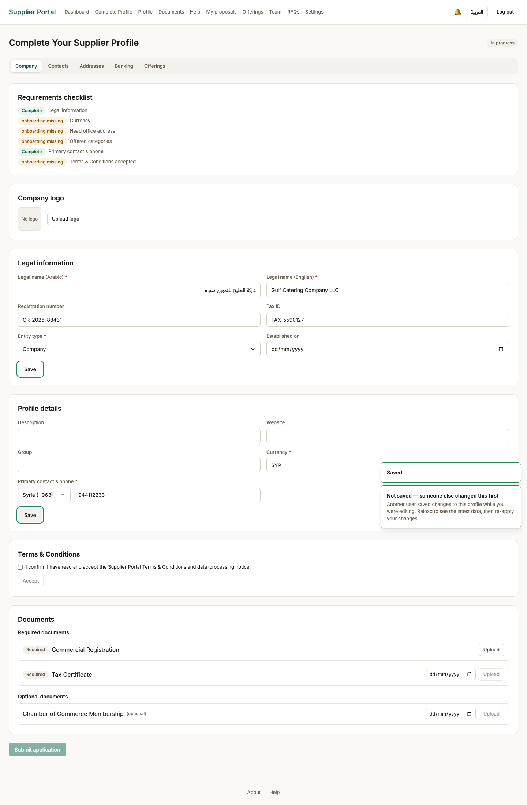

- **Persona:** supplier_admin
- **Screen:** Onboarding — company profile saved — `/onboarding`
- **What just happened:** Currency and a reachable contact are recorded. The currency matters later: a proposal is priced in it, and the comparison matrix refuses to convert between currencies it was never told the rate for.
- **What the user does next:** Add a head-office address, a bank account, and the categories this company supplies.

### 15. Onboarding — contacts

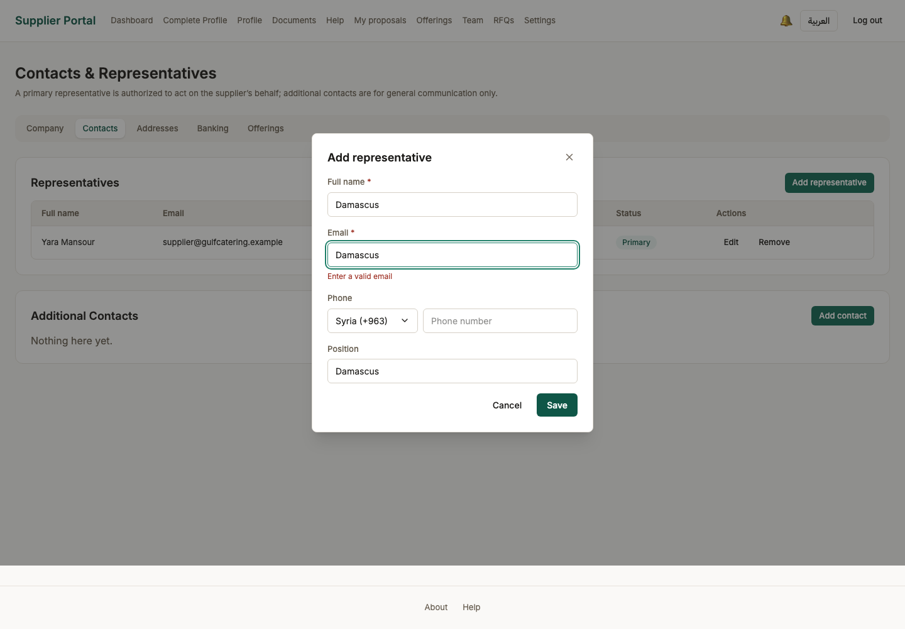

- **Persona:** supplier_admin
- **Screen:** Onboarding — contacts — `/onboarding/contacts`
- **What just happened:** The people a buyer may contact about a bid. One must be primary — that is the address a clarification is sent to.
- **What the user does next:** Continue to the next step of the profile.

### 16. Onboarding — addresses

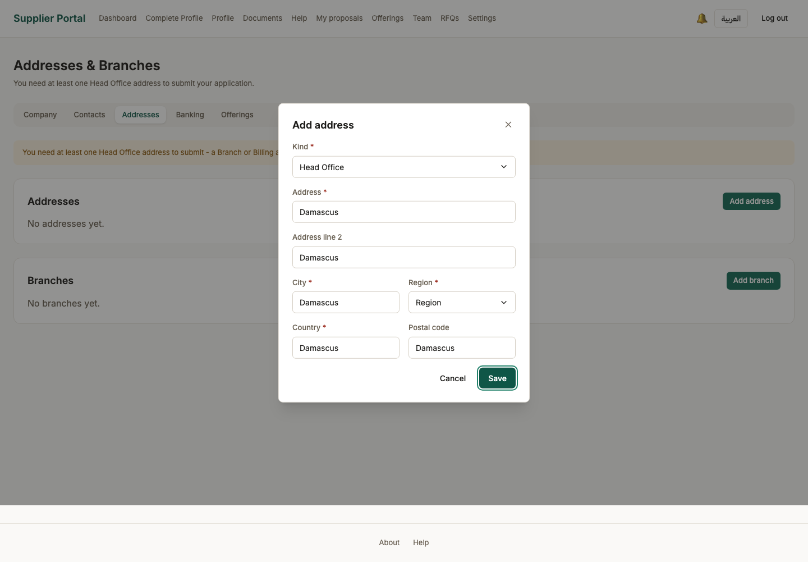

- **Persona:** supplier_admin
- **Screen:** Onboarding — addresses — `/onboarding/addresses`
- **What just happened:** A head-office address is one of the completeness conditions: an approved supplier with no registered address is one nobody can serve notice on.
- **What the user does next:** Continue to the next step of the profile.

### 17. Onboarding — banking

- **Persona:** supplier_admin
- **Screen:** Onboarding — banking — `/onboarding/banking`
- **What just happened:** Where an award would be paid. The account number is masked everywhere it is displayed afterwards.
- **What the user does next:** Continue to the next step of the profile.

### 18. Onboarding — categories

- **Persona:** supplier_admin
- **Screen:** Onboarding — categories — `/onboarding/offerings`
- **What just happened:** What this company supplies, chosen from the ministry-maintained category list rather than typed. Invitations are matched against these.
- **What the user does next:** Tick at least one category — a supplier with none cannot be matched to any tender.

### 19. Onboarding — category chosen

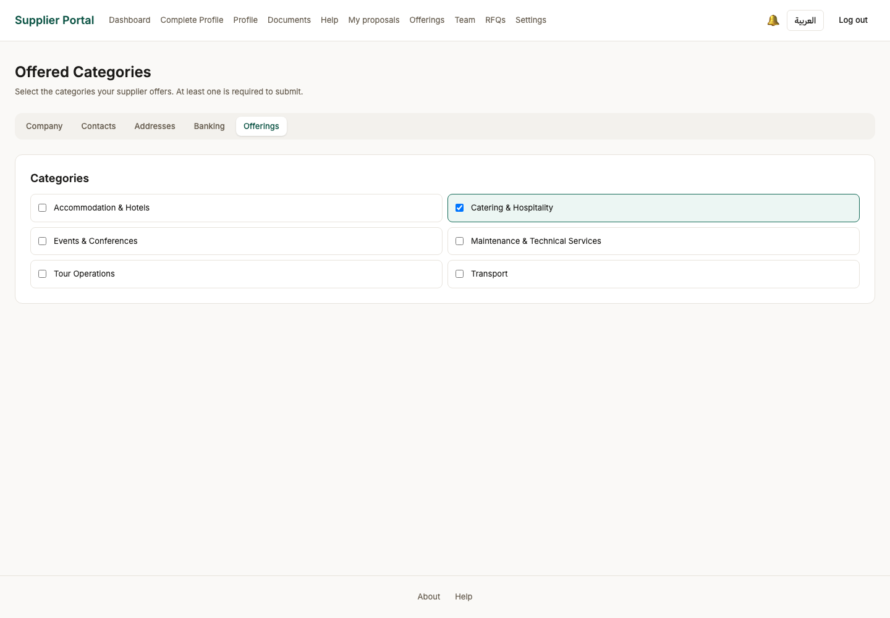

- **Persona:** supplier_admin
- **Screen:** Onboarding — category chosen — `/onboarding/offerings`
- **What just happened:** The category link is recorded and the completeness checklist drops one item.
- **What the user does next:** Upload the documents the ministry requires before an application can be submitted.

### 20. Onboarding — document uploaded

- **Persona:** supplier_admin
- **Screen:** Onboarding — document uploaded — `/onboarding`
- **What just happened:** The file went to object storage and ClamAV scanned it before it was accepted. That scan is fail-closed: if clamd is not running the upload is refused rather than stored unscanned.
- **What the user does next:** Upload the rest of the required documents.

### 21. Onboarding — ready to submit

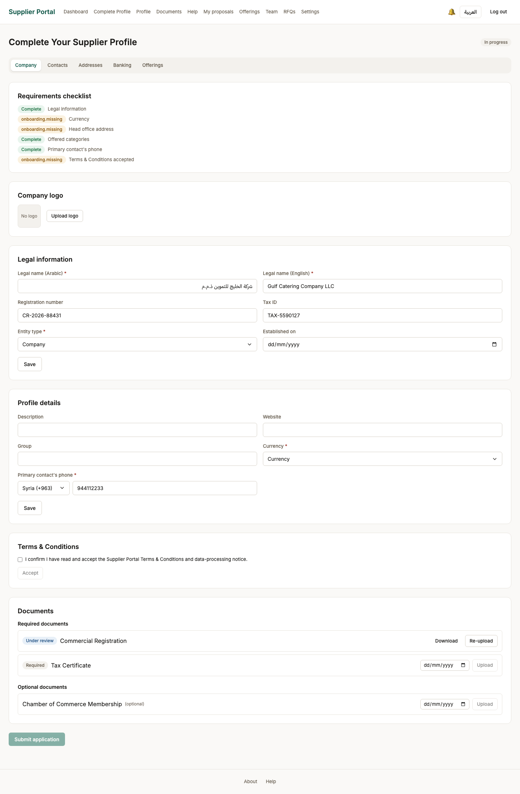

- **Persona:** supplier_admin
- **Screen:** Onboarding — ready to submit — `/onboarding`
- **What just happened:** Every required document is uploaded and scanned. The submit button is offered only now: the server enforces the same list, so a submission that looks possible here is one that will be accepted.
- **What the user does next:** Submit the application for review.
